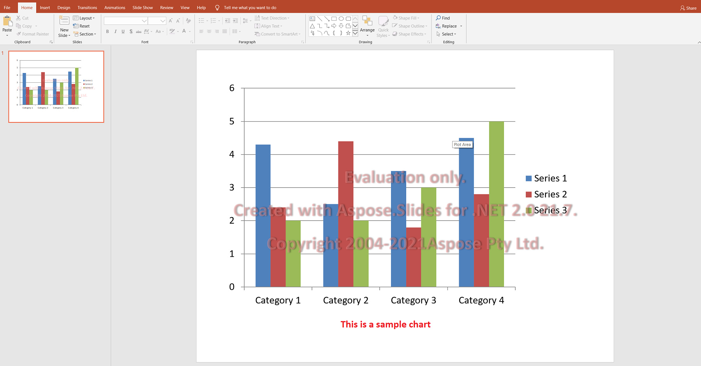

## **Valutazione di Aspose.Slides**

Puoi scaricare facilmente Aspose.Slides per la valutazione. Il pacchetto di valutazione è lo stesso del pacchetto acquistato. La versione di valutazione diventa semplicemente licenziata dopo aver aggiunto poche righe di codice per applicare la licenza. 

La versione di valutazione di Aspose.Slides (senza una licenza specificata) offre tutte le funzionalità del prodotto, ma inserisce una filigrana di valutazione nella parte superiore del documento all'apertura e al salvataggio. Sei anche limitato a una diapositiva quando estrai il testo dalle diapositive della presentazione.

{} 

Se desideri testare Aspose.Slides senza le limitazioni della versione di valutazione, puoi richiedere una **Licenza Temporanea di 30 giorni**. Per ulteriori informazioni, consulta [Come ottenere una Licenza Temporanea?](https://purchase.aspose.com/temporary-license).

{}

## **FAQ**

**Posso testare più presentazioni in parallelo su thread diversi in modalità valutazione?**

Sì. È possibile elaborare documenti diversi in parallelo; non dovresti condividere lo stesso oggetto presentazione [tra thread](/slides/it/net/multithreading/). La modalità valutazione non influisce su questo.

**Devo installare Microsoft PowerPoint per valutare la libreria su un server o in CI?**

No. Aspose.Slides è un motore autonomo e non richiede l'installazione di PowerPoint né per la valutazione né per la produzione.

**Posso testare completamente la conversione di PPT/PPTX in PDF e immagini in modalità valutazione?**

Sì. I [convertitori](/slides/it/net/convert-presentation/) funzionano; l'output includerà una filigrana.

**Posso utilizzare una licenza temporanea per i test di carico senza filigrana?**

Sì. Una licenza temporanea di 30 giorni rimuove le limitazioni della modalità valutazione e consente di testare senza filigrana.