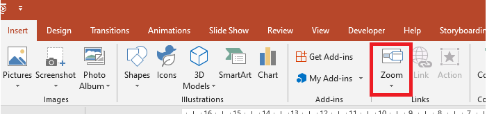

## **Introduzione**

Gli Zoom in PowerPoint ti consentono di passare da e verso diapositive specifiche, sezioni e parti di una presentazione. Quando stai presentando, questa capacità di navigare rapidamente tra i contenuti può rivelarsi molto utile. 



* Per riassumere un'intera presentazione su una singola diapositiva, usa un [Summary Zoom](#Summary-Zoom).
* Per mostrare solo le diapositive selezionate, usa un [Slide Zoom](#Slide-Zoom).
* Per mostrare una sola sezione, usa un [Section Zoom](#Section-Zoom).

## **Zoom Diapositiva**

Uno Zoom diapositiva può rendere la tua presentazione più dinamica, consentendoti di navigare liberamente tra le diapositive in qualsiasi ordine tu scelga senza interrompere il flusso della presentazione. Gli Zoom diapositiva sono ideali per presentazioni brevi senza molte sezioni, ma possono comunque essere utilizzati in diversi scenari di presentazione.

Gli Zoom diapositiva ti aiutano a approfondire più informazioni mantenendo la sensazione di essere su una singola tela. 


Per gli oggetti slide zoom, Aspose.Slides fornisce l'enumerazione [ZoomImageType](https://reference.aspose.com/slides/it/nodejs-java/aspose.slides/ZoomImageType), la classe [ZoomFrame](https://reference.aspose.com/slides/it/nodejs-java/aspose.slides/ZoomFrame) e alcuni metodi della classe [ShapeCollection](https://reference.aspose.com/slides/it/nodejs-java/aspose.slides/ShapeCollection).

### **Creazione dei Zoom Frame**

Puoi aggiungere un frame zoom su una diapositiva in questo modo:

1.	Crea un'istanza della classe [Presentation](https://reference.aspose.com/slides/it/nodejs-java/aspose.slides/Presentation).
2.	Crea nuove diapositive a cui intendi collegare i frame zoom. 
3.	Aggiungi un testo di identificazione e uno sfondo alle diapositive create.
4.	Aggiungi i frame zoom (contenenti i riferimenti alle diapositive create) alla prima diapositiva.
5.	Scrivi la presentazione modificata in un file PPTX.

```javascript
var pres = new aspose.slides.Presentation();
try {
    // Aggiunge nuove diapositive alla presentazione
    var slide2 = pres.getSlides().addEmptySlide(pres.getSlides().get_Item(0).getLayoutSlide());
    var slide3 = pres.getSlides().addEmptySlide(pres.getSlides().get_Item(0).getLayoutSlide());
    // Crea uno sfondo per la seconda diapositiva
    slide2.getBackground().setType(aspose.slides.BackgroundType.OwnBackground);
    slide2.getBackground().getFillFormat().setFillType(java.newByte(aspose.slides.FillType.Solid));
    slide2.getBackground().getFillFormat().getSolidFillColor().setColor(java.getStaticFieldValue("java.awt.Color", "cyan"));
    // Crea una casella di testo per la seconda diapositiva
    var autoshape = slide2.getShapes().addAutoShape(aspose.slides.ShapeType.Rectangle, 100, 200, 500, 200);
    autoshape.getTextFrame().setText("Second Slide");
    // Crea uno sfondo per la terza diapositiva
    slide3.getBackground().setType(aspose.slides.BackgroundType.OwnBackground);
    slide3.getBackground().getFillFormat().setFillType(java.newByte(aspose.slides.FillType.Solid));
    slide3.getBackground().getFillFormat().getSolidFillColor().setColor(java.getStaticFieldValue("java.awt.Color", "darkGray"));
    // Crea una casella di testo per la terza diapositiva
    autoshape = slide3.getShapes().addAutoShape(aspose.slides.ShapeType.Rectangle, 100, 200, 500, 200);
    autoshape.getTextFrame().setText("Trird Slide");
    // Aggiunge oggetti ZoomFrame
    pres.getSlides().get_Item(0).getShapes().addZoomFrame(20, 20, 250, 200, slide2);
    pres.getSlides().get_Item(0).getShapes().addZoomFrame(200, 250, 250, 200, slide3);
    // Salva la presentazione
    pres.save("presentation.pptx", aspose.slides.SaveFormat.Pptx);
} finally {
    if (pres != null) {
        pres.dispose();
    }
}
```

### **Creazione di Zoom Frame con Immagini Personalizzate**

Con Aspose.Slides per Node.js via Java, puoi creare un frame zoom con un'immagine di anteprima della diapositiva diversa in questo modo:

1.	Crea un'istanza della classe [Presentation](https://reference.aspose.com/slides/it/nodejs-java/aspose.slides/Presentation).
2.	Crea una nuova diapositiva a cui intendi collegare il frame zoom. 
3.	Aggiungi un testo di identificazione e uno sfondo alla diapositiva.
4.	Crea un oggetto [PPImage](https://reference.aspose.com/slides/it/nodejs-java/aspose.slides/PPImage) aggiungendo un'immagine alla collezione Images associata all'oggetto [Presentation](https://reference.aspose.com/slides/it/nodejs-java/aspose.slides/Presentation) che verrà utilizzata per riempire il frame.
5.	Aggiungi i frame zoom (contenenti il riferimento alla diapositiva creata) alla prima diapositiva.
6.	Scrivi la presentazione modificata in un file PPTX.

```javascript
var pres = new aspose.slides.Presentation();
try {
    // Aggiunge una nuova diapositiva alla presentazione
    var slide = pres.getSlides().addEmptySlide(pres.getSlides().get_Item(0).getLayoutSlide());
    // Crea uno sfondo per la seconda diapositiva
    slide.getBackground().setType(aspose.slides.BackgroundType.OwnBackground);
    slide.getBackground().getFillFormat().setFillType(java.newByte(aspose.slides.FillType.Solid));
    slide.getBackground().getFillFormat().getSolidFillColor().setColor(java.getStaticFieldValue("java.awt.Color", "cyan"));
    // Crea una casella di testo per la terza diapositiva
    var autoshape = slide.getShapes().addAutoShape(aspose.slides.ShapeType.Rectangle, 100, 200, 500, 200);
    autoshape.getTextFrame().setText("Second Slide");
    // Crea una nuova immagine per l'oggetto zoom
    var picture;
    var image = aspose.slides.Images.fromFile("image.png");
    try {
        picture = pres.getImages().addImage(image);
    } finally {
        if (image != null) {
            image.dispose();
        }
    }
    // Aggiunge l'oggetto ZoomFrame
    pres.getSlides().get_Item(0).getShapes().addZoomFrame(20, 20, 300, 200, slide, picture);
    // Salva la presentazione
    pres.save("presentation.pptx", aspose.slides.SaveFormat.Pptx);
} catch (e) {console.log(e);
} finally {
    if (pres != null) {
        pres.dispose();
    }
}
```

### **Formattazione dei Zoom Frame**

Nelle sezioni precedenti ti abbiamo mostrato come creare dei semplici zoom frame. Per creare zoom frame più complessi, devi modificare la formattazione di un frame semplice. Esistono diverse opzioni di formattazione che puoi applicare a un zoom frame.

Puoi controllare la formattazione di un zoom frame su una diapositiva in questo modo:

1.	Crea un'istanza della classe [Presentation](https://reference.aspose.com/slides/it/nodejs-java/aspose.slides/Presentation).
2.	Crea nuove diapositive a cui intendi collegare il frame zoom. 
3.	Aggiungi qualche testo di identificazione e uno sfondo alle diapositive create.
4.	Aggiungi i frame zoom (contenenti i riferimenti alle diapositive create) alla prima diapositiva.
5.	Crea un oggetto [PPImage](https://reference.aspose.com/slides/it/nodejs-java/aspose.slides/PPImage) aggiungendo un'immagine alla collezione Images associata all'oggetto [Presentation](https://reference.aspose.com/slides/it/nodejs-java/aspose.slides/Presentation) che verrà utilizzata per riempire il frame.
6.	Imposta un'immagine personalizzata per il primo oggetto zoom frame.
7.	Modifica il formato della linea per il secondo oggetto zoom frame.
8.	Rimuovi lo sfondo da un'immagine del secondo oggetto zoom frame.
5.	Scrivi la presentazione modificata in un file PPTX.

```javascript
var pres = new aspose.slides.Presentation();
try {
    // Aggiunge nuove diapositive alla presentazione
    var slide2 = pres.getSlides().addEmptySlide(pres.getSlides().get_Item(0).getLayoutSlide());
    var slide3 = pres.getSlides().addEmptySlide(pres.getSlides().get_Item(0).getLayoutSlide());
    // Crea uno sfondo per la seconda diapositiva
    slide2.getBackground().setType(aspose.slides.BackgroundType.OwnBackground);
    slide2.getBackground().getFillFormat().setFillType(java.newByte(aspose.slides.FillType.Solid));
    slide2.getBackground().getFillFormat().getSolidFillColor().setColor(java.getStaticFieldValue("java.awt.Color", "cyan"));
    // Crea una casella di testo per la seconda diapositiva
    var autoshape = slide2.getShapes().addAutoShape(aspose.slides.ShapeType.Rectangle, 100, 200, 500, 200);
    autoshape.getTextFrame().setText("Second Slide");
    // Crea uno sfondo per la terza diapositiva
    slide3.getBackground().setType(aspose.slides.BackgroundType.OwnBackground);
    slide3.getBackground().getFillFormat().setFillType(java.newByte(aspose.slides.FillType.Solid));
    slide3.getBackground().getFillFormat().getSolidFillColor().setColor(java.getStaticFieldValue("java.awt.Color", "darkGray"));
    // Crea una casella di testo per la terza diapositiva
    autoshape = slide3.getShapes().addAutoShape(aspose.slides.ShapeType.Rectangle, 100, 200, 500, 200);
    autoshape.getTextFrame().setText("Trird Slide");
    // Aggiunge oggetti ZoomFrame
    var zoomFrame1 = pres.getSlides().get_Item(0).getShapes().addZoomFrame(20, 20, 250, 200, slide2);
    var zoomFrame2 = pres.getSlides().get_Item(0).getShapes().addZoomFrame(200, 250, 250, 200, slide3);
    // Crea una nuova immagine per l'oggetto zoom
    var picture;
    var image = aspose.slides.Images.fromFile("image.png");
    try {
        picture = pres.getImages().addImage(image);
    } finally {
        if (image != null) {
            image.dispose();
        }
    }
    // Imposta immagine personalizzata per l'oggetto zoomFrame1
    zoomFrame1.setImage(picture);
    // Imposta un formato di zoom frame per l'oggetto zoomFrame2
    zoomFrame2.getLineFormat().setWidth(5);
    zoomFrame2.getLineFormat().getFillFormat().setFillType(java.newByte(aspose.slides.FillType.Solid));
    zoomFrame2.getLineFormat().getFillFormat().getSolidFillColor().setColor(java.getStaticFieldValue("java.awt.Color", "pink"));
    zoomFrame2.getLineFormat().setDashStyle(aspose.slides.LineDashStyle.DashDot);
    // Impostazione per non mostrare lo sfondo per l'oggetto zoomFrame2
    zoomFrame2.setShowBackground(false);
    // Salva la presentazione
    pres.save("presentation.pptx", aspose.slides.SaveFormat.Pptx);
} catch (e) {console.log(e);
} finally {
    if (pres != null) {
        pres.dispose();
    }
}
```

## **Zoom Sezione**

Uno zoom sezione è un collegamento a una sezione della tua presentazione. Puoi usare gli zoom sezione per tornare a sezioni che desideri enfatizzare davvero. Oppure puoi usarli per evidenziare come alcune parti della tua presentazione si collegano. 


Per gli oggetti section zoom, Aspose.Slides fornisce la classe [SectionZoomFrame](https://reference.aspose.com/slides/it/nodejs-java/aspose.slides/SectionZoomFrame) e alcuni metodi della classe [ShapeCollection](https://reference.aspose.com/slides/it/nodejs-java/aspose.slides/ShapeCollection).

### **Creazione di Frame Zoom Sezione**

Puoi aggiungere un frame zoom sezione a una diapositiva in questo modo:

1.	Crea un'istanza della classe [Presentation](https://reference.aspose.com/slides/it/nodejs-java/aspose.slides/Presentation).
2.	Crea una nuova diapositiva. 
3.	Aggiungi uno sfondo di identificazione alla diapositiva creata.
4.	Crea una nuova sezione a cui intendi collegare il frame zoom. 
5.	Aggiungi un frame zoom sezione (contenente i riferimenti alla sezione creata) alla prima diapositiva.
6.	Scrivi la presentazione modificata in un file PPTX.

```javascript
var pres = new aspose.slides.Presentation();
try {
    // Aggiunge una nuova diapositiva alla presentazione
    var slide = pres.getSlides().addEmptySlide(pres.getSlides().get_Item(0).getLayoutSlide());
    slide.getBackground().getFillFormat().setFillType(java.newByte(aspose.slides.FillType.Solid));
    slide.getBackground().getFillFormat().getSolidFillColor().setColor(java.getStaticFieldValue("java.awt.Color", "yellow"));
    slide.getBackground().setType(aspose.slides.BackgroundType.OwnBackground);
    // Aggiunge una nuova Sezione alla presentazione
    pres.getSections().addSection("Section 1", slide);
    // Aggiunge un oggetto SectionZoomFrame
    var sectionZoomFrame = pres.getSlides().get_Item(0).getShapes().addSectionZoomFrame(20, 20, 300, 200, pres.getSections().get_Item(1));
    // Salva la presentazione
    pres.save("presentation.pptx", aspose.slides.SaveFormat.Pptx);
} finally {
    if (pres != null) {
        pres.dispose();
    }
}
```

### **Creazione di Frame Zoom Sezione con Immagini Personalizzate**

Con Aspose.Slides per Node.js via Java, puoi creare un frame zoom sezione con un'immagine di anteprima della diapositiva diversa in questo modo:

1.	Crea un'istanza della classe [Presentation](https://reference.aspose.com/slides/it/nodejs-java/aspose.slides/Presentation).
2.	Crea una nuova diapositiva.
3.	Aggiungi uno sfondo di identificazione alla diapositiva creata.
4.	Crea una nuova sezione a cui intendi collegare il frame zoom. 
5.	Crea un oggetto [PPImage](https://reference.aspose.com/slides/it/nodejs-java/aspose.slides/PPImage) aggiungendo un'immagine alla collezione Images associata all'oggetto [Presentation](https://reference.aspose.com/slides/it/nodejs-java/aspose.slides/Presentation) che verrà utilizzata per riempire il frame.
5.	Aggiungi un frame zoom sezione (contenente un riferimento alla sezione creata) alla prima diapositiva.
6.	Scrivi la presentazione modificata in un file PPTX.

```javascript
var pres = new aspose.slides.Presentation();
try {
    // Aggiunge una nuova diapositiva alla presentazione
    var slide = pres.getSlides().addEmptySlide(pres.getSlides().get_Item(0).getLayoutSlide());
    slide.getBackground().getFillFormat().setFillType(java.newByte(aspose.slides.FillType.Solid));
    slide.getBackground().getFillFormat().getSolidFillColor().setColor(java.getStaticFieldValue("java.awt.Color", "yellow"));
    slide.getBackground().setType(aspose.slides.BackgroundType.OwnBackground);
    // Aggiunge una nuova Sezione alla presentazione
    pres.getSections().addSection("Section 1", slide);
    // Crea una nuova immagine per l'oggetto zoom
    var picture;
    var image = aspose.slides.Images.fromFile("image.png");
    try {
        picture = pres.getImages().addImage(image);
    } finally {
        if (image != null) {
            image.dispose();
        }
    }
    // Aggiunge l'oggetto SectionZoomFrame
    var sectionZoomFrame = pres.getSlides().get_Item(0).getShapes().addSectionZoomFrame(20, 20, 300, 200, pres.getSections().get_Item(1), picture);
    // Salva la presentazione
    pres.save("presentation.pptx", aspose.slides.SaveFormat.Pptx);
} catch (e) {console.log(e);
} finally {
    if (pres != null) {
        pres.dispose();
    }
}
```

### **Formattazione dei Frame Zoom Sezione**

Puoi controllare la formattazione di un frame zoom sezione su una diapositiva in questo modo:

1.	Crea un'istanza della classe [Presentation](https://reference.aspose.com/slides/it/nodejs-java/aspose.slides/Presentation).
2.	Crea una nuova diapositiva.
3.	Aggiungi uno sfondo di identificazione alla diapositiva creata.
4.	Crea una nuova sezione a cui intendi collegare il frame zoom. 
5.	Aggiungi un frame zoom sezione (contenente i riferimenti alla sezione creata) alla prima diapositiva.
6.	Modifica le dimensioni e la posizione dell'oggetto zoom sezione creato.
7.	Crea un oggetto [PPImage](https://reference.aspose.com/slides/it/nodejs-java/aspose.slides/PPImage) aggiungendo un'immagine alla collezione Images associata all'oggetto [Presentation](https://reference.aspose.com/slides/it/nodejs-java/aspose.slides/Presentation) che verrà utilizzata per riempire il frame.
8.	Imposta un'immagine personalizzata per l'oggetto frame zoom sezione creato.
9.	Imposta la funzionalità *ritorno alla diapositiva originale dalla sezione collegata*.
10.	Rimuovi lo sfondo da un'immagine dell'oggetto frame zoom sezione.
11.	Modifica il formato della linea per il secondo oggetto zoom frame.
12.	Modifica la durata della transizione.
13.	Scrivi la presentazione modificata in un file PPTX.

```javascript
var pres = new aspose.slides.Presentation();
try {
    // Aggiunge una nuova diapositiva alla presentazione
    var slide = pres.getSlides().addEmptySlide(pres.getSlides().get_Item(0).getLayoutSlide());
    slide.getBackground().getFillFormat().setFillType(java.newByte(aspose.slides.FillType.Solid));
    slide.getBackground().getFillFormat().getSolidFillColor().setColor(java.getStaticFieldValue("java.awt.Color", "yellow"));
    slide.getBackground().setType(aspose.slides.BackgroundType.OwnBackground);
    // Aggiunge una nuova Sezione alla presentazione
    pres.getSections().addSection("Section 1", slide);
    // Aggiunge l'oggetto SectionZoomFrame
    var sectionZoomFrame = pres.getSlides().get_Item(0).getShapes().addSectionZoomFrame(20, 20, 300, 200, pres.getSections().get_Item(1));
    // Formattazione per SectionZoomFrame
    sectionZoomFrame.setX(100);
    sectionZoomFrame.setY(300);
    sectionZoomFrame.setWidth(100);
    sectionZoomFrame.setHeight(75);
    var picture;
    var image = aspose.slides.Images.fromFile("image.png");
    try {
        picture = pres.getImages().addImage(image);
    } finally {
        if (image != null) {
            image.dispose();
        }
    }
    sectionZoomFrame.setImage(picture);
    sectionZoomFrame.setReturnToParent(true);
    sectionZoomFrame.setShowBackground(false);
    sectionZoomFrame.getLineFormat().getFillFormat().setFillType(java.newByte(aspose.slides.FillType.Solid));
    sectionZoomFrame.getLineFormat().getFillFormat().getSolidFillColor().setColor(java.getStaticFieldValue("java.awt.Color", "gray"));
    sectionZoomFrame.getLineFormat().setDashStyle(aspose.slides.LineDashStyle.DashDot);
    sectionZoomFrame.getLineFormat().setWidth(2.5);
    sectionZoomFrame.setTransitionDuration(1.5);
    // Salva la presentazione
    pres.save("presentation.pptx", aspose.slides.SaveFormat.Pptx);
} catch (e) {console.log(e);
} finally {
    if (pres != null) {
        pres.dispose();
    }
}
```

## **Zoom Sommario**

Uno zoom sommario è come una pagina di destinazione in cui tutte le parti della tua presentazione sono visualizzate contemporaneamente. Quando presenti, puoi usare lo zoom per passare da un punto della presentazione a un altro in qualsiasi ordine desideri. Puoi essere creativo, saltare avanti o rivedere parti della presentazione senza interrompere il flusso.


Per gli oggetti summary zoom, Aspose.Slides fornisce le classi [SummaryZoomFrame](https://reference.aspose.com/slides/it/nodejs-java/aspose.slides/SummaryZoomFrame), [SummaryZoomSection](https://reference.aspose.com/slides/it/nodejs-java/aspose.slides/SummaryZoomSection) e [SummaryZoomSectionCollection](https://reference.aspose.com/slides/it/nodejs-java/aspose.slides/SummaryZoomSectionCollection), e alcuni metodi della classe [ShapeCollection](https://reference.aspose.com/slides/it/nodejs-java/aspose.slides/ShapeCollection).

### **Creazione di Summary Zoom**

Puoi aggiungere un frame summary zoom a una diapositiva in questo modo:

1.	Crea un'istanza della classe [Presentation](https://reference.aspose.com/slides/it/nodejs-java/aspose.slides/Presentation).
2.	Crea nuove diapositive con sfondo di identificazione e nuove sezioni per le diapositive create.
3.	Aggiungi il frame summary zoom alla prima diapositiva.
4.	Scrivi la presentazione modificata in un file PPTX.

```javascript
var pres = new aspose.slides.Presentation();
try {
    // Aggiunge una nuova diapositiva alla presentazione
    var slide = pres.getSlides().addEmptySlide(pres.getSlides().get_Item(0).getLayoutSlide());
    slide.getBackground().getFillFormat().setFillType(java.newByte(aspose.slides.FillType.Solid));
    slide.getBackground().getFillFormat().getSolidFillColor().setColor(java.getStaticFieldValue("java.awt.Color", "gray"));
    slide.getBackground().setType(aspose.slides.BackgroundType.OwnBackground);
    // Aggiunge una nuova sezione alla presentazione
    pres.getSections().addSection("Section 1", slide);
    // Aggiunge una nuova diapositiva alla presentazione
    slide = pres.getSlides().addEmptySlide(pres.getSlides().get_Item(0).getLayoutSlide());
    slide.getBackground().getFillFormat().setFillType(java.newByte(aspose.slides.FillType.Solid));
    slide.getBackground().getFillFormat().getSolidFillColor().setColor(java.getStaticFieldValue("java.awt.Color", "cyan"));
    slide.getBackground().setType(aspose.slides.BackgroundType.OwnBackground);
    // Aggiunge una nuova sezione alla presentazione
    pres.getSections().addSection("Section 2", slide);
    // Aggiunge una nuova diapositiva alla presentazione
    slide = pres.getSlides().addEmptySlide(pres.getSlides().get_Item(0).getLayoutSlide());
    slide.getBackground().getFillFormat().setFillType(java.newByte(aspose.slides.FillType.Solid));
    slide.getBackground().getFillFormat().getSolidFillColor().setColor(java.getStaticFieldValue("java.awt.Color", "magenta"));
    slide.getBackground().setType(aspose.slides.BackgroundType.OwnBackground);
    // Aggiunge una nuova sezione alla presentazione
    pres.getSections().addSection("Section 3", slide);
    // Aggiunge una nuova diapositiva alla presentazione
    slide = pres.getSlides().addEmptySlide(pres.getSlides().get_Item(0).getLayoutSlide());
    slide.getBackground().getFillFormat().setFillType(java.newByte(aspose.slides.FillType.Solid));
    slide.getBackground().getFillFormat().getSolidFillColor().setColor(java.getStaticFieldValue("java.awt.Color", "green"));
    slide.getBackground().setType(aspose.slides.BackgroundType.OwnBackground);
    // Aggiunge una nuova sezione alla presentazione
    pres.getSections().addSection("Section 4", slide);
    // Aggiunge un oggetto SummaryZoomFrame
    var summaryZoomFrame = pres.getSlides().get_Item(0).getShapes().addSummaryZoomFrame(150, 50, 300, 200);
    // Salva la presentazione
    pres.save("presentation.pptx", aspose.slides.SaveFormat.Pptx);
} finally {
    if (pres != null) {
        pres.dispose();
    }
}
```

### **Aggiunta e Rimozione di Sezioni Summary Zoom**

Tutte le sezioni in un frame summary zoom sono rappresentate da oggetti [SummaryZoomSection](https://reference.aspose.com/slides/it/nodejs-java/aspose.slides/SummaryZoomSection), che sono memorizzati nell'oggetto [SummaryZoomSectionCollection](https://reference.aspose.com/slides/it/nodejs-java/aspose.slides/SummaryZoomSectionCollection). Puoi aggiungere o rimuovere un oggetto sezione summary zoom tramite la classe [SummaryZoomSectionCollection](https://reference.aspose.com/slides/it/nodejs-java/aspose.slides/SummaryZoomSectionCollection) in questo modo:

1.	Crea un'istanza della classe [Presentation](https://reference.aspose.com/slides/it/nodejs-java/aspose.slides/Presentation).
2.	Crea nuove diapositive con sfondo di identificazione e nuove sezioni per le diapositive create.
3.	Aggiungi un frame summary zoom nella prima diapositiva.
4.	Aggiungi una nuova diapositiva e una nuova sezione alla presentazione.
5.	Aggiungi la sezione creata al frame summary zoom.
6.	Rimuovi la prima sezione dal frame summary zoom.
7.	Scrivi la presentazione modificata in un file PPTX.

```javascript
var pres = new aspose.slides.Presentation();
try {
    // Aggiunge una nuova diapositiva alla presentazione
    var slide = pres.getSlides().addEmptySlide(pres.getSlides().get_Item(0).getLayoutSlide());
    slide.getBackground().getFillFormat().setFillType(java.newByte(aspose.slides.FillType.Solid));
    slide.getBackground().getFillFormat().getSolidFillColor().setColor(java.getStaticFieldValue("java.awt.Color", "gray"));
    slide.getBackground().setType(aspose.slides.BackgroundType.OwnBackground);
    // Aggiunge una nuova sezione alla presentazione
    pres.getSections().addSection("Section 1", slide);
    // Aggiunge una nuova diapositiva alla presentazione
    slide = pres.getSlides().addEmptySlide(pres.getSlides().get_Item(0).getLayoutSlide());
    slide.getBackground().getFillFormat().setFillType(java.newByte(aspose.slides.FillType.Solid));
    slide.getBackground().getFillFormat().getSolidFillColor().setColor(java.getStaticFieldValue("java.awt.Color", "cyan"));
    slide.getBackground().setType(aspose.slides.BackgroundType.OwnBackground);
    // Aggiunge una nuova sezione alla presentazione
    pres.getSections().addSection("Section 2", slide);
    // Aggiunge un oggetto SummaryZoomFrame
    var summaryZoomFrame = pres.getSlides().get_Item(0).getShapes().addSummaryZoomFrame(150, 50, 300, 200);
    // Aggiunge una nuova diapositiva alla presentazione
    slide = pres.getSlides().addEmptySlide(pres.getSlides().get_Item(0).getLayoutSlide());
    slide.getBackground().getFillFormat().setFillType(java.newByte(aspose.slides.FillType.Solid));
    slide.getBackground().getFillFormat().getSolidFillColor().setColor(java.getStaticFieldValue("java.awt.Color", "magenta"));
    slide.getBackground().setType(aspose.slides.BackgroundType.OwnBackground);
    // Aggiunge una nuova sezione alla presentazione
    var section3 = pres.getSections().addSection("Section 3", slide);
    // Aggiunge una sezione allo Summary Zoom
    summaryZoomFrame.getSummaryZoomCollection().addSummaryZoomSection(section3);
    // Rimuove una sezione dallo Summary Zoom
    summaryZoomFrame.getSummaryZoomCollection().removeSummaryZoomSection(pres.getSections().get_Item(1));
    // Salva la presentazione
    pres.save("presentation.pptx", aspose.slides.SaveFormat.Pptx);
} finally {
    if (pres != null) {
        pres.dispose();
    }
}
```

### **Formattazione delle Sezioni Summary Zoom**

Per creare oggetti sezione summary zoom più complessi, devi modificare la formattazione di un frame semplice. Esistono diverse opzioni di formattazione che puoi applicare a un oggetto sezione summary zoom.

Puoi controllare la formattazione per un oggetto sezione summary zoom in un frame summary zoom in questo modo:

1.	Crea un'istanza della classe [Presentation](https://reference.aspose.com/slides/it/nodejs-java/aspose.slides/Presentation).
2.	Crea nuove diapositive con sfondo di identificazione e nuove sezioni per le diapositive create.
3.	Aggiungi un frame summary zoom alla prima diapositiva.
4.	Ottieni un oggetto summary zoom section per il primo elemento dalla `ISummaryZoomSectionCollection`.
7.	Crea un oggetto [PPImage](https://reference.aspose.com/slides/it/nodejs-java/aspose.slides/PPImage) aggiungendo un'immagine alla collezione images associata all'oggetto [Presentation](https://reference.aspose.com/slides/it/nodejs-java/aspose.slides/Presentation) che verrà utilizzata per riempire il frame.
8.	Imposta un'immagine personalizzata per l'oggetto frame zoom sezione creato.
9.	Imposta la funzionalità *ritorno alla diapositiva originale dalla sezione collegata*.
11.	Modifica il formato della linea per il secondo oggetto zoom frame.
12.	Modifica la durata della transizione.
13.	Scrivi la presentazione modificata in un file PPTX.

```javascript
var pres = new aspose.slides.Presentation();
try {
    // Aggiunge una nuova diapositiva alla presentazione
    var slide = pres.getSlides().addEmptySlide(pres.getSlides().get_Item(0).getLayoutSlide());
    slide.getBackground().getFillFormat().setFillType(java.newByte(aspose.slides.FillType.Solid));
    slide.getBackground().getFillFormat().getSolidFillColor().setColor(java.getStaticFieldValue("java.awt.Color", "gray"));
    slide.getBackground().setType(aspose.slides.BackgroundType.OwnBackground);
    // Aggiunge una nuova sezione alla presentazione
    pres.getSections().addSection("Section 1", slide);
    // Aggiunge una nuova diapositiva alla presentazione
    slide = pres.getSlides().addEmptySlide(pres.getSlides().get_Item(0).getLayoutSlide());
    slide.getBackground().getFillFormat().setFillType(java.newByte(aspose.slides.FillType.Solid));
    slide.getBackground().getFillFormat().getSolidFillColor().setColor(java.getStaticFieldValue("java.awt.Color", "cyan"));
    slide.getBackground().setType(aspose.slides.BackgroundType.OwnBackground);
    // Aggiunge una nuova sezione alla presentazione
    pres.getSections().addSection("Section 2", slide);
    // Aggiunge un oggetto SummaryZoomFrame
    var summaryZoomFrame = pres.getSlides().get_Item(0).getShapes().addSummaryZoomFrame(150, 50, 300, 200);
    // Ottiene il primo oggetto SummaryZoomSection
    var summarySection = summaryZoomFrame.getSummaryZoomCollection().get_Item(0);
    // Formattazione per l'oggetto SummaryZoomSection
    var picture;
    var image = aspose.slides.Images.fromFile("image.png");
    try {
        picture = pres.getImages().addImage(picture);
    } finally {
        if (image != null) {
            image.dispose();
        }
    }
    summarySection.setImage(picture);
    summarySection.setReturnToParent(false);
    summarySection.getLineFormat().getFillFormat().setFillType(java.newByte(aspose.slides.FillType.Solid));
    summarySection.getLineFormat().getFillFormat().getSolidFillColor().setColor(java.getStaticFieldValue("java.awt.Color", "black"));
    summarySection.getLineFormat().setDashStyle(aspose.slides.LineDashStyle.DashDot);
    summarySection.getLineFormat().setWidth(1.5);
    summarySection.setTransitionDuration(1.5);
    // Salva la presentazione
    pres.save("presentation.pptx", aspose.slides.SaveFormat.Pptx);
} catch (e) {console.log(e);
} finally {
    if (pres != null) {
        pres.dispose();
    }
}
```

## **FAQ**

**Posso controllare il ritorno alla diapositiva 'madre' dopo aver mostrato il target?**

Sì. Il [Zoom frame](https://reference.aspose.com/slides/it/nodejs-java/aspose.slides/zoomframe/) o la [section](https://reference.aspose.com/slides/it/nodejs-java/aspose.slides/sectionzoomframe/) ha un metodo `setReturnToParent` che, quando abilitato, riporta gli spettatori alla diapositiva di origine dopo aver visitato il contenuto target.

**Posso regolare la 'velocità' o la durata della transizione Zoom?**

Sì. Zoom espone un metodo `setTransitionDuration` che ti permette di controllare la durata dell'animazione di salto.

**Ci sono limiti al numero di oggetti Zoom che una presentazione può contenere?**

Non esiste un limite rigido dell'API documentato. I limiti pratici dipendono dalla complessità complessiva della presentazione e dalle prestazioni del visualizzatore. Puoi aggiungere molti Zoom frame, ma considera la dimensione del file e i tempi di rendering.