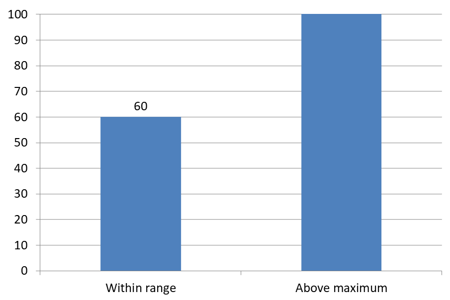

## **Introduzione**

Le etichette dati visualizzano informazioni sulle serie del grafico e sui singoli punti dati, aiutando i lettori a identificare i valori e a comprendere il grafico. Questo articolo spiega come formattare i valori, visualizzare le percentuali, leggere il testo delle etichette, controllare le etichette al di sopra del massimo dell'asse, regolare la spaziatura delle etichette dell'asse delle categorie e posizionare le etichette nei grafici a torta.

## **Imposta la Precisione dei Dati nelle Etichette del Grafico**

Usa [setNumberFormatOfValues](https://reference.aspose.com/slides/it/nodejs-java/aspose.slides/chartseries/setnumberformatofvalues/) per formattare i valori delle serie. Questo esempio crea un grafico a linee con dati predefiniti, visualizza la sua tabella dati e abilita le etichette dei valori per la prima serie. Il formato `#,##0.00` mostra il separatore delle migliaia e due cifre decimali senza modificare i valori di base.

```javascript
const aspose = { slides: require("aspose.slides.via.java") };

const presentation = new aspose.slides.Presentation();
try {
    const slide = presentation.getSlides().get_Item(0);

    const chart = slide.getShapes().addChart(aspose.slides.ChartType.Line, 50, 50, 450, 300);
    chart.setDataTable(true);

    const series = chart.getChartData().getSeries().get_Item(0);
    series.setNumberFormatOfValues("#,##0.00");
    series.getLabels().getDefaultDataLabelFormat().setShowValue(true);

    presentation.save("PrecisionOfDatalabels_out.pptx", aspose.slides.SaveFormat.Pptx);
} finally {
    presentation.dispose();
}
```

## **Visualizza la Percentuale Come Etichette**

Per un grafico a colonne impilate, calcola ogni valore come percentuale del totale della sua categoria e assegna il testo al frame di testo restituito da [getTextFrameForOverriding](https://reference.aspose.com/slides/it/nodejs-java/aspose.slides/datalabel/gettextframeforoverriding/). Questo esempio utilizza i dati predefiniti del grafico e visualizza le percentuali con due cifre decimali in un carattere da 8 punti. Le categorie con un totale pari a zero vengono ignorate per evitare la divisione per zero. Ricalcola il testo personalizzato dell'etichetta se i dati del grafico cambiano.

```javascript
const aspose = { slides: require("aspose.slides.via.java") };

const presentation = new aspose.slides.Presentation();
try {
    const slide = presentation.getSlides().get_Item(0);

    const chart = slide.getShapes().addChart(aspose.slides.ChartType.StackedColumn, 20, 20, 400, 400);

    const categoryTotals = new Array(chart.getChartData().getCategories().size()).fill(0);
    for (let k = 0; k < chart.getChartData().getCategories().size(); k++) {
        for (let i = 0; i < chart.getChartData().getSeries().size(); i++) {
            const series = chart.getChartData().getSeries().get_Item(i);
            const pointValue = series.getDataPoints().get_Item(k).getValue().getData();
            categoryTotals[k] += Number(pointValue);
        }
    }

    for (let x = 0; x < chart.getChartData().getSeries().size(); x++) {
        const series = chart.getChartData().getSeries().get_Item(x);
        series.getLabels().getDefaultDataLabelFormat().setShowLegendKey(false);

        for (let j = 0; j < series.getDataPoints().size(); j++) {
            const label = series.getDataPoints().get_Item(j).getLabel();
            if (categoryTotals[j] == 0) {
                continue;
            }

            const pointValue = series.getDataPoints().get_Item(j).getValue().getData();
            const dataPointPercent = (Number(pointValue) / categoryTotals[j]) * 100;

            const portion = new aspose.slides.Portion();
            portion.setText(dataPointPercent.toFixed(2) + " %");
            portion.getPortionFormat().setFontHeight(8);

            label.getTextFrameForOverriding().setText("");
            const paragraph = label.getTextFrameForOverriding().getParagraphs().get_Item(0);
            paragraph.getPortions().add(portion);

            label.getDataLabelFormat().setShowValue(true);
            label.getDataLabelFormat().setShowSeriesName(false);
            label.getDataLabelFormat().setShowPercentage(false);
            label.getDataLabelFormat().setShowLegendKey(false);
            label.getDataLabelFormat().setShowCategoryName(false);
            label.getDataLabelFormat().setShowBubbleSize(false);
        }
    }

    presentation.save("DisplayPercentageAsLabels_out.pptx", aspose.slides.SaveFormat.Pptx);
} finally {
    presentation.dispose();
}
```

## **Imposta il Segno Percentuale con le Etichette dei Dati del Grafico**

Quando i valori sono memorizzati come frazioni, usa [setNumberFormat](https://reference.aspose.com/slides/it/nodejs-java/aspose.slides/datalabelformat/setnumberformat/) per visualizzare le percentuali. Passa `false` a [setNumberFormatLinkedToSource](https://reference.aspose.com/slides/it/nodejs-java/aspose.slides/datalabelformat/setnumberformatlinkedtosource/) per applicare il formato dell'etichetta indipendentemente dalle celle di origine.

Questo esempio crea un grafico a colonne impilate al 100% con serie rossa e blu in quattro categorie. Ogni coppia di valori somma a 1. Il formato dell'etichetta `0.0%` visualizza 0.30 come 30.0%, mentre l'asse verticale utilizza due cifre decimali. Entrambe le serie usano testo dell'etichetta bianco, da 10 punti.

```javascript
const aspose = { slides: require("aspose.slides.via.java") };
const java = require("java");

const presentation = new aspose.slides.Presentation();
try {
    const slide = presentation.getSlides().get_Item(0);

    const chart = slide.getShapes().addChart(aspose.slides.ChartType.PercentsStackedColumn, 20, 20, 500, 400);

    chart.getAxes().getVerticalAxis().setNumberFormatLinkedToSource(false);
    chart.getAxes().getVerticalAxis().setNumberFormat("0.00%");

    chart.getChartData().getSeries().clear();
    chart.getChartData().getCategories().clear();

    const workbook = chart.getChartData().getChartDataWorkbook();
    const worksheetIndex = 0;
    for (let i = 0; i < 4; i++) {
        const categoryCell = workbook.getCell(worksheetIndex, i + 1, 0, "Category " + (i + 1));
        chart.getChartData().getCategories().add(categoryCell);
    }

    const seriesNames = ["Reds", "Blues"];
    const white = java.getStaticFieldValue("java.awt.Color", "WHITE");
    const seriesColors = [java.getStaticFieldValue("java.awt.Color", "RED"), java.getStaticFieldValue("java.awt.Color", "BLUE")];
    const values = [[0.30, 0.50, 0.80, 0.65], [0.70, 0.50, 0.20, 0.35]];

    for (let i = 0; i < seriesNames.length; i++) {
        const seriesCell = workbook.getCell(worksheetIndex, 0, i + 1, seriesNames[i]);
        const series = chart.getChartData().getSeries().add(seriesCell, chart.getType());
        for (let j = 0; j < 4; j++) {
            const valueCell = workbook.getCell(worksheetIndex, j + 1, i + 1, values[i][j]);
            series.getDataPoints().addDataPointForBarSeries(valueCell);
        }

        series.getFormat().getFill().setFillType(java.newByte(aspose.slides.FillType.Solid));
        series.getFormat().getFill().getSolidFillColor().setColor(seriesColors[i]);

        const labelFormat = series.getLabels().getDefaultDataLabelFormat();
        labelFormat.setShowValue(true);
        labelFormat.setNumberFormatLinkedToSource(false);
        labelFormat.setNumberFormat("0.0%");
        labelFormat.getTextFormat().getPortionFormat().setFontHeight(10);
        labelFormat.getTextFormat().getPortionFormat().getFillFormat().setFillType(java.newByte(aspose.slides.FillType.Solid));
        labelFormat.getTextFormat().getPortionFormat().getFillFormat().getSolidFillColor().setColor(white);
    }

    presentation.save("SetDataLabelsPercentageSign_out.pptx", aspose.slides.SaveFormat.Pptx);
} finally {
    presentation.dispose();
}
```

## **Leggi il Testo Effettivo delle Etichette Dati**

Usa [getActualLabelText](https://reference.aspose.com/slides/it/nodejs-java/aspose.slides/datalabel/getactuallabeltext/) per recuperare il testo prodotto dalle impostazioni di un'etichetta dati. Questo è utile quando si estraggono le etichette per report, si cerca il contenuto della presentazione o si convalidano i grafici generati. Nell'esempio seguente, il [formato predefinito delle etichette dati](https://reference.aspose.com/slides/it/nodejs-java/aspose.slides/datalabelformat/) combina il nome di ogni categoria, il nome della serie e il valore. Un punto formatta il suo valore come percentuale, e un altro usa testo personalizzato da [getTextFrameForOverriding](https://reference.aspose.com/slides/it/nodejs-java/aspose.slides/datalabel/gettextframeforoverriding/).

```javascript
const aspose = { slides: require("aspose.slides.via.java") };

const presentation = new aspose.slides.Presentation();
try {
    const slide = presentation.getSlides().get_Item(0);

    const chart = slide.getShapes().addChart(aspose.slides.ChartType.ClusteredColumn, 20, 20, 500, 300);

    chart.getChartData().getSeries().clear();
    chart.getChartData().getCategories().clear();

    const workbook = chart.getChartData().getChartDataWorkbook();
    const firstCategoryCell = workbook.getCell(0, 1, 0, "Q1");
    chart.getChartData().getCategories().add(firstCategoryCell);
    const secondCategoryCell = workbook.getCell(0, 2, 0, "Q2");
    chart.getChartData().getCategories().add(secondCategoryCell);

    const northSeriesCell = workbook.getCell(0, 0, 1, "North");
    const north = chart.getChartData().getSeries().add(northSeriesCell, chart.getType());
    const northFirstValueCell = workbook.getCell(0, 1, 1, 0.25);
    north.getDataPoints().addDataPointForBarSeries(northFirstValueCell);
    const northSecondValueCell = workbook.getCell(0, 2, 1, 0.75);
    north.getDataPoints().addDataPointForBarSeries(northSecondValueCell);

    const southSeriesCell = workbook.getCell(0, 0, 2, "South");
    const south = chart.getChartData().getSeries().add(southSeriesCell, chart.getType());
    const southFirstValueCell = workbook.getCell(0, 1, 2, 0.40);
    south.getDataPoints().addDataPointForBarSeries(southFirstValueCell);
    const southSecondValueCell = workbook.getCell(0, 2, 2, 0.60);
    south.getDataPoints().addDataPointForBarSeries(southSecondValueCell);

    for (let i = 0; i < chart.getChartData().getSeries().size(); i++) {
        const series = chart.getChartData().getSeries().get_Item(i);
        const format = series.getLabels().getDefaultDataLabelFormat();
        format.setShowCategoryName(true);
        format.setShowSeriesName(true);
        format.setShowValue(true);
    }

    north.getLabels().get_Item(1).getDataLabelFormat().setNumberFormatLinkedToSource(false);
    north.getLabels().get_Item(1).getDataLabelFormat().setNumberFormat("0%");
    south.getLabels().get_Item(0).getTextFrameForOverriding().setText("Reviewed");

    for (let i = 0; i < chart.getChartData().getSeries().size(); i++) {
        const series = chart.getChartData().getSeries().get_Item(i);
        for (let j = 0; j < series.getDataPoints().size(); j++) {
            const point = series.getDataPoints().get_Item(j);
            const label = point.getLabel();
            if (!label.isVisible()) {
                continue;
            }

            console.log("Value: " + point.getValue().getData() + "; label: " + label.getActualLabelText());
        }
    }
} finally {
    presentation.dispose();
}
```

Il numero memorizzato in un punto dati rimane `0.75`, anche quando la sua etichetta mostra `75%` insieme ai nomi della categoria e della serie. Il testo personalizzato sostituisce il testo dell'etichetta generato. [getActualLabelText](https://reference.aspose.com/slides/it/nodejs-java/aspose.slides/datalabel/getactuallabeltext/) restituisce la stringa dell'etichetta risultante in entrambi i casi. Controlla [isVisible](https://reference.aspose.com/slides/it/nodejs-java/aspose.slides/datalabel/isvisible/) separatamente, come mostrato sopra, quando desideri estrarre solo le etichette visibili.

## **Controlla le Etichette Dati Oltre il Massimo dell'Asse**

Quando limiti manualmente un intervallo dell'asse, alcuni punti dati possono superare il suo massimo. Usa [setShowDataLabelsOverMaximum](https://reference.aspose.com/slides/it/nodejs-java/aspose.slides/chart/setshowdatalabelsovermaximum/) per controllare se le loro etichette dati vengono visualizzate. Questa impostazione modifica la visibilità dell'etichetta; non cambia l'intervallo dell'asse né i valori dei dati sottostanti.

L'esempio di seguito crea un grafico a colonne raggruppate 2D con valori 60 e 120. Passa `false` a [setAutomaticMaxValue](https://reference.aspose.com/slides/it/nodejs-java/aspose.slides/axis/setautomaticmaxvalue/) e imposta il massimo a 100 con [setMaxValue](https://reference.aspose.com/slides/it/nodejs-java/aspose.slides/axis/setmaxvalue/) sull'asse verticale. La prima diapositiva consente etichette oltre il massimo; una copia di quella diapositiva le disabilita. Entrambe le diapositive vengono salvate in `DataLabelsOverMaximum.pptx`.

Abilita le etichette dei valori con [setShowValue](https://reference.aspose.com/slides/it/nodejs-java/aspose.slides/datalabelformat/setshowvalue/). L'impostazione a livello di grafico non abilita la visualizzazione dei valori da sola né sovrascrive la visualizzazione dei valori disabilitata di un'etichetta individuale. Questo esempio abilita i valori per l'intera serie e usa [setPosition](https://reference.aspose.com/slides/it/nodejs-java/aspose.slides/datalabelformat/setposition/) per posizionare le etichette all'estremità esterna di ogni colonna.

```javascript
const aspose = { slides: require("aspose.slides.via.java") };

const presentation = new aspose.slides.Presentation();
try {
    const slide = presentation.getSlides().get_Item(0);

    const chart = slide.getShapes().addChart(aspose.slides.ChartType.ClusteredColumn, 50, 50, 600, 400);
    chart.setLegend(false);

    chart.getChartData().getSeries().clear();
    chart.getChartData().getCategories().clear();

    const workbook = chart.getChartData().getChartDataWorkbook();

    const firstCategory = workbook.getCell(0, 1, 0, "Within range");
    const secondCategory = workbook.getCell(0, 2, 0, "Above maximum");

    chart.getChartData().getCategories().add(firstCategory);
    chart.getChartData().getCategories().add(secondCategory);

    const seriesName = workbook.getCell(0, 0, 1, "Values");
    const series = chart.getChartData().getSeries().add(seriesName, chart.getType());

    const firstValue = workbook.getCell(0, 1, 1, 60);
    const secondValue = workbook.getCell(0, 2, 1, 120);

    series.getDataPoints().addDataPointForBarSeries(firstValue);
    series.getDataPoints().addDataPointForBarSeries(secondValue);

    series.getLabels().getDefaultDataLabelFormat().setShowValue(true);
    series.getLabels().getDefaultDataLabelFormat().setPosition(aspose.slides.LegendDataLabelPosition.OutsideEnd);

    chart.getAxes().getVerticalAxis().setAutomaticMaxValue(false);
    chart.getAxes().getVerticalAxis().setMaxValue(100);
    chart.setShowDataLabelsOverMaximum(true);

    const secondSlide = presentation.getSlides().addClone(slide);
    const secondChart = secondSlide.getShapes().get_Item(0);
    secondChart.setShowDataLabelsOverMaximum(false);

    presentation.save("DataLabelsOverMaximum.pptx", aspose.slides.SaveFormat.Pptx);
} finally {
    presentation.dispose();
}
```

Le immagini seguenti mostrano le diapositive salvate renderizzate da Microsoft PowerPoint. Con `true`, l'etichetta **120** è visibile al limite superiore; con `false`, è nascosta. L'etichetta **60** rimane visibile, il massimo dell'asse rimane a **100** e il secondo punto dati rimane **120** in entrambi i casi.

| setShowDataLabelsOverMaximum(true) | setShowDataLabelsOverMaximum(false) |
| --- | --- |
|  |  |

{}
Questo esempio utilizza un grafico a colonne 2D con un asse dei valori. I grafici senza asse dei valori, come i grafici a torta e ciambella, non hanno un massimo dell'asse da limitare in questo modo.
{}

## **Imposta la Distanza dell'Etichetta dall'Asse**

Usa [setLabelOffset](https://reference.aspose.com/slides/it/nodejs-java/aspose.slides/axis/setlabeloffset/) per controllare la distanza tra le etichette dell'asse delle categorie e l'asse. Il valore è una percentuale della dimensione massima del carattere delle etichette dell'asse. Questo esempio crea un grafico a colonne raggruppate e imposta l'offset dell'etichetta dell'asse orizzontale a 500. Questa impostazione influisce sulle etichette dell'asse delle categorie piuttosto che sulle etichette collegate ai singoli punti dati.

```javascript
const aspose = { slides: require("aspose.slides.via.java") };

const presentation = new aspose.slides.Presentation();
try {
    const slide = presentation.getSlides().get_Item(0);

    const chart = slide.getShapes().addChart(aspose.slides.ChartType.ClusteredColumn, 20, 20, 500, 300);
    chart.getAxes().getHorizontalAxis().setLabelOffset(500);

    presentation.save("SetCategoryAxisLabelDistance_out.pptx", aspose.slides.SaveFormat.Pptx);
} finally {
    presentation.dispose();
}
```

## **Regola la Posizione dell'Etichetta**

Su un grafico a torta, regola le posizioni delle etichette dei dati per migliorare la spaziatura e fare spazio alle linee guida.

Questo esempio visualizza il valore del primo punto dati, posiziona la sua etichetta all'esterno della fetta e regola gli offset orizzontali e verticali usando [setX](https://reference.aspose.com/slides/it/nodejs-java/aspose.slides/datalabel/setx/) e [setY](https://reference.aspose.com/slides/it/nodejs-java/aspose.slides/datalabel/sety/). Questi offset sono relativi alla larghezza e all'altezza del grafico, rispettivamente.

```javascript
const aspose = { slides: require("aspose.slides.via.java") };
const java = require("java");

const presentation = new aspose.slides.Presentation();
try {
    const slide = presentation.getSlides().get_Item(0);

    const chart = slide.getShapes().addChart(aspose.slides.ChartType.Pie, 50, 50, 200, 200);
    const series = chart.getChartData().getSeries();

    const label = series.get_Item(0).getLabels().get_Item(0);
    label.getDataLabelFormat().setShowValue(true);
    label.getDataLabelFormat().setPosition(aspose.slides.LegendDataLabelPosition.OutsideEnd);
    label.setX(java.newFloat(0.71));
    label.setY(java.newFloat(0.04));

    presentation.save("presentation.pptx", aspose.slides.SaveFormat.Pptx);
} finally {
    presentation.dispose();
}
```


## **FAQ**

**Come posso evitare che le etichette dei dati si sovrappongano su grafici densi?**  
Combina il posizionamento automatico delle etichette, le linee guida e la riduzione della dimensione del carattere; se necessario, nascondi alcuni campi (ad esempio la categoria) o mostra le etichette solo per valori estremi o punti chiave.

**Come posso disabilitare le etichette solo per valori zero, negativi o vuoti?**  
Filtra i punti dati prima di abilitare le etichette e disattiva la visualizzazione per valori pari a 0, valori negativi o valori mancanti secondo una regola definita.

**Come posso garantire uno stile di etichetta coerente durante l'esportazione in PDF/immagini?**  
Imposta esplicitamente la famiglia e la dimensione del carattere e verifica che il carattere sia disponibile nell'ambiente di rendering per evitare fallback.