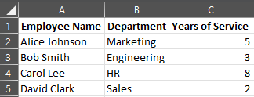

## **Introduzione**

Le presentazioni PowerPoint sono un modo potente per visualizzare e comunicare informazioni. Sono spesso utilizzate in combinazione con cartelle di lavoro Excel, dove Excel funge da eccellente fonte di dati strutturati e PowerPoint eccelle nella visualizzazione di questi dati per un pubblico.

Esistono molti scenari pratici in cui combinare Excel e PowerPoint è essenziale: stampa unione, popolamento di tabelle dati, generazione di una diapositiva per ogni record (generazione batch di diapositive), creazione di materiale formativo e consolidamento di più report Excel in un’unica presentazione, per citarne alcuni.

Finora, implementare tali funzionalità con l’API Aspose.Slides richiedeva l’utilizzo di soluzioni di terze parti come Aspose.Cells. Sebbene questi strumenti siano robusti, possono risultare eccessivamente complessi e costosi per gli utenti che necessitano solo di funzionalità di integrazione dati di base.

## **Come funziona**

Per semplificare e rendere più fluido il lavoro con i dati Excel, Aspose.Slides ha introdotto nuove classi per leggere i dati da cartelle di lavoro Excel e importare il contenuto in una presentazione. Questa funzionalità apre nuove possibilità per gli utenti dell’API che desiderano sfruttare Excel come fonte di dati nei propri flussi di lavoro di presentazione.

La nuova funzionalità è pensata per l’accesso generico ai dati e non è integrata nel Document Object Model (DOM) della presentazione. Ciò significa *che non consente di modificare o salvare file Excel* — il suo unico scopo è aprire cartelle di lavoro e navigare nel loro contenuto per recuperare i dati delle celle.

Al centro di questa funzionalità c’è la nuova classe [ExcelDataWorkbook](https://reference.aspose.com/slides/it/nodejs-java/aspose.slides/exceldataworkbook/). Questa classe consente di caricare una cartella di lavoro Excel da un file locale o da uno stream. Una volta caricata, fornisce diverse overload del metodo [getCell](https://reference.aspose.com/slides/it/nodejs-java/aspose.slides/exceldataworkbook/#getCell), che è possibile utilizzare per recuperare celle specifiche per posizione (ad esempio, indici di riga e colonna o intervalli denominati).

Ogni chiamata a [getCell](https://reference.aspose.com/slides/it/nodejs-java/aspose.slides/exceldataworkbook/#getCell) restituisce un’istanza della classe [ExcelDataCell](https://reference.aspose.com/slides/it/nodejs-java/aspose.slides/exceldatacell/). Questo oggetto rappresenta una singola cella nella cartella di lavoro Excel e consente di accedere al suo valore in modo semplice e intuitivo.

#### **Importare un grafico Excel**

Il passo successivo per estendere la funzionalità è la classe [ExcelWorkbookImporter](https://reference.aspose.com/slides/it/nodejs-java/aspose.slides/excelworkbookimporter/). Questa classe di utilità fornisce la funzionalità per importare contenuti da una cartella di lavoro Excel in una presentazione. Contiene diverse overload del metodo [addChartFromWorkbook](https://reference.aspose.com/slides/it/nodejs-java/aspose.slides/excelworkbookimporter/#addChartFromWorkbook), che aiutano a recuperare il grafico selezionato dalla cartella di lavoro Excel specificata e ad aggiungerlo alla fine della collezione di forme indicata alle coordinate specificate.

In breve, è un’API leggera e diretta per leggere dati Excel — esattamente ciò di cui molti sviluppatori hanno bisogno senza l’onere di una libreria completa di elaborazione di fogli di calcolo.

## **Scriviamo del codice**

### **Esempio di scenario Mail Merge**

Nel seguente esempio, implementeremo un semplice scenario di Mail Merge generando più presentazioni basate sui dati memorizzati in una cartella di lavoro Excel.

Per iniziare, servono due elementi:
1. Una cartella di lavoro Excel contenente i dati



2.  Un modello di presentazione PowerPoint


```js
// Carica la cartella di lavoro Excel con i dati dei dipendenti.
let workbook = new aspose.slides.ExcelDataWorkbook("TemplateData.xlsx");
const worksheetIndex = 0;

// Carica il modello di presentazione.
let templatePresentation = new aspose.slides.Presentation("PresentationTemplate.pptx");

try {
    // Itera le righe di Excel (esclusa l'intestazione alla riga 0).
    for (let rowIndex = 1; rowIndex <= 4; rowIndex++) {

        // Crea una nuova presentazione per ciascun record dipendente.
        let employeePresentation = new aspose.slides.Presentation();

        try {
            // Rimuovi la diapositiva vuota predefinita.
            employeePresentation.getSlides().removeAt(0);

            // Clona la diapositiva modello nella nuova presentazione.
            let slide = employeePresentation.getSlides().addClone(templatePresentation.getSlides().get_Item(0));

            // Ottieni i paragrafi dalla forma target (si assume che l'indice della forma 1 sia usato).
            let paragraphs = slide.getShapes().get_Item(1).getTextFrame().getParagraphs();

            // Sostituisci i segnaposto con i dati di Excel.
            let employeeName = workbook.getCell(worksheetIndex, rowIndex, 0).getValue().toString();
            let namePortion = paragraphs.get_Item(0).getPortions().get_Item(0);
            namePortion.setText(namePortion.getText().replace("{{EmployeeName}}", employeeName));

            let department = workbook.getCell(worksheetIndex, rowIndex, 1).getValue().toString();
            let departmentPortion = paragraphs.get_Item(1).getPortions().get_Item(0);
            departmentPortion.setText(departmentPortion.getText().replace("{{Department}}", department));

            let yearsOfService = workbook.getCell(worksheetIndex, rowIndex, 2).getValue().toString();
            let yearsPortion = paragraphs.get_Item(2).getPortions().get_Item(0);
            yearsPortion.setText(yearsPortion.getText().replace("{{YearsOfService}}", yearsOfService));

            // Salva la presentazione personalizzata in un file separato.
            employeePresentation.save(`${employeeName} Report.pptx`, aspose.slides.SaveFormat.Pptx);
        } finally {
            employeePresentation.dispose();
        }
    }
} finally {
    templatePresentation.dispose();
}
```


### **Esempio di tabella Excel**

Nel secondo esempio, copiamo semplicemente i dati da una tabella Excel e li mostriamo su una diapositiva PowerPoint in un formato più accattivante dal punto di vista visivo.

In questo esempio, riutilizziamo la stessa cartella di lavoro Excel del primo esempio, che contiene una semplice tabella dipendenti.

```js
// Carica la cartella di lavoro Excel contenente i dati dei dipendenti.
let workbook = new aspose.slides.ExcelDataWorkbook("TemplateData.xlsx");
const worksheetIndex = 0;

// Crea una nuova presentazione PowerPoint.
let presentation = new aspose.slides.Presentation();

try {
    // Aggiungi una forma tabella alla prima diapositiva.
    let table = presentation.getSlides().get_Item(0).getShapes().addTable(
            50, 200,
            java.newArray("double", [200, 200, 200]),
            java.newArray("double", [30, 30, 30, 30, 30])
    );

    // Riempi la tabella PowerPoint con i dati della cartella di lavoro Excel.
    for (let rowIndex = 0; rowIndex < 5; rowIndex++) {
        for (let columnIndex = 0; columnIndex < 3; columnIndex++) {
            let cellValue = workbook.getCell(worksheetIndex, rowIndex, columnIndex).getValue().toString();
            table.getColumns().get_Item(columnIndex).get_Item(rowIndex).getTextFrame().setText(cellValue);
        }
    }

    // Salva la presentazione risultante in un file.
    presentation.save("Table.pptx", aspose.slides.SaveFormat.Pptx);
} finally {
    presentation.dispose();
}
```


### **Esempio di importazione di un grafico Excel**

In questo esempio, importiamo un grafico dal primo foglio di lavoro della cartella di lavoro Excel usata nell’esempio precedente. Il grafico sarà collegato alla cartella di lavoro esterna nella presentazione risultante.

Per prima cosa, aggiungiamo un grafico a torta alla cartella di lavoro Excel basato sulla tabella dei dipendenti.


```js
// Crea una nuova presentazione PowerPoint.
let presentation = new aspose.slides.Presentation();
try {
    // Ottieni la collezione di forme della prima diapositiva.
    let shapes = presentation.getSlides().get_Item(0).getShapes();

    // Importa il grafico denominato "Chart 1" dal primo foglio della cartella di lavoro e aggiungilo alla collezione di forme.
    aspose.slides.ExcelWorkbookImporter.addChartFromWorkbook(shapes, 10, 10, "TemplateData.xlsx", "Sheet1", "Chart 1", false);

    // Salva la presentazione risultante in un file.
    presentation.save("Chart.pptx", aspose.slides.SaveFormat.Pptx);
} finally {
    presentation.dispose();
}
```


### **Esempio di importazione di tutti i grafici Excel**

Immaginiamo di avere una cartella di lavoro Excel piena di grafici e di doverli importare tutti in una presentazione. Ogni grafico dovrebbe essere posizionato su una nuova diapositiva.

Il codice seguente itera su tutti i fogli di lavoro nel file Excel di origine, estrae i grafici da ciascun foglio e aggiunge ogni grafico a una diapositiva separata utilizzando un layout di diapositiva vuoto. Nella presentazione risultante, saranno incorporati solo i dati del grafico, non l’intera cartella di lavoro.

```js
// Carica la cartella di lavoro Excel contenente i dati dei dipendenti.
let workbook = new aspose.slides.ExcelDataWorkbook("ExcelWithCharts.xlsx");

// Crea una nuova presentazione PowerPoint.
let presentation = new aspose.slides.Presentation();
try {
    // Recupera il layout della diapositiva vuota.
    let layoutType = java.newByte(aspose.slides.SlideLayoutType.Blank);
    let layoutSlide = presentation.getLayoutSlides().getByType(layoutType);

    // Ottieni i nomi di tutti i fogli contenuti nella cartella di lavoro Excel.
    let worksheetNames = workbook.getWorksheetNames().iterator();

    while (worksheetNames.hasNext()) {
        let name = worksheetNames.next();
        // Recupera una mappa che associa gli indici dei grafici ai nomi dei grafici per il foglio.
        let worksheetCharts = workbook.getChartsFromWorksheet(name).iterator();

        while (worksheetCharts.hasNext()) {
            let chart = worksheetCharts.next();
            // Aggiungi una nuova diapositiva usando il layout vuoto.
            let slide = presentation.getSlides().addEmptySlide(layoutSlide);

            // Importa il grafico specificato dalla cartella di lavoro Excel nella collezione di forme della diapositiva.
            aspose.slides.ExcelWorkbookImporter.addChartFromWorkbook(
                    slide.getShapes(), 10, 10, workbook, name, chart.getKey(), false);
        }
    }

    // Salva la presentazione risultante in un file.
    presentation.save("Charts.pptx", aspose.slides.SaveFormat.Pptx);
} finally {
    presentation.dispose();
}
```

## **Riepilogo**

Questo meccanismo, disponibile direttamente in Aspose.Slides, combina la gestione dei dati Excel e delle presentazioni in un unico posto. Consente di creare diapositive con grafici visivi e dati presentati come tabelle Excel — senza librerie aggiuntive o integrazioni complesse.