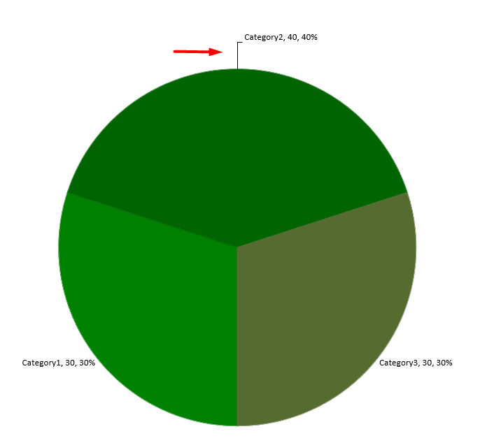

## **Introduzione**

Le etichette dei dati in un grafico mostrano dettagli sulla serie di dati del grafico o sui singoli punti dati. Consentono ai lettori di identificare rapidamente le serie di dati e rendono i grafici più facili da comprendere.

## **Imposta la precisione dei dati nelle etichette del grafico**

Questo codice Python mostra come impostare la precisione dei dati in un&apos;etichetta del grafico:

```python
import jpype
import asposeslides

if not jpype.isJVMStarted():
    jpype.startJVM()

from asposeslides.api import ChartType, Presentation, SaveFormat

presentation = Presentation()
try:
    chart = presentation.getSlides().get_Item(0).getShapes().addChart(ChartType.Line, 50, 50, 450, 300)
    chart.setDataTable(True)
    chart.getChartData().getSeries().get_Item(0).setNumberFormatOfValues("#,##0.00")

    presentation.save("output.pptx", SaveFormat.Pptx)
finally:
    presentation.dispose()
```

## **Visualizza la percentuale come etichette**
Aspose.Slides per Python via Java consente di impostare etichette percentuali sui grafici visualizzati. Questo codice Python dimostra l&apos;operazione:

```python
import jpype
import asposeslides

if not jpype.isJVMStarted():
    jpype.startJVM()

from asposeslides.api import ChartType, Portion, Presentation, SaveFormat

presentation = Presentation()
try:
    slide = presentation.getSlides().get_Item(0)
    chart = slide.getShapes().addChart(ChartType.StackedColumn, 20, 20, 400, 400)
    chart_series = chart.getChartData().getSeries()
    category_totals = [0.0] * chart.getChartData().getCategories().size()
    for category_index in range(len(category_totals)):
        for series_index in range(chart_series.size()):
            data_point = chart_series.get_Item(series_index).getDataPoints().get_Item(category_index)
            category_totals[category_index] += float(data_point.getValue().getData())

    for series_index in range(chart_series.size()):
        series = chart_series.get_Item(series_index)
        series.getLabels().getDefaultDataLabelFormat().setShowLegendKey(False)

        for point_index in range(series.getDataPoints().size()):
            data_point = series.getDataPoints().get_Item(point_index)
            label = data_point.getLabel()
            if category_totals[point_index] == 0:
                print(f"Cannot calculate a percentage for category {point_index}: the total is zero.")
                continue
            point_percentage = float(data_point.getValue().getData()) / category_totals[point_index] * 100

            portion = Portion()
            portion.setText(f"{point_percentage:.2f} %")
            portion.getPortionFormat().setFontHeight(8)
            label.getTextFrameForOverriding().setText("")
            paragraph = label.getTextFrameForOverriding().getParagraphs().get_Item(0)
            paragraph.getPortions().add(portion)

            label_format = label.getDataLabelFormat()
            label_format.setShowSeriesName(False)
            label_format.setShowPercentage(False)
            label_format.setShowLegendKey(False)
            label_format.setShowCategoryName(False)
            label_format.setShowBubbleSize(False)

    presentation.save("output.pptx", SaveFormat.Pptx)
finally:
    presentation.dispose()
```

## **Imposta il segno di percentuale nelle etichette del grafico**
Questo codice Python mostra come impostare il segno di percentuale per un&apos;etichetta del grafico:

```python
import jpype
import asposeslides

if not jpype.isJVMStarted():
    jpype.startJVM()

from asposeslides.api import ChartType, FillType, Presentation, SaveFormat

Color = jpype.JClass("java.awt.Color")

presentation = Presentation()
try:
    slide = presentation.getSlides().get_Item(0)
    chart = slide.getShapes().addChart(ChartType.PercentsStackedColumn, 20, 20, 500, 400)
    chart.getAxes().getVerticalAxis().setNumberFormatLinkedToSource(False)
    chart.getAxes().getVerticalAxis().setNumberFormat("0.00%")
    chart.getChartData().getSeries().clear()
    worksheet_index = 0
    workbook = chart.getChartData().getChartDataWorkbook()

    # Aggiungi la serie rossa.
    series_cell = workbook.getCell(worksheet_index, 0, 1, "Reds")
    red_series = chart.getChartData().getSeries().add(series_cell, chart.getType())
    for row_index, value in enumerate([0.30, 0.50, 0.80, 0.65], start=1):
        data_cell = workbook.getCell(worksheet_index, row_index, 1, jpype.JDouble(value))
        red_series.getDataPoints().addDataPointForBarSeries(data_cell)

    red_series.getFormat().getFill().setFillType(FillType.Solid)
    red_series.getFormat().getFill().getSolidFillColor().setColor(Color.RED)
    red_label_format = red_series.getLabels().getDefaultDataLabelFormat()
    red_label_format.setShowValue(True)
    red_label_format.setNumberFormatLinkedToSource(False)
    red_label_format.setNumberFormat("0.0%")
    red_portion_format = red_label_format.getTextFormat().getPortionFormat()
    red_portion_format.setFontHeight(10)
    red_portion_format.getFillFormat().setFillType(FillType.Solid)
    red_portion_format.getFillFormat().getSolidFillColor().setColor(Color.WHITE)

    # Aggiungi la serie blu.
    series_cell = workbook.getCell(worksheet_index, 0, 2, "Blues")
    blue_series = chart.getChartData().getSeries().add(series_cell, chart.getType())
    for row_index, value in enumerate([0.70, 0.50, 0.20, 0.35], start=1):
        data_cell = workbook.getCell(worksheet_index, row_index, 2, jpype.JDouble(value))
        blue_series.getDataPoints().addDataPointForBarSeries(data_cell)

    blue_series.getFormat().getFill().setFillType(FillType.Solid)
    blue_series.getFormat().getFill().getSolidFillColor().setColor(Color.BLUE)
    blue_label_format = blue_series.getLabels().getDefaultDataLabelFormat()
    blue_label_format.setShowValue(True)
    blue_label_format.setNumberFormatLinkedToSource(False)
    blue_label_format.setNumberFormat("0.0%")
    blue_portion_format = blue_label_format.getTextFormat().getPortionFormat()
    blue_portion_format.setFontHeight(10)
    blue_portion_format.getFillFormat().setFillType(FillType.Solid)
    blue_portion_format.getFillFormat().getSolidFillColor().setColor(Color.WHITE)

    presentation.save("SetDataLabelsPercentageSign_out.pptx", SaveFormat.Pptx)
finally:
    presentation.dispose()
```

## **Imposta la distanza dell&apos;etichetta da un asse**
Questo codice Python mostra come impostare la distanza dell&apos;etichetta da un asse delle categorie quando si lavora con un grafico tracciato da assi:

```python
import jpype
import asposeslides

if not jpype.isJVMStarted():
    jpype.startJVM()

from asposeslides.api import ChartType, Presentation, SaveFormat

presentation = Presentation()
try:
    slide = presentation.getSlides().get_Item(0)
    chart = slide.getShapes().addChart(ChartType.ClusteredColumn, 20, 20, 500, 300)
    chart.getAxes().getHorizontalAxis().setLabelOffset(500)

    presentation.save("output.pptx", SaveFormat.Pptx)
finally:
    presentation.dispose()
```

## **Regola la posizione dell&apos;etichetta**

Quando crei un grafico che non si basa su alcun asse, come un diagramma a torta, le etichette dei dati del grafico potrebbero trovarsi troppo vicine al suo bordo. In tal caso, è necessario regolare la posizione dell&apos;etichetta dei dati in modo che le linee guida vengano visualizzate chiaramente.

Questo codice Python mostra come regolare la posizione dell&apos;etichetta su un diagramma a torta:

```python
import jpype
import asposeslides

if not jpype.isJVMStarted():
    jpype.startJVM()

from asposeslides.api import ChartType, LegendDataLabelPosition, Presentation, SaveFormat

presentation = Presentation()
try:
    chart = presentation.getSlides().get_Item(0).getShapes().addChart(ChartType.Pie, 50, 50, 200, 200)
    series = chart.getChartData().getSeries()
    label = series.get_Item(0).getLabels().get_Item(0)
    label.getDataLabelFormat().setShowValue(True)
    label.getDataLabelFormat().setPosition(LegendDataLabelPosition.OutsideEnd)
    label.setX(0.71)
    label.setY(0.04)

    presentation.save("pres.pptx", SaveFormat.Pptx)
finally:
    presentation.dispose()
```



## **FAQ**

**Come posso impedire che le etichette dei dati si sovrappongano in grafici densi?**

Combina il posizionamento automatico delle etichette, le linee di collegamento e una dimensione del carattere ridotta; se necessario, nascondi alcuni campi (ad esempio, la categoria) o mostra le etichette solo per i punti estremi/chiave.

**Come posso disabilitare le etichette solo per valori zero, negativi o vuoti?**

Filtra i punti dati prima di abilitare le etichette e disattiva la visualizzazione per valori pari a 0, valori negativi o valori mancanti secondo una regola definita.

**Come posso garantire uno stile di etichetta coerente durante l'esportazione in PDF/immagini?**

Imposta esplicitamente i caratteri (famiglia, dimensione) e verifica che il font sia disponibile sul lato rendering per evitare il fallback.