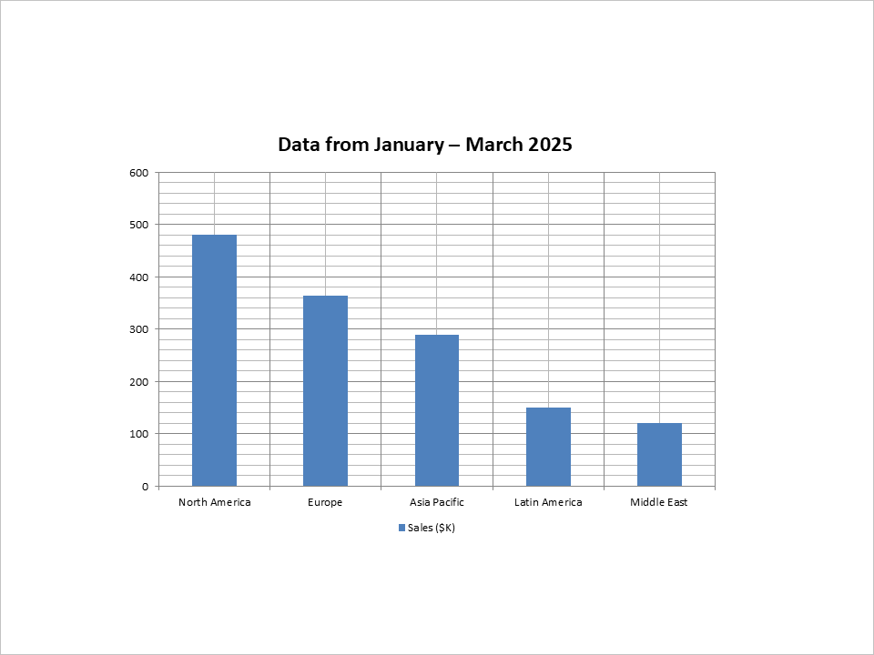

## **Introduzione**

Creare presentazioni manualmente diventa ripetitivo quando il loro contenuto cambia frequentemente. I report settimanali, i materiali di formazione e le presentazioni per i clienti condividono spesso una struttura comune ma richiedono nuovi dati per ogni consegna.

Aspose.Slides per Python tramite Java consente di generare queste presentazioni da applicazioni Python. È possibile integrare la creazione di diapositive in portali web, attività programmate e worker cloud, utilizzando dati provenienti da database, API o file caricati.

## **Casi d'uso comuni per l'automazione di PowerPoint in Python**

- **Report aziendali e dashboard:** trasformare i dati di vendita e le metriche di prestazione in grafici e tabelle.  
- **Presentazioni di vendita personalizzate:** popolare le diapositive con dati specifici del cliente mantenendo un design coerente.  
- **Contenuto educativo:** assemblare lezioni, quiz e riepiloghi di corsi da materiale strutturato.  
- **Approfondimenti basati su dati e AI:** utilizzare i risultati di analisi o di servizi di elaborazione del linguaggio come contenuto della presentazione.  
- **Diapositive basate su media:** combinare immagini o screenshot caricati con testo esplicativo.  
- **Flussi di lavoro documentali:** mappare i contenuti estratti da altri strumenti nei layout delle presentazioni.  
- **Strumenti per sviluppatori:** generare riepiloghi di release, panorami tecnici o dimostrazioni dai dati del progetto.  

## **Prerequisiti**

Segui [Installazione](/slides/it/python-java/installation/) per configurare Python, Java, JPype e Aspose.Slides. Per il deployment su cloud, consulta anche [Slides su piattaforme cloud](/slides/it/python-java/slides-on-cloud-platforms/).

L'esempio utilizza dati aziendali fissi così può essere eseguito senza un database o un servizio esterno. Sostituisci questi valori con i dati della tua applicazione quando lo integri in un flusso di lavoro di report.

{}
Puoi provare l'esempio senza licenza, ma l'output di valutazione include una filigrana ed è soggetto a restrizioni di valutazione. Vedi [Valuta Aspose.Slides](/slides/it/python-java/evaluate-aspose-slides/) per i dettagli e le informazioni sulla licenza temporanea.
{}

## **Crea la presentazione**

Lo script completo di seguito crea una presentazione contenente quattro diapositive. Ogni passo utilizza la stessa presentazione e l'ultimo passo la salva come `presentation.pptx`.

### **Crea una diapositiva del titolo**

Utilizza la diapositiva iniziale in una nuova [Presentation](https://reference.aspose.com/slides/it/python-java/aspose.slides/presentation/) e applica il layout del titolo. Compila i segnaposto del titolo e del sottotitolo con l'intestazione del report e il pubblico.


### **Aggiungi una diapositiva con un grafico a colonne**

Aggiungi una diapositiva vuota e crea un grafico con [ShapeCollection.addChart](https://reference.aspose.com/slides/it/python-java/aspose.slides/shapecollection/#addChart). Popola il suo workbook incorporato con cinque regioni e una serie di vendite. I valori rimangono modificabili in PowerPoint.



### **Aggiungi una diapositiva con una tabella**

Crea una tabella con [ShapeCollection.addTable](https://reference.aspose.com/slides/it/python-java/aspose.slides/shapecollection/#addTable) e popola due colonne con nomi delle metriche e valori. L'esempio passa espliciti array Java di double per le larghezze delle colonne e le altezze delle righe tramite JPype.


### **Aggiungi una diapositiva di riepilogo con punti elenco**

Crea una forma di testo e aggiungi un [Paragraph](https://reference.aspose.com/slides/it/python-java/aspose.slides/paragraph/) per ogni elemento d'azione. Applica un simbolo di elenco puntato e testo nero a ogni paragrafo, e rimuovi il riempimento e il contorno della forma.


### **Salva la presentazione**

Usa [Presentation.save](https://reference.aspose.com/slides/it/python-java/aspose.slides/presentation/#save) per scrivere il file PowerPoint. Rilascia la presentazione con [Presentation.dispose](https://reference.aspose.com/slides/it/python-java/aspose.slides/presentation/#dispose) in un blocco `finally`.

### **Esempio Python completo**

Salva questo script in una directory scrivibile e eseguilo con l'ambiente Python configurato sopra. Avvia la JVM solo se necessario e la mantiene disponibile fino all'uscita del processo. Per l'uso in notebook e servizi, consulta la [guida al ciclo di vita della JVM](/slides/it/python-java/limitations-and-api-differences/#import-the-library).

```python
import jpype
import asposeslides
from jpype.types import JArray, JDouble

if not jpype.isJVMStarted():
    jpype.startJVM()

from asposeslides.api import BulletType, ChartType, FillType, LegendPositionType, Paragraph, Presentation, SaveFormat, ShapeType, SlideLayoutType
from java.awt import Color


def create_bullet_paragraph(text):
    paragraph = Paragraph()
    paragraph.getParagraphFormat().getBullet().setType(BulletType.Symbol)
    paragraph.getParagraphFormat().setIndent(15)
    paragraph.getParagraphFormat().getDefaultPortionFormat().getFillFormat().setFillType(FillType.Solid)
    paragraph.getParagraphFormat().getDefaultPortionFormat().getFillFormat().getSolidFillColor().setColor(Color.BLACK)
    paragraph.setText(text)
    return paragraph


presentation = Presentation()
try:
    # Crea la diapositiva del titolo.
    title_slide = presentation.getSlides().get_Item(0)
    title_layout = presentation.getLayoutSlides().getByType(SlideLayoutType.Title)
    title_slide.setLayoutSlide(title_layout)
    title_shape = title_slide.getShapes().get_Item(0)
    subtitle_shape = title_slide.getShapes().get_Item(1)
    title_shape.getTextFrame().setText("Quarterly Business Review – Q1 2025")
    subtitle_shape.getTextFrame().setText("Prepared for Executive Team")

    # Aggiungi una diapositiva con grafico.
    blank_layout = presentation.getLayoutSlides().getByType(SlideLayoutType.Blank)
    chart_slide = presentation.getSlides().addEmptySlide(blank_layout)
    chart = chart_slide.getShapes().addChart(ChartType.ClusteredColumn, 100, 100, 500, 350, False)
    chart.getLegend().setPosition(LegendPositionType.Bottom)
    chart.setTitle(True)
    chart.getChartTitle().addTextFrameForOverriding("Data from January – March 2025")
    chart.getChartTitle().setOverlay(False)

    workbook = chart.getChartData().getChartDataWorkbook()
    worksheet_index = 0
    sales = [("North America", 480), ("Europe", 365), ("Asia Pacific", 290), ("Latin America", 150), ("Middle East", 120)]
    for row_index, (region, amount) in enumerate(sales, start=1):
        category_cell = workbook.getCell(worksheet_index, row_index, 0, region)
        chart.getChartData().getCategories().add(category_cell)

    series_cell = workbook.getCell(worksheet_index, 0, 1, "Sales ($K)")
    series = chart.getChartData().getSeries().add(series_cell, chart.getType())
    for row_index, (region, amount) in enumerate(sales, start=1):
        value_cell = workbook.getCell(worksheet_index, row_index, 1, JDouble(amount))
        series.getDataPoints().addDataPointForBarSeries(value_cell)

    # Aggiungi una diapositiva con tabella.
    table_slide = presentation.getSlides().addEmptySlide(blank_layout)
    column_widths = JArray(JDouble)([200, 100])
    row_heights = JArray(JDouble)([40, 40, 40, 40, 40])
    table = table_slide.getShapes().addTable(200, 200, column_widths, row_heights)
    metrics = [("Metric", "Value"), ("Total Revenue", "$1.4M"), ("Gross Margin", "54%"), ("New Customers", "340"), ("Customer Retention", "87%")]
    for row_index, (metric, value) in enumerate(metrics):
        table.getColumns().get_Item(0).get_Item(row_index).getTextFrame().setText(metric)
        table.getColumns().get_Item(1).get_Item(row_index).getTextFrame().setText(value)

    # Aggiungi una diapositiva di riepilogo.
    summary_slide = presentation.getSlides().addEmptySlide(blank_layout)
    bullet_list = summary_slide.getShapes().addAutoShape(ShapeType.Rectangle, 100, 50, 600, 200)
    bullet_list.getFillFormat().setFillType(FillType.NoFill)
    bullet_list.getLineFormat().getFillFormat().setFillType(FillType.NoFill)
    paragraphs = bullet_list.getTextFrame().getParagraphs()
    paragraphs.clear()
    action_items = ["Strong performance in North America; growth opportunity in Asia Pacific", "Improve marketing outreach in underperforming regions", "Prepare new campaign strategy for Q2", "Schedule follow-up review in early July"]
    for text in action_items:
        paragraph = create_bullet_paragraph(text)
        paragraphs.add(paragraph)

    presentation.save("presentation.pptx", SaveFormat.Pptx)
finally:
    presentation.dispose()
```

Le illustrazioni mostrano le diapositive corrispondenti dell'esempio Java. L'aspetto può variare a seconda dei font installati e della modalità di valutazione.

## **Usa l'esempio in un'applicazione cloud**

Recupera i dati del report prima di creare la presentazione, quindi passali ai passaggi di grafico, tabella e generazione del testo. Usa un percorso di output separato per ogni attività. Dopo il salvataggio, la tua applicazione può caricare il file nello storage degli oggetti o restituirlo come download.

Mantieni la JVM in esecuzione tra i lavori nello stesso processo worker e rilascia ogni presentazione al termine del relativo lavoro. Includi i font richiesti dal design del tuo report nella distribuzione per ridurre le differenze tra gli ambienti.

## **Conclusione**

Questo esempio genera una presentazione aziendale completa da Python usando grafici, tabelle e testo modificabili. Sostituire i dati di esempio con i dati dell'applicazione rende lo stesso approccio utile per report ricorrenti, presentazioni per clienti e materiale educativo.

## **FAQ**

**Lo script richiede Microsoft PowerPoint o Excel?**

No. Aspose.Slides crea le diapositive e il workbook incorporato del grafico senza alcuna di queste applicazioni.

**Perché l'esempio di tabella utilizza array Java?**

Il metodo sottostante accetta array di double Java. Gli array espliciti rendono chiari i tipi numerici passati tramite JPype.

**Posso salvare la stessa presentazione come PDF o ODP?**

Sì. Prima di rilasciarla, salvala con un altro nome file di output usando il valore corrispondente di [SaveFormat](https://reference.aspose.com/slides/it/python-java/aspose.slides/saveformat/). Consulta [Formati di file supportati](/slides/it/python-java/supported-file-formats/) per le funzionalità specifiche dei formati.

**Posso usare un modello brandizzato?**

Sì. Carica il tuo modello invece di creare una presentazione vuota, quindi adatta il layout e la selezione dei segnaposto a quel modello. L'esempio presuppone i layout e l'ordine dei segnaposto di una nuova presentazione predefinita.