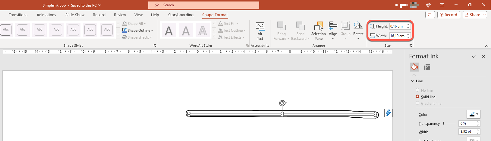

## **Introduzione**

PowerPoint fornisce una funzionalità di inchiostro che consente di disegnare tratti liberi. L’inchiostro può essere utilizzato per evidenziare altri oggetti, mostrare connessioni e processi e attirare l’attenzione su elementi specifici di una diapositiva.

Lo spazio dei nomi [aspose.slides.ink](https://reference.aspose.com/slides/it/python-net/aspose.slides.ink/) contiene le classi necessarie per lavorare con gli oggetti di inchiostro. Ad esempio, la classe [Ink](https://reference.aspose.com/slides/it/python-net/aspose.slides.ink/ink/) rappresenta un oggetto di inchiostro su una diapositiva.

## **Differenze tra oggetti regolari e oggetti di inchiostro**

Gli oggetti su una diapositiva PowerPoint sono tipicamente rappresentati da oggetti forma. Nella sua forma più semplice, una forma è un contenitore che definisce l’area dell’oggetto stesso (il suo riquadro) insieme a proprietà come la dimensione del contenitore, la forma e lo sfondo. Per ulteriori informazioni, vedere [Shape Layout Format](https://docs.aspose.com/slides/it/python-net/shape-manipulations/#access-layout-formats-for-shape).

Tuttavia, quando PowerPoint gestisce un oggetto di inchiostro, ignora tutte le proprietà del riquadro dell’oggetto (contenitore) tranne la sua dimensione. La dimensione dell’area del contenitore è determinata dalle proprietà standard [Ink.width](https://reference.aspose.com/slides/it/python-net/aspose.slides.ink/ink/width/) e [Ink.height](https://reference.aspose.com/slides/it/python-net/aspose.slides.ink/ink/height/):



## **Tracce di inchiostro**

Una traccia di inchiostro è un elemento di base utilizzato per registrare la traiettoria di una penna mentre l’utente scrive in digitale. Una traccia memorizza una sequenza di punti collegati.

La forma più semplice di codifica specifica le coordinate X e Y di ogni punto di campionamento. Quando tutti i punti collegati vengono renderizzati, producono un’immagine come questa:


## **Proprietà del pennello per il disegno**

Un pennello è usato per disegnare linee che collegano i punti di una traccia di inchiostro. Le sue proprietà [InkBrush.color](https://reference.aspose.com/slides/it/python-net/aspose.slides.ink/inkbrush/color/) e [InkBrush.size](https://reference.aspose.com/slides/it/python-net/aspose.slides.ink/inkbrush/size/) controllano rispettivamente il colore e la dimensione.

### **Impostare il colore del pennello di inchiostro**

Questo codice Python mostra come impostare il colore di un pennello di inchiostro:

```py
import aspose.slides as slides
import aspose.pydrawing as draw

with slides.Presentation("pres.pptx") as presentation:
    ink = presentation.slides[0].shapes[0]
    brush = ink.traces[0].brush
    brush.color = draw.Color.red
```

### **Impostare la dimensione del pennello di inchiostro**

Questo codice Python mostra come impostare la dimensione di un pennello di inchiostro:

```py
import aspose.slides as slides
import aspose.pydrawing as draw

with slides.Presentation("pres.pptx") as presentation:
    ink = presentation.slides[0].shapes[0]
    brush = ink.traces[0].brush
    brush.size = draw.SizeF(5.0, 10.0)
```

In generale, la larghezza e l’altezza di un pennello non coincidono, quindi PowerPoint non visualizza la dimensione del pennello (la sezione dati corrispondente è grigia). Quando larghezza e altezza coincidono, PowerPoint visualizza la dimensione in questo modo:


Per chiarezza, aumentiamo l’altezza dell’oggetto di inchiostro e rivediamo le dimensioni importanti:


Il contenitore (riquadro) non tiene conto della dimensione dei pennelli – assume sempre che lo spessore della linea sia zero (vedi l’immagine precedente).

Pertanto, per determinare l’area visibile dell’intero oggetto di inchiostro, è necessario tenere conto della dimensione del pennello delle sue tracce. Qui, l’oggetto di destinazione (la traccia del testo scritto a mano) è stato scalato alle dimensioni del contenitore (riquadro). Quando la dimensione del contenitore cambia, la dimensione del pennello rimane costante, e viceversa.


PowerPoint utilizza un comportamento simile per gli oggetti di testo:


## **Controllare l’aspetto dell’inchiostro durante l’esportazione e il rendering**

Aspose.Slides fornisce la classe [InkOptions](https://reference.aspose.com/slides/it/python-net/aspose.slides.export/inkoptions/) per controllare come gli oggetti di inchiostro appaiono nell’output esportato o renderizzato. È possibile usare le sue proprietà per nascondere completamente l’inchiostro o modificare il modo in cui le operazioni di maschera del pennello di inchiostro vengono interpretate.

Le opzioni di inchiostro sono disponibili attraverso le opzioni di esportazione o rendering per diversi tipi di output:

| Output | Proprietà delle opzioni Ink |
| --- | --- |
| PDF | [`PdfOptions.ink_options`](https://reference.aspose.com/slides/it/python-net/aspose.slides.export/pdfoptions/ink_options/) |
| HTML | [`HtmlOptions.ink_options`](https://reference.aspose.com/slides/it/python-net/aspose.slides.export/htmloptions/ink_options/) |
| SVG | [`SVGOptions.ink_options`](https://reference.aspose.com/slides/it/python-net/aspose.slides.export/svgoptions/ink_options/) |
| TIFF | [`TiffOptions.ink_options`](https://reference.aspose.com/slides/it/python-net/aspose.slides.export/tiffoptions/ink_options/) |
| Immagine diapositiva | [`RenderingOptions.ink_options`](https://reference.aspose.com/slides/it/python-net/aspose.slides.export/renderingoptions/ink_options/) |

Le stesse due impostazioni sono disponibili tramite queste proprietà:

- [`InkOptions.hide_ink`](https://reference.aspose.com/slides/it/python-net/aspose.slides.export/inkoptions/hide_ink/) determina se gli oggetti di inchiostro sono inclusi nell’output. Il valore predefinito è `False`.
- [`InkOptions.interpret_mask_op_as_opacity`](https://reference.aspose.com/slides/it/python-net/aspose.slides.export/inkoptions/interpret_mask_op_as_opacity/) determina se un’operazione di maschera è interpretata come opacità durante il rendering di un pennello di inchiostro. Il valore predefinito è `True`; impostarlo su `False` per utilizzare l’operazione ROP invece.

### **Nascondere gli oggetti di inchiostro nell’output PDF**

Per impostazione predefinita, gli oggetti di inchiostro rimangono visibili durante l’esportazione. Impostare [InkOptions.hide_ink](https://reference.aspose.com/slides/it/python-net/aspose.slides.export/inkoptions/hide_ink/) su `True` quando è necessario un output pulito senza annotazioni scritte a mano o altri contenuti di inchiostro.

Il seguente esempio Python esporta una presentazione in PDF nascondendo tutti gli oggetti di inchiostro:

```py
import aspose.slides as slides

with slides.Presentation("presentation.pptx") as presentation:
    pdf_options = slides.export.PdfOptions()
    pdf_options.ink_options.hide_ink = True

    presentation.save("presentation_without_ink.pdf", slides.export.SaveFormat.PDF, pdf_options)
```

### **Nascondere gli oggetti di inchiostro durante il rendering di una diapositiva come immagine**

Per nascondere gli oggetti di inchiostro quando le diapositive vengono renderizzate come immagini bitmap, configurare [RenderingOptions.ink_options](https://reference.aspose.com/slides/it/python-net/aspose.slides.export/renderingoptions/ink_options/) e passare le opzioni di rendering al metodo [Slide.get_image](https://reference.aspose.com/slides/it/python-net/aspose.slides/slide/get_image/).

Il seguente esempio Python renderizza la prima diapositiva come immagine PNG senza oggetti di inchiostro:

```py
import aspose.slides as slides

with slides.Presentation("presentation.pptx") as presentation:
    rendering_options = slides.export.RenderingOptions()
    rendering_options.ink_options.hide_ink = True

    with presentation.slides[0].get_image(rendering_options) as image:
        image.save("slide_without_ink.png", slides.ImageFormat.PNG)
```

### **Controllare il rendering della maschera di inchiostro**

La proprietà [InkOptions.interpret_mask_op_as_opacity](https://reference.aspose.com/slides/it/python-net/aspose.slides.export/inkoptions/interpret_mask_op_as_opacity/) controlla come le operazioni di maschera sono interpretate durante il rendering dei pennelli di inchiostro. Il valore predefinito è `True`, che utilizza l’opacità. Impostare la proprietà su `False` per usare l’operazione ROP.

Il seguente esempio Python esporta una diapositiva in SVG e utilizza il rendering basato su ROP per le operazioni di maschera di inchiostro:

```py
import aspose.slides as slides

with slides.Presentation("presentation.pptx") as presentation:
    svg_options = slides.export.SVGOptions()
    svg_options.ink_options.interpret_mask_op_as_opacity = False

    with open("slide.svg", "wb") as svg_stream:
        presentation.slides[0].write_as_svg(svg_stream, svg_options)
```

La stessa impostazione può essere applicata tramite [TiffOptions.ink_options](https://reference.aspose.com/slides/it/python-net/aspose.slides.export/tiffoptions/ink_options/) quando si esporta una presentazione o si rende una diapositiva in TIFF.

### **Scegliere se nascondere o preservare l’inchiostro**

Impostare [InkOptions.hide_ink](https://reference.aspose.com/slides/it/python-net/aspose.slides.export/inkoptions/hide_ink/) su `True` quando il file esportato deve essere una versione pulita di una presentazione annotata, ad esempio una copia finale destinata alla distribuzione senza segni di revisione.

Lasciare [InkOptions.hide_ink](https://reference.aspose.com/slides/it/python-net/aspose.slides.export/inkoptions/hide_ink/) al valore predefinito `False` quando le annotazioni di inchiostro fanno parte del contenuto previsto, come commenti di revisione, note scritte a mano, evidenziazioni o disegni che devono rimanere visibili nel risultato esportato. Questo consente alle applicazioni di generare uscite di revisione e finali separate dalla stessa presentazione senza modificare gli oggetti di inchiostro di origine.

## **FAQ**

**Posso modificare il colore o la dimensione di un tratto di inchiostro esistente?**

Sì. Ottieni la traccia da [Ink.traces](https://reference.aspose.com/slides/it/python-net/aspose.slides.ink/ink/traces/), quindi modifica il suo [InkTrace.brush](https://reference.aspose.com/slides/it/python-net/aspose.slides.ink/inktrace/brush/). È possibile impostare le proprietà [InkBrush.color](https://reference.aspose.com/slides/it/python-net/aspose.slides.ink/inkbrush/color/) e [InkBrush.size](https://reference.aspose.com/slides/it/python-net/aspose.slides.ink/inkbrush/size/).

**Nascondere l’inchiostro modifica la presentazione di origine?**

No. [InkOptions.hide_ink](https://reference.aspose.com/slides/it/python-net/aspose.slides.export/inkoptions/hide_ink/) influisce solo sul risultato renderizzato o esportato; non rimuove né modifica gli oggetti di inchiostro nella presentazione di origine.

**Quali formati di esportazione supportano le opzioni di inchiostro?**

È possibile configurare le opzioni di inchiostro per PDF, HTML, SVG, TIFF e immagini bitmap delle diapositive tramite le relative opzioni di esportazione o rendering indicate sopra.

**Ulteriori letture**

* Per informazioni generali sulle forme, vedere la sezione [PowerPoint Shapes](https://docs.aspose.com/slides/it/python-net/powerpoint-shapes/).
* Per maggiori dettagli sui valori effettivi, consultare [Shape Effective Properties](https://docs.aspose.com/slides/it/python-net/shape-effective-properties/#get-effective-font-height-value).
* Per i dettagli sull’esportazione PDF, vedere [Convert PPT and PPTX to PDF](https://docs.aspose.com/slides/it/python-net/convert-powerpoint-to-pdf/).
* Per i dettagli sull’esportazione HTML, vedere [Convert PowerPoint Presentations to HTML](https://docs.aspose.com/slides/it/python-net/convert-powerpoint-to-html/).
* Per i dettagli sull’esportazione SVG, vedere [Render Presentation Slides as SVG Images](https://docs.aspose.com/slides/it/python-net/render-a-slide-as-an-svg-image/).
* Per i dettagli sull’esportazione TIFF, vedere [Convert PowerPoint Presentations to TIFF](https://docs.aspose.com/slides/it/python-net/convert-powerpoint-to-tiff/).
* Per i dettagli sul rendering diapositiva‑immagine, vedere [Convert Presentation Slides to Images](https://docs.aspose.com/slides/it/python-net/convert-slide/).