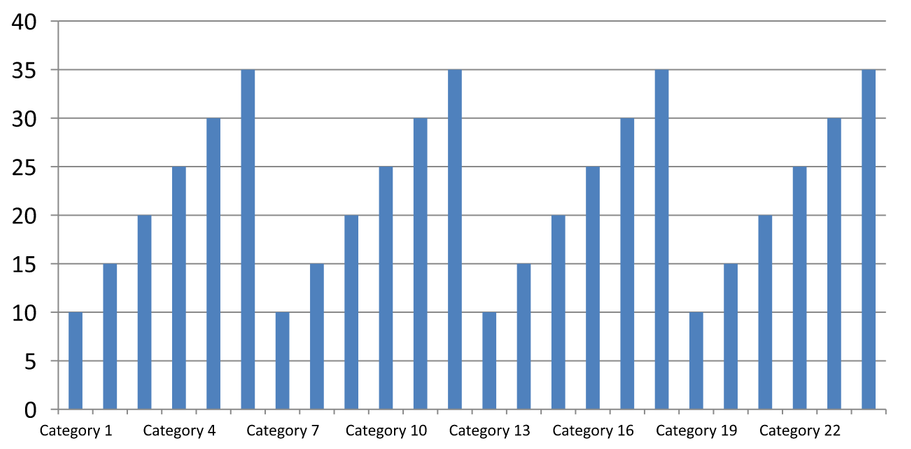

## **Panoramica**

Questo articolo spiega come personalizzare gli assi dei grafici con Aspose.Slides per Python tramite .NET. Copre i valori calcolati dell'asse, lo scambio di righe e colonne del grafico, la visibilità dell'asse, gli intervalli di etichette e di tick-mark delle categorie, le categorie data e la formattazione, la rotazione del titolo, il posizionamento dell'asse e le unità di visualizzazione.

## **Ottieni i valori massimi sull'asse verticale nei grafici**

Crea una [Presentation](https://reference.aspose.com/slides/python-net/aspose.slides/presentation/) e aggiungi un grafico a area con dati predefiniti. Chiama [validate_chart_layout](https://reference.aspose.com/slides/python-net/aspose.slides.charts/chart/validate_chart_layout/) prima di leggere i valori calcolati dell'asse in modo che il layout del grafico sia aggiornato.

Leggi [actual_max_value](https://reference.aspose.com/slides/python-net/aspose.slides.charts/axis/actual_max_value/) e [actual_min_value](https://reference.aspose.com/slides/python-net/aspose.slides.charts/axis/actual_min_value/) per i limiti dell'asse, e [actual_major_unit](https://reference.aspose.com/slides/python-net/aspose.slides.charts/axis/actual_major_unit/) e [actual_minor_unit](https://reference.aspose.com/slides/python-net/aspose.slides.charts/axis/actual_minor_unit/) per gli intervalli dei tick. [actual_major_unit_scale](https://reference.aspose.com/slides/python-net/aspose.slides.charts/axis/actual_major_unit_scale/) e [actual_minor_unit_scale](https://reference.aspose.com/slides/python-net/aspose.slides.charts/axis/actual_minor_unit_scale/) forniscono le scale di unità temporali, rilevanti per gli assi data. L'esempio memorizza questi valori in variabili locali e salva il grafico.

```python
import aspose.slides as slides
import aspose.slides.charts as charts

with slides.Presentation() as presentation:
    slide = presentation.slides[0]

    chart = slide.shapes.add_chart(charts.ChartType.AREA, 100, 100, 500, 350)
    chart.validate_chart_layout()

    max_value = chart.axes.vertical_axis.actual_max_value
    min_value = chart.axes.vertical_axis.actual_min_value

    major_unit = chart.axes.vertical_axis.actual_major_unit
    minor_unit = chart.axes.vertical_axis.actual_minor_unit

    major_unit_scale = chart.axes.vertical_axis.actual_major_unit_scale
    minor_unit_scale = chart.axes.vertical_axis.actual_minor_unit_scale

    presentation.save("AxisValues_out.pptx", slides.export.SaveFormat.PPTX)
```

## **Scambia i dati tra gli assi**

Usa [switch_row_column](https://reference.aspose.com/slides/python-net/aspose.slides.charts/chartdata/switch_row_column/) per scambiare i ruoli di serie e categorie nei dati del grafico. Ogni categoria precedente diventa una serie e ogni serie precedente diventa una categoria. Questo modifica il modo in cui i dati sono raggruppati; non scambia gli assi orizzontale e verticale. L'esempio utilizza [set_range](https://reference.aspose.com/slides/python-net/aspose.slides.charts/chartdata/set_range/) per collegare i dati predefiniti a `Sheet1!A1:D5`, includendo la riga di intestazione e la colonna delle categorie, prima di scambiare righe e colonne. Salva un grafico con quattro serie e tre categorie.

```python
import aspose.slides as slides
import aspose.slides.charts as charts

with slides.Presentation() as presentation:
    slide = presentation.slides[0]

    chart = slide.shapes.add_chart(charts.ChartType.CLUSTERED_COLUMN, 100, 100, 400, 300)

    chart.chart_data.set_range("Sheet1!A1:D5")
    chart.chart_data.switch_row_column()

    presentation.save("SwitchChartRowColumns_out.pptx", slides.export.SaveFormat.PPTX)
```

## **Disabilita l'asse verticale per i grafici a linee**

Imposta [is_visible](https://reference.aspose.com/slides/python-net/aspose.slides.charts/axis/is_visible/) su `False` sull'asse verticale per nasconderlo. L'esempio crea un grafico a linee con dati predefiniti e lo salva con l'asse verticale nascosto.

```python
import aspose.slides as slides
import aspose.slides.charts as charts

with slides.Presentation() as presentation:
    slide = presentation.slides[0]

    chart = slide.shapes.add_chart(charts.ChartType.LINE, 100, 100, 400, 300)
    chart.axes.vertical_axis.is_visible = False

    presentation.save("HiddenVerticalAxis.pptx", slides.export.SaveFormat.PPTX)
```

## **Disabilita l'asse orizzontale per i grafici a linee**

Imposta [is_visible](https://reference.aspose.com/slides/python-net/aspose.slides.charts/axis/is_visible/) su `False` sull'asse orizzontale per nasconderlo. L'esempio crea un grafico a linee con dati predefiniti e lo salva con l'asse orizzontale nascosto.

```python
import aspose.slides as slides
import aspose.slides.charts as charts

with slides.Presentation() as presentation:
    slide = presentation.slides[0]

    chart = slide.shapes.add_chart(charts.ChartType.LINE, 100, 100, 400, 300)
    chart.axes.horizontal_axis.is_visible = False

    presentation.save("HiddenHorizontalAxis.pptx", slides.export.SaveFormat.PPTX)
```

## **Modifica un asse di categoria**

Imposta [category_axis_type](https://reference.aspose.com/slides/python-net/aspose.slides.charts/axis/category_axis_type/) per scegliere un asse di categoria data o di testo. Questo esempio richiede `ExistingChart.pptx`, con un grafico come prima forma nella prima diapositiva e celle di categoria contenenti valori data Excel numerici. Cambia l'asse orizzontale in un asse data. Impostando [is_automatic_major_unit](https://reference.aspose.com/slides/python-net/aspose.slides.charts/axis/is_automatic_major_unit/) su `False`, [major_unit](https://reference.aspose.com/slides/python-net/aspose.slides.charts/axis/major_unit/) su `1` e [major_unit_scale](https://reference.aspose.com/slides/python-net/aspose.slides.charts/axis/major_unit_scale/) su mesi, posiziona i tick principali a intervalli di un mese.

```python
import aspose.slides as slides
import aspose.slides.charts as charts

with slides.Presentation("ExistingChart.pptx") as presentation:
    slide = presentation.slides[0]

    chart = slide.shapes[0]
    chart.axes.horizontal_axis.category_axis_type = charts.CategoryAxisType.DATE
    chart.axes.horizontal_axis.is_automatic_major_unit = False
    chart.axes.horizontal_axis.major_unit = 1
    chart.axes.horizontal_axis.major_unit_scale = charts.TimeUnitType.MONTHS

    presentation.save("ChangeChartCategoryAxis_out.pptx", slides.export.SaveFormat.PPTX)
```

## **Controlla gli intervalli delle etichette dell'asse di categoria**

Quando un grafico ha molte categorie, riduci il numero di etichette dell'asse visibili senza rimuovere categorie o punti dati. Imposta [is_automatic_tick_label_spacing](https://reference.aspose.com/slides/python-net/aspose.slides.charts/axis/is_automatic_tick_label_spacing/) su `False`, quindi imposta [tick_label_spacing](https://reference.aspose.com/slides/python-net/aspose.slides.charts/axis/tick_label_spacing/) sull'intervallo di categoria desiderato. Per le categorie testuali nel loro ordine normale, il conteggio inizia dalla prima categoria:

| Intervallo | Etichette visualizzate nell'esempio |
| --- | --- |
| `1` | Categoria 1, Categoria 2, Categoria 3, ... Categoria 24 |
| `2` | Categoria 1, Categoria 3, Categoria 5, ... Categoria 23 |
| `3` | Categoria 1, Categoria 4, Categoria 7, ... Categoria 22 |

Un intervallo di `3` visualizza ogni terza etichetta, lasciando due etichette nascoste tra quelle visualizzate. Non rimuove le colonne corrispondenti. La spaziatura automatica sceglie un intervallo in base allo spazio disponibile; non visualizza necessariamente ogni etichetta.

I tick mark hanno controlli separati. Imposta [is_automatic_tick_marks_spacing](https://reference.aspose.com/slides/python-net/aspose.slides.charts/axis/is_automatic_tick_marks_spacing/) su `False` e usa [tick_marks_spacing](https://reference.aspose.com/slides/python-net/aspose.slides.charts/axis/tick_marks_spacing/) per impostare il loro intervallo. Ad esempio, `1` mantiene un tick mark a ogni intervallo di categoria mentre le etichette appaiono solo ogni terza categoria. Imposta [major_tick_mark](https://reference.aspose.com/slides/python-net/aspose.slides.charts/axis/major_tick_mark/) su uno stile visibile per poter vedere il risultato. Impostare nuovamente le proprietà di spaziatura automatica su `True` consente al grafico di scegliere di nuovo quell'intervallo.

L'esempio autonomo seguente crea 24 categorie e una serie, quindi salva tre diapositive in `CategoryAxisIntervals.pptx`: spaziatura automatica, spaziatura manuale delle etichette con tick mark indipendenti e spaziatura automatica ripristinata. Le due copie mantengono i dati originali del grafico. Non è necessaria alcuna presentazione di input. Il testo delle etichette orizzontali rende evidente la differenza di densità.

```python
import aspose.slides as slides
import aspose.slides.charts as charts

with slides.Presentation() as presentation:
    slide = presentation.slides[0]

    chart = slide.shapes.add_chart(charts.ChartType.CLUSTERED_COLUMN, 30, 40, 660, 320)

    chart.has_legend = False
    chart.chart_data.categories.clear()
    chart.chart_data.series.clear()

    workbook = chart.chart_data.chart_data_workbook
    workbook.clear(0)

    series = chart.chart_data.series.add(charts.ChartType.CLUSTERED_COLUMN)
    for i in range(24):
        category_cell = workbook.get_cell(0, i + 1, 0, f"Category {i + 1}")
        chart.chart_data.categories.add(category_cell)
        value_cell = workbook.get_cell(0, i + 1, 1, 10 + i % 6 * 5)
        series.data_points.add_data_point_for_bar_series(value_cell)

    axis = chart.axes.horizontal_axis
    axis.category_axis_type = charts.CategoryAxisType.TEXT
    axis.text_format.text_block_format.rotation_angle = 0
    axis.text_format.portion_format.font_height = 12
    axis.major_tick_mark = charts.TickMarkType.OUTSIDE
    axis.is_automatic_tick_label_spacing = True
    axis.is_automatic_tick_marks_spacing = True

    # Slide 2: mostra ogni terza etichetta, ma mantieni un tick per ogni categoria.
    manual_slide = presentation.slides.add_clone(slide)
    manual_chart = manual_slide.shapes[0]
    manual_axis = manual_chart.axes.horizontal_axis
    manual_axis.is_automatic_tick_label_spacing = False
    manual_axis.tick_label_spacing = 3
    manual_axis.is_automatic_tick_marks_spacing = False
    manual_axis.tick_marks_spacing = 1

    # Slide 3: lascia che il grafico scelga di nuovo entrambi gli intervalli.
    restored_slide = presentation.slides.add_clone(manual_slide)
    restored_chart = restored_slide.shapes[0]
    restored_chart.axes.horizontal_axis.is_automatic_tick_label_spacing = True
    restored_chart.axes.horizontal_axis.is_automatic_tick_marks_spacing = True

    presentation.save("CategoryAxisIntervals.pptx", slides.export.SaveFormat.PPTX)
```

**Spaziatura automatica (diapositiva 1):** In questa rappresentazione, ogni seconda etichetta di categoria è visualizzata e si avvolge su due linee. Il risultato automatico può variare con le dimensioni del grafico, i caratteri e il renderer.


**Spaziatura manuale (diapositiva 2):** Ogni terza etichetta è visualizzata su una linea, mentre i tick mark rimangono a ogni intervallo di categoria. Tutte le 24 colonne, incluse quelle senza etichette, rimangono visibili con gli stessi valori. La diapositiva 3 ripristina l'aspetto automatico mostrato sopra.



### **Scegli l'asse e l'intervallo corretti**

Usa questo intervallo di conteggio delle categorie per un asse di categoria testuale, come l'asse di categoria di un grafico a colonne, linee, area o barre. In un grafico a colonne è l'asse orizzontale. In un grafico a barre orizzontali, l'asse di categoria è verticale, quindi applica queste impostazioni a [vertical_axis](https://reference.aspose.com/slides/python-net/aspose.slides.charts/axesmanager/vertical_axis/). La spaziatura dei tick-mark si applica anche a un asse di serie nei grafici che ne hanno uno.

Non utilizzare la spaziatura delle etichette di categoria per impostare la scala numerica di un asse di valore. Su un asse di valore, [major_unit](https://reference.aspose.com/slides/python-net/aspose.slides.charts/axis/major_unit/) specifica una differenza di valori: ad esempio, un'unità principale di `10` produce tick a 0, 10, 20 e così via quando l'asse parte da zero. Un intervallo di etichetta di categoria di `3` conta invece le posizioni delle categorie, indipendentemente dai loro valori dati. I grafici a dispersione e a bolle usano assi di valore anziché un asse di categoria testuale. Per un asse data, usa unità principali e scale basate sul tempo come descritto in [Modifica un asse di categoria](#change-a-category-axis).

## **Imposta il formato data per i valori dell'asse di categoria**

L'esempio sostituisce i dati predefiniti del grafico con quattro valori annuali. Le date sono memorizzate come numeri seriali OLE Automation nel primo foglio di lavoro (indice `0`). Imposta [category_axis_type](https://reference.aspose.com/slides/python-net/aspose.slides.charts/axis/category_axis_type/) su un asse data, disattiva [is_number_format_linked_to_source](https://reference.aspose.com/slides/python-net/aspose.slides.charts/axis/is_number_format_linked_to_source/) e assegna `yyyy` a [number_format](https://reference.aspose.com/slides/python-net/aspose.slides.charts/axis/number_format/) in modo che le etichette di categoria mostrino gli anni a quattro cifre indipendentemente dalla formattazione della cella.

```python
from datetime import date

import aspose.slides as slides
import aspose.slides.charts as charts

with slides.Presentation() as presentation:
    slide = presentation.slides[0]

    chart = slide.shapes.add_chart(charts.ChartType.LINE, 50, 50, 450, 300)

    chart.chart_data.categories.clear()
    chart.chart_data.series.clear()

    workbook = chart.chart_data.chart_data_workbook
    workbook.clear(0)

    series = chart.chart_data.series.add(charts.ChartType.LINE)
    for i in range(4):
        category_date = date(2015 + i, 1, 1)
        serial_date = (category_date - date(1899, 12, 30)).days
        category_cell = workbook.get_cell(0, i + 1, 0, serial_date)
        chart.chart_data.categories.add(category_cell)

        value_cell = workbook.get_cell(0, i + 1, 1, i + 1)
        series.data_points.add_data_point_for_line_series(value_cell)

    chart.axes.horizontal_axis.category_axis_type = charts.CategoryAxisType.DATE
    chart.axes.horizontal_axis.is_number_format_linked_to_source = False
    chart.axes.horizontal_axis.number_format = "yyyy"

    presentation.save("DateAxisFormat.pptx", slides.export.SaveFormat.PPTX)
```

## **Imposta un angolo di rotazione per il titolo di un asse del grafico**

Abilita [has_title](https://reference.aspose.com/slides/python-net/aspose.slides.charts/axis/has_title/) sull'asse verticale, fornisci il testo del titolo e imposta [rotation_angle](https://reference.aspose.com/slides/python-net/aspose.slides/textframeformat/rotation_angle/) per ruotare il titolo. L'angolo è misurato in gradi; questo esempio salva un grafico a colonne con il titolo dell'asse dei valori ruotato di 90 gradi.

```python
import aspose.slides as slides
import aspose.slides.charts as charts

with slides.Presentation() as presentation:
    slide = presentation.slides[0]

    chart = slide.shapes.add_chart(charts.ChartType.CLUSTERED_COLUMN, 50, 50, 450, 300)
    chart.axes.vertical_axis.has_title = True
    chart.axes.vertical_axis.title.add_text_frame_for_overriding("Value")
    chart.axes.vertical_axis.title.text_format.text_block_format.rotation_angle = 90

    presentation.save("RotatedAxisTitle.pptx", slides.export.SaveFormat.PPTX)
```

## **Imposta la posizione dell'asse su un asse di categoria o di valore**

Usa [axis_between_categories](https://reference.aspose.com/slides/python-net/aspose.slides.charts/axis/axis_between_categories/) per controllare se l'asse di valore attraversa l'asse di categoria tra le categorie o sui tick delle categorie. Questa proprietà si applica agli assi di categoria. L'esempio la imposta su `True` sull'asse di categoria orizzontale di un grafico a colonne e salva il risultato.

```python
import aspose.slides as slides
import aspose.slides.charts as charts

with slides.Presentation() as presentation:
    slide = presentation.slides[0]

    chart = slide.shapes.add_chart(charts.ChartType.CLUSTERED_COLUMN, 50, 50, 450, 300)
    chart.axes.horizontal_axis.axis_between_categories = True

    presentation.save("AxisBetweenCategories.pptx", slides.export.SaveFormat.PPTX)
```

## **Imposta l'unità di visualizzazione su un asse di valore del grafico**

Imposta [display_unit](https://reference.aspose.com/slides/python-net/aspose.slides.charts/axis/display_unit/) per scalare le etichette su un asse di valore senza modificare i dati sottostanti. Con [DisplayUnitType](https://reference.aspose.com/slides/python-net/aspose.slides.charts/displayunittype/) impostato su `MILLIONS`, un valore di 60.000.000 viene visualizzato come 60. L'esempio crea un grafico a colonne e applica l'unità di visualizzazione milioni al suo asse verticale.

```python
import aspose.slides as slides
import aspose.slides.charts as charts

with slides.Presentation() as presentation:
    slide = presentation.slides[0]

    chart = slide.shapes.add_chart(charts.ChartType.CLUSTERED_COLUMN, 50, 50, 450, 300)
    chart.axes.vertical_axis.display_unit = charts.DisplayUnitType.MILLIONS

    presentation.save("Result.pptx", slides.export.SaveFormat.PPTX)
```

## **FAQ**

**Come imposto il valore al quale un asse incrocia l'altro (incrocio assi)?**

Usa [cross_type](https://reference.aspose.com/slides/python-net/aspose.slides.charts/axis/cross_type/) per selezionare il comportamento di incrocio. Per specificare un valore numerico di incrocio, imposta [cross_at](https://reference.aspose.com/slides/python-net/aspose.slides.charts/axis/cross_at/). Queste impostazioni ti consentono di spostare l'incrocio dell'asse a una linea di base adeguata.

**Come posso posizionare le etichette dei tick rispetto all'asse?**

Imposta [tick_label_position](https://reference.aspose.com/slides/python-net/aspose.slides.charts/axis/tick_label_position/) usando [TickLabelPositionType](https://reference.aspose.com/slides/python-net/aspose.slides.charts/ticklabelpositiontype/): `LOW`, `HIGH`, `NEXT_TO` o `NONE`. Per controllare i tick mark stessi, usa [major_tick_mark](https://reference.aspose.com/slides/python-net/aspose.slides.charts/axis/major_tick_mark/) o [minor_tick_mark](https://reference.aspose.com/slides/python-net/aspose.slides.charts/axis/minor_tick_mark/); questi sono separati dal posizionamento delle etichette.