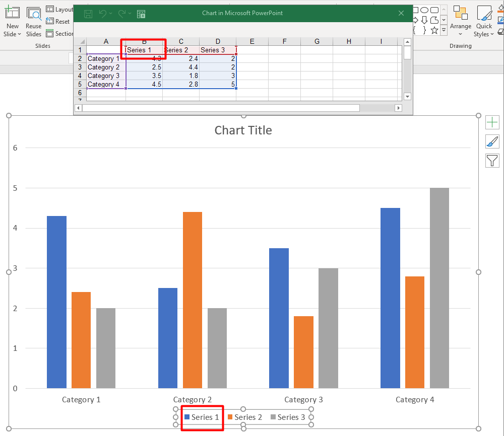

## **Panoramica**

Un grafico memorizza i dati tracciati in una cartella di lavoro dei dati del grafico. Una [ChartSeries](https://reference.aspose.com/slides/it/python-net/aspose.slides.charts/chartseries/) rappresenta un insieme di valori correlati, e ciascun [ChartDataPoint](https://reference.aspose.com/slides/it/python-net/aspose.slides.charts/chartdatapoint/) nella serie si riferisce a una o più celle della cartella di lavoro. Gli oggetti [ChartCategory](https://reference.aspose.com/slides/it/python-net/aspose.slides.charts/chartcategory/) forniscono le etichette o i valori di raggruppamento condivisi dalla serie. Il nome della serie, le categorie e i valori dei punti sono quindi collegati agli oggetti [ChartDataCell](https://reference.aspose.com/slides/it/python-net/aspose.slides.charts/chartdatacell/) anziché essere memorizzati solo come testo visualizzato.

Per un tipico grafico a categorie, la cartella di lavoro predefinita utilizza la riga 0 per i nomi delle serie, la colonna 0 per i nomi delle categorie e le celle rimanenti per i valori delle serie. Gli indici di foglio di lavoro, riga e colonna passati a [ChartDataWorkbook.get_cell](https://reference.aspose.com/slides/it/python-net/aspose.slides.charts/chartdataworkbook/get_cell/) sono basati su zero. Questa disposizione è utile quando si crea un grafico con dati predefiniti, ma non si deve presumere che tutti i grafici esistenti la utilizzino. Per una presentazione caricata, ispezionare le celle a cui fanno riferimento le serie, le categorie e i punti dati prima di modificare i valori della cartella di lavoro.

Le impostazioni del grafico hanno tre ambiti diversi:

- Impostazioni a livello di serie, come [ChartSeries.format](https://reference.aspose.com/slides/it/python-net/aspose.slides.charts/chartseries/format/), forniscono l'aspetto predefinito per tutti i punti di una serie.
- Impostazioni dei punti dati, come [ChartDataPoint.format](https://reference.aspose.com/slides/it/python-net/aspose.slides.charts/chartdatapoint/format/), sovrascrivono l'aspetto della serie per un punto.
- Le impostazioni di gruppo si applicano a serie compatibili che appartengono allo stesso [ChartSeriesGroup](https://reference.aspose.com/slides/it/python-net/aspose.slides.charts/chartseriesgroup/). Accedi al gruppo tramite [ChartSeries.parent_series_group](https://reference.aspose.com/slides/it/python-net/aspose.slides.charts/chartseries/parent_series_group/) quando è necessario impostare opzioni come sovrapposizione o larghezza dello spazio.

Quando non è impostato alcun riempimento esplicito per punto o serie, lo stile e il tema del grafico determinano l'aspetto automatico. Quando sono presenti sia la formattazione della serie sia quella del punto, la formattazione del punto ha la precedenza per quel punto.



## **Imposta la sovrapposizione della serie del grafico**

[ChartSeries.overlap](https://reference.aspose.com/slides/it/python-net/aspose.slides.charts/chartseries/overlap/) indica quanto le barre o le colonne si sovrappongono in un grafico 2D, da -100 a 100 percento. È una proiezione in sola lettura dell'impostazione sul gruppo di serie padre. Imposta [ChartSeriesGroup.overlap](https://reference.aspose.com/slides/it/python-net/aspose.slides.charts/chartseriesgroup/overlap/) per aggiornare tutte le serie compatibili in quel gruppo. Questa opzione si applica ai tipi di grafico che visualizzano barre o colonne raggruppate; non influisce sui gruppi di serie non correlati in un grafico combinato.

L'esempio seguente imposta la sovrapposizione per il gruppo che contiene la prima serie:

```py
import aspose.slides as slides
import aspose.slides.charts as charts

first_slide_index = 0
first_series_index = 0
overlap_percent = 30

with slides.Presentation() as presentation:
    slide = presentation.slides[first_slide_index]

    # Il nuovo grafico contiene serie, categorie e valori di esempio.
    chart = slide.shapes.add_chart(charts.ChartType.CLUSTERED_COLUMN, 20, 20, 500, 200)

    series = chart.chart_data.series[first_series_index]
    series.parent_series_group.overlap = overlap_percent

    presentation.save("series_overlap.pptx", slides.export.SaveFormat.PPTX)
```

Il risultato:


## **Modifica il colore di riempimento della serie**

Utilizza [ChartSeries.format](https://reference.aspose.com/slides/it/python-net/aspose.slides.charts/chartseries/format/) per impostare il riempimento predefinito per un'intera serie. Se un punto ha già un riempimento esplicito, la sua impostazione [ChartDataPoint.format](https://reference.aspose.com/slides/it/python-net/aspose.slides.charts/chartdatapoint/format/) sovrascrive il riempimento della serie per quel punto.

L'esempio seguente applica un riempimento solido blu alla prima serie:

```py
import aspose.pydrawing as drawing
import aspose.slides as slides
import aspose.slides.charts as charts

first_slide_index = 0
first_series_index = 0

with slides.Presentation() as presentation:
    slide = presentation.slides[first_slide_index]

    chart = slide.shapes.add_chart(charts.ChartType.CLUSTERED_COLUMN, 20, 20, 500, 200)

    series = chart.chart_data.series[first_series_index]
    series.format.fill.fill_type = slides.FillType.SOLID
    series.format.fill.solid_fill_color.color = drawing.Color.blue

    presentation.save("series_color.pptx", slides.export.SaveFormat.PPTX)
```

Il risultato:


## **Modifica il nome della serie**

Il nome di una serie è memorizzato nella cartella di lavoro dei dati del grafico e viene normalmente visualizzato nella legenda. Nella cartella di lavoro predefinita creata per un grafico a colonne raggruppate, la cella B1 si trova nella riga 0, colonna 1 e contiene il nome della prima serie. Le costanti nominate nell'esempio seguente rendono esplicita tale struttura:

```py
import aspose.slides as slides
import aspose.slides.charts as charts

first_slide_index = 0
worksheet_index = 0
series_name_row_index = 0
first_series_column_index = 1

with slides.Presentation() as presentation:
    slide = presentation.slides[first_slide_index]

    chart = slide.shapes.add_chart(charts.ChartType.CLUSTERED_COLUMN, 20, 20, 500, 200)

    workbook = chart.chart_data.chart_data_workbook
    series_name_cell = workbook.get_cell(worksheet_index, series_name_row_index, first_series_column_index)
    series_name_cell.value = "Revenue"

    presentation.save("series_name.pptx", slides.export.SaveFormat.PPTX)
```

È anche possibile aggiornare la cella già referenziata da [ChartSeries.name](https://reference.aspose.com/slides/it/python-net/aspose.slides.charts/chartseries/name/). Questo approccio evita di presumere una riga e colonna specifiche in un grafico esistente:

```py
import aspose.slides as slides
import aspose.slides.charts as charts

first_slide_index = 0
first_series_index = 0
first_name_cell_index = 0

with slides.Presentation() as presentation:
    slide = presentation.slides[first_slide_index]

    chart = slide.shapes.add_chart(charts.ChartType.CLUSTERED_COLUMN, 20, 20, 500, 200)

    series = chart.chart_data.series[first_series_index]
    series_name_cell = series.name.as_cells[first_name_cell_index]
    series_name_cell.value = "Revenue"

    presentation.save("series_name.pptx", slides.export.SaveFormat.PPTX)
```

Il risultato:


## **Ottieni il colore di riempimento automatico della serie**

[ChartSeries.get_automatic_series_color](https://reference.aspose.com/slides/it/python-net/aspose.slides.charts/chartseries/get_automatic_series_color/) restituisce il colore calcolato in base all'indice della serie e allo stile del grafico. Questo è il colore utilizzato quando il riempimento della serie non è stato definito esplicitamente. Invocare il metodo legge il colore calcolato; non assegna un nuovo riempimento.

L'esempio seguente stampa il colore automatico di ciascuna serie predefinita:

```py
import aspose.slides as slides
import aspose.slides.charts as charts

first_slide_index = 0

with slides.Presentation() as presentation:
    slide = presentation.slides[first_slide_index]

    chart = slide.shapes.add_chart(charts.ChartType.CLUSTERED_COLUMN, 20, 20, 500, 200)

    series_count = len(chart.chart_data.series)
    for series_index in range(series_count):
        series = chart.chart_data.series[series_index]
        automatic_color = series.get_automatic_series_color()
        print(f"Series {series_index}: {automatic_color.name}")
```

Esempio di output per lo stile di grafico predefinito:

```text
Series 0: ff4f81bd
Series 1: ffc0504d
Series 2: ff9bbb59
```

I colori esatti dipendono dallo stile del grafico e dal tema.

## **Imposta il colore di riempimento invertito per una serie del grafico**

Per le serie a barre, colonne e bolle, [ChartSeries.invert_if_negative](https://reference.aspose.com/slides/it/python-net/aspose.slides.charts/chartseries/invert_if_negative/) può visualizzare i valori negativi con un riempimento diverso. Imposta il riempimento regolare della serie su solido, abilita l'inversione e assegna il colore per i valori negativi tramite [ChartSeries.inverted_solid_fill_color](https://reference.aspose.com/slides/it/python-net/aspose.slides.charts/chartseries/inverted_solid_fill_color/). I numeri negativi rimangono invariati nella cartella di lavoro; solo il loro colore di visualizzazione cambia.

L'esempio seguente sostituisce i dati del grafico predefiniti con una serie. La riga 0 del foglio di lavoro contiene il nome della serie, la colonna 0 contiene i nomi delle categorie e la colonna 1 contiene i valori:

```py
import aspose.pydrawing as drawing
import aspose.slides as slides
import aspose.slides.charts as charts

first_slide_index = 0
worksheet_index = 0
header_row_index = 0
category_column_index = 0
first_series_column_index = 1
first_data_row_index = 1

category_names = ["Category 1", "Category 2", "Category 3"]
series_values = [-20, 50, -30]

with slides.Presentation() as presentation:
    slide = presentation.slides[first_slide_index]

    chart = slide.shapes.add_chart(charts.ChartType.CLUSTERED_COLUMN, 20, 20, 500, 200)
    chart_data = chart.chart_data
    workbook = chart_data.chart_data_workbook

    chart_data.series.clear()
    chart_data.categories.clear()

    series_name_cell = workbook.get_cell(worksheet_index, header_row_index, first_series_column_index, "Series 1")
    series = chart_data.series.add(series_name_cell, chart.type)

    category_count = len(category_names)
    for category_index in range(category_count):
        data_row_index = first_data_row_index + category_index
        category_name = category_names[category_index]
        series_value = series_values[category_index]

        category_cell = workbook.get_cell(worksheet_index, data_row_index, category_column_index, category_name)
        chart_data.categories.add(category_cell)

        value_cell = workbook.get_cell(worksheet_index, data_row_index, first_series_column_index, series_value)
        series.data_points.add_data_point_for_bar_series(value_cell)

    automatic_series_color = series.get_automatic_series_color()
    series.format.fill.fill_type = slides.FillType.SOLID
    series.format.fill.solid_fill_color.color = automatic_series_color
    series.invert_if_negative = True
    series.inverted_solid_fill_color.color = drawing.Color.red

    presentation.save("inverted_solid_fill_color.pptx", slides.export.SaveFormat.PPTX)
```

Il risultato:


Puoi abilitare l'inversione per un punto tramite [ChartDataPoint.invert_if_negative](https://reference.aspose.com/slides/it/python-net/aspose.slides.charts/chartdatapoint/invert_if_negative/). Nell'esempio seguente, l'inversione è disabilitata per la serie e abilitata solo per il punto selezionato. Al punto è anche assegnato un valore negativo in modo che l'effetto sia visibile:

```py
import aspose.pydrawing as drawing
import aspose.slides as slides
import aspose.slides.charts as charts

first_slide_index = 0
first_series_index = 0
target_data_point_index = 2
negative_value = -30

with slides.Presentation() as presentation:
    slide = presentation.slides[first_slide_index]

    chart = slide.shapes.add_chart(charts.ChartType.CLUSTERED_COLUMN, 20, 20, 500, 200)

    series = chart.chart_data.series[first_series_index]
    automatic_series_color = series.get_automatic_series_color()
    series.format.fill.fill_type = slides.FillType.SOLID
    series.format.fill.solid_fill_color.color = automatic_series_color
    series.inverted_solid_fill_color.color = drawing.Color.red
    series.invert_if_negative = False

    data_point = series.data_points[target_data_point_index]
    data_point.value.as_cell.value = negative_value
    data_point.invert_if_negative = True

    presentation.save("data_point_invert_color_if_negative.pptx", slides.export.SaveFormat.PPTX)
```

## **Cancella un valore di punto dati specifico**

Per rendere vuoto un punto senza rimuovere gli altri punti, imposta la cella della cartella di lavoro di supporto su `None`. Per un grafico a colonne, il valore tracciato è disponibile tramite [ChartDataPoint.value](https://reference.aspose.com/slides/it/python-net/aspose.slides.charts/chartdatapoint/value/). Il punto dati rimane nella stessa posizione di categoria, ma il grafico tratta il suo valore come vuoto in base alle impostazioni di valori vuoti del grafico.

L'esempio seguente cancella solo il secondo punto nella prima serie:

```py
import aspose.slides as slides
import aspose.slides.charts as charts

first_slide_index = 0
first_series_index = 0
target_data_point_index = 1

with slides.Presentation() as presentation:
    slide = presentation.slides[first_slide_index]

    chart = slide.shapes.add_chart(charts.ChartType.CLUSTERED_COLUMN, 20, 20, 500, 200)

    series = chart.chart_data.series[first_series_index]
    data_point = series.data_points[target_data_point_index]
    data_point.value.as_cell.value = None

    presentation.save("clear_data_point_value.pptx", slides.export.SaveFormat.PPTX)
```

I grafici a dispersione utilizzano celle X e Y separate, e i grafici a bolle usano anche una cella per la dimensione. Cancella solo la cella che rappresenta il valore che intendi rimuovere. Non chiamare [ChartDataPointCollection.clear](https://reference.aspose.com/slides/it/python-net/aspose.slides.charts/chartdatapointcollection/clear/) quando vuoi conservare gli altri punti, poiché quel metodo rimuove tutti i punti dati dalla collezione.

## **Imposta la larghezza dello spazio tra le serie**

La larghezza dello spazio è lo spazio tra gruppi di barre o colonne adiacenti, espresso in percentuale della larghezza della barra o colonna. Come la sovrapposizione, appartiene al gruppo di serie padre anziché a una singola serie. Imposta [ChartSeriesGroup.gap_width](https://reference.aspose.com/slides/it/python-net/aspose.slides.charts/chartseriesgroup/gap_width/) una volta per il gruppo. Un valore più grande crea più spazio tra i gruppi; un valore più piccolo li rende più densi.

L'esempio seguente modifica la larghezza dello spazio e salva solo la presentazione finale:

```py
import aspose.slides as slides
import aspose.slides.charts as charts

first_slide_index = 0
first_series_index = 0
gap_width_percent = 30

with slides.Presentation() as presentation:
    slide = presentation.slides[first_slide_index]

    chart = slide.shapes.add_chart(charts.ChartType.STACKED_COLUMN, 20, 20, 500, 200)

    series = chart.chart_data.series[first_series_index]
    series.parent_series_group.gap_width = gap_width_percent

    presentation.save("gap_width_30.pptx", slides.export.SaveFormat.PPTX)
```

Il risultato:


## **FAQ**

**Quali tipi di grafico supportano le serie di dati?**

Tutti i tipi di grafico rappresentati dall'enumerazione [ChartType](https://reference.aspose.com/slides/it/python-net/aspose.slides.charts/charttype/) utilizzano i dati del grafico, ma le loro serie non hanno tutte la stessa struttura di valori o le stesse impostazioni. Ad esempio, i grafici a categorie utilizzano categorie e valori, i grafici a dispersione utilizzano valori X e Y, e i grafici a bolle aggiungono le dimensioni delle bolle. Usa il metodo di creazione dei punti dati che corrisponde al tipo di serie. Opzioni come sovrapposizione e larghezza dello spazio si applicano solo a gruppi di barre o colonne compatibili.

**Che cos'è un gruppo di serie del grafico?**

Un [ChartSeriesGroup](https://reference.aspose.com/slides/it/python-net/aspose.slides.charts/chartseriesgroup/) contiene serie compatibili che condividono impostazioni di tracciamento a livello di gruppo. Un grafico combinato può contenere più di un gruppo, quindi modificare il gruppo raggiunto tramite una serie non cambia necessariamente tutte le serie nel grafico.

**Un grafico appena creato contiene dati predefiniti?**

Sì. Per impostazione predefinita, [ShapeCollection.add_chart](https://reference.aspose.com/slides/it/python-net/aspose.slides/shapecollection/add_chart/) crea serie, categorie e valori di esempio. È possibile modificare quelle celle o cancellare sia le collezioni di serie che di categorie prima di aggiungere un set di dati completamente personalizzato. Un overload può anche creare un grafico senza dati predefiniti.

**Come sono collegati gli oggetti del grafico alle celle della cartella di lavoro?**

I nomi delle serie, le etichette di categoria e i valori dei punti dati fanno riferimento a celle in un [ChartDataWorkbook](https://reference.aspose.com/slides/it/python-net/aspose.slides.charts/chartdataworkbook/). Modificando una cella referenziata si aggiorna l'elemento corrispondente del grafico. Quando costruisci dati personalizzati, mantieni le righe delle categorie e le righe dei valori delle serie allineate in modo che ogni punto sia tracciato sotto la categoria prevista.

**Come posso cancellare un punto invece dell'intera serie?**

Imposta la cella del valore pertinente su `None` per mantenere la posizione di categoria del punto come punto vuoto. Usa [ChartDataPointCollection.clear](https://reference.aspose.com/slides/it/python-net/aspose.slides.charts/chartdatapointcollection/clear/) solo quando intendi rimuovere tutti i punti da quella serie. Se rimuovi anche le categorie, aggiorna ogni serie affinché i loro valori rimangano allineati con la collezione delle categorie.

**Come vengono visualizzati i punti vuoti?**

Il risultato dipende dal tipo di grafico e da [Chart.display_blanks_as](https://reference.aspose.com/slides/it/python-net/aspose.slides.charts/chart/display_blanks_as/). I grafici supportati possono visualizzare i vuoti come spazi, come valori zero o collegando i punti vicini. Scegli l'impostazione che corrisponde al significato dei dati mancanti nella tua presentazione.

**Come vengono formattati i valori negativi?**

Per le serie a barre, colonne e bolle supportate, abilita [ChartSeries.invert_if_negative](https://reference.aspose.com/slides/it/python-net/aspose.slides.charts/chartseries/invert_if_negative/) e imposta [ChartSeries.inverted_solid_fill_color](https://reference.aspose.com/slides/it/python-net/aspose.slides.charts/chartseries/inverted_solid_fill_color/). Puoi sovrascrivere il comportamento per un punto individuale con [ChartDataPoint.invert_if_negative](https://reference.aspose.com/slides/it/python-net/aspose.slides.charts/chartdatapoint/invert_if_negative/). Queste proprietà influenzano la formattazione, non i valori numerici memorizzati.

**Quale formattazione prevale quando sia una serie sia un punto sono formattati?**

La formattazione esplicita del punto dati ha precedenza per quel punto. Gli altri punti continuano a utilizzare il formato esplicito della serie o, quando il formato della serie non è definito, lo stile e il tema automatici del grafico. Le proprietà di gruppo come sovrapposizione e larghezza dello spazio controllano il layout e non sono sovrascritture di formattazione a livello di punto.

**C'è un limite al numero di serie che un grafico può contenere?**

Aspose.Slides non impone un limite fisso separato al numero di serie. In pratica, i vincoli del file di presentazione, la memoria disponibile, il tempo di rendering e la leggibilità del grafico determinano un limite pratico.

**Cosa dovrei modificare quando le colonne sono troppo vicine o troppo distanti?**

Imposta [ChartSeriesGroup.gap_width](https://reference.aspose.com/slides/it/python-net/aspose.slides.charts/chartseriesgroup/gap_width/) sul gruppo di serie padre appropriato. Aumenta il valore per ampliare lo spazio tra i gruppi, oppure riducilo per avvicinare i gruppi.