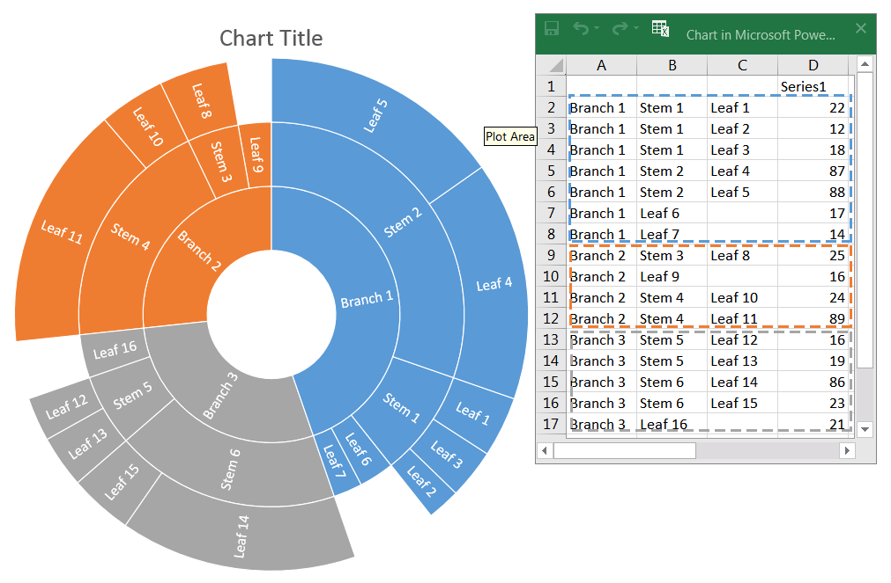

## **Introduzione**

Tra gli altri tipi di grafico di PowerPoint, ce ne sono due gerarchici — **Treemap** e **Sunburst** (conosciuti anche come Grafico a Raggi, Diagramma Sunburst, Grafico Radiale, Diagramma Radiale o Grafico a Torta Multilivello). Questi grafici visualizzano dati gerarchici organizzati come un albero—dalle foglie alla cima di un ramo. Le foglie sono definite dai punti dati della serie, e ogni successivo livello di raggruppamento annidato è definito dalla categoria corrispondente. Aspose.Slides for Python via .NET consente di formattare i punti dati dei grafici Sunburst e Treemap in Python.

Ecco un grafico Sunburst in cui i dati nella colonna Series1 definiscono i nodi foglia, mentre le altre colonne definiscono i punti dati gerarchici:



Iniziamo aggiungendo un nuovo grafico Sunburst alla presentazione:

```py
with slides.Presentation() as presentation:
    slide = presentation.slides[0]
    chart = slide.shapes.add_chart(charts.ChartType.SUNBURST, 30, 30, 450, 400)
```

{}
- [**Crea grafici Sunburst**](/slides/it/python-net/create-chart/#create-sunburst-charts)
{}

Se è necessario formattare i punti dati del grafico, utilizzare le seguenti API:

[ChartDataPointLevelsManager](https://reference.aspose.com/slides/it/python-net/aspose.slides.charts/chartdatapointlevelsmanager/), [ChartDataPointLevel](https://reference.aspose.com/slides/it/python-net/aspose.slides.charts/chartdatapointlevel/), e la proprietà [ChartDataPoint.data_point_levels](https://reference.aspose.com/slides/it/python-net/aspose.slides.charts/chartdatapoint/data_point_levels/). Forniscono l'accesso alla formattazione dei punti dati nei grafici Treemap e Sunburst. [ChartDataPointLevelsManager](https://reference.aspose.com/slides/it/python-net/aspose.slides.charts/chartdatapointlevelsmanager/) è usato per accedere alle categorie a più livelli; rappresenta un contenitore di oggetti [ChartDataPointLevel](https://reference.aspose.com/slides/it/python-net/aspose.slides.charts/chartdatapointlevel/). È essenzialmente un wrapper attorno a [ChartCategoryLevelsManager](https://reference.aspose.com/slides/it/python-net/aspose.slides.charts/chartcategorylevelsmanager/) con proprietà aggiuntive specifiche per i punti dati. Il tipo [ChartDataPointLevel](https://reference.aspose.com/slides/it/python-net/aspose.slides.charts/chartdatapointlevel/) espone due proprietà—[format](https://reference.aspose.com/slides/it/python-net/aspose.slides.charts/chartdatapointlevel/format/) e [label](https://reference.aspose.com/slides/it/python-net/aspose.slides.charts/chartdatapointlevel/label/)—che forniscono l'accesso alle impostazioni corrispondenti.

## **Visualizzare i valori dei punti dati**

Questa sezione mostra come visualizzare il valore per i singoli punti dati nei grafici Treemap e Sunburst. Vedrete come abilitare le etichette di valore per i punti selezionati.

Visualizzare il valore del punto dati "Leaf 4":

```py
data_points = chart.chart_data.series[0].data_points
data_points[3].data_point_levels[0].label.data_label_format.show_value = True
```


## **Impostare etichette e colori per i punti dati**

Questa sezione mostra come impostare etichette e colori personalizzati per i singoli punti dati nei grafici Treemap e Sunburst. Imparerete come accedere a un punto dato specifico, assegnare un'etichetta e applicare un riempimento solido per evidenziare i nodi importanti.

Impostare l'etichetta dati "Branch 1" per mostrare il nome della serie ("Series1") anziché il nome della categoria, quindi impostare il colore del testo su giallo:

```py
branch1_label = data_points[0].data_point_levels[2].label
branch1_label.data_label_format.show_category_name = False
branch1_label.data_label_format.show_series_name = True

branch1_label.data_label_format.text_format.portion_format.fill_format.fill_type = slides.FillType.SOLID
branch1_label.data_label_format.text_format.portion_format.fill_format.solid_fill_color.color = draw.Color.yellow
```


## **Impostare i colori dei rami per i punti dati**

Usare i colori dei rami per controllare come i nodi genitore e figlio sono raggruppati visivamente nei grafici Treemap e Sunburst. Questa sezione mostra come impostare un colore di ramo personalizzato per un punto dati specifico in modo da evidenziare sottoalberi importanti e migliorare la leggibilità del grafico.

Modificare il colore del ramo "Stem 4":

```py
import aspose.slides as slides
import aspose.slides.charts as charts
import aspose.pydrawing as draw

with slides.Presentation() as presentation:
    slide = presentation.slides[0]

    chart = slide.shapes.add_chart(charts.ChartType.SUNBURST, 30, 30, 450, 400)
    data_points = chart.chart_data.series[0].data_points

    stem4_branch = data_points[9].data_point_levels[1]
    
    stem4_branch.format.fill.fill_type = slides.FillType.SOLID
    stem4_branch.format.fill.solid_fill_color.color = draw.Color.red
      
    presentation.save("branch_color.pptx", slides.export.SaveFormat.PPTX)
```


## **FAQ**

**Posso cambiare l'ordine (ordinamento) dei segmenti in Sunburst/Treemap?**

No. PowerPoint ordina i segmenti automaticamente (tipicamente per valori decrescenti, in senso orario). Aspose.Slides rispecchia questo comportamento: non è possibile modificare direttamente l'ordine; è necessario pre‑elaborare i dati.

**In che modo il tema della presentazione influisce sui colori dei segmenti e delle etichette?**

I colori del grafico ereditano il [tema/palette](/slides/it/python-net/presentation-theme/) della presentazione, a meno che non vengano impostati esplicitamente riempimenti/font. Per risultati coerenti, fissate riempimenti solidi e formattazione del testo ai livelli richiesti.

**L'esportazione in PDF/PNG preserva i colori personalizzati dei rami e le impostazioni delle etichette?**

Sì. Quando si esporta la presentazione, le impostazioni del grafico (riempimenti, etichette) sono conservate nei formati di output perché Aspose.Slides rende il grafico con la formattazione applicata.

**Posso calcolare le coordinate effettive di un'etichetta/elemento per il posizionamento personalizzato di sovrapposizioni sopra il grafico?**

Sì. Dopo la convalida del layout del grafico, `actual_x`/`actual_y` sono disponibili per gli elementi (ad esempio, un [DataLabel](https://reference.aspose.com/slides/it/python-net/aspose.slides.charts/datalabel/)), il che aiuta a posizionare con precisione le sovrapposizioni.