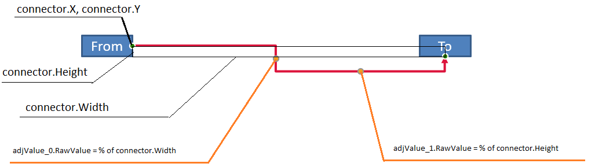

## **Introduzione**

Un connettore PowerPoint è una linea specializzata che collega due forme e rimane collegata quando le forme vengono spostate o riposizionate su una diapositiva. I connettori si collegano ai **punti di connessione** (punti verdi) delle forme. I punti di connessione compaiono quando il puntatore si avvicina. **Maniglie di regolazione** (punti gialli), disponibili su alcuni connettori, ti consentono di modificare la posizione e la forma di un connettore.

## **Tipi di connettore**

In PowerPoint, è possibile utilizzare tre tipi di connettori: rettilineo, a gomito (angolato) e curvo.

Aspose.Slides supporta i seguenti tipi di connettore:

| Tipo di connettore | Immagine | Numero di punti di regolazione |
| ------------------ | -------- | ------------------------------ |
| `ShapeType.LINE` |  | 0 |
| `ShapeType.STRAIGHT_CONNECTOR1` |  | 0 |
| `ShapeType.BENT_CONNECTOR2` |  | 0 |
| `ShapeType.BENT_CONNECTOR3` |  | 1 |
| `ShapeType.BENT_CONNECTOR4` |  | 2 |
| `ShapeType.BENT_CONNECTOR5` |  | 3 |
| `ShapeType.CURVED_CONNECTOR2` |  | 0 |
| `ShapeType.CURVED_CONNECTOR3` |  | 1 |
| `ShapeType.CURVED_CONNECTOR4` |  | 2 |
| `ShapeType.CURVED_CONNECTOR5` |  | 3 |

## **Collegare le forme con connettori**

Questa sezione dimostra come collegare le forme con i connettori in Aspose.Slides. Aggiungerai un connettore a una diapositiva, ne collegherai l’inizio e la fine alle forme di destinazione. L’utilizzo dei punti di connessione garantisce che il connettore rimanga “incollato” alle forme anche quando queste vengono spostate o ridimensionate.

1. Crea un'istanza della classe [Presentation](https://reference.aspose.com/slides/it/python-net/aspose.slides/presentation/).
1. Ottieni un riferimento alla diapositiva tramite il suo indice.
1. Aggiungi due oggetti [AutoShape](https://reference.aspose.com/slides/it/python-net/aspose.slides/autoshape/) alla diapositiva usando il metodo `add_auto_shape` esposto dall'oggetto [ShapeCollection](https://reference.aspose.com/slides/it/python-net/aspose.slides/shapecollection/).
1. Aggiungi un connettore usando il metodo `add_connector` esposto dall'oggetto [ShapeCollection](https://reference.aspose.com/slides/it/python-net/aspose.slides/shapecollection/) e specifica il tipo di connettore.
1. Collega le forme con il connettore.
1. Chiama il metodo `reroute` per applicare il percorso di connessione più breve.
1. Salva la presentazione.

```python
import aspose.slides as slides

# Istanzia la classe Presentation per creare un file PPTX.
with slides.Presentation() as presentation:

    # Accedi alla collezione di forme della prima diapositiva.
    shapes = presentation.slides[0].shapes

    # Aggiungi un AutoShape ellisse.
    ellipse = shapes.add_auto_shape(slides.ShapeType.ELLIPSE, 50, 50, 100, 100)

    # Aggiungi un AutoShape rettangolo.
    rectangle = shapes.add_auto_shape(slides.ShapeType.RECTANGLE, 150, 200, 100, 100)

    # Aggiungi un connettore alla diapositiva.
    connector = shapes.add_connector(slides.ShapeType.BENT_CONNECTOR2, 0, 0, 10, 10)

    # Collega le forme con il connettore.
    connector.start_shape_connected_to = ellipse
    connector.end_shape_connected_to = rectangle

    # Chiama reroute per impostare il percorso più breve.
    connector.reroute()

    # Salva la presentazione.
    presentation.save("connected_shapes.pptx", slides.export.SaveFormat.PPTX)
```

{}
Il metodo `connector.reroute` ricalcola il percorso di un connettore, costringendolo a prendere il percorso più breve possibile tra le forme. Per farlo, il metodo può modificare i valori `start_shape_connection_site_index` e `end_shape_connection_site_index`.
{}

## **Specificare i punti di connessione**

Questa sezione spiega come collegare un connettore a un punto di connessione specifico su una forma in Aspose.Slides. Puntando a siti di connessione precisi, è possibile controllare il percorso del connettore e il layout, ottenendo diagrammi puliti e prevedibili nelle presentazioni.

1. Crea un'istanza della classe [Presentation](https://reference.aspose.com/slides/it/python-net/aspose.slides/presentation/).
1. Ottieni un riferimento alla diapositiva tramite il suo indice.
1. Aggiungi due oggetti [AutoShape](https://reference.aspose.com/slides/it/python-net/aspose.slides/autoshape/) alla diapositiva usando il metodo `add_auto_shape` esposto dall'oggetto [ShapeCollection](https://reference.aspose.com/slides/it/python-net/aspose.slides/shapecollection/).
1. Aggiungi un connettore usando il metodo `add_connector` sull'oggetto [ShapeCollection](https://reference.aspose.com/slides/it/python-net/aspose.slides/shapecollection/) e specifica il tipo di connettore.
1. Collega le forme con il connettore.
1. Imposta i punti di connessione preferiti sulle forme.
1. Salva la presentazione.

```python
import aspose.slides as slides

# Istanzia la classe Presentation per creare un file PPTX.
with slides.Presentation() as presentation:

    # Accedi alla collezione di forme della prima diapositiva.
    shapes = presentation.slides[0].shapes

    # Aggiungi un AutoShape ellisse.
    ellipse = shapes.add_auto_shape(slides.ShapeType.ELLIPSE, 50, 50, 100, 100)

    # Aggiungi un AutoShape rettangolo.
    rectangle = shapes.add_auto_shape(slides.ShapeType.RECTANGLE, 150, 200, 100, 100)

    # Aggiungi un connettore alla collezione di forme della diapositiva.
    connector = shapes.add_connector(slides.ShapeType.BENT_CONNECTOR3, 0, 0, 10, 10)

    # Collega le forme con il connettore.
    connector.start_shape_connected_to = ellipse
    connector.end_shape_connected_to = rectangle

    # Imposta l'indice del sito di connessione preferito sull'ellisse.
    site_index = 6

    # Verifica che l'indice preferito sia entro il conteggio dei siti disponibili.
    if  ellipse.connection_site_count > site_index:
        # Assegna il sito di connessione preferito all'AutoShape ellisse.
        connector.start_shape_connection_site_index = site_index

    # Salva la presentazione.
    presentation.save("connection_points.pptx", slides.export.SaveFormat.PPTX)
```

## **Regolare i punti del connettore**

Puoi modificare i connettori usando i loro punti di regolazione. Solo i connettori che espongono punti di regolazione possono essere modificati in questo modo. Per i dettagli su quali connettori supportano le regolazioni, vedi la tabella sotto [Connector Types](/slides/it/python-net/connector/#connector-types).

### **Caso semplice**

Considera un caso in cui un connettore tra due forme (A e B) interseca una terza forma (C):


```python
import aspose.slides as slides
import aspose.pydrawing as draw

with slides.Presentation() as presentation:
    slide = presentation.slides[0]

    shape = slide.shapes.add_auto_shape(slides.ShapeType.RECTANGLE, 300, 150, 150, 75)
    shape_from = slide.shapes.add_auto_shape(slides.ShapeType.RECTANGLE, 500, 400, 100, 50)
    shape_to = slide.shapes.add_auto_shape(slides.ShapeType.RECTANGLE, 100, 100, 70, 30)
    
    connector = slide.shapes.add_connector(slides.ShapeType.BENT_CONNECTOR5, 20, 20, 400, 300)
    
    connector.line_format.end_arrowhead_style = slides.LineArrowheadStyle.TRIANGLE
    connector.line_format.fill_format.fill_type = slides.FillType.SOLID
    connector.line_format.fill_format.solid_fill_color.color = draw.Color.black
    
    connector.start_shape_connected_to = shape_from
    connector.end_shape_connected_to = shape_to
    connector.start_shape_connection_site_index = 2
```

Per evitare la terza forma, regola il connettore spostando il suo segmento verticale verso sinistra:


```python
    adjustment2 = connector.adjustments[1]
    adjustment2.raw_value += 10000
```

### **Casi complessi**

Per regolazioni più avanzate, considera quanto segue:

- Il punto regolabile di un connettore è determinato da una formula che ne definisce la posizione. Modificando questo punto è possibile alterare la forma complessiva del connettore.
- I punti di regolazione di un connettore sono memorizzati in un array strettamente ordinato, numerato dall'inizio del connettore alla sua fine.
- I valori dei punti di regolazione rappresentano percentuali della larghezza/altezza della forma del connettore.
  - La forma è delimitata dai punti di inizio e fine del connettore e scalata per 1000.
  - Il primo, secondo e terzo punto di regolazione rappresentano rispettivamente: percentuale della larghezza, percentuale dell'altezza e nuovamente percentuale della larghezza.
- Nel calcolare le coordinate dei punti di regolazione, tenere conto della rotazione e della riflessione del connettore. **Nota:** Per tutti i connettori elencati in [Connector Types](/slides/it/python-net/connector/#connector-types), l'angolo di rotazione è 0.

#### **Caso 1**

Considera un caso in cui due oggetti di riquadro di testo sono collegati con un connettore:



```python
import aspose.slides as slides
import aspose.pydrawing as draw

# Istanzia la classe Presentation per creare un file PPTX.
with slides.Presentation() as presentation:

    # Ottieni la prima diapositiva.
    slide = presentation.slides[0]

    # Ottieni la prima diapositiva.
    shape_from = slide.shapes.add_auto_shape(slides.ShapeType.RECTANGLE, 100, 100, 60, 25)
    shape_from.text_frame.text = "From"
    shape_to = slide.shapes.add_auto_shape(slides.ShapeType.RECTANGLE, 500, 100, 60, 25)
    shape_to.text_frame.text = "To"

    # Aggiungi un connettore.
    connector = slide.shapes.add_connector(slides.ShapeType.BENT_CONNECTOR4, 20, 20, 400, 300)
    # Imposta la direzione del connettore.
    connector.line_format.end_arrowhead_style = slides.LineArrowheadStyle.TRIANGLE
    # Imposta il colore del connettore.
    connector.line_format.fill_format.fill_type = slides.FillType.SOLID
    connector.line_format.fill_format.solid_fill_color.color = draw.Color.crimson
    # Imposta lo spessore della linea del connettore.
    connector.line_format.width = 3

    # Collega le forme con il connettore.
    connector.start_shape_connected_to = shape_from
    connector.start_shape_connection_site_index = 3
    connector.end_shape_connected_to = shape_to
    connector.end_shape_connection_site_index = 2

    # Ottieni i punti di regolazione del connettore.
    adjustment_0 = connector.adjustments[0]
    adjustment_1 = connector.adjustments[1]
```

**Regolazione**

Modifica i valori dei punti di regolazione del connettore aumentando la percentuale di larghezza del 20 % e la percentuale di altezza del 200 %, rispettivamente:

```python
    # Modifica i valori dei punti di regolazione.
    adjustment_0.raw_value += 20000
    adjustment_1.raw_value += 200000
```

Il risultato:


Per definire un modello che consenta di determinare le coordinate e la forma dei segmenti del connettore, crea una forma che corrisponda alla componente verticale del connettore in `connector.adjustments[0]`:

```python
    # Disegna la componente verticale del connettore.
    x = connector.x + connector.width * adjustment_0.raw_value / 100000
    y = connector.y
    height = connector.height * adjustment_1.raw_value / 100000

    slide.shapes.add_auto_shape(slides.ShapeType.RECTANGLE, x, y, 0, height)
```

Il risultato:


#### **Caso 2**

Nel **Caso 1**, abbiamo dimostrato una semplice regolazione del connettore usando principi di base. In scenari tipici, è necessario tenere conto della rotazione del connettore e delle sue impostazioni di visualizzazione (controllate da `connector.rotation`, `connector.frame.flip_h` e `connector.frame.flip_v`). Ecco come funziona il processo.

Prima, aggiungi un nuovo oggetto di riquadro di testo (**To 1**) alla diapositiva (per la connessione) e crea un nuovo connettore verde che lo collega agli oggetti esistenti.

```python
    # Crea un nuovo oggetto di destinazione.
    shape_to_1 = sld.shapes.add_auto_shape(slides.ShapeType.RECTANGLE, 100, 400, 60, 25)
    shape_to_1.text_frame.text = "To 1"

    # Crea un nuovo connettore.
    connector = sld.shapes.add_connector(slides.ShapeType.BENT_CONNECTOR4, 20, 20, 400, 300)
    connector.line_format.end_arrowhead_style = slides.LineArrowheadStyle.TRIANGLE
    connector.line_format.fill_format.fill_type = slides.FillType.SOLID
    connector.line_format.fill_format.solid_fill_color.color = draw.Color.medium_aquamarine
    connector.line_format.width = 3

    # Collega gli oggetti usando il connettore appena creato.
    connector.start_shape_connected_to = shapeFrom
    connector.start_shape_connection_site_index = 2
    connector.end_shape_connected_to = shape_to_1
    connector.end_shape_connection_site_index = 3

    # Ottieni i punti di regolazione del connettore.
    adjustment_0 = connector.adjustments[0]
    adjustment_1 = connector.adjustments[1]
    
    # Modifica i valori dei punti di regolazione.
    adjustment_0.raw_value += 20000
    adjustment_1.raw_value += 200000
```

Il risultato:


Secondo, crea una forma che corrisponda al segmento **orizzontale** del connettore che passa per il nuovo punto di regolazione del connettore, `connector.adjustments[0]`. Usa i valori di `connector.rotation`, `connector.frame.flip_h` e `connector.frame.flip_v` e applica la formula standard di conversione delle coordinate per la rotazione attorno a un punto dato `x0`:

X = (x — x0) * cos(alpha) — (y — y0) * sin(alpha) + x0;

Y = (x — x0) * sin(alpha) + (y — y0) * cos(alpha) + y0;

Nel nostro caso, l’angolo di rotazione dell’oggetto è 90 gradi e il connettore è visualizzato verticalmente, quindi il codice corrispondente è:

```python
    # Salva le coordinate del connettore.
    x = connector.x
    y = connector.y
    
    # Correggi le coordinate del connettore se è capovolto.
    if connector.frame.flip_h == 1:
        x += connector.width
    if connector.frame.flip_v == 1:
        y += connector.height

    # Usa il valore del punto di regolazione come coordinata.
    x += connector.width * adjValue_0.raw_value / 100000
    
    # Converti le coordinate perché sin(90°) = 1 e cos(90°) = 0.
    xx = connector.frame.center_x - y + connector.frame.center_y
    yy = x - connector.frame.center_x + connector.frame.center_y

    # Determina la larghezza del segmento orizzontale usando il valore del secondo punto di regolazione.
    width = connector.height * adjValue_1.raw_value / 100000
    shape = sld.shapes.add_auto_shape(slides.ShapeType.RECTANGLE, xx, yy, width, 0)
    shape.line_format.fill_format.fill_type = slides.FillType.SOLID
    shape.line_format.fill_format.solid_fill_color.color = draw.Color.red
```

Il risultato:


Abbiamo dimostrato calcoli che coinvolgono sia regolazioni semplici sia punti di regolazione più complessi (quelli che tengono conto della rotazione). Con queste conoscenze, puoi sviluppare il tuo modello – o scrivere codice – per ottenere un oggetto `GraphicsPath` o persino impostare i valori dei punti di regolazione del connettore basandoti su coordinate specifiche della diapositiva.

## **Trovare gli angoli delle linee del connettore**

Usa l’esempio seguente per determinare l’angolo delle linee del connettore su una diapositiva con Aspose.Slides. Imparerai a leggere le estremità di un connettore e a calcolarne l’orientamento per allineare con precisione frecce, etichette e altre forme.

1. Crea un'istanza della classe [Presentation](https://reference.aspose.com/slides/it/python-net/aspose.slides/presentation/).
1. Ottieni un riferimento alla diapositiva per indice.
1. Accedi alla forma della linea del connettore.
1. Utilizza la larghezza e l’altezza della linea, e la larghezza e l’altezza del frame della forma, per calcolare l’angolo.

```python
import aspose.slides as slides
import math

def get_direction(w, h, flip_h, flip_v):
    end_line_x = w * (-1 if flip_h else 1)
    end_line_y = h * (-1 if flip_v else 1)
    end_y_axis_x = 0
    end_y_axis_y = h
    angle = math.atan2(end_y_axis_y, end_y_axis_x) - math.atan2(end_line_y, end_line_x)
    if (angle < 0):
         angle += 2 * math.pi
    return angle * 180.0 / math.pi

with slides.Presentation("connector_line_angle.pptx") as presentation:
    slide = presentation.slides[0]
    for shape_index in range(len(slide.shapes)):
        direction = 0.0
        shape = slide.shapes[shape_index]
        if type(shape) is slides.AutoShape and shape.shape_type == slides.ShapeType.LINE:
            direction = get_direction(shape.width, shape.height, shape.frame.flip_h, shape.frame.flip_v)
        elif type(shape) is slides.Connector:
            direction = get_direction(shape.width, shape.height, shape.frame.flip_h, shape.frame.flip_v)
        print(direction)
```

## **FAQ**

**Come posso capire se un connettore può essere “incollato” a una forma specifica?**

Verifica che la forma esponga i [connection sites](https://reference.aspose.com/slides/it/python-net/aspose.slides/shape/connection_site_count/). Se non ce ne sono o il conteggio è zero, l’incollaggio non è disponibile; in tal caso, utilizza estremità libere e posizionale manualmente. È consigliabile controllare il conteggio dei siti prima di collegare.

** Cosa succede a un connettore se elimino una delle forme collegate?**

Le sue estremità verranno scollegate; il connettore rimane sulla diapositiva come una linea ordinaria con inizio/fine liberi. Puoi eliminarlo oppure riassegnare le connessioni e, se necessario, [reroute](https://reference.aspose.com/slides/it/python-net/aspose.slides/connector/reroute/).

**Le associazioni del connettore vengono mantenute quando si copia una diapositiva in un’altra presentazione?**

Generalmente sì, a condizione che le forme di destinazione vengano copiate anch'esse. Se la diapositiva viene inserita in un altro file senza le forme collegate, le estremità diventano libere e sarà necessario ricollegarle.