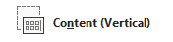
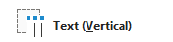

## **Panoramica**

Un layout di diapositiva definisce le posizioni e la formattazione dei segnaposti come titoli, testo, immagini, grafici e tabelle. Applicare un layout conferisce alle diapositive una struttura coerente, consentendo a ciascuna diapositiva di contenere il proprio contenuto.

I layout più comuni includono:

- **Diapositiva Titolo**: Contiene segnaposti per titolo e sottotitolo.
- **Titolo e Contenuto**: Contiene un segnaposto per il titolo e un segnaposto generico per il contenuto.
- **Vuota**: Non contiene segnaposti di contenuto ed è utile quando ogni forma verrà posizionata manualmente.

## **Comprendere l'Eredità del Layout**

Una presentazione ha tre livelli correlati:

1. Una [diapositiva master](https://reference.aspose.com/slides/it/python-net/aspose.slides/masterslide/) definisce il tema, la formattazione condivisa, gli sfondi e gli oggetti comuni.
2. Una [diapositiva di layout](https://reference.aspose.com/slides/it/python-net/aspose.slides/layoutslide/) appartiene a un master e definisce una disposizione particolare dei segnaposti.
3. Una [diapositiva normale](https://reference.aspose.com/slides/it/python-net/aspose.slides/slide/) utilizza un layout e memorizza il contenuto inserito per quella diapositiva.

Una diapositiva normale eredita il tema e la formattazione dal proprio layout, e il layout eredita dal master. Un valore impostato direttamente su una diapositiva normale sovrascrive il valore ereditato a quel livello. Quando una diapositiva normale viene creata, le sue forme segnaposto vengono generate dal layout selezionato, mentre il contenuto inserito in quei segnaposti appartiene alla diapositiva normale.

Aggiungere i segnaposti necessari a un layout prima di creare diapositive da esso. Aggiungere in seguito un altro segnaposto a un layout non aggiunge automaticamente una forma segnaposto corrispondente alle diapositive normali esistenti.

Questa relazione ha due importanti conseguenze:

- Modificare la formattazione ereditata o la geometria dei segnaposti esistenti su un layout può aggiornare ogni diapositiva che dipende da esso. Prima di modificare un layout già in uso, ispeziona le diapositive dipendenti e rivedi la presentazione risultante.
- Un layout ancora utilizzato da una diapositiva non può essere rimosso. Riassegna prima le sue diapositive dipendenti a un altro layout, oppure rimuovi solo i layout non utilizzati.

Per ulteriori informazioni sul livello superiore di questa gerarchia, vedere [Master Diapositiva](/slides/it/python-net/slide-master/).

Per nascondere loghi ereditati o forme decorative del master su una diapositiva o tramite un layout condiviso, vedere [Controllare la Visibilità della Grafica del Master](/slides/it/python-net/slide-master/). L'esempio confronta due diapositive che utilizzano lo stesso master.

## **Selezionare e Applicare un Layout di Diapositiva**

Utilizza un tipo di layout quando la presentazione segue le definizioni standard dei layout di PowerPoint. I nomi dei layout sono modificabili dall'utente e possono essere localizzati, quindi la selezione basata sul nome è meno affidabile a meno che non si controlli il modello di origine.

L'esempio seguente cerca **Titolo e Contenuto** sul primo master. Se quel layout non è disponibile, ricade deliberatamente su **Vuota**. Il secondo controllo nullo è necessario perché una presentazione può contenere solo layout personalizzati. Il layout selezionato viene quindi applicato alla prima diapositiva normale tramite la proprietà [Slide.layout_slide](https://reference.aspose.com/slides/it/python-net/aspose.slides/slide/layout_slide/).

```python
import aspose.slides as slides

with slides.Presentation("input.pptx") as presentation:
    layout_slides = presentation.masters[0].layout_slides
    target_layout = layout_slides.get_by_type(slides.SlideLayoutType.TITLE_AND_OBJECT)

    if target_layout is None:
        target_layout = layout_slides.get_by_type(slides.SlideLayoutType.BLANK)

    if target_layout is None:
        raise RuntimeError("The first master does not contain a suitable layout slide.")

    presentation.slides[0].layout_slide = target_layout
    presentation.save("output-with-new-layout.pptx", slides.export.SaveFormat.PPTX)
```

Modificare il layout di una diapositiva non rimuove le forme ordinarie aggiunte direttamente alla diapositiva. Tuttavia, le posizioni dei segnaposti, la formattazione ereditata e la corrispondenza tra i segnaposti esistenti e il nuovo layout possono cambiare, quindi ispeziona l'output quando si passa da layout sostanzialmente diversi.

## **Aggiungere una Diapositiva di Layout**

Selezione e creazione sono operazioni separate. L'esempio precedente seleziona un layout esistente; non ne crea uno. Per creare un layout, chiama il metodo [MasterLayoutSlideCollection.add](https://reference.aspose.com/slides/it/python-net/aspose.slides/masterlayoutslidecollection/add/) sulla collezione di layout del master di destinazione.

L'esempio seguente aggiunge sempre un nuovo layout **Titolo e Contenuto** denominato `Report Title and Content`, quindi aggiunge una diapositiva normale basata su di esso. I nomi dei layout devono essere unici all'interno della collezione.

```python
import aspose.slides as slides

with slides.Presentation("input.pptx") as presentation:
    master_slide = presentation.masters[0]
    report_layout = master_slide.layout_slides.add(slides.SlideLayoutType.TITLE_AND_OBJECT, "Report Title and Content")
    presentation.slides.add_empty_slide(report_layout)

    presentation.save("output-with-report-layout.pptx", slides.export.SaveFormat.PPTX)
```

Aggiungi un layout solo quando il modello ha realmente bisogno di un'altra struttura riutilizzabile. Se esiste già un layout adatto, selezionalo e riutilizzalo invece di crearne un duplicato.

## **Aggiungere Segnaposti a una Diapositiva di Layout**

La proprietà [LayoutSlide.placeholder_manager](https://reference.aspose.com/slides/it/python-net/aspose.slides/layoutslide/placeholder_manager/) fornisce un [LayoutPlaceholderManager](https://reference.aspose.com/slides/it/python-net/aspose.slides/layoutplaceholdermanager/) per aggiungere forme di segnaposto a un layout.

| Segnaposto PowerPoint              | `LayoutPlaceholderManager` Metodo |
| ----------------------------------- | --------------------------------- |
|            | [`add_content_placeholder(x, y, width, height)`](https://reference.aspose.com/slides/it/python-net/aspose.slides/layoutplaceholdermanager/add_content_placeholder/) |
|  | [`add_vertical_content_placeholder(x, y, width, height)`](https://reference.aspose.com/slides/it/python-net/aspose.slides/layoutplaceholdermanager/add_vertical_content_placeholder/) |
|                  | [`add_text_placeholder(x, y, width, height)`](https://reference.aspose.com/slides/it/python-net/aspose.slides/layoutplaceholdermanager/add_text_placeholder/) |
|     | [`add_vertical_text_placeholder(x, y, width, height)`](https://reference.aspose.com/slides/it/python-net/aspose.slides/layoutplaceholdermanager/add_vertical_text_placeholder/) |
|            | [`add_picture_placeholder(x, y, width, height)`](https://reference.aspose.com/slides/it/python-net/aspose.slides/layoutplaceholdermanager/add_picture_placeholder/) |
|               | [`add_chart_placeholder(x, y, width, height)`](https://reference.aspose.com/slides/it/python-net/aspose.slides/layoutplaceholdermanager/add_chart_placeholder/) |
|               | [`add_table_placeholder(x, y, width, height)`](https://reference.aspose.com/slides/it/python-net/aspose.slides/layoutplaceholdermanager/add_table_placeholder/) |
|           | [`add_smart_art_placeholder(x, y, width, height)`](https://reference.aspose.com/slides/it/python-net/aspose.slides/layoutplaceholdermanager/add_smart_art_placeholder/) |
|                 | [`add_media_placeholder(x, y, width, height)`](https://reference.aspose.com/slides/it/python-net/aspose.slides/layoutplaceholdermanager/add_media_placeholder/) |
|  | [`add_online_image_placeholder(x, y, width, height)`](https://reference.aspose.com/slides/it/python-net/aspose.slides/layoutplaceholdermanager/add_online_image_placeholder/) |

L'esempio seguente verifica che il layout **Vuota** esista, aggiunge quattro segnaposti ad esso, e quindi crea una diapositiva normale che utilizza il layout modificato. L'ordine è intenzionale: i segnaposti vengono aggiunti prima che la diapositiva normale venga creata, così Aspose.Slides può generare le forme segnaposto corrispondenti su quella diapositiva.

```python
import aspose.slides as slides

with slides.Presentation() as presentation:
    blank_layout = presentation.layout_slides.get_by_type(slides.SlideLayoutType.BLANK)

    if blank_layout is None:
        raise RuntimeError("The presentation does not contain a Blank layout slide.")

    placeholder_manager = blank_layout.placeholder_manager
    placeholder_manager.add_content_placeholder(20, 20, 310, 270)
    placeholder_manager.add_vertical_text_placeholder(350, 20, 350, 270)
    placeholder_manager.add_chart_placeholder(20, 310, 310, 180)
    placeholder_manager.add_table_placeholder(350, 310, 350, 180)

    presentation.slides.add_empty_slide(blank_layout)
    presentation.save("output-with-placeholders.pptx", slides.export.SaveFormat.PPTX)
```

Il risultato:


{}
Modificare la formattazione ereditata o la geometria dei segnaposti di layout esistenti può influire sulle diapositive dipendenti. Un segnaposto di layout appena aggiunto non viene retroalimentato nelle diapositive normali esistenti. Prova le modifiche al layout su una copia della presentazione e ispira ogni diapositiva dipendente.
{}

## **Rimuovere le Diapositive di Layout non Utilizzate**

Utilizza il metodo [Compress.remove_unused_layout_slides](https://reference.aspose.com/slides/it/python-net/aspose.slides.lowcode/compress/remove_unused_layout_slides/) per rimuovere i layout a cui nessuna diapositiva normale fa riferimento. Il metodo lascia intatti i layout ancora in uso.

```python
import aspose.slides as slides

with slides.Presentation("input.pptx") as presentation:
    slides.lowcode.Compress.remove_unused_layout_slides(presentation)
    presentation.save("output-without-unused-layouts.pptx", slides.export.SaveFormat.PPTX)
```

Per rimuovere un layout specifico, usa prima la sua proprietà [has_depending_slides](https://reference.aspose.com/slides/it/python-net/aspose.slides/layoutslide/has_depending_slides/) o il metodo [get_depending_slides](https://reference.aspose.com/slides/it/python-net/aspose.slides/layoutslide/get_depending_slides/). Riassegna eventuali diapositive dipendenti prima di chiamare [LayoutSlide.remove](https://reference.aspose.com/slides/it/python-net/aspose.slides/layoutslide/remove/). Tentare di rimuovere un layout in uso genera una [PptxEditException](https://reference.aspose.com/slides/it/python-net/aspose.slides/pptxeditexception/).

## **Controllare la Visibilità del Piè di Pagina su una Diapositiva di Layout**

Un layout ha i propri segnaposti per piè di pagina, numero di diapositiva e data-ora. Usa la proprietà [LayoutSlide.header_footer_manager](https://reference.aspose.com/slides/it/python-net/aspose.slides/layoutslide/header_footer_manager/) per controllare quei segnaposti per un singolo layout. Questo è utile quando, ad esempio, i layout di contenuto devono mostrare i piè di pagina ma i layout di titolo no.

```python
import aspose.slides as slides

with slides.Presentation("input.pptx") as presentation:
    layout_slide = presentation.layout_slides.get_by_type(slides.SlideLayoutType.TITLE_AND_OBJECT)

    if layout_slide is None:
        layout_slide = presentation.layout_slides.get_by_type(slides.SlideLayoutType.BLANK)

    if layout_slide is None:
        raise RuntimeError("The presentation does not contain a suitable layout slide.")

    header_footer_manager = layout_slide.header_footer_manager
    header_footer_manager.set_footer_visibility(True)
    header_footer_manager.set_slide_number_visibility(True)
    header_footer_manager.set_date_time_visibility(True)
    header_footer_manager.set_footer_text("Footer text")
    header_footer_manager.set_date_time_text("Date and time text")

    presentation.save("output-with-layout-footers.pptx", slides.export.SaveFormat.PPTX)
```

## **Controllare la Visibilità del Piè di Pagina su un Master e sui suoi Layout Figli**

Per applicare impostazioni di piè di pagina coerenti su un'intera gerarchia di master, utilizza la proprietà [MasterSlide.header_footer_manager](https://reference.aspose.com/slides/it/python-net/aspose.slides/masterslide/header_footer_manager/). I metodi di propagazione di [MasterSlideHeaderFooterManager](https://reference.aspose.com/slides/it/python-net/aspose.slides/masterslideheaderfootermanager/) operano sul master e sulle sue diapositive di layout dipendenti e sulle diapositive normali; non mirano solo a una singola diapositiva normale.

```python
import aspose.slides as slides

with slides.Presentation("input.pptx") as presentation:
    header_footer_manager = presentation.masters[0].header_footer_manager
    header_footer_manager.set_footer_and_child_footers_visibility(True)
    header_footer_manager.set_slide_number_and_child_slide_numbers_visibility(True)
    header_footer_manager.set_date_time_and_child_date_times_visibility(True)
    header_footer_manager.set_footer_and_child_footers_text("Footer text")
    header_footer_manager.set_date_time_and_child_date_times_text("Date and time text")

    presentation.save("output-with-master-footers.pptx", slides.export.SaveFormat.PPTX)
```

## **FAQ**

**Qual è la differenza tra una diapositiva master e una diapositiva di layout?**

Una diapositiva master definisce il tema della presentazione e la formattazione condivisa. Una diapositiva di layout appartiene a un master e definisce una disposizione riutilizzabile di segnaposti. Le diapositive normali utilizzano quei layout e memorizzano il contenuto specifico della diapositiva.

**Posso copiare una diapositiva di layout da una presentazione all'altra?**

Sì. Aggiungi una copia alla collezione di destinazione con il metodo [add_clone](https://reference.aspose.com/slides/it/python-net/aspose.slides/globallayoutslidecollection/add_clone/). Quando copi tra presentazioni, verifica anche i font, i temi, le immagini e le altre risorse utilizzate dal layout di origine.

**Cosa succede quando modifico un layout già in uso?**

Le diapositive dipendenti ereditano le modifiche al layout a meno che non sovrascrivano localmente la formattazione o gli oggetti interessati. La geometria dei segnaposti e lo stile ereditato possono quindi cambiare su molte diapositive contemporaneamente. Usa [get_depending_slides](https://reference.aspose.com/slides/it/python-net/aspose.slides/layoutslide/get_depending_slides/) per identificare le diapositive interessate prima di modificare il layout.

**Cosa succede se rimuovo un layout ancora in uso?**

Aspose.Slides genera una [PptxEditException](https://reference.aspose.com/slides/it/python-net/aspose.slides/pptxeditexception/). Riassegna prima le diapositive dipendenti, o usa [remove_unused_layout_slides](https://reference.aspose.com/slides/it/python-net/aspose.slides.lowcode/compress/remove_unused_layout_slides/) per rimuovere solo i layout non referenziati.