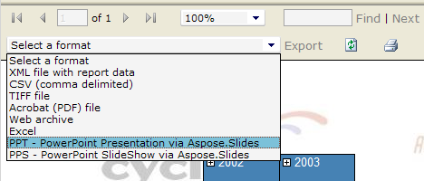

## **Benvenuti a Aspose.Slides for Reporting Services!**

Aspose.Slides for Reporting Services è l'unica soluzione sul mercato che consente di generare veri report PPT e PPS in Microsoft SQL Server 2005, 2008, 2012, 2016 e 2017 Reporting Services (32-bit e 64-bit). Tutte le funzionalità dei report RDL, incluse tabelle, matrici, grafici e immagini, vengono convertite con il più alto grado di precisione in presentazioni Microsoft PowerPoint.

## **Panoramica del Prodotto**

Microsoft SQL Server Reporting Services non dispone di funzionalità integrate per esportare i report come presentazioni Microsoft PowerPoint, ma dopo aver installato Aspose.Slides for Reporting Services sul tuo server, ottieni l'accesso a formati di esportazione aggiuntivi:

- PPT - Presentazione PowerPoint via Aspose.Slides
- PPS - SlideShow PowerPoint via Aspose.Slides
- PPTX - Presentazione PowerPoint 2007 via Aspose.Slides
- PPSX - SlideShow PowerPoint 2007 via Aspose.Slides

Aspose.Slides for Reporting Services crea presentazioni sul server senza utilizzare Microsoft PowerPoint. Aspose.Slides for Reporting Services utilizza internamente Aspose.Slides per .NET – il componente di classe mondiale per l'elaborazione di presentazioni lato server.

**Aspose.Slides for Reporting Services consente di esportare qualsiasi report in formato PPT, PPS, PPTX o PPSX.** 

**Aspose.Slides for Reporting Services ha esportato un report come file PPT.** 

