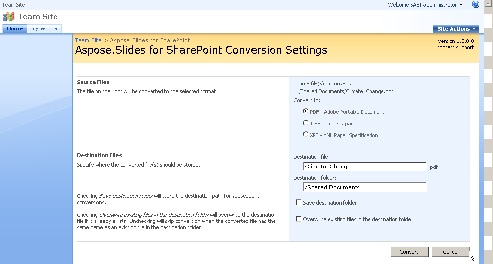

{} 

Con Aspose.Slides per SharePoint, è possibile convertire documenti tra molti formati di documenti Office popolari all'interno di una libreria documenti di SharePoint. Le conversioni vengono eseguite con alta fedeltà e precisione. 

{} 
## **Formati di Input Supportati**
Aspose.Slides per SharePoint supporta i seguenti formati di input: 

- PPT – Presentazione Microsoft PowerPoint 97 - 2003
- PPS – Presentazione Microsoft PowerPoint SlideShow 97 - 2003
- POT – Modello Microsoft PowerPoint 97 - 2003
- PPTX – Presentazione Office Open XML
- PPSX – SlideShow Office Open XML
- POTX – Modello Office Open XML

{} 

Per generare documenti, Aspose.Slides per SharePoint fa affidamento su una versione integrata di [Aspose.Slides for .NET](http://www.aspose.com/categories/.net-components/aspose.slides-for-.net/default.aspx), l'unico componente di elaborazione di documenti PowerPoint di Aspose.

{}
## **Formati di Output Supportati**
Sono supportati i seguenti formati di output da Aspose.Slides per SharePoint: 

- PDF – Formato Documento Portatile
- TIFF – Pacchetto Immagini
- XPS – Specifica XML Paper

**Selezionare il formato di output dalla schermata Impostazioni di Conversione** 

