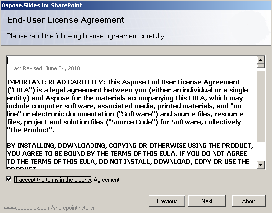

{} 

Aspose.Slides per SharePoint viene scaricato come archivio Aspose.Slides.SharePoint.zip. L'archivio contiene: 

- **Aspose.Slides.SharePoint.wsp**: file della soluzione SharePoint. Aspose.Slides per SharePoint è confezionato come soluzione SharePoint per facilitare l'attivazione e la disattivazione nell'intera fattoria server.
- **Aspose_LicenseAgreement.rtf**: il contratto di licenza per l'utente finale.
- **Setup.exe**: il programma di installazione.
- **Setup.exe.config**: il file di configurazione dell'installazione.

{} 
## **Processo di installazione**
Prima di avviare l'installazione, il programma di setup verifica che:

- WSS 3.0 o MOSS 2007 siano installati.
- L'utente disponga dei permessi per installare soluzioni SharePoint.
- Il database SharePoint sia online.
- Il servizio di amministrazione WSS sia avviato.
- Il servizio timer WSS sia avviato.

I servizi di amministrazione e timer WSS sono necessari perché alcune operazioni di installazione si basano su un job timer per propagarsi a tutti i server della fattoria. 
### **Esecuzione dell'installazione**
Per installare Aspose.Slides per SharePoint: 

1. Decomprimi il file zip Aspose.Slides.SharePoint sul disco locale del server MOSS 7.0 o WSS 3.0.
2. Esegui Setup.exe e segui le istruzioni visualizzate.
   Il programma di setup esegue le seguenti azioni: 
   1. Controlla i requisiti di installazione. L'installazione non prosegue se qualche verifica fallisce. 

      **Esecuzione del controllo di sistema** 

3. Visualizza il Contratto di Licenza per l'Utente Finale. È necessario accettare il contratto per continuare. 

   **Il contratto EULA** 

4. Visualizza la selezione del target di distribuzione. Seleziona le applicazioni web e le collezioni di siti per le quali la funzionalità deve essere attivata. 

   **Selezione dei target di distribuzione** 

5. Distribuisce la funzionalità nella fattoria server. 

   **Barra di avanzamento dell'installazione** 

6. Attiva Aspose.Slides per le collezioni di siti selezionate e configura le relative applicazioni web.
7. Visualizza un elenco di applicazioni web e collezioni di siti per le quali la funzionalità è stata distribuita e attivata. 

   **Installazione completata con successo** 

