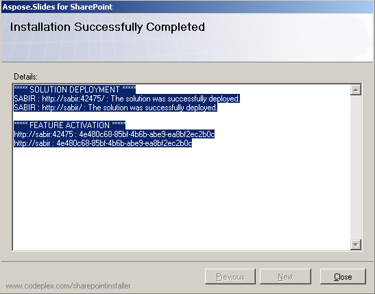

## **Contenuto del pacchetto**

Aspose.Slides for SharePoint viene scaricato dalla [pagina di download](https://releases.aspose.com/slides/it/sharepoint/) come archivio ZIP. L'archivio contiene un pacchetto di soluzione SharePoint (WSP) e un programma di installazione per ciascuna versione di SharePoint supportata:

| Versione SharePoint | Programma di installazione | Pacchetto di soluzione |
| :- | :- | :- |
| SharePoint 2007 | Setup2007.exe | Aspose.Slides.SharePoint2007.wsp |
| SharePoint 2010 | Setup2010.exe | Aspose.Slides.SharePoint2010.wsp |
| SharePoint Server 2013 | Setup2013.exe | Aspose.Slides.SharePoint2013.wsp |
| SharePoint Server 2016 | Setup2016.exe | Aspose.Slides.SharePoint2016.wsp |
| SharePoint Server 2019 | Setup2019.exe | Aspose.Slides.SharePoint2019.wsp |

Ogni programma di installazione ha un file di configurazione accanto (ad esempio, *Setup2019.exe.config*) che indica il pacchetto di soluzione che installa. La cartella *License* contiene un collegamento al contratto di licenza per l'utente finale e alle note di licenza di terze parti.

Aspose.Slides for SharePoint è confezionato come soluzione SharePoint, che SharePoint distribuisce in tutto il server farm. La sua funzionalità viene quindi attivata o disattivata per collezione di siti.

## **Processo di installazione**

Prima dell'installazione, il programma di installazione esegue un controllo di sistema. Verifica che:

- SharePoint sia installato sul server.
- L'utente corrente disponga dell'autorizzazione per installare e distribuire soluzioni SharePoint.
- Il servizio SharePoint Administration sia avviato.
- Il servizio SharePoint Timer sia avviato.
- Il pacchetto di soluzione indicato nel file di configurazione sia presente.

I servizi Administration e Timer sono necessari perché alcune azioni di installazione vengono eseguite come job di timer che propagano la soluzione a tutti i server del farm.

### **Esecuzione dell'installazione**

Per installare Aspose.Slides for SharePoint:

1. Decomprimi l'archivio ZIP su un'unità locale di un server nel farm SharePoint.
2. Esegui il programma di installazione corrispondente alla tua versione di SharePoint (vedi la tabella sopra) e segui le istruzioni a schermo. Il programma di installazione:
   1. Esegue il controllo di sistema. L'installazione non continua se qualche controllo fallisce.

      **Esecuzione del controllo di sistema**

      

   2. Visualizza il contratto di licenza per l'utente finale. È necessario accettarlo per continuare.

      **Il contratto di licenza**

      

   3. Visualizza le destinazioni di distribuzione. Seleziona le applicazioni web e le collezioni di siti per le quali attivare la funzionalità.

      **Selezione delle destinazioni di distribuzione**

      

   4. Distribuisce la soluzione nel farm.

      **Progresso dell'installazione**

      

   5. Attiva Aspose.Slides for SharePoint sulle collezioni di siti selezionate.
   6. Elenca le applicazioni web e le collezioni di siti in cui la soluzione è stata distribuita e attivata.

      **Installazione completata con successo**

      

{}
Gli screenshot sono stati catturati su SharePoint 2007. I programmi di installazione per le versioni successive attraversano le stesse schermate.
{}

Se la stessa versione di Aspose.Slides for SharePoint è già installata, il programma di installazione offre la possibilità di ripararla o rimuoverla. Se è installata un'altra versione, offre di aggiornarla o rimuoverla.

Dopo l'installazione, appare una voce **Convert via Aspose.Slides** nel menu dei file nelle librerie documenti delle collezioni di siti selezionate (su SharePoint 2007, **Convert with Aspose.Slides**). Per convertire una prima presentazione, consulta [Converting Microsoft PowerPoint Documents into Other Formats](/slides/it/sharepoint/converting-microsoft-powerpoint-documents-into-other-formats/). Ciò che la soluzione aggiunge al farm è descritto in [Deployment and Activation](/slides/it/sharepoint/deployment-and-activation/).

## **FAQ**

**Quale programma di installazione devo eseguire?**

Quello il cui nome corrisponde alla tua versione di SharePoint. Ad esempio, esegui *Setup2016.exe* su un farm SharePoint Server 2016. Ogni programma di installazione installa solo il proprio pacchetto di soluzione.

**Ho bisogno di un download separato per la versione con licenza?**

No. Lo stesso pacchetto funziona in modalità valutazione fino a quando non installi la soluzione di licenza; vedi [Installing Aspose.Slides for SharePoint License](/slides/it/sharepoint/installing-aspose-slides-for-sharepoint-license/).

**Come rimuovo il prodotto?**

Esegui nuovamente lo stesso programma di installazione e seleziona **Remove**; vedi [Uninstalling Aspose.Slides for SharePoint](/slides/it/sharepoint/uninstalling-aspose-slides-for-sharepoint/).