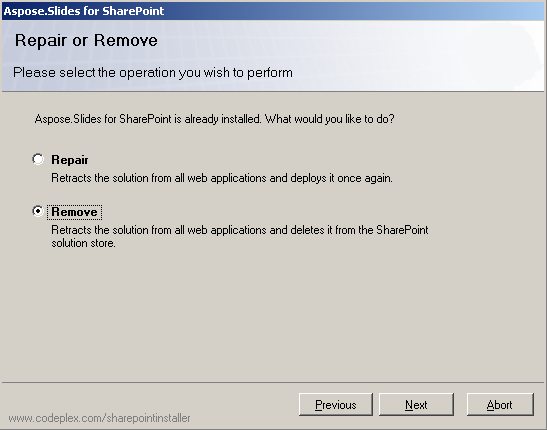

Per disinstallare Aspose.Slides per SharePoint: 

1. Eseguire il programma di installazione.
   Se Aspose.Slides per SharePoint è già installato, il programma di installazione suggerisce di rimuoverlo o ripararlo. 
1. Selezionare **Remove** per disinstallare Aspose.Slides per SharePoint.

**Disinstallazione di Aspose.Slides per SharePoint** 

