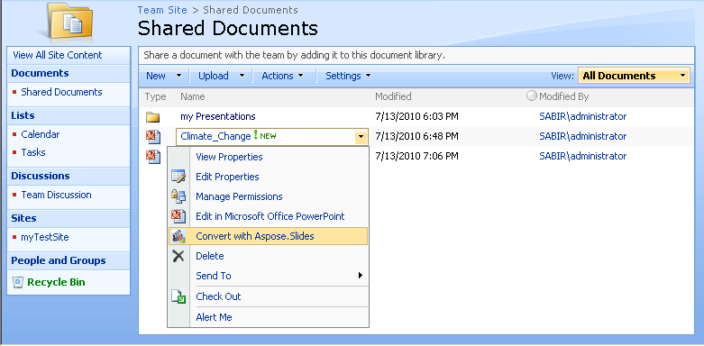

## **Panoramica del prodotto**

Aspose.Slides per SharePoint converte le presentazioni PowerPoint archiviate nelle librerie documenti di SharePoint in altri formati, sul server.

Converte i seguenti formati PowerPoint:

- PPT – presentazione Microsoft PowerPoint 97 - 2003
- PPTX – presentazione Office Open XML

Le converte in PDF, TIFF, XPS, HTML, SWF, ODP, PPS, PPSX, PPTM, PPSM, POTX e POTM. Vedi [Formati di file supportati](/slides/it/sharepoint/supported-file-formats/) per i dettagli.

Il download contiene un programma di installazione separato e un pacchetto di soluzioni per ciascuno dei seguenti prodotti:

- SharePoint 2007
- SharePoint 2010
- SharePoint Server 2013
- SharePoint Server 2016
- SharePoint Server 2019

**Utilizza Aspose.Slides per SharePoint per convertire i documenti dalla libreria documenti di SharePoint**

