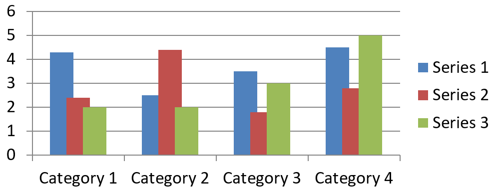

## **概要**

チャートはプロットされたデータをチャート データ ワークブックに格納します。[IChartSeries](https://reference.aspose.com/slides/ja/cpp/aspose.slides.charts/ichartseries/) は関連する値のセットを表し、シリーズ内の各[IChartDataPoint](https://reference.aspose.com/slides/ja/cpp/aspose.slides.charts/ichartdatapoint/) は 1 つ以上のワークブック セルを参照します。[IChartCategory](https://reference.aspose.com/slides/ja/cpp/aspose.slides.charts/ichartcategory/) オブジェクトは、シリーズが共有するラベルまたはグループ化値を提供します。したがって、シリーズ名、カテゴリ、およびポイント値は、表示テキストとしてだけでなく、[IChartDataCell](https://reference.aspose.com/slides/ja/cpp/aspose.slides.charts/ichartdatacell/) オブジェクトに接続されています。

典型的なカテゴリ チャートの場合、デフォルトのワークブックは行 0 をシリーズ名に、列 0 をカテゴリ名に、残りのセルをシリーズ値に使用します。[IChartDataWorkbook::GetCell](https://reference.aspose.com/slides/ja/cpp/aspose.slides.charts/ichartdataworkbook/getcell/) に渡されるワークシート、行、列インデックスは 0 ベースです。このレイアウトはデフォルト データでチャートを作成するときに便利ですが、既存のすべてのチャートがそれを使用しているとは限りません。読み込んだプレゼンテーションでは、ワークブック値を変更する前に、シリーズ、カテゴリ、およびデータ ポイントが参照しているセルを確認してください。

チャート設定には次の 3 つのスコープがあります。

- シリーズ レベルの設定。たとえば[IChartSeries::get_Format](https://reference.aspose.com/slides/ja/cpp/aspose.slides.charts/ichartseries/get_format/) は、1 つのシリーズ内のすべてのポイントのデフォルトの外観を提供します。
- データ ポイントの設定。たとえば[IChartDataPoint::get_Format](https://reference.aspose.com/slides/ja/cpp/aspose.slides.charts/ichartdatapoint/get_format/) は、1 つのポイントに対してシリーズの外観を上書きします。
- グループ設定。互換性のあるシリーズが同じ[IChartSeriesGroup](https://reference.aspose.com/slides/ja/cpp/aspose.slides.charts/ichartseriesgroup/) に属している場合に適用されます。重なりやギャップ幅などのオプションを設定する必要があるときは、[IChartSeries::get_ParentSeriesGroup](https://reference.aspose.com/slides/ja/cpp/aspose.slides.charts/ichartseries/get_parentseriesgroup/) を介してグループにアクセスします。

明示的なポイントまたはシリーズの塗りつぶしが設定されていない場合、チャート スタイルとテーマが自動外観を決定します。シリーズとポイントの書式設定の両方が存在する場合、ポイントの書式設定がそのポイントに対して優先されます。


## **チャート シリーズの重なりを設定する**

[IChartSeries::get_Overlap](https://reference.aspose.com/slides/ja/cpp/aspose.slides.charts/ichartseries/get_overlap/) は、2D チャートにおける棒や列の重なり率を -100% から 100% の範囲で報告します。これは、親シリーズ グループ上の設定の読み取り専用プロジェクションです。すべての互換シリーズを更新するには、[IChartSeriesGroup::set_Overlap](https://reference.aspose.com/slides/ja/cpp/aspose.slides.charts/ichartseriesgroup/set_overlap/) を呼び出してください。このオプションは、グループ化された棒や列を表示するチャート タイプに適用され、組み合わせチャートの無関係なシリーズ グループには影響しません。

次の例は、最初のシリーズを含むグループの重なりを設定します。

```cpp
#include <cstdint>
#include <DOM/Chart/ChartType.h>
#include <DOM/Chart/IChartData.h>
#include <DOM/Chart/IChartSeries.h>
#include <DOM/Chart/IChartSeriesCollection.h>
#include <DOM/Chart/IChartSeriesGroup.h>
#include <DOM/IChart.h>
#include <DOM/IShapeCollection.h>
#include <DOM/ISlide.h>
#include <DOM/Presentation.h>
#include <Export/SaveFormat.h>
#include <system/shared_ptr.h>

using Aspose::Slides::Charts::ChartType;
using Aspose::Slides::Export::SaveFormat;
using Aspose::Slides::Presentation;

const int firstSlideIndex = 0;
const int firstSeriesIndex = 0;
const int8_t overlapPercent = 30;

auto presentation = System::MakeObject<Presentation>();
auto slide = presentation->get_Slide(firstSlideIndex);

// 新しいチャートにはサンプルのシリーズ、カテゴリ、値が含まれています。
auto chart = slide->get_Shapes()->AddChart(ChartType::ClusteredColumn, 20.0f, 20.0f, 500.0f, 200.0f);

auto seriesCollection = chart->get_ChartData()->get_Series();
auto series = seriesCollection->idx_get(firstSeriesIndex);
series->get_ParentSeriesGroup()->set_Overlap(overlapPercent);

presentation->Save(u"series_overlap.pptx", SaveFormat::Pptx);
presentation->Dispose();
```

結果:



## **シリーズの塗りつぶし色を変更する**

[IChartSeries::get_Format](https://reference.aspose.com/slides/ja/cpp/aspose.slides.charts/ichartseries/get_format/) を使用して、シリーズ全体のデフォルト塗りつぶしを設定します。ポイントに明示的な塗りつぶしが既にある場合、その[IChartDataPoint::get_Format](https://reference.aspose.com/slides/ja/cpp/aspose.slides.charts/ichartdatapoint/get_format/) 設定がそのポイントのシリーズ塗りつぶしを上書きします。

次の例は、最初のシリーズに単色の青塗りつぶしを適用します。

```cpp
#include <DOM/Chart/ChartType.h>
#include <DOM/Chart/IChartData.h>
#include <DOM/Chart/IChartSeries.h>
#include <DOM/Chart/IChartSeriesCollection.h>
#include <DOM/Chart/IFormat.h>
#include <DOM/FillType.h>
#include <DOM/IChart.h>
#include <DOM/IColorFormat.h>
#include <DOM/IFillFormat.h>
#include <DOM/IShapeCollection.h>
#include <DOM/ISlide.h>
#include <DOM/Presentation.h>
#include <Export/SaveFormat.h>
#include <drawing/color.h>
#include <system/shared_ptr.h>

using Aspose::Slides::Charts::ChartType;
using Aspose::Slides::Export::SaveFormat;
using Aspose::Slides::FillType;
using Aspose::Slides::Presentation;
using System::Drawing::Color;

const int firstSlideIndex = 0;
const int firstSeriesIndex = 0;

auto presentation = System::MakeObject<Presentation>();
auto slide = presentation->get_Slide(firstSlideIndex);

auto chart = slide->get_Shapes()->AddChart(ChartType::ClusteredColumn, 20.0f, 20.0f, 500.0f, 200.0f);

auto seriesCollection = chart->get_ChartData()->get_Series();
auto series = seriesCollection->idx_get(firstSeriesIndex);
auto seriesColor = Color::get_Blue();
series->get_Format()->get_Fill()->set_FillType(FillType::Solid);
series->get_Format()->get_Fill()->get_SolidFillColor()->set_Color(seriesColor);

presentation->Save(u"series_color.pptx", SaveFormat::Pptx);
presentation->Dispose();
```

結果:


## **シリーズ名を変更する**

シリーズ名はチャート データ ワークブックに保存され、通常は凡例に表示されます。クラスター化された縦棒チャート用にデフォルトで作成されたワークブックでは、セル B1 は行 0、列 1 にあり、最初のシリーズ名が格納されています。以下の例の名前付き定数は、その構造を明示的に示します。

```cpp
#include <DOM/Chart/ChartType.h>
#include <DOM/Chart/IChartData.h>
#include <DOM/Chart/IChartDataCell.h>
#include <DOM/Chart/IChartDataWorkbook.h>
#include <DOM/IChart.h>
#include <DOM/IShapeCollection.h>
#include <DOM/ISlide.h>
#include <DOM/Presentation.h>
#include <Export/SaveFormat.h>
#include <system/object_ext.h>
#include <system/shared_ptr.h>
#include <system/string.h>

using Aspose::Slides::Charts::ChartType;
using Aspose::Slides::Export::SaveFormat;
using Aspose::Slides::Presentation;
using System::ObjectExt;
using System::String;

const int firstSlideIndex = 0;
const int worksheetIndex = 0;
const int seriesNameRowIndex = 0;
const int firstSeriesColumnIndex = 1;

auto presentation = System::MakeObject<Presentation>();
auto slide = presentation->get_Slide(firstSlideIndex);

auto chart = slide->get_Shapes()->AddChart(ChartType::ClusteredColumn, 20.0f, 20.0f, 500.0f, 200.0f);

auto workbook = chart->get_ChartData()->get_ChartDataWorkbook();
auto seriesNameCell = workbook->GetCell(worksheetIndex, seriesNameRowIndex, firstSeriesColumnIndex);
auto seriesName = ObjectExt::Box<String>(u"Revenue");
seriesNameCell->set_Value(seriesName);

presentation->Save(u"series_name.pptx", SaveFormat::Pptx);
presentation->Dispose();
```

また、[IChartSeries::get_Name](https://reference.aspose.com/slides/ja/cpp/aspose.slides.charts/ichartseries/get_name/) が参照しているセルを直接更新することもできます。この方法は、既存のチャートで特定の行や列を想定することを避けられます。

```cpp
#include <DOM/Chart/ChartType.h>
#include <DOM/Chart/IChartCellCollection.h>
#include <DOM/Chart/IChartData.h>
#include <DOM/Chart/IChartDataCell.h>
#include <DOM/Chart/IChartSeries.h>
#include <DOM/Chart/IChartSeriesCollection.h>
#include <DOM/Chart/IStringChartValue.h>
#include <DOM/IChart.h>
#include <DOM/IShapeCollection.h>
#include <DOM/ISlide.h>
#include <DOM/Presentation.h>
#include <Export/SaveFormat.h>
#include <system/object_ext.h>
#include <system/shared_ptr.h>
#include <system/string.h>

using Aspose::Slides::Charts::ChartType;
using Aspose::Slides::Export::SaveFormat;
using Aspose::Slides::Presentation;
using System::ObjectExt;
using System::String;

const int firstSlideIndex = 0;
const int firstSeriesIndex = 0;
const int firstNameCellIndex = 0;

auto presentation = System::MakeObject<Presentation>();
auto slide = presentation->get_Slide(firstSlideIndex);

auto chart = slide->get_Shapes()->AddChart(ChartType::ClusteredColumn, 20.0f, 20.0f, 500.0f, 200.0f);

auto seriesCollection = chart->get_ChartData()->get_Series();
auto series = seriesCollection->idx_get(firstSeriesIndex);
auto seriesNameCells = series->get_Name()->get_AsCells();
auto seriesNameCell = seriesNameCells->idx_get(firstNameCellIndex);
auto seriesName = ObjectExt::Box<String>(u"Revenue");
seriesNameCell->set_Value(seriesName);

presentation->Save(u"series_name.pptx", SaveFormat::Pptx);
presentation->Dispose();
```

結果:


## **自動系列塗りつぶし色を取得する**

[IChartSeries::GetAutomaticSeriesColor](https://reference.aspose.com/slides/ja/cpp/aspose.slides.charts/ichartseries/getautomaticseriescolor/) は、シリーズインデックスとチャート スタイルから計算された色を返します。これは、シリーズ塗りつぶしが明示的に定義されていないときに使用される色です。メソッドを呼び出すと計算された色が取得されますが、新しい塗りつぶしは割り当てられません。

次の例は、各デフォルトシリーズの自動色を出力します。

```cpp
#include <DOM/Chart/ChartType.h>
#include <DOM/Chart/IChartData.h>
#include <DOM/Chart/IChartSeries.h>
#include <DOM/Chart/IChartSeriesCollection.h>
#include <DOM/IChart.h>
#include <DOM/IShapeCollection.h>
#include <DOM/ISlide.h>
#include <DOM/Presentation.h>
#include <drawing/color.h>
#include <system/console.h>
#include <system/shared_ptr.h>
#include <system/string.h>

using Aspose::Slides::Charts::ChartType;
using Aspose::Slides::Presentation;
using System::Console;
using System::String;

const int firstSlideIndex = 0;

auto presentation = System::MakeObject<Presentation>();
auto slide = presentation->get_Slide(firstSlideIndex);

auto chart = slide->get_Shapes()->AddChart(ChartType::ClusteredColumn, 20.0f, 20.0f, 500.0f, 200.0f);

auto seriesCollection = chart->get_ChartData()->get_Series();
const int seriesCount = seriesCollection->get_Count();
for (int seriesIndex = 0; seriesIndex < seriesCount; seriesIndex++)
{
    auto series = seriesCollection->idx_get(seriesIndex);
    auto automaticColor = series->GetAutomaticSeriesColor();
    auto colorName = automaticColor.get_Name();
    auto outputLine = String::Format(u"Series {0}: {1}", seriesIndex, colorName);
    Console::WriteLine(outputLine);
}

presentation->Dispose();
```

デフォルトのチャート スタイルに対するサンプル出力:

```text
Series 0: ff4f81bd
Series 1: ffc0504d
Series 2: ff9bbb59
```

正確な色はチャート スタイルとテーマに依存します。

## **シリーズの塗りつぶしを反転させるカラーを設定する**

棒、縦棒、バブルシリーズの場合、[IChartSeries::set_InvertIfNegative](https://reference.aspose.com/slides/ja/cpp/aspose.slides.charts/ichartseries/set_invertifnegative/) を使用すると、負の値を別の塗りつぶしで表示できます。通常のシリーズ塗りつぶしを単色に設定し、反転を有効にして、[IChartSeries::get_InvertedSolidFillColor](https://reference.aspose.com/slides/ja/cpp/aspose.slides.charts/ichartseries/get_invertedsolidfillcolor/) で負の値用カラーを割り当てます。ワークブック内の負の数値は変更されず、表示カラーだけが変わります。

次の例は、デフォルトのチャート データを 1 系列に置き換えます。ワークシートの行 0 にシリーズ名、列 0 にカテゴリ名、列 1 に値が格納されます。

```cpp
#include <DOM/Chart/ChartType.h>
#include <DOM/Chart/IChartCategoryCollection.h>
#include <DOM/Chart/IChartData.h>
#include <DOM/Chart/IChartDataCell.h>
#include <DOM/Chart/IChartDataPointCollection.h>
#include <DOM/Chart/IChartDataWorkbook.h>
#include <DOM/Chart/IChartSeries.h>
#include <DOM/Chart/IChartSeriesCollection.h>
#include <DOM/Chart/IFormat.h>
#include <DOM/FillType.h>
#include <DOM/IChart.h>
#include <DOM/IColorFormat.h>
#include <DOM/IFillFormat.h>
#include <DOM/IShapeCollection.h>
#include <DOM/ISlide.h>
#include <DOM/Presentation.h>
#include <Export/SaveFormat.h>
#include <drawing/color.h>
#include <system/object_ext.h>
#include <system/shared_ptr.h>
#include <system/string.h>

using Aspose::Slides::Charts::ChartType;
using Aspose::Slides::Export::SaveFormat;
using Aspose::Slides::FillType;
using Aspose::Slides::Presentation;
using System::Drawing::Color;
using System::ObjectExt;
using System::String;

const int firstSlideIndex = 0;
const int worksheetIndex = 0;
const int headerRowIndex = 0;
const int categoryColumnIndex = 0;
const int firstSeriesColumnIndex = 1;
const int firstDataRowIndex = 1;
const int categoryCount = 3;

const String categoryNames[] = {u"Category 1", u"Category 2", u"Category 3"};
const int seriesValues[] = {-20, 50, -30};

auto presentation = System::MakeObject<Presentation>();
auto slide = presentation->get_Slide(firstSlideIndex);

auto chart = slide->get_Shapes()->AddChart(ChartType::ClusteredColumn, 20.0f, 20.0f, 500.0f, 200.0f);
auto chartData = chart->get_ChartData();
auto workbook = chartData->get_ChartDataWorkbook();

auto seriesCollection = chartData->get_Series();
seriesCollection->Clear();
chartData->get_Categories()->Clear();

auto seriesName = ObjectExt::Box<String>(u"Series 1");
auto seriesNameCell = workbook->GetCell(worksheetIndex, headerRowIndex, firstSeriesColumnIndex, seriesName);
auto chartType = chart->get_Type();
auto series = seriesCollection->Add(seriesNameCell, chartType);

for (int categoryIndex = 0; categoryIndex < categoryCount; categoryIndex++)
{
    const int dataRowIndex = firstDataRowIndex + categoryIndex;
    auto categoryName = categoryNames[categoryIndex];
    const int seriesValue = seriesValues[categoryIndex];

    auto boxedCategoryName = ObjectExt::Box<String>(categoryName);
    auto categoryCell = workbook->GetCell(worksheetIndex, dataRowIndex, categoryColumnIndex, boxedCategoryName);
    chartData->get_Categories()->Add(categoryCell);

    auto boxedSeriesValue = ObjectExt::Box<int>(seriesValue);
    auto valueCell = workbook->GetCell(worksheetIndex, dataRowIndex, firstSeriesColumnIndex, boxedSeriesValue);
    series->get_DataPoints()->AddDataPointForBarSeries(valueCell);
}

auto automaticSeriesColor = series->GetAutomaticSeriesColor();
auto invertedSeriesColor = Color::get_Red();
series->get_Format()->get_Fill()->set_FillType(FillType::Solid);
series->get_Format()->get_Fill()->get_SolidFillColor()->set_Color(automaticSeriesColor);
series->set_InvertIfNegative(true);
series->get_InvertedSolidFillColor()->set_Color(invertedSeriesColor);

presentation->Save(u"inverted_solid_fill_color.pptx", SaveFormat::Pptx);
presentation->Dispose();
```

結果:


1 つのポイントだけに反転を有効にするには[IChartDataPoint::set_InvertIfNegative](https://reference.aspose.com/slides/ja/cpp/aspose.slides.charts/ichartdatapoint/set_invertifnegative/) を使用します。以下の例では、シリーズ全体の反転を無効にし、選択したポイントのみで反転を有効にしています。ポイントには負の値も割り当て、効果を確認できるようにしています。

```cpp
#include <DOM/Chart/ChartType.h>
#include <DOM/Chart/IChartData.h>
#include <DOM/Chart/IChartDataCell.h>
#include <DOM/Chart/IChartDataPoint.h>
#include <DOM/Chart/IChartSeries.h>
#include <DOM/Chart/IChartSeriesCollection.h>
#include <DOM/Chart/IDoubleChartValue.h>
#include <DOM/Chart/IFormat.h>
#include <DOM/FillType.h>
#include <DOM/IChart.h>
#include <DOM/IColorFormat.h>
#include <DOM/IFillFormat.h>
#include <DOM/IShapeCollection.h>
#include <DOM/ISlide.h>
#include <DOM/Presentation.h>
#include <Export/SaveFormat.h>
#include <drawing/color.h>
#include <system/object_ext.h>
#include <system/shared_ptr.h>

using Aspose::Slides::Charts::ChartType;
using Aspose::Slides::Export::SaveFormat;
using Aspose::Slides::FillType;
using Aspose::Slides::Presentation;
using System::Drawing::Color;
using System::ObjectExt;

const int firstSlideIndex = 0;
const int firstSeriesIndex = 0;
const int targetDataPointIndex = 2;
const int negativeValue = -30;

auto presentation = System::MakeObject<Presentation>();
auto slide = presentation->get_Slide(firstSlideIndex);

auto chart = slide->get_Shapes()->AddChart(ChartType::ClusteredColumn, 20.0f, 20.0f, 500.0f, 200.0f);

auto seriesCollection = chart->get_ChartData()->get_Series();
auto series = seriesCollection->idx_get(firstSeriesIndex);
auto automaticSeriesColor = series->GetAutomaticSeriesColor();
auto invertedSeriesColor = Color::get_Red();
series->get_Format()->get_Fill()->set_FillType(FillType::Solid);
series->get_Format()->get_Fill()->get_SolidFillColor()->set_Color(automaticSeriesColor);
series->get_InvertedSolidFillColor()->set_Color(invertedSeriesColor);
series->set_InvertIfNegative(false);

auto dataPoint = series->get_DataPoint(targetDataPointIndex);
auto boxedNegativeValue = ObjectExt::Box<int>(negativeValue);
dataPoint->get_YValue()->get_AsCell()->set_Value(boxedNegativeValue);
dataPoint->set_InvertIfNegative(true);

presentation->Save(u"data_point_invert_color_if_negative.pptx", SaveFormat::Pptx);
presentation->Dispose();
```

## **特定のデータ ポイントの値をクリアする**

ポイントを削除せずに空にしたい場合は、対応するバックアップ ワークブックセルを `nullptr` に設定します。縦棒チャートの場合、プロットされる値は[IChartDataPoint::get_YValue](https://reference.aspose.com/slides/ja/cpp/aspose.slides.charts/ichartdatapoint/get_yvalue/) で取得できます。データ ポイントは同じカテゴリ位置に残りますが、チャートはブランク値設定に従ってその値を空白として扱います。

次の例は、最初のシリーズの 2 番目のポイントだけをクリアします。

```cpp
#include <DOM/Chart/ChartType.h>
#include <DOM/Chart/IChartData.h>
#include <DOM/Chart/IChartDataCell.h>
#include <DOM/Chart/IChartDataPoint.h>
#include <DOM/Chart/IChartSeries.h>
#include <DOM/Chart/IChartSeriesCollection.h>
#include <DOM/Chart/IDoubleChartValue.h>
#include <DOM/IChart.h>
#include <DOM/IShapeCollection.h>
#include <DOM/ISlide.h>
#include <DOM/Presentation.h>
#include <Export/SaveFormat.h>
#include <system/shared_ptr.h>

using Aspose::Slides::Charts::ChartType;
using Aspose::Slides::Export::SaveFormat;
using Aspose::Slides::Presentation;

const int firstSlideIndex = 0;
const int firstSeriesIndex = 0;
const int targetDataPointIndex = 1;

auto presentation = System::MakeObject<Presentation>();
auto slide = presentation->get_Slide(firstSlideIndex);

auto chart = slide->get_Shapes()->AddChart(ChartType::ClusteredColumn, 20.0f, 20.0f, 500.0f, 200.0f);

auto seriesCollection = chart->get_ChartData()->get_Series();
auto series = seriesCollection->idx_get(firstSeriesIndex);
auto dataPoint = series->get_DataPoint(targetDataPointIndex);
dataPoint->get_YValue()->get_AsCell()->set_Value(nullptr);

presentation->Save(u"clear_data_point_value.pptx", SaveFormat::Pptx);
presentation->Dispose();
```

散布図は X と Y の別々のセルを使用し、バブルチャートはサイズセルも使用します。削除したい値に対応するセルだけをクリアしてください。コレクション全体を削除したいとき以外は[IChartDataPointCollection::Clear](https://reference.aspose.com/slides/ja/cpp/aspose.slides.charts/ichartdatapointcollection/clear/) を呼び出さないでください。これはすべてのデータ ポイントを削除します。

## **シリーズのギャップ幅を設定する**

ギャップ幅は隣接する棒または列のクラスター間のスペースで、棒または列の幅に対するパーセンテージで表されます。重なりと同様に、これは個々のシリーズではなく、親シリーズ グループに属します。グループ全体に対して[IChartSeriesGroup::set_GapWidth](https://reference.aspose.com/slides/ja/cpp/aspose.slides.charts/ichartseriesgroup/set_gapwidth/) を 1 回呼び出すだけです。値が大きいほどクラスター間のスペースが広がり、値が小さいほど密集します。

次の例はギャップ幅を変更し、最終プレゼンテーションだけを保存します。

```cpp
#include <cstdint>
#include <DOM/Chart/ChartType.h>
#include <DOM/Chart/IChartData.h>
#include <DOM/Chart/IChartSeries.h>
#include <DOM/Chart/IChartSeriesCollection.h>
#include <DOM/Chart/IChartSeriesGroup.h>
#include <DOM/IChart.h>
#include <DOM/IShapeCollection.h>
#include <DOM/ISlide.h>
#include <DOM/Presentation.h>
#include <Export/SaveFormat.h>
#include <system/shared_ptr.h>

using Aspose::Slides::Charts::ChartType;
using Aspose::Slides::Export::SaveFormat;
using Aspose::Slides::Presentation;

const int firstSlideIndex = 0;
const int firstSeriesIndex = 0;
const uint16_t gapWidthPercent = 30;

auto presentation = System::MakeObject<Presentation>();
auto slide = presentation->get_Slide(firstSlideIndex);

auto chart = slide->get_Shapes()->AddChart(ChartType::StackedColumn, 20.0f, 20.0f, 500.0f, 200.0f);

auto seriesCollection = chart->get_ChartData()->get_Series();
auto series = seriesCollection->idx_get(firstSeriesIndex);
series->get_ParentSeriesGroup()->set_GapWidth(gapWidthPercent);

presentation->Save(u"gap_width_30.pptx", SaveFormat::Pptx);
presentation->Dispose();
```

結果:


## **FAQ**

**どのチャート タイプがデータ シリーズをサポートしていますか？**

[ChartType](https://reference.aspose.com/slides/ja/cpp/aspose.slides.charts/charttype/) 列挙体で表されるすべてのチャート タイプはチャート データを使用しますが、シリーズの値構造や設定はすべて同じではありません。たとえば、カテゴリ チャートはカテゴリと値を使用し、散布図は X と Y の値を使用し、バブル チャートはバブル サイズを追加します。シリーズの種類に合わせたデータ ポイント作成メソッドを使用してください。重なりやギャップ幅などのオプションは、互換性のある棒または列のグループにのみ適用されます。

**チャート シリーズ グループとは何ですか？**

[IChartSeriesGroup](https://reference.aspose.com/slides/ja/cpp/aspose.slides.charts/ichartseriesgroup/) は、グループレベルのプロット設定を共有する互換シリーズを含みます。組み合わせチャートは複数のグループを含むことができるため、あるシリーズを通じて取得したグループを変更しても、必ずしもチャート内のすべてのシリーズが変更されるわけではありません。

**新規作成したチャートにはデフォルト データが含まれますか？**

はい。デフォルトでは、[IShapeCollection::AddChart](https://reference.aspose.com/slides/ja/cpp/aspose.slides/ishapecollection/addchart/) はサンプルのシリーズ、カテゴリ、値を作成します。これらのセルを編集するか、カスタム データセットを追加する前にシリーズとカテゴリのコレクションをクリアできます。オーバーロードを使用してデフォルト データなしでチャートを作成することも可能です。

**チャート オブジェクトはワークブック セルとどのように接続されていますか？**

シリーズ名、カテゴリ ラベル、データ ポイントの値は[IChartDataWorkbook](https://reference.aspose.com/slides/ja/cpp/aspose.slides.charts/ichartdataworkbook/) のセルを参照しています。参照セルを変更すると、対応するチャート要素が更新されます。カスタム データを構築する際は、カテゴリ行とシリーズ値行が揃うようにし、各ポイントが意図したカテゴリの下にプロットされるようにしてください。

**シリーズ全体ではなく 1 つのポイントだけをクリアするには？**

対象の値セルを `nullptr` に設定すると、ポイントのカテゴリ位置は保持されたまま空のポイントになります。シリーズ全体のポイントを削除したい場合のみ[IChartDataPointCollection::Clear](https://reference.aspose.com/slides/ja/cpp/aspose.slides.charts/ichartdatapointcollection/clear/) を呼び出してください。カテゴリも削除する場合は、すべてのシリーズがカテゴリ コレクションと整列したままになるように更新してください。

**空のポイントはどのように表示されますか？**

表示はチャート タイプと[IChart::get_DisplayBlanksAs](https://reference.aspose.com/slides/ja/cpp/aspose.slides.charts/ichart/get_displayblanksas/) の設定に依存します。サポートされているチャートは、空白をギャップとして、ゼロ値として、または隣接ポイントを接続して表示できます。プレゼンテーションでの欠損データの意味に合った設定を選択してください。

**負の値はどのように書式設定されますか？**

サポートされている棒、縦棒、バブルシリーズの場合、[IChartSeries::set_InvertIfNegative](https://reference.aspose.com/slides/ja/cpp/aspose.slides.charts/ichartseries/set_invertifnegative/) を呼び出し、[IChartSeries::get_InvertedSolidFillColor](https://reference.aspose.com/slides/ja/cpp/aspose.slides.charts/ichartseries/get_invertedsolidfillcolor/) でカラーを設定します。個別のポイントについては[IChartDataPoint::set_InvertIfNegative](https://reference.aspose.com/slides/ja/cpp/aspose.slides.charts/ichartdatapoint/set_invertifnegative/) で動作を上書きできます。これらのメソッドは書式設定に影響し、数値自体は変更しません。

**シリーズとポイントの両方が書式設定されている場合、どちらが優先されますか？**

明示的なデータ ポイントの書式設定がそのポイントに対して優先されます。他のポイントは、明示的なシリーズ書式設定がある場合はそれを使用し、シリーズ書式設定が未定義の場合は自動的なチャート スタイルとテーマが適用されます。重なりやギャップ幅などのグループ設定はレイアウトに影響し、ポイントレベルの書式設定の上書きにはなりません。

**チャートに含められるシリーズ数に上限はありますか？**

Aspose.Slides には固定されたシリーズ数の上限はありません。実際には、プレゼンテーション ファイルの制限、利用可能なメモリ、レンダリング時間、およびチャートの可読性が実用的な上限を決定します。

**列が近すぎる、または離れすぎる場合は何を変更すべきですか？**

適切な親シリーズ グループに対して[IChartSeriesGroup::set_GapWidth](https://reference.aspose.com/slides/ja/cpp/aspose.slides.charts/ichartseriesgroup/set_gapwidth/) を呼び出してください。値を大きくするとクラスター間のスペースが広がり、値を小さくするとクラスターが近づきます。