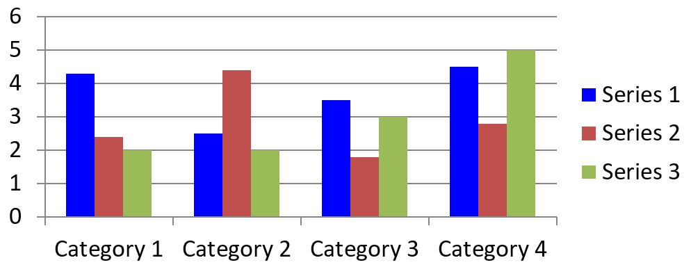

## **概要**

チャートは、プロットされたデータをチャート データ ワークブックに保存します。  
[IChartSeries](https://reference.aspose.com/slides/ja/cpp/aspose.slides.charts/ichartseries/) は関連する値のセットを表し、シリーズ内の各 [IChartDataPoint](https://reference.aspose.com/slides/ja/cpp/aspose.slides.charts/ichartdatapoint/) は1つ以上のワークブック セルを参照します。  
[IChartCategory](https://reference.aspose.com/slides/ja/cpp/aspose.slides.charts/ichartcategory/) オブジェクトは、シリーズが共有するラベルまたはグループ化値を提供します。  
したがって、シリーズ名、カテゴリ、およびポイント値は、表示テキストとしてだけでなく、[IChartDataCell](https://reference.aspose.com/slides/ja/cpp/aspose.slides.charts/ichartdatacell/) オブジェクトに接続されます。

一般的なカテゴリ チャートの場合、デフォルトのワークブックは、シリーズ名に行 0、カテゴリ名に列 0 を使用し、残りのセルにシリーズの値を格納します。  
ワークシート、行、列のインデックスは、[IChartDataWorkbook::GetCell](https://reference.aspose.com/slides/ja/cpp/aspose.slides.charts/ichartdataworkbook/getcell/) に渡す際はゼロベースです。  
このレイアウトは、デフォルト データでチャートを作成する場合に便利ですが、すべての既存チャートがこのレイアウトを使用しているとは限りません。  
読み込んだプレゼンテーションの場合、ワークブックの値を変更する前に、シリーズ、カテゴリ、データ ポイントが参照しているセルを確認してください。

チャート設定には、次の 3 つの異なるスコープがあります:

- シリーズ レベルの設定 (例: [IChartSeries::get_Format](https://reference.aspose.com/slides/ja/cpp/aspose.slides.charts/ichartseries/get_format/)) は、1 つのシリーズ内のすべてのポイントのデフォルトの外観を提供します。
- データ ポイント設定 (例: [IChartDataPoint::get_Format](https://reference.aspose.com/slides/ja/cpp/aspose.slides.charts/ichartdatapoint/get_format/)) は、特定のポイントに対してシリーズの外観を上書きします。
- グループ設定は、同一の [IChartSeriesGroup](https://reference.aspose.com/slides/ja/cpp/aspose.slides.charts/ichartseriesgroup/) に属する互換性のあるシリーズに適用されます。オーバーラップやギャップ幅などのオプションを設定する必要がある場合は、[IChartSeries::get_ParentSeriesGroup](https://reference.aspose.com/slides/ja/cpp/aspose.slides.charts/ichartseries/get_parentseriesgroup/) でグループにアクセスします。

明示的なポイントまたはシリーズの塗りつぶしが設定されていない場合、チャートのスタイルとテーマが自動的な外観を決定します。  
シリーズとポイントの書式設定の両方が存在する場合、そのポイントに対してはポイントの書式設定が優先されます。


## **チャート系列のオーバーラップを設定する**

[IChartSeries::get_Overlap](https://reference.aspose.com/slides/ja/cpp/aspose.slides.charts/ichartseries/get_overlap/) は、2D チャートで棒や列がどの程度オーバーラップするか（-100% から 100%）を示します。  
これは、親シリーズ グループの設定の読み取り専用の投影です。  
そのグループ内のすべての互換シリーズを更新するには、[IChartSeriesGroup::set_Overlap](https://reference.aspose.com/slides/ja/cpp/aspose.slides.charts/ichartseriesgroup/set_overlap/) を呼び出します。  
このオプションは、グループ化された棒または列を表示するチャート タイプに適用され、組み合わせチャートの無関係なシリーズ グループには影響しません。

以下の例は、最初のシリーズを含むグループのオーバーラップを設定します:

```cpp
#include <cstdint>
#include <DOM/Chart/ChartType.h>
#include <DOM/Chart/IChartData.h>
#include <DOM/Chart/IChartSeries.h>
#include <DOM/Chart/IChartSeriesCollection.h>
#include <DOM/Chart/IChartSeriesGroup.h>
#include <DOM/IChart.h>
#include <DOM/IShapeCollection.h>
#include <DOM/ISlide.h>
#include <DOM/Presentation.h>
#include <Export/SaveFormat.h>
#include <system/shared_ptr.h>

using Aspose::Slides::Charts::ChartType;
using Aspose::Slides::Export::SaveFormat;
using Aspose::Slides::Presentation;

const int firstSlideIndex = 0;
const int firstSeriesIndex = 0;
const int8_t overlapPercent = 30;

auto presentation = System::MakeObject<Presentation>();
auto slide = presentation->get_Slide(firstSlideIndex);

// 新しいチャートにはサンプルシリーズ、カテゴリ、および値が含まれます。
auto chart = slide->get_Shapes()->AddChart(ChartType::ClusteredColumn, 20.0f, 20.0f, 500.0f, 200.0f);

auto seriesCollection = chart->get_ChartData()->get_Series();
auto series = seriesCollection->idx_get(firstSeriesIndex);
series->get_ParentSeriesGroup()->set_Overlap(overlapPercent);

presentation->Save(u"series_overlap.pptx", SaveFormat::Pptx);
presentation->Dispose();
```

結果:


## **シリーズの塗りつぶし色を変更する**

[IChartSeries::get_Format](https://reference.aspose.com/slides/ja/cpp/aspose.slides.charts/ichartseries/get_format/) を使用して、シリーズ全体のデフォルトの塗りつぶしを設定します。  
ポイントに明示的な塗りつぶしが既に設定されている場合、その [IChartDataPoint::get_Format](https://reference.aspose.com/slides/ja/cpp/aspose.slides.charts/ichartdatapoint/get_format/) の設定がそのポイントのシリーズ塗りつぶしを上書きします。

以下の例は、最初のシリーズに単色の青い塗りつぶしを適用します:

```cpp
#include <DOM/Chart/ChartType.h>
#include <DOM/Chart/IChartData.h>
#include <DOM/Chart/IChartSeries.h>
#include <DOM/Chart/IChartSeriesCollection.h>
#include <DOM/Chart/IFormat.h>
#include <DOM/FillType.h>
#include <DOM/IChart.h>
#include <DOM/IColorFormat.h>
#include <DOM/IFillFormat.h>
#include <DOM/IShapeCollection.h>
#include <DOM/ISlide.h>
#include <DOM/Presentation.h>
#include <Export/SaveFormat.h>
#include <drawing/color.h>
#include <system/shared_ptr.h>

using Aspose::Slides::Charts::ChartType;
using Aspose::Slides::Export::SaveFormat;
using Aspose::Slides::FillType;
using Aspose::Slides::Presentation;
using System::Drawing::Color;

const int firstSlideIndex = 0;
const int firstSeriesIndex = 0;

auto presentation = System::MakeObject<Presentation>();
auto slide = presentation->get_Slide(firstSlideIndex);

auto chart = slide->get_Shapes()->AddChart(ChartType::ClusteredColumn, 20.0f, 20.0f, 500.0f, 200.0f);

auto seriesCollection = chart->get_ChartData()->get_Series();
auto series = seriesCollection->idx_get(firstSeriesIndex);
auto seriesColor = Color::get_Blue();
series->get_Format()->get_Fill()->set_FillType(FillType::Solid);
series->get_Format()->get_Fill()->get_SolidFillColor()->set_Color(seriesColor);

presentation->Save(u"series_color.pptx", SaveFormat::Pptx);
presentation->Dispose();
```

結果:



## **シリーズ名を変更する**

シリーズ名はチャート データ ワークブックに保存され、通常は凡例に表示されます。  
クラスター化された縦棒チャート用に作成されたデフォルトのワークブックでは、セル B1 は行 0、列 1 にあり、最初のシリーズの名前が含まれます。  
以下の例の名前付き定数は、その構造を明示的に示しています:

```cpp
#include <DOM/Chart/ChartType.h>
#include <DOM/Chart/IChartData.h>
#include <DOM/Chart/IChartDataCell.h>
#include <DOM/Chart/IChartDataWorkbook.h>
#include <DOM/IChart.h>
#include <DOM/IShapeCollection.h>
#include <DOM/ISlide.h>
#include <DOM/Presentation.h>
#include <Export/SaveFormat.h>
#include <system/object_ext.h>
#include <system/shared_ptr.h>
#include <system/string.h>

using Aspose::Slides::Charts::ChartType;
using Aspose::Slides::Export::SaveFormat;
using Aspose::Slides::Presentation;
using System::ObjectExt;
using System::String;

const int firstSlideIndex = 0;
const int worksheetIndex = 0;
const int seriesNameRowIndex = 0;
const int firstSeriesColumnIndex = 1;

auto presentation = System::MakeObject<Presentation>();
auto slide = presentation->get_Slide(firstSlideIndex);

auto chart = slide->get_Shapes()->AddChart(ChartType::ClusteredColumn, 20.0f, 20.0f, 500.0f, 200.0f);

auto workbook = chart->get_ChartData()->get_ChartDataWorkbook();
auto seriesNameCell = workbook->GetCell(worksheetIndex, seriesNameRowIndex, firstSeriesColumnIndex);
auto seriesName = ObjectExt::Box<String>(u"Revenue");
seriesNameCell->set_Value(seriesName);

presentation->Save(u"series_name.pptx", SaveFormat::Pptx);
presentation->Dispose();
```

[IChartSeries::get_Name](https://reference.aspose.com/slides/ja/cpp/aspose.slides.charts/ichartseries/get_name/) が既に参照しているセルを更新することもできます。このアプローチにより、既存のチャートで特定の行や列を前提としなくて済みます:

```cpp
#include <DOM/Chart/ChartType.h>
#include <DOM/Chart/IChartCellCollection.h>
#include <DOM/Chart/IChartData.h>
#include <DOM/Chart/IChartDataCell.h>
#include <DOM/Chart/IChartSeries.h>
#include <DOM/Chart/IChartSeriesCollection.h>
#include <DOM/Chart/IStringChartValue.h>
#include <DOM/IChart.h>
#include <DOM/IShapeCollection.h>
#include <DOM/ISlide.h>
#include <DOM/Presentation.h>
#include <Export/SaveFormat.h>
#include <system/object_ext.h>
#include <system/shared_ptr.h>
#include <system/string.h>

using Aspose::Slides::Charts::ChartType;
using Aspose::Slides::Export::SaveFormat;
using Aspose::Slides::Presentation;
using System::ObjectExt;
using System::String;

const int firstSlideIndex = 0;
const int firstSeriesIndex = 0;
const int firstNameCellIndex = 0;

auto presentation = System::MakeObject<Presentation>();
auto slide = presentation->get_Slide(firstSlideIndex);

auto chart = slide->get_Shapes()->AddChart(ChartType::ClusteredColumn, 20.0f, 20.0f, 500.0f, 200.0f);

auto seriesCollection = chart->get_ChartData()->get_Series();
auto series = seriesCollection->idx_get(firstSeriesIndex);
auto seriesNameCells = series->get_Name()->get_AsCells();
auto seriesNameCell = seriesNameCells->idx_get(firstNameCellIndex);
auto seriesName = ObjectExt::Box<String>(u"Revenue");
seriesNameCell->set_Value(seriesName);

presentation->Save(u"series_name.pptx", SaveFormat::Pptx);
presentation->Dispose();
```

結果:


## **自動シリーズ塗りつぶし色を取得する**

[IChartSeries::GetAutomaticSeriesColor](https://reference.aspose.com/slides/ja/cpp/aspose.slides.charts/ichartseries/getautomaticseriescolor/) は、シリーズ インデックスとチャート スタイルから計算された色を返します。  
これは、シリーズの塗りつぶしが明示的に定義されていない場合に使用される色です。  
このメソッドを呼び出すと計算された色を取得しますが、新しい塗りつぶしは割り当てられません。

以下の例は、各デフォルトシリーズの自動色を出力します:

```cpp
#include <DOM/Chart/ChartType.h>
#include <DOM/Chart/IChartData.h>
#include <DOM/Chart/IChartSeries.h>
#include <DOM/Chart/IChartSeriesCollection.h>
#include <DOM/IChart.h>
#include <DOM/IShapeCollection.h>
#include <DOM/ISlide.h>
#include <DOM/Presentation.h>
#include <drawing/color.h>
#include <system/console.h>
#include <system/shared_ptr.h>
#include <system/string.h>

using Aspose::Slides::Charts::ChartType;
using Aspose::Slides::Presentation;
using System::Console;
using System::String;

const int firstSlideIndex = 0;

auto presentation = System::MakeObject<Presentation>();
auto slide = presentation->get_Slide(firstSlideIndex);

auto chart = slide->get_Shapes()->AddChart(ChartType::ClusteredColumn, 20.0f, 20.0f, 500.0f, 200.0f);

auto seriesCollection = chart->get_ChartData()->get_Series();
const int seriesCount = seriesCollection->get_Count();
for (int seriesIndex = 0; seriesIndex < seriesCount; seriesIndex++)
{
    auto series = seriesCollection->idx_get(seriesIndex);
    auto automaticColor = series->GetAutomaticSeriesColor();
    auto colorName = automaticColor.get_Name();
    auto outputLine = String::Format(u"Series {0}: {1}", seriesIndex, colorName);
    Console::WriteLine(outputLine);
}

presentation->Dispose();
```

デフォルトのチャート スタイルの出力例:

```text
Series 0: ff4f81bd
Series 1: ffc0504d
Series 2: ff9bbb59
```

正確な色はチャート スタイルとテーマに依存します。

## **チャートシリーズの反転塗りつぶし色を設定する**

棒、縦棒、バブルシリーズの場合、[IChartSeries::set_InvertIfNegative](https://reference.aspose.com/slides/ja/cpp/aspose.slides.charts/ichartseries/set_invertifnegative/) を使用すると、負の値を別の塗りつぶしで表示できます。  
通常のシリーズ塗りつぶしを単色に設定し、反転を有効にし、負の値の色を [IChartSeries::get_InvertedSolidFillColor](https://reference.aspose.com/slides/ja/cpp/aspose.slides.charts/ichartseries/get_invertedsolidfillcolor/) で割り当てます。  
負の数はワークブック内では変更されず、表示色だけが変わります。

以下の例は、デフォルトのチャート データを 1 つのシリーズに置き換えます。ワークシートの行 0 にシリーズ名、列 0 にカテゴリ名、列 1 に値が格納されています:

```cpp
#include <DOM/Chart/ChartType.h>
#include <DOM/Chart/IChartCategoryCollection.h>
#include <DOM/Chart/IChartData.h>
#include <DOM/Chart/IChartDataCell.h>
#include <DOM/Chart/IChartDataPointCollection.h>
#include <DOM/Chart/IChartDataWorkbook.h>
#include <DOM/Chart/IChartSeries.h>
#include <DOM/Chart/IChartSeriesCollection.h>
#include <DOM/Chart/IFormat.h>
#include <DOM/FillType.h>
#include <DOM/IChart.h>
#include <DOM/IColorFormat.h>
#include <DOM/IFillFormat.h>
#include <DOM/IShapeCollection.h>
#include <DOM/ISlide.h>
#include <DOM/Presentation.h>
#include <Export/SaveFormat.h>
#include <drawing/color.h>
#include <system/object_ext.h>
#include <system/shared_ptr.h>
#include <system/string.h>

using Aspose::Slides::Charts::ChartType;
using Aspose::Slides::Export::SaveFormat;
using Aspose::Slides::FillType;
using Aspose::Slides::Presentation;
using System::Drawing::Color;
using System::ObjectExt;
using System::String;

const int firstSlideIndex = 0;
const int worksheetIndex = 0;
const int headerRowIndex = 0;
const int categoryColumnIndex = 0;
const int firstSeriesColumnIndex = 1;
const int firstDataRowIndex = 1;
const int categoryCount = 3;

const String categoryNames[] = {u"Category 1", u"Category 2", u"Category 3"};
const int seriesValues[] = {-20, 50, -30};

auto presentation = System::MakeObject<Presentation>();
auto slide = presentation->get_Slide(firstSlideIndex);

auto chart = slide->get_Shapes()->AddChart(ChartType::ClusteredColumn, 20.0f, 20.0f, 500.0f, 200.0f);
auto chartData = chart->get_ChartData();
auto workbook = chartData->get_ChartDataWorkbook();

auto seriesCollection = chartData->get_Series();
seriesCollection->Clear();
chartData->get_Categories()->Clear();

auto seriesName = ObjectExt::Box<String>(u"Series 1");
auto seriesNameCell = workbook->GetCell(worksheetIndex, headerRowIndex, firstSeriesColumnIndex, seriesName);
auto chartType = chart->get_Type();
auto series = seriesCollection->Add(seriesNameCell, chartType);

for (int categoryIndex = 0; categoryIndex < categoryCount; categoryIndex++)
{
    const int dataRowIndex = firstDataRowIndex + categoryIndex;
    auto categoryName = categoryNames[categoryIndex];
    const int seriesValue = seriesValues[categoryIndex];

    auto boxedCategoryName = ObjectExt::Box<String>(categoryName);
    auto categoryCell = workbook->GetCell(worksheetIndex, dataRowIndex, categoryColumnIndex, boxedCategoryName);
    chartData->get_Categories()->Add(categoryCell);

    auto boxedSeriesValue = ObjectExt::Box<int>(seriesValue);
    auto valueCell = workbook->GetCell(worksheetIndex, dataRowIndex, firstSeriesColumnIndex, boxedSeriesValue);
    series->get_DataPoints()->AddDataPointForBarSeries(valueCell);
}

auto automaticSeriesColor = series->GetAutomaticSeriesColor();
auto invertedSeriesColor = Color::get_Red();
series->get_Format()->get_Fill()->set_FillType(FillType::Solid);
series->get_Format()->get_Fill()->get_SolidFillColor()->set_Color(automaticSeriesColor);
series->set_InvertIfNegative(true);
series->get_InvertedSolidFillColor()->set_Color(invertedSeriesColor);

presentation->Save(u"inverted_solid_fill_color.pptx", SaveFormat::Pptx);
presentation->Dispose();
```

結果:


[IChartDataPoint::set_InvertIfNegative](https://reference.aspose.com/slides/ja/cpp/aspose.slides.charts/ichartdatapoint/set_invertifnegative/) を使用して、1 つのポイントに対して反転を有効にできます。以下の例では、シリーズ全体の反転は無効にし、選択したポイントのみ反転を有効にしています。そのポイントには負の値も割り当てられ、効果が確認できます:

```cpp
#include <DOM/Chart/ChartType.h>
#include <DOM/Chart/IChartData.h>
#include <DOM/Chart/IChartDataCell.h>
#include <DOM/Chart/IChartDataPoint.h>
#include <DOM/Chart/IChartSeries.h>
#include <DOM/Chart/IChartSeriesCollection.h>
#include <DOM/Chart/IDoubleChartValue.h>
#include <DOM/Chart/IFormat.h>
#include <DOM/FillType.h>
#include <DOM/IChart.h>
#include <DOM/IColorFormat.h>
#include <DOM/IFillFormat.h>
#include <DOM/IShapeCollection.h>
#include <DOM/ISlide.h>
#include <DOM/Presentation.h>
#include <Export/SaveFormat.h>
#include <drawing/color.h>
#include <system/object_ext.h>
#include <system/shared_ptr.h>

using Aspose::Slides::Charts::ChartType;
using Aspose::Slides::Export::SaveFormat;
using Aspose::Slides::FillType;
using Aspose::Slides::Presentation;
using System::Drawing::Color;
using System::ObjectExt;

const int firstSlideIndex = 0;
const int firstSeriesIndex = 0;
const int targetDataPointIndex = 2;
const int negativeValue = -30;

auto presentation = System::MakeObject<Presentation>();
auto slide = presentation->get_Slide(firstSlideIndex);

auto chart = slide->get_Shapes()->AddChart(ChartType::ClusteredColumn, 20.0f, 20.0f, 500.0f, 200.0f);

auto seriesCollection = chart->get_ChartData()->get_Series();
auto series = seriesCollection->idx_get(firstSeriesIndex);
auto automaticSeriesColor = series->GetAutomaticSeriesColor();
auto invertedSeriesColor = Color::get_Red();
series->get_Format()->get_Fill()->set_FillType(FillType::Solid);
series->get_Format()->get_Fill()->get_SolidFillColor()->set_Color(automaticSeriesColor);
series->get_InvertedSolidFillColor()->set_Color(invertedSeriesColor);
series->set_InvertIfNegative(false);

auto dataPoint = series->get_DataPoint(targetDataPointIndex);
auto boxedNegativeValue = ObjectExt::Box<int>(negativeValue);
dataPoint->get_YValue()->get_AsCell()->set_Value(boxedNegativeValue);
dataPoint->set_InvertIfNegative(true);

presentation->Save(u"data_point_invert_color_if_negative.pptx", SaveFormat::Pptx);
presentation->Dispose();
```

## **特定のデータ ポイントの値をクリアする**

他のポイントを削除せずに 1 つのポイントを空にするには、そのバックエンド ワークブック セルを `nullptr` に設定します。  
縦棒チャートの場合、プロットされた値は [IChartDataPoint::get_YValue](https://reference.aspose.com/slides/ja/cpp/aspose.slides.charts/ichartdatapoint/get_yvalue/) で取得できます。  
データ ポイントは同じカテゴリ位置に留まり、チャートはその値を空白として扱います（チャートの空白値設定に従います）。

以下の例は、最初のシリーズの 2 番目のポイントのみをクリアします:

```cpp
#include <DOM/Chart/ChartType.h>
#include <DOM/Chart/IChartData.h>
#include <DOM/Chart/IChartDataCell.h>
#include <DOM/Chart/IChartDataPoint.h>
#include <DOM/Chart/IChartSeries.h>
#include <DOM/Chart/IChartSeriesCollection.h>
#include <DOM/Chart/IDoubleChartValue.h>
#include <DOM/IChart.h>
#include <DOM/IShapeCollection.h>
#include <DOM/ISlide.h>
#include <DOM/Presentation.h>
#include <Export/SaveFormat.h>
#include <system/shared_ptr.h>

using Aspose::Slides::Charts::ChartType;
using Aspose::Slides::Export::SaveFormat;
using Aspose::Slides::Presentation;

const int firstSlideIndex = 0;
const int firstSeriesIndex = 0;
const int targetDataPointIndex = 1;

auto presentation = System::MakeObject<Presentation>();
auto slide = presentation->get_Slide(firstSlideIndex);

auto chart = slide->get_Shapes()->AddChart(ChartType::ClusteredColumn, 20.0f, 20.0f, 500.0f, 200.0f);

auto seriesCollection = chart->get_ChartData()->get_Series();
auto series = seriesCollection->idx_get(firstSeriesIndex);
auto dataPoint = series->get_DataPoint(targetDataPointIndex);
dataPoint->get_YValue()->get_AsCell()->set_Value(nullptr);

presentation->Save(u"clear_data_point_value.pptx", SaveFormat::Pptx);
presentation->Dispose();
```

散布図は X と Y のセルが別々で、バブルチャートはサイズのセルも使用します。削除したい値に対応するセルだけをクリアしてください。  
他のポイントを保持したい場合は [IChartDataPointCollection::Clear](https://reference.aspose.com/slides/ja/cpp/aspose.slides.charts/ichartdatapointcollection/clear/) を呼び出さないでください。このメソッドはコレクション内のすべてのデータ ポイントを削除します。

## **空のセルの表示を制御する**

値を含む非表示セルは、空のセルとは別のケースです。  
非表示のワークシート 行や列からデータを含めたり除外したりするには、[Include Data from Hidden Rows and Columns](/slides/ja/cpp/chart-workbook/#include-data-from-hidden-rows-and-columns) を参照してください。  
空のワークブック セルはデータ欠損を表し、`0` を含むセルは既知の数値を表します。  
`nullptr` を使って [IChartDataCell::set_Value](https://reference.aspose.com/slides/ja/cpp/aspose.slides.charts/ichartdatacell/set_value/) を呼び出すと、セルを空にできます。  
数値のゼロは、空セル設定に関係なくゼロのままです。  
空のセルの表示方法を選択するには、[IChart::set_DisplayBlanksAs](https://reference.aspose.com/slides/ja/cpp/aspose.slides.charts/ichart/set_displayblanksas/) を使用します。  
この設定はチャート全体に適用されます。  
空白がどのようにプロットされるかを変更し、空のワークブック セルをゼロや補間値で埋めることはありません。

以下の自己完結型例は、1 系列の折れ線グラフを作成し、Day 3 の値をクリアし、各モードで同じチャートを保存します。入力ファイルは不要です。  
[IChartDataWorkbook](https://reference.aspose.com/slides/ja/cpp/aspose.slides.charts/ichartdataworkbook/) はワークシート 0、列 0 にカテゴリ ラベル、列 1 に値を使用し、行 0 にシリーズ名を保持します。  
最終データは `10, 20, empty, 30, 40` です。

```cpp
#include <array>
#include <DOM/Chart/ChartType.h>
#include <DOM/Chart/DisplayBlanksAsType.h>
#include <DOM/Chart/IChartCategoryCollection.h>
#include <DOM/Chart/IChartData.h>
#include <DOM/Chart/IChartDataCell.h>
#include <DOM/Chart/IChartDataPointCollection.h>
#include <DOM/Chart/IChartDataWorkbook.h>
#include <DOM/Chart/IChartSeries.h>
#include <DOM/Chart/IChartSeriesCollection.h>
#include <DOM/IChart.h>
#include <DOM/IShapeCollection.h>
#include <DOM/ISlide.h>
#include <DOM/Presentation.h>
#include <Export/SaveFormat.h>
#include <system/object_ext.h>
#include <system/shared_ptr.h>
#include <system/string.h>

using namespace Aspose::Slides;
using namespace Aspose::Slides::Charts;
using namespace Aspose::Slides::Export;
using System::ObjectExt;
using System::String;

auto presentation = System::MakeObject<Presentation>();
auto slide = presentation->get_Slide(0);

auto chart = slide->get_Shapes()->AddChart(ChartType::LineWithMarkers, 40.0f, 40.0f, 640.0f, 400.0f);
auto chartData = chart->get_ChartData();
auto workbook = chartData->get_ChartDataWorkbook();

chartData->get_Series()->Clear();
chartData->get_Categories()->Clear();

auto seriesName = ObjectExt::Box<String>(u"Measurements");
auto seriesNameCell = workbook->GetCell(0, 0, 1, seriesName);
auto series = chartData->get_Series()->Add(seriesNameCell, chart->get_Type());
auto values = std::array<int, 5>{10, 20, 25, 30, 40};

for (auto i = 0; i < values.size(); i++)
{
    auto categoryName = String::Format(u"Day {0}", i + 1);
    auto boxedCategoryName = ObjectExt::Box<String>(categoryName);
    auto categoryCell = workbook->GetCell(0, i + 1, 0, boxedCategoryName);
    chartData->get_Categories()->Add(categoryCell);
    auto boxedValue = ObjectExt::Box<int>(values[i]);
    auto valueCell = workbook->GetCell(0, i + 1, 1, boxedValue);
    series->get_DataPoints()->AddDataPointForLineSeries(valueCell);
}

// Day 3 を実際に空のままにし、カテゴリとデータ ポイントは保持します。
workbook->GetCell(0, 3, 1)->set_Value(nullptr);

auto modes = std::array<DisplayBlanksAsType, 3>{DisplayBlanksAsType::Gap, DisplayBlanksAsType::Zero, DisplayBlanksAsType::Span};
for (auto mode : modes)
{
    chart->set_DisplayBlanksAs(mode);
    auto outputPath = String::Format(u"empty_cells_{0}.pptx", mode);
    presentation->Save(outputPath, SaveFormat::Pptx);
}

presentation->Dispose();
```

各出力ファイルは保存前に設定されたモードを保持します：`empty_cells_Gap.pptx`、`empty_cells_Zero.pptx`、`empty_cells_Span.pptx`。  
1 つのバージョンだけを保存するには、目的のモードを設定し、モードを繰り返さずにプレゼンテーションを一度だけ保存します。

以下の比較は、3 つのファイルすべてで同じデータを示しています。いずれの場合も Day 3 のセルはワークブックで空です:


見た目の効果はチャート タイプによります。  
折れ線グラフは 3 つのモードを比較しやすくします。  
棒と縦棒チャートは欠損したカテゴリを跨ぐラインがないため、`Span` は上記のような接続セグメントを作成できません。また、欠損した列と高さ 0 の列は見た目が似ていることがあります。  
同様に、マーカーのみの散布図にも接続ラインはありません。  
すべてのチャート タイプで 3 つの異なる結果が得られるとは限りません。使用するタイプの出力を確認してください。

## **シリーズのギャップ幅を設定する**

ギャップ幅は、隣接する棒または列クラスター間のスペースで、棒や列の幅のパーセンテージで表されます。  
オーバーラップと同様に、ギャップ幅は親シリーズ グループに属し、個々のシリーズには属しません。  
グループに対して一度だけ [IChartSeriesGroup::set_GapWidth](https://reference.aspose.com/slides/ja/cpp/aspose.slides.charts/ichartseriesgroup/set_gapwidth/) を呼び出します。  
大きい値はクラスター間のスペースを広くし、小さい値は密にします。

以下の例は、ギャップ幅を変更し、最終プレゼンテーションのみを保存します:

```cpp
#include <cstdint>
#include <DOM/Chart/ChartType.h>
#include <DOM/Chart/IChartData.h>
#include <DOM/Chart/IChartSeries.h>
#include <DOM/Chart/IChartSeriesCollection.h>
#include <DOM/Chart/IChartSeriesGroup.h>
#include <DOM/IChart.h>
#include <DOM/IShapeCollection.h>
#include <DOM/ISlide.h>
#include <DOM/Presentation.h>
#include <Export/SaveFormat.h>
#include <system/shared_ptr.h>

using Aspose::Slides::Charts::ChartType;
using Aspose::Slides::Export::SaveFormat;
using Aspose::Slides::Presentation;

const int firstSlideIndex = 0;
const int firstSeriesIndex = 0;
const uint16_t gapWidthPercent = 30;

auto presentation = System::MakeObject<Presentation>();
auto slide = presentation->get_Slide(firstSlideIndex);

auto chart = slide->get_Shapes()->AddChart(ChartType::StackedColumn, 20.0f, 20.0f, 500.0f, 200.0f);

auto seriesCollection = chart->get_ChartData()->get_Series();
auto series = seriesCollection->idx_get(firstSeriesIndex);
series->get_ParentSeriesGroup()->set_GapWidth(gapWidthPercent);

presentation->Save(u"gap_width_30.pptx", SaveFormat::Pptx);
presentation->Dispose();
```

結果:


## **よくある質問**

**どのチャート タイプがデータ シリーズをサポートしていますか？**  
列挙型 [ChartType](https://reference.aspose.com/slides/ja/cpp/aspose.slides.charts/charttype/) で表されるすべてのチャート タイプはチャート データを使用しますが、シリーズの値構造や設定はすべて同じではありません。たとえば、カテゴリ チャートはカテゴリと値を使用し、散布図は X と Y の値を使用し、バブルチャートはバブル サイズを追加します。シリーズのタイプに合ったデータ ポイント作成メソッドを使用してください。オーバーラップやギャップ幅などのオプションは、互換性のある棒または列のグループにのみ適用されます。

**チャート シリーズ グループとは何ですか？**  
[IChartSeriesGroup](https://reference.aspose.com/slides/ja/cpp/aspose.slides.charts/ichartseriesgroup/) は、グループレベルのプロット設定を共有する互換性のあるシリーズを含みます。組み合わせチャートは複数のグループを含むことができるため、あるシリーズを通じてアクセスしたグループを変更しても、チャート内のすべてのシリーズが必ずしも変更されるわけではありません。

**新しく作成されたチャートにはデフォルト データが含まれますか？**  
はい。デフォルトでは、[IShapeCollection::AddChart](https://reference.aspose.com/slides/ja/cpp/aspose.slides/ishapecollection/addchart/) はサンプルのシリーズ、カテゴリ、値を作成します。これらのセルを編集するか、完全にカスタム データを追加する前にシリーズとカテゴリのコレクションをクリアできます。オーバーロードを使用すれば、デフォルト データなしでチャートを作成することも可能です。

**チャート オブジェクトはワークブック セルとどのように接続されていますか？**  
シリーズ名、カテゴリ ラベル、データ ポイントの値は [IChartDataWorkbook](https://reference.aspose.com/slides/ja/cpp/aspose.slides.charts/ichartdataworkbook/) のセルを参照しています。参照されたセルを変更すると、対応するチャート要素が更新されます。カスタム データを構築する際は、カテゴリ行とシリーズ値行を揃えて、各ポイントが意図したカテゴリの下にプロットされるようにしてください。

**シリーズ全体ではなく、1 つのポイントだけをクリアするにはどうすればよいですか？**  
該当する値セルを `nullptr` に設定すると、ポイントのカテゴリ位置は空のポイントとして保持されます。[IChartDataPointCollection::Clear](https://reference.aspose.com/slides/ja/cpp/aspose.slides.charts/ichartdatapointcollection/clear/) は、そのシリーズのすべてのポイントを削除したい場合にのみ呼び出してください。カテゴリも削除する場合は、すべてのシリーズの値がカテゴリ コレクションと整合するように更新してください。

**空のポイントはどのように表示されますか？**  
結果はチャート タイプと [IChart::get_DisplayBlanksAs](https://reference.aspose.com/slides/ja/cpp/aspose.slides.charts/ichart/get_displayblanksas/) に依存します。サポートされているチャートは、空白をギャップ、ゼロ値、または隣接ポイントの接続として表示できます。プレゼンテーションでの欠損データの意味に合った設定を選択してください。完全な例とビジュアル比較については、[空のセルの表示を制御する](#control-the-display-of-empty-cells) を参照してください。

**負の値はどのように書式設定されますか？**  
サポートされている棒、縦棒、バブルシリーズの場合、[IChartSeries::set_InvertIfNegative](https://reference.aspose.com/slides/ja/cpp/aspose.slides.charts/ichartseries/set_invertifnegative/) を呼び出し、[IChartSeries::get_InvertedSolidFillColor](https://reference.aspose.com/slides/ja/cpp/aspose.slides.charts/ichartseries/get_invertedsolidfillcolor/) で色を設定します。個々のポイントに対しては、[IChartDataPoint::set_InvertIfNegative](https://reference.aspose.com/slides/ja/cpp/aspose.slides.charts/ichartdatapoint/set_invertifnegative/) で動作を上書きできます。これらのメソッドは書式設定に影響し、格納されている数値には影響しません。

**シリーズとポイントの両方が書式設定されている場合、どちらが優先されますか？**  
明示的なデータ ポイントの書式設定がそのポイントで優先されます。他のポイントは、明示的なシリーズ書式設定を使用し続けるか、シリーズ書式設定が定義されていない場合は自動的なチャート スタイルとテーマが適用されます。オーバーラップやギャップ幅などのグループ設定はレイアウトを制御し、ポイントレベルの書式設定の上書きではありません。

**チャートに含められるシリーズの数に制限はありますか？**  
Aspose.Slides では、固定されたシリーズ数の上限は設けられていません。実際には、プレゼンテーション ファイルの制約、利用可能なメモリ、レンダリング時間、チャートの可読性が実用的な上限を決定します。

**列が互いに近すぎる、または離れすぎる場合は何を変更すればよいですか？**  
適切な親シリーズ グループで [IChartSeriesGroup::set_GapWidth](https://reference.aspose.com/slides/ja/cpp/aspose.slides.charts/ichartseriesgroup/set_gapwidth/) を呼び出してください。値を増やすとクラスター間のスペースが広がり、減らすとクラスターが近くなります。