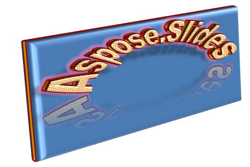

## **概要**

WordArt エフェクトを使用すると、PowerPoint プレゼンテーションに視覚的に魅力的でスタイリッシュなテキストを追加できます。Aspose.Slides を使用すれば、開発者は Office をインストールせずに、Microsoft PowerPoint と同様に WordArt をプログラムから作成、カスタマイズ、管理できます。本記事では、WordArt の概要と、テキスト変形、塗りつぶしスタイル、輪郭、影、その他の書式オプションを適用してプレゼンテーションのコンテンツをより表現豊かで魅力的にする方法を紹介します。WordArt はテキストをグラフィック オブジェクトとして扱うことができ、テキストをより魅力的または目立たせるための効果や特別な修飾から構成されます。

## **シンプルな WordArt テンプレートを作成し、テキストに適用する**

**Using Aspose.Slides**

まず、次の Python コードでシンプルなテキストを作成します。

```python
import jpype
import asposeslides

if not jpype.isJVMStarted():
    jpype.startJVM()

from asposeslides.api import Presentation, ShapeType

presentation = Presentation()
try:
    slide = presentation.getSlides().get_Item(0)
    auto_shape = slide.getShapes().addAutoShape(ShapeType.Rectangle, 200, 200, 400, 200)
    text_frame = auto_shape.getTextFrame()

    portion = text_frame.getParagraphs().get_Item(0).getPortions().get_Item(0)
    portion.setText("Aspose.Slides")
finally:
    presentation.dispose()
```
次に、フォント サイズを大きくして効果を目立たせます。

```python
import jpype
import asposeslides

if not jpype.isJVMStarted():
    jpype.startJVM()

from asposeslides.api import FontData, Presentation, ShapeType

presentation = Presentation()
try:
    slide = presentation.getSlides().get_Item(0)
    auto_shape = slide.getShapes().addAutoShape(ShapeType.Rectangle, 200, 200, 400, 200)
    text_frame = auto_shape.getTextFrame()
    portion = text_frame.getParagraphs().get_Item(0).getPortions().get_Item(0)
    portion.setText("Aspose.Slides")

    font_data = FontData("Arial Black")
    portion_format = portion.getPortionFormat()
    portion_format.setLatinFont(font_data)
    portion_format.setFontHeight(36)
finally:
    presentation.dispose()
```

**Using Microsoft PowerPoint**

Microsoft PowerPoint の WordArt エフェクト メニューに移動します。


右側のメニューから事前定義された WordArt エフェクトを選択できます。左側のメニューから新しい WordArt の設定を指定できます。

利用可能なパラメータまたはオプションの一部は次のとおりです。


**Using Aspose.Slides**

ここでは、テキストに [PatternStyle.SmallGrid](https://reference.aspose.com/slides/ja/python-java/aspose.slides/patternstyle/#SmallGrid) パターン塗りつぶしを適用し、黒いテキスト枠線を追加するコードを示します。

```python
import jpype
import asposeslides

if not jpype.isJVMStarted():
    jpype.startJVM()

from asposeslides.api import FillType, PatternStyle, Presentation, ShapeType
from java.awt import Color

presentation = Presentation()
try:
    slide = presentation.getSlides().get_Item(0)
    auto_shape = slide.getShapes().addAutoShape(ShapeType.Rectangle, 200, 200, 400, 200)
    text_frame = auto_shape.getTextFrame()
    portion = text_frame.getParagraphs().get_Item(0).getPortions().get_Item(0)
    portion.setText("Aspose.Slides")

    portion_format = portion.getPortionFormat()
    portion_format.getFillFormat().setFillType(FillType.Pattern)
    pattern_format = portion_format.getFillFormat().getPatternFormat()
    pattern_format.getForeColor().setColor(Color.ORANGE)
    pattern_format.getBackColor().setColor(Color.WHITE)
    pattern_format.setPatternStyle(PatternStyle.SmallGrid)

    line_format = portion_format.getLineFormat()
    line_format.getFillFormat().setFillType(FillType.Solid)
    line_format.getFillFormat().getSolidFillColor().setColor(Color.BLACK)
finally:
    presentation.dispose()
```

結果のテキスト:


## **他の WordArt エフェクトの適用**

**Using Microsoft PowerPoint**

プログラムのインターフェイスから、テキスト、テキストブロック、図形、または同様の要素にこれらのエフェクトを適用できます。


たとえば、影、反射、光彩エフェクトはテキストに、3D 書式と 3D 回転エフェクトはテキストブロックに、ソフト エッジ エフェクトは図形に適用できます（3D 書式エフェクトが設定されていなくても効果があります）。

### **影エフェクトの適用**

次の Python コードはテキストのみに影エフェクトを適用します。

```python
import jpype
import asposeslides

if not jpype.isJVMStarted():
    jpype.startJVM()

from asposeslides.api import ColorTransformOperation, Presentation, ShapeType
from java.awt import Color

presentation = Presentation()
try:
    slide = presentation.getSlides().get_Item(0)
    auto_shape = slide.getShapes().addAutoShape(ShapeType.Rectangle, 200, 200, 400, 200)
    text_frame = auto_shape.getTextFrame()
    portion = text_frame.getParagraphs().get_Item(0).getPortions().get_Item(0)
    portion.setText("Aspose.Slides")

    portion_format = portion.getPortionFormat()
    portion_format.getEffectFormat().enableOuterShadowEffect()
    outer_shadow = portion_format.getEffectFormat().getOuterShadowEffect()
    outer_shadow.getShadowColor().setColor(Color.BLACK)
    outer_shadow.setScaleHorizontal(100)
    outer_shadow.setScaleVertical(65)
    outer_shadow.setBlurRadius(4.73)
    outer_shadow.setDirection(230)
    outer_shadow.setDistance(2)
    outer_shadow.setSkewHorizontal(30)
    outer_shadow.setSkewVertical(0)
    outer_shadow.getShadowColor().getColorTransform().add(ColorTransformOperation.SetAlpha, 0.32)
finally:
    presentation.dispose()
```

Aspose.Slides API は、[OuterShadow](https://reference.aspose.com/slides/ja/python-java/aspose.slides/outershadow/)、[InnerShadow](https://reference.aspose.com/slides/ja/python-java/aspose.slides/innershadow/)、[PresetShadow](https://reference.aspose.com/slides/ja/python-java/aspose.slides/presetshadow/) の 3 種類の影をサポートしています。

[PresetShadow](https://reference.aspose.com/slides/ja/python-java/aspose.slides/presetshadow/) を使用すると、プリセット値でテキストに影を適用できます。

**Using Microsoft PowerPoint**

PowerPoint では 1 種類の影のみ使用できます。例を示します。


**Using Aspose.Slides**

Aspose.Slides では実際に 2 種類の影を同時に適用できます: [InnerShadow](https://reference.aspose.com/slides/ja/python-java/aspose.slides/innershadow/) と [PresetShadow](https://reference.aspose.com/slides/ja/python-java/aspose.slides/presetshadow/)。

**注意事項:**

- [OuterShadow](https://reference.aspose.com/slides/ja/python-java/aspose.slides/outershadow/) と [PresetShadow](https://reference.aspose.com/slides/ja/python-java/aspose.slides/presetshadow/) を同時に使用すると、[OuterShadow](https://reference.aspose.com/slides/ja/python-java/aspose.slides/outershadow/) のみが適用されます。
- [OuterShadow](https://reference.aspose.com/slides/ja/python-java/aspose.slides/outershadow/) と [InnerShadow](https://reference.aspose.com/slides/ja/python-java/aspose.slides/innershadow/) を同時に使用した場合、適用される効果は PowerPoint のバージョンに依存します。たとえば PowerPoint 2013 では効果が二重になりますが、PowerPoint 2007 では [OuterShadow](https://reference.aspose.com/slides/ja/python-java/aspose.slides/outershadow/) が適用されます。

### **テキストに反射を適用する**

Python (Java) 経由で次のコードサンプルを使用してテキストに反射を追加します。

```python
import jpype
import asposeslides

if not jpype.isJVMStarted():
    jpype.startJVM()

from asposeslides.api import Presentation, RectangleAlignment, ShapeType

presentation = Presentation()
try:
    slide = presentation.getSlides().get_Item(0)
    auto_shape = slide.getShapes().addAutoShape(ShapeType.Rectangle, 200, 200, 400, 200)
    text_frame = auto_shape.getTextFrame()
    portion = text_frame.getParagraphs().get_Item(0).getPortions().get_Item(0)
    portion.setText("Aspose.Slides")

    portion_format = portion.getPortionFormat()
    portion_format.getEffectFormat().enableReflectionEffect()
    reflection = portion_format.getEffectFormat().getReflectionEffect()
    reflection.setBlurRadius(0.5)
    reflection.setDistance(4.72)
    reflection.setStartPosAlpha(0)
    reflection.setEndPosAlpha(60)
    reflection.setDirection(90)
    reflection.setScaleHorizontal(100)
    reflection.setScaleVertical(-100)
    reflection.setStartReflectionOpacity(60)
    reflection.setEndReflectionOpacity(0.9)
    reflection.setRectangleAlign(RectangleAlignment.BottomLeft)
finally:
    presentation.dispose()
```

### **テキストに光彩エフェクトを適用する**

次のコードを使用してテキストに光彩エフェクトを適用し、光らせます。

```python
import jpype
import asposeslides

if not jpype.isJVMStarted():
    jpype.startJVM()

from asposeslides.api import ColorTransformOperation, Presentation, ShapeType

presentation = Presentation()
try:
    slide = presentation.getSlides().get_Item(0)
    auto_shape = slide.getShapes().addAutoShape(ShapeType.Rectangle, 200, 200, 400, 200)
    text_frame = auto_shape.getTextFrame()
    portion = text_frame.getParagraphs().get_Item(0).getPortions().get_Item(0)
    portion.setText("Aspose.Slides")

    portion_format = portion.getPortionFormat()
    portion_format.getEffectFormat().enableGlowEffect()
    glow = portion_format.getEffectFormat().getGlowEffect()
    glow.getColor().setR(jpype.JByte(-1))
    glow.getColor().getColorTransform().add(ColorTransformOperation.SetAlpha, 0.54)
    glow.setRadius(7)
finally:
    presentation.dispose()
```

操作結果:


{}
影、反射、光彩のパラメータは個別に変更できます。各テキスト部分ごとにプロパティが設定されます。
{}

### **WordArt で変形を使用する**

全テキストブロックを変形するには [TextFrameFormat.setTransform](https://reference.aspose.com/slides/ja/python-java/aspose.slides/textframeformat/#setTransform) を使用します。

```python
import jpype
import asposeslides

if not jpype.isJVMStarted():
    jpype.startJVM()

from asposeslides.api import Presentation, ShapeType, TextShapeType

presentation = Presentation()
try:
    slide = presentation.getSlides().get_Item(0)
    auto_shape = slide.getShapes().addAutoShape(ShapeType.Rectangle, 200, 200, 400, 200)
    text_frame = auto_shape.getTextFrame()
    text_frame.setText("Aspose.Slides")

    text_frame.getTextFrameFormat().setTransform(TextShapeType.ArchUpPour)
finally:
    presentation.dispose()
```

結果:


{}
Microsoft PowerPoint と Aspose.Slides for Python via Java の両方で、事前定義された変形タイプがいくつか提供されています。
{}

**Using PowerPoint**

事前定義された変形タイプにアクセスするには、**Format** → **TextEffect** → **Transform** を選択します。

**Using Aspose.Slides**

変形タイプを選択するには、[TextShapeType](https://reference.aspose.com/slides/ja/python-java/aspose.slides/textshapetype/) 列挙型を使用します。

### **テキストと図形に 3D エフェクトを適用する**

次のサンプルコードでテキスト形状に 3D エフェクトを適用します。

```python
import jpype
import asposeslides

if not jpype.isJVMStarted():
    jpype.startJVM()

from asposeslides.api import BevelPresetType, CameraPresetType, LightRigPresetType, LightingDirection, MaterialPresetType, Presentation, ShapeType
from java.awt import Color

presentation = Presentation()
try:
    slide = presentation.getSlides().get_Item(0)
    auto_shape = slide.getShapes().addAutoShape(ShapeType.Rectangle, 200, 200, 400, 200)
    auto_shape.getTextFrame().setText("Aspose.Slides")

    three_d_format = auto_shape.getThreeDFormat()
    three_d_format.getBevelBottom().setBevelType(BevelPresetType.Circle)
    three_d_format.getBevelBottom().setHeight(10.5)
    three_d_format.getBevelBottom().setWidth(10.5)

    three_d_format.getBevelTop().setBevelType(BevelPresetType.Circle)
    three_d_format.getBevelTop().setHeight(12.5)
    three_d_format.getBevelTop().setWidth(11)

    three_d_format.getExtrusionColor().setColor(Color.ORANGE)
    three_d_format.setExtrusionHeight(6)

    three_d_format.getContourColor().setColor(Color.RED)
    three_d_format.setContourWidth(1.5)

    three_d_format.setDepth(3)

    three_d_format.setMaterial(MaterialPresetType.Plastic)

    three_d_format.getLightRig().setDirection(LightingDirection.Top)
    three_d_format.getLightRig().setLightType(LightRigPresetType.Balanced)
    three_d_format.getLightRig().setRotation(0, 0, 40)

    three_d_format.getCamera().setCameraType(CameraPresetType.PerspectiveContrastingRightFacing)
finally:
    presentation.dispose()
```

結果のテキストと形状:


次の Python コードでテキストに 3D エフェクトを適用します。

```python
import jpype
import asposeslides

if not jpype.isJVMStarted():
    jpype.startJVM()

from asposeslides.api import BevelPresetType, CameraPresetType, LightRigPresetType, LightingDirection, MaterialPresetType, Presentation, ShapeType
from java.awt import Color

presentation = Presentation()
try:
    slide = presentation.getSlides().get_Item(0)
    auto_shape = slide.getShapes().addAutoShape(ShapeType.Rectangle, 200, 200, 400, 200)
    text_frame = auto_shape.getTextFrame()
    text_frame.setText("Aspose.Slides")

    three_d_format = text_frame.getTextFrameFormat().getThreeDFormat()
    three_d_format.getBevelBottom().setBevelType(BevelPresetType.Circle)
    three_d_format.getBevelBottom().setHeight(3.5)
    three_d_format.getBevelBottom().setWidth(3.5)

    three_d_format.getBevelTop().setBevelType(BevelPresetType.Circle)
    three_d_format.getBevelTop().setHeight(4)
    three_d_format.getBevelTop().setWidth(4)

    three_d_format.getExtrusionColor().setColor(Color.ORANGE)
    three_d_format.setExtrusionHeight(6)

    three_d_format.getContourColor().setColor(Color.RED)
    three_d_format.setContourWidth(1.5)

    three_d_format.setDepth(3)

    three_d_format.setMaterial(MaterialPresetType.Plastic)

    three_d_format.getLightRig().setDirection(LightingDirection.Top)
    three_d_format.getLightRig().setLightType(LightRigPresetType.Balanced)
    three_d_format.getLightRig().setRotation(0, 0, 40)

    three_d_format.getCamera().setCameraType(CameraPresetType.PerspectiveContrastingRightFacing)
finally:
    presentation.dispose()
```

操作結果:



{}
テキストまたはその形状への 3D エフェクトの適用およびエフェクト間の相互作用は、特定の規則に基づきます。

テキストとそのテキストを含む形状のシーンを考慮します。3D エフェクトは 3D オブジェクトの表現と、オブジェクトが配置されるシーンを含みます。

- 形状とテキストの両方にシーンが設定されている場合、形状のシーンが優先され、テキストのシーンは無視されます。
- 形状に独自のシーンがなく 3D 表現がある場合、テキストのシーンが使用されます。
- それ以外の場合（形状に 3D エフェクトがまったくない場合）、形状は平面になり、3D エフェクトはテキストのみに適用されます。

これらの規則は [ThreeDFormat.getLightRig](https://reference.aspose.com/slides/ja/python-java/aspose.slides/threedformat/#getLightRig) と [ThreeDFormat.getCamera](https://reference.aspose.com/slides/ja/python-java/aspose.slides/threedformat/#getCamera) メソッドに関係します。
{}

## **テキストに外側影エフェクトを適用する**

Aspose.Slides for Python via Java は、[OuterShadow](https://reference.aspose.com/slides/ja/python-java/aspose.slides/outershadow/) と [InnerShadow](https://reference.aspose.com/slides/ja/python-java/aspose.slides/innershadow/) クラスを提供し、[TextFrame](https://reference.aspose.com/slides/ja/python-java/aspose.slides/textframe/) 内のテキストに影エフェクトを適用できます。手順は次のとおりです。

1. [Presentation](https://reference.aspose.com/slides/ja/python-java/aspose.slides/presentation/) クラスのインスタンスを作成します。  
2. インデックスを使用してスライドへの参照を取得します。  
3. スライドに長方形の形状を追加します。  
4. 形状に関連付けられたテキストフレームにアクセスします。  
5. 形状の塗りつぶしを無効にします。  
6. 外側影エフェクトを有効にします。  
7. 影のぼかし半径を設定します。  
8. 影の方向を設定します。  
9. 影の距離を設定します。  
10. 影を左上に揃えます。  
11. 影の色を黒に設定します。  
12. プレゼンテーションを [PPTX](https://docs.fileformat.com/presentation/pptx/) ファイルとして書き出します。

上記手順の実装例である Python (Java) サンプルコードは、テキストに外側影エフェクトを適用する方法を示しています。

```python
import jpype
import asposeslides

if not jpype.isJVMStarted():
    jpype.startJVM()

from asposeslides.api import FillType, Presentation, PresetColor, RectangleAlignment, SaveFormat, ShapeType

presentation = Presentation()
try:
    # スライドの参照を取得
    slide = presentation.getSlides().get_Item(0)

    # 矩形タイプの AutoShape を追加
    auto_shape = slide.getShapes().addAutoShape(ShapeType.Rectangle, 150, 75, 150, 50)

    # 矩形に TextFrame を追加
    auto_shape.addTextFrame("Aspose TextBox")

    # テキストの影を取得したい場合に備えて形状の塗りつぶしを無効化
    auto_shape.getFillFormat().setFillType(FillType.NoFill)

    # 外側影を追加し、必要なすべてのパラメータを設定
    auto_shape.getEffectFormat().enableOuterShadowEffect()
    shadow = auto_shape.getEffectFormat().getOuterShadowEffect()
    shadow.setBlurRadius(4.0)
    shadow.setDirection(45)
    shadow.setDistance(3)
    shadow.setRectangleAlign(RectangleAlignment.TopLeft)
    shadow.getShadowColor().setPresetColor(PresetColor.Black)

    # プレゼンテーションをディスクに保存
    presentation.save("pres_out.pptx", SaveFormat.Pptx)
finally:
    presentation.dispose()
```

## **形状に内側影エフェクトを適用する**

手順は次のとおりです。

1. [Presentation](https://reference.aspose.com/slides/ja/python-java/aspose.slides/presentation/) クラスのインスタンスを作成します。  
2. スライドへの参照を取得します。  
3. 長方形の形状を追加します。  
4. 内側影エフェクトを有効にします。  
5. 必要なパラメータをすべて設定します。  
6. 影の色種別をテーマカラーに設定します。  
7. テーマカラーを指定します。  
8. プレゼンテーションを [PPTX](https://docs.fileformat.com/presentation/pptx/) ファイルとして書き出します。

以下のサンプルコード（上記手順に基づく）は、Python via Java で形状内のテキストに内側影エフェクトを適用する方法を示しています。

```python
import jpype
import asposeslides

if not jpype.isJVMStarted():
    jpype.startJVM()

from asposeslides.api import ColorType, FillType, Presentation, SaveFormat, SchemeColor, ShapeType

presentation = Presentation()
try:
    # スライドの参照を取得
    slide = presentation.getSlides().get_Item(0)

    # 矩形タイプの AutoShape を追加
    auto_shape = slide.getShapes().addAutoShape(ShapeType.Rectangle, 150, 75, 400, 300)
    auto_shape.getFillFormat().setFillType(FillType.NoFill)

    # 矩形に TextFrame を追加
    auto_shape.addTextFrame("Aspose TextBox")
    portion = auto_shape.getTextFrame().getParagraphs().get_Item(0).getPortions().get_Item(0)
    portion_format = portion.getPortionFormat()
    portion_format.setFontHeight(50)

    # InnerShadowEffect を有効化
    effect_format = portion_format.getEffectFormat()
    effect_format.enableInnerShadowEffect()

    # 必要なすべてのパラメータを設定
    inner_shadow = effect_format.getInnerShadowEffect()
    inner_shadow.setBlurRadius(8.0)
    inner_shadow.setDirection(90.0)
    inner_shadow.setDistance(6.0)
    inner_shadow.getShadowColor().setB(jpype.JByte(-67))

    # ColorType を Scheme に設定
    inner_shadow.getShadowColor().setColorType(ColorType.Scheme)

    # スキーム カラーを設定
    inner_shadow.getShadowColor().setSchemeColor(SchemeColor.Accent1)

    # プレゼンテーションを保存
    presentation.save("WordArt_out.pptx", SaveFormat.Pptx)
finally:
    presentation.dispose()
```

## **FAQ**

**異なるフォントやスクリプト（例: アラビア語、中文）で WordArt エフェクトを使用できますか？**

はい、Aspose.Slides は Unicode をサポートし、主要なフォントとスクリプトすべてで動作します。影、塗りつぶし、輪郭などの WordArt エフェクトは言語に関係なく適用できますが、フォントの可用性とレンダリングはシステムにインストールされているフォントに依存する場合があります。

**スライド マスター要素に WordArt エフェクトを適用できますか？**

はい、マスタースライド上の図形（タイトル プレースホルダー、フッター、背景テキストなど）に WordArt エフェクトを適用できます。マスター レイアウトへの変更は、関連付けられたすべてのスライドに反映されます。

**WordArt エフェクトはプレゼンテーション ファイルのサイズに影響しますか？**

わずかに影響します。影、光彩、グラデーション 塗りつぶしなどのエフェクトは、追加の書式メタデータによりファイルサイズを若干増加させる可能性がありますが、差は通常無視できる程度です。

**プレゼンテーションを保存せずに WordArt エフェクトの結果をプレビューできますか？**

はい、[Shape.getImage](https://reference.aspose.com/slides/ja/python-java/aspose.slides/shape/#getImage) や [Slide.getImage](https://reference.aspose.com/slides/ja/python-java/aspose.slides/slide/#getImage) を使用して、WordArt を含むスライドを画像 (PNG、JPEG など) にレンダリングできます。これにより、保存またはエクスポートする前にメモリ上または画面上で結果をプレビューできます。