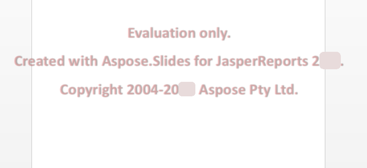

{} 

Aspose.Slides for JasperReports is available as a free time unlimited evaluation from the [download page](https://downloads.aspose.com/slides/jasperreport). The evaluation and licensed versions of the product is the same download.

When you are happy with the evaluation, [buy a license](https://purchase.aspose.com/default.aspx). Make sure you understand and agree to the subscription terms.

The license is available for download from the order page after the order has been paid for. The license is a clear text, digitally signed XML file which contains information such as the client name, the purchased product and the license type. Do not modify the content of the license file in any way: doing so invalidates the license.

Download the license to your computer and copy it to the appropriate folder (for example your application folder or **JasperReports\lib**).

## **Evaluation Version Limitation**
Evaluation version of Aspose.Slides (without a license specified) provides full product functionality, but (when you save your presentations) it injects an evaluation watermark at the center of each slide as shown in the figure below:

 

## **Applying a License**
There are several ways to apply a license, depending on whether you're working on JasperReports, or JasperServer.

### **Applying a License for JasperReports**
Use a direct setLicense method call similar to Aspose.Slides for Java.

```java
import com.aspose.slides.jasperreports.License;

..... 

try {
    //Create a stream object containing the license file
    FileInputStream fstream=new FileInputStream("Aspose.Slides.JasperReports.Developer.lic");
	
    //Instantiate the License class
    License license = new License();
	
    //Set the license through the stream object
    license.setLicense(fstream);
} catch(Exception ex) {
    System.out.println(ex.toString());
}
```

Or, set the exporter parameter in the code.

```java
ASPptExporter exporter = new ASPptExporter (); 
exporter.setParameter(ASExporterParameters.PPT_LICENSE, "Aspose.Slides.JasperReports.Developer.lic");
exporter.exportReport();
```

### **Applying a License on JasperServer**
Set the exporter parameter in the applicationContext.xml.

``` xml
<bean id="asExportParametersBean" class="com.aspose.slides.jasperreports.ASExportParametersBean">
    <property name="licenseFile" value="C:/jasperserver-3.0/apache-tomcat/webapps/jasperserver/WEB-INF/Aspose.Slides.JasperReports.Developer.lic"/>
</bean>
```
