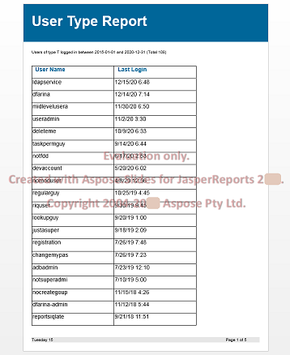

{} 


## **Welcome to the Aspose.Slides for JasperReports documentation!**
Aspose.Slides for JasperReports is a library specially designed and developed for developers who need to easily export reports from JasperReports to Microsoft PowerPoint Presentation (PPT) and Microsoft PowerPoint Show (PPS) formats in their Java applications. All report features are converted with the highest degree of precision to Microsoft PowerPoint presentations. Aspose.Slides for JasperReports includes support for JasperReports 5+.

{} 

## **Product Description**
[JasperReports](http://jasperforge.org/sf/projects/jasperreports) and JasperServer do not have built-in abilities to export reports as Microsoft PowerPoint presentations, but Aspose.Slides for JasperReports, gives you access to two additional export formats: 

- PPT – PowerPoint Presentation via Aspose.Slides
- PPS - PowerPoint Show via Aspose.Slides
- PPTX – PowerPoint Presentation via Aspose.Slides
- PPSX - PowerPoint Show via Aspose.Slides

Aspose.Slides for JasperReports internally uses our 100% pure Java libraries Aspose.Slides for Java and Aspose.Metafiles for Java, world-class libraries for server-side presentations and metafiles processing.

Aspose.Slides for JasperReports makes it possible to export any report in PPT or PPS format.

### **Output Example**
The ASPptExporter class extends the ASAbstractExporter class so it can be used in the same way as any other standard exporters. This short example shows typical code and screenshot of a report viewed in MS PowerPoint. Detailed examples can be found in the provided demo reports. 

``` java
File sourceFile = new File(fileName); 
JasperPrint jasperPrint = (JasperPrint)JRLoader.loadObject(sourceFile);
File destFile = new File(sourceFile.getParent(), jasperPrint.getName() + ".ppt");
ASPptExporter exporter = new ASPptExporter();
exporter.setParameter(JRExporterParameter.JASPER_PRINT, jasperPrint);
exporter.setParameter(JRExporterParameter.OUTPUT_FILE_NAME, destFile.toString());
exporter.exportReport();
```

**Presentation generated with JasperReports xmldatasource demo** 


