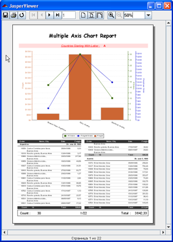
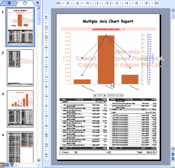
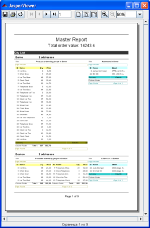
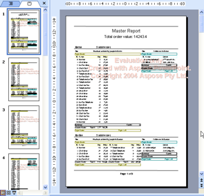

{} 

Aspose.Slides for JasperReports exports reports as Microsoft PowerPoint presentations in such a way that they look identical to reports exported by the built-in exporters of [JasperReports](http://jasperforge.org/sf/projects/jasperreports). 

{} 

|**MultipleAxisChartReport from Charts demo, rendered by JasperReports built-in report viewer** |**MultipleAxisChartReport from Charts demo, exported to a PPT presentation by Aspose.Slides for JasperReports** |
| :- | :- |
|||
|**MasterReport from SubReports demo, rendered by JasperReports built-in report viewer** |**MasterReport from SubReports demo, exported to a PPT presentation by Aspose.Slides for JasperReports** |
|||

