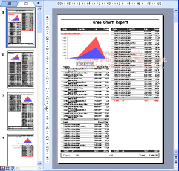

{} 

[JasperReports](http://jasperforge.org/sf/projects/jasperreports) and JasperServer do not have built-in abilities to export reports as Microsoft PowerPoint presentations, but with Aspose.Slides for JasperReports, you get access to additional export formats:

- Microsoft PowerPoint Presentation (PPT)
- Microsoft PowerPoint Presentation (PPTX)
- HTML
- PDF

{} 

To create documents in these formats, Aspose.Slides for JasperReports relies on a built-in version of [Aspose.Slides for Java](http://www.aspose.com/categories/java-components/aspose.slides-for-java/default.aspx), the market leading presentation-processing library from Aspose. Microsoft PowerPoint is not used to generate the documents.

**A sample report exported as a Microsoft PowerPoint (PPT) presentation** 

**A sample report exported as a Microsoft PowerPoint presentation (PPTX)** 

