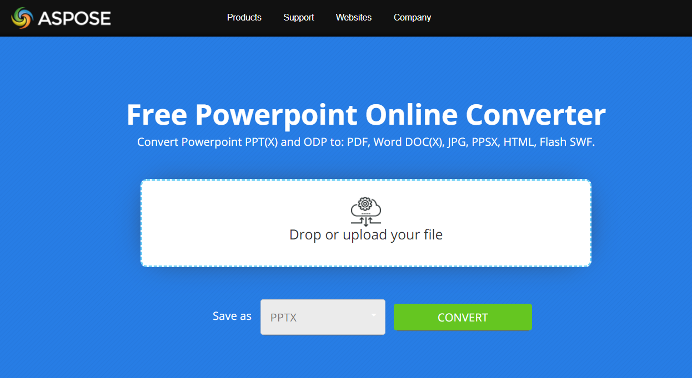

## **About PowerPoint to JPG Conversion**
With [**Aspose.Slides API**](https://products.aspose.com/slides/java) you can convert PowerPoint PPT or PPTX presentation to JPG image. It is also possible to convert PPT/PPTX to JPEG, PNG or SVG. With this features it's easy to implement your own presentation viewer, create  the thumbnail for every slide. This may be useful if you want to protect presentation slides from copywriting, demonstrate presentation in read-only mode. Aspose.Slides allows to convert the whole presentation or a certain slide into image formats. 

{} 

To see how Aspose.Slides API converts PPT/PPTX to JPG, you may try [**Aspose.Slides Converter**](https://products.aspose.app/slides/conversion) online free app:

[](https://products.aspose.app/slides/conversion)

{} 

## **Convert PowerPoint PPT/PPTX to JPG**
Here are the steps to convert PPT/PPTX to JPG:

- Create an instance of [Presentation](https://apireference.aspose.com/slides/java/com.aspose.slides/Presentation) type.
- Get the slide object of [ISlide](https://apireference.aspose.com/slides/java/com.aspose.slides/ISlide) type from [Presentation.getSlides()](https://apireference.aspose.com/slides/java/com.aspose.slides/Presentation#getSlides--) collection.
- Create the thumbnail of each slide and then convert it into JPG. [**ISlide.getThumbnail(float scaleX, float scaleY)**](https://apireference.aspose.com/slides/java/com.aspose.slides/ISlide#getThumbnail-float-float-) method is used to get a thumbnail of a slide, it returns [BufferedImage](https://docs.oracle.com/javase/7/docs/api/java/awt/image/BufferedImage.html) object as a result. [getThumbnail](https://apireference.aspose.com/slides/java/com.aspose.slides/ISlide#getThumbnail-com.aspose.slides.IRenderingOptions-float-float-) method has to be called from the needed slide of [ISlide](https://apireference.aspose.com/slides/java/com.aspose.slides/ISlide) type, the scales of the resulting thumbnail are passed into the method.
- After you get the slide thumbnail, call [**ImageIO.write(RenderedImage im, String formatName, File output)**](https://docs.oracle.com/javase/7/docs/api/javax/imageio/ImageIO.html#write(java.awt.image.RenderedImage,%20java.lang.String,%20java.io.File)) method from the thumbnail object. Pass the resulting file name and the image format into it. 

{}

**Note**: PPT/PPTX to JPG conversion differs from the conversion to other types in Aspose.Slides API. For other types, you usually use [**IPresentation.Save(String fname, int format, ISaveOptions options)**](https://apireference.aspose.com/slides/java/com.aspose.slides/IPresentation#save-java.lang.String-int-com.aspose.slides.ISaveOptions-) method, but here you need [**ImageIO.write(RenderedImage im, String formatName, File output)**](https://docs.oracle.com/javase/7/docs/api/javax/imageio/ImageIO.html#write(java.awt.image.RenderedImage,%20java.lang.String,%20java.io.File)) method.

{} 

```java
Presentation pres = new Presentation("PowerPoint-Presentation.pptx");
try {
    for (ISlide sld : pres.getSlides()) {
        // Create a full scale image
        BufferedImage bmp = sld.getThumbnail(1f, 1f);

        // Save the image to disk in JPEG format
        ImageIO.write(bmp, "JPEG", new java.io.File(String.format("Slide_%d.jpg", sld.getSlideNumber())));
    }
} catch (IOException e) {
} finally {
    if (pres != null) pres.dispose();
}
```

## **Convert PowerPoint PPT/PPTX to JPG with Customized Dimensions**
To change the dimension of the resulting thumbnail and JPG image, you can set the *ScaleX* and *ScaleY* for it. To do that, pass *ScaleX* and *ScaleY* values into [**ISlide.getThumbnail(float scaleX, float scaleY)**](https://apireference.aspose.com/slides/java/com.aspose.slides/ISlide#getThumbnail-float-float-) method:

```java
Presentation pres = new Presentation("PowerPoint-Presentation.pptx");
try {
    // Define dimensions
    int desiredX = 1200;
    int desiredY = 800;
    // Get scaled values of X and Y
    float ScaleX = (float) (1.0 / pres.getSlideSize().getSize().getWidth()) * desiredX;
    float ScaleY = (float) (1.0 / pres.getSlideSize().getSize().getHeight()) * desiredY;

    for (ISlide sld : pres.getSlides())
    {
        // Create a full scale image
        BufferedImage bmp = sld.getThumbnail(ScaleX, ScaleY);

        // Save the image to disk in JPEG format
        ImageIO.write(bmp, "JPEG", new java.io.File(String.format("Slide_%d.jpg", sld.getSlideNumber())));
    }
} catch (IOException e) {
} finally {
    if (pres != null) pres.dispose();
}
```

## **Render Comments when saving Presentation into Image**
Aspose.Slides for Java provides a facility to render comments of presentations or slide when converting those into images. An example is given below that shows how to render comments of presentation into an image.

```java
Presentation pres = new Presentation("presentation.pptx");
try {
    IRenderingOptions opts = new RenderingOptions();
    opts.getNotesCommentsLayouting().setNotesPosition(NotesPositions.BottomTruncated);

    for (ISlide sld : pres.getSlides()) {
        BufferedImage image = new BufferedImage(740, 960, BufferedImage.TYPE_INT_ARGB);
        java.awt.Graphics graphics = image.createGraphics();
        try {

            pres.getSlides().get_Item(0).renderToGraphics(opts, (Graphics2D) graphics);
        } finally {
            if (graphics != null) graphics.dispose();
        }
        ImageIO.write(image,"png", new java.io.File(String.format("Slide_%d.png", sld.getSlideNumber())));
    }
} catch (IOException e) {
} finally {
    if (pres != null) pres.dispose();
}
```

## **See also**
See other options to convert PPT/PPTX into image, like:

- [PPT/PPTX to SVG conversion](/slides/java/presentation-viewer/)