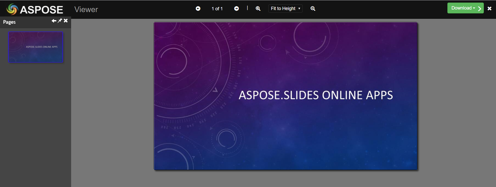

## **About PowerPoint to PDF Conversion**
[**Aspose.Slides**](https://products.aspose.com/slides/java) allows converting PowerPoint PPT, PPTX and OpenOffice ODP formats to PDF. To convert the presentation to PDF simply pass the file name and save format to the [**Presentation.Save**](How is the game going?) method. The [**Presentation**](https://apireference.aspose.com/slides/java/com.aspose.slides/Presentation) class exposes the [**Save**](https://apireference.aspose.com/slides/java/com.aspose.slides/Presentation#save-java.lang.String-int-com.aspose.slides.ISaveOptions-) method that can be called to convert the whole PPT, PPTX or ODP presentation into a PDF document. The [**PdfOptions**](https://apireference.aspose.com/slides/java/com.aspose.slides/PdfOptions) class provides options for creating the PDF such as **JpegQuality**, **TextCompression**, **Compliance** and others. These options can be used to get the desired standard of PDF.

**Note**: Aspose.Slides for Java directly writes the information about API and Version Number in output documents. For example, upon rendering Document to PDF, Aspose.Slides for Java populates Application field with value 'Aspose.Slides' and PDF Producer field with a value, e.g 'Aspose.Slides v 17.10'. Please note that you cannot instruct Aspose.Slides for Java to change or remove this information from output Documents.

{} 

Try **free online demo apps** to test [**PPT to PDF**](https://products.aspose.app/slides/conversion/ppt-to-pdf), [**PPTX to PDF**](https://products.aspose.app/slides/conversion/pptx-to-pdf), [**ODP to PDF** ](https://products.aspose.app/slides/conversion/odp-to-pdf)feature by Aspose.

{} 

Aspose.Slides for Java exports the presentation documents to PDF and make it looking similar to the original presentation document. Aspose.Slides supports to render any elements of presentation document while converting to PDF:

- Images, Text Boxes and other Shapes
- Text and Formatting
- Paragraphs and Formatting
- Hyperlinks
- Headers and Footers
- Bullets
- Tables

Furthermore, you can customize the presentation to PDF export with different options explained in this topic.

With Aspose.Slides you are able to set the options of PPT(X) to PDF conversion and change it in a flexible way:

- Convert the whole PPT(X) presentation to PDF.
- Convert separate slides of PPT(X) to PDF.
- Convert PPT(X) to PDF with default settings. To simplify PPT(X) to PDF conversion process for you, Aspose.Slides choose the optimal conversion settings that you are to required to define them all.
- Convert PPT(X) to PDF with custom settings. Change PDF file standard, set text compression level, choose the quality of JPEG images inside PDF document.
- Convert PPT(X) to PDF with hidden slides included.
- Set access permissions of the resulting PDF document. For example, you may convert PPT(X) to a password protected PDF. This way it's easy to protect the resulting PDF document from copying and editing.
- Convert PPT(X) to PDF with speaker notes included. Additionally, it's possible to define how speaker notes should be rendered into PDF.
- Convert PPT(X) to PDF with comments included. It's also possible to define comments rendering rules.
- Export presentation metafiles to PNGs, while converting PPT(X) to PDF.
- Choose font settings of PPT(X) to PDF conversion process. The API allows to save the original fonts of the presentation during conversion. Otherwise, it's possible to define the substitution fonts and rules. 


Aspose.Slides allows to convert PPT(X) presentation to PDF document with a maximum quality:

|<p>**Input PPT:**</p><p></p>|<p>**Output PDF:**</p><p></p>|
| :- | :- |

## **Convert PowerPoint to PDF with Default Options**
The following example shows how to convert PowerPoint PPT, PPTX and OpenOffice ODP document into a PDF document using the default options. The default options create a PDF document of maximum quality.

```java
// Instantiate a Presentation object that represents a PPT file
Presentation pres = new Presentation("PowerPoint.ppt");
try {
// Save the presentation as PDF
    pres.save("PPT-to-PDF.pdf", SaveFormat.Pdf);
} finally {
    if (pres != null) pres.dispose();
}
```

## **Convert PowerPoint to PDF with Custom Options**
The following example shows how to convert PowerPoint PPT, PPTX and OpenOffice ODP into a PDF document with customized options as provided by the [**PdfOptions**](https://apireference.aspose.com/slides/java/com.aspose.slides/PdfOptions) class. It sets the JPEG quality, saves metafiles to PNG, sets text compression level with [**PdfTextCompression**](https://apireference.aspose.com/slides/java/com.aspose.slides/PdfTextCompression) enumeration and sets PDF standard.

```java
// Instantiate a Presentation object that represents a PPTX file
Presentation pres = new Presentation("PowerPoint.pptx");
try {
    // Instantiate the PdfOptions class
    PdfOptions pdfOptions = new PdfOptions();

    // Set Jpeg quality
    pdfOptions.setJpegQuality((byte)90);

    // Set behavior for metafiles
    pdfOptions.setSaveMetafilesAsPng(true);

    // Set text compression level
    pdfOptions.setTextCompression(PdfTextCompression.Flate);

    // Define the PDF standard
    pdfOptions.setCompliance(PdfCompliance.Pdf15);

    // Save the presentation as PDF
    pres.save("PowerPoint-to-PDF.pdf", SaveFormat.Pdf, pdfOptions);
} finally {
    if (pres != null) pres.dispose();
}
```

## **Convert PowerPoint to PDF with Hidden Slides Included**
The following example shows how to convert PowerPoint PPT, PPTX and OpenOffice ODP into a PDF document with hidden slides included as provided by the [**PdfOptions**](https://apireference.aspose.com/slides/java/com.aspose.slides/PdfOptions) class. You can also include comments in generated HTML by using [**PdfOptions**](https://apireference.aspose.com/slides/java/com.aspose.slides/PdfOptions) class. 
It sets the ShowHiddenSlides property to generated PDF with hidden slides. 
Methods [**setShowHiddenSlides**](https://apireference.aspose.com/slides/java/com.aspose.slides/IPdfOptions#setShowHiddenSlides-boolean-) and [**getShowHiddenSlides**](https://apireference.aspose.com/slides/java/com.aspose.slides/IPdfOptions#getShowHiddenSlides--) have been added to [**IHtmlOptions**](https://apireference.aspose.com/slides/java/com.aspose.slides/IHtmlOptions), [**IPdfOption**](https://apireference.aspose.com/slides/java/com.aspose.slides/IPdfOptions), [**ISwfOptions**](https://apireference.aspose.com/slides/java/com.aspose.slides/ISwfOptions), 
[**ITiffOptions**](https://apireference.aspose.com/slides/java/com.aspose.slides/ITiffOptions), [**IXpsOptions**](https://apireference.aspose.com/slides/java/com.aspose.slides/IXpsOptions) interfaces and [**HtmlOptions**](https://apireference.aspose.com/slides/java/com.aspose.slides/HtmlOptions), 
[**PdfOptions**](https://apireference.aspose.com/slides/java/com.aspose.slides/PdfOptions), [**SwfOptions**](https://apireference.aspose.com/slides/java/com.aspose.slides/SwfOptions), [**TiffOptions**](https://apireference.aspose.com/slides/java/com.aspose.slides/TiffOptions), [**XpsOptions**](https://apireference.aspose.com/slides/java/com.aspose.slides/XpsOptions) classes. 
This property specifies whether the exported document should include hidden slides or not. 
Default value is **"false"**.

```java
// Instantiate a Presentation object that represents a PPTX file
Presentation pres = new Presentation("PowerPoint.pptx");
try {
    // Instantiate the PdfOptions class
    PdfOptions pdfOptions = new PdfOptions();

    // Include hidden slides
    pdfOptions.setShowHiddenSlides(true);

    // Save the presentation as PDF
    pres.save("PowerPoint-to-PDF.pdf", SaveFormat.Pdf, pdfOptions);
} finally {
    if (pres != null) pres.dispose();
}
```

## **Convert PowerPoint to Password Protected PDF**
The following example shows how to convert a presentation to a password protected PDF document with customized options as provided by the [**PdfOptions**](https://apireference.aspose.com/slides/java/com.aspose.slides/PdfOptions) class.

```java
// Instantiate a Presentation object that represents a PPTX file
Presentation pres = new Presentation("PowerPoint.pptx");
try {
    /// Instantiate the PdfOptions class
    PdfOptions pdfOptions = new PdfOptions();
    
    // Setting PDF password and access permissions
    pdfOptions.setPassword("password");
    pdfOptions.setAccessPermissions(PdfAccessPermissions.PrintDocument | PdfAccessPermissions.HighQualityPrint);
    
    // Save the presentation as PDF
    pres.save("PPTX-to-PDF-password.pdf", SaveFormat.Pdf, pdfOptions);
} finally {
    if (pres != null) pres.dispose();
}
```

## **Convert Selected Slides of PowerPoint to PDF**
The following example shows how to convert a specific presentation slide to a PDF document with custom options.

```java
// Instantiate a Presentation object that represents a PPTX file
Presentation pres = new Presentation("PowerPoint.pptx");
try {
    // Setting array of slides positions
    int[] slides = { 1, 3 };
    
    // Save the presentation as PDF
    pres.save("PPTX-to-PDF.pdf", slides, SaveFormat.Pdf);
} finally {
    if (pres != null) pres.dispose();
}
```

