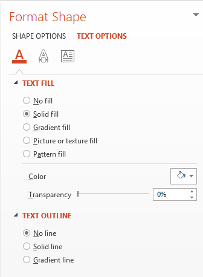
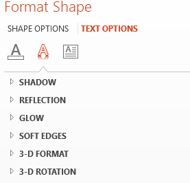
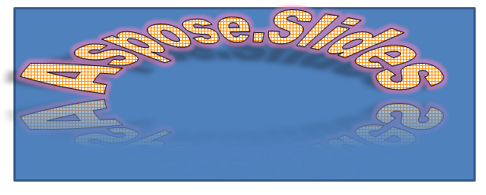

## **About WordArt?**
WordArt or Word Art is a feature that allows you to apply effects to texts to make them stand out. With WordArt, for example, you can outline a text or fill it with a color (or gradient), add 3D effects to it, etc. You also get to skew, bend, and stretch the shape of a text. 

{} 

WordArt allows you to treat a text as you would a graphical object. In general, WordArt consists of effects or special modifications made to texts to make them more attractive or noticeable. 

{} 

**WordArt in Microsoft PowerPoint**

To use WordArt in Microsoft PowerPoint, you have to select one of the predefined WordArt templates. A WordArt template is a set of effects that gets applied to a text or its shape. 

**WordArt in Aspose.Slides**

In Aspose.Slides for Java 20.10, we implemented support for WordArt and made improvements to the feature in subsequent Aspose.Slides for Java releases. 

With Aspose.Slides for Java, you can easily create your own WordArt template (one effect or combination of effects) in Java and apply it to texts. 

## Creating a Simple WordArt Template and Applying It to a Text

**Using Aspose.Slides** 

First, we create a simple text using this Java code: 

``` java
Presentation pres = new Presentation();
try {
    ISlide slide = pres.getSlides().get_Item(0);
    IAutoShape autoShape = slide.getShapes().addAutoShape(ShapeType.Rectangle, 200, 200, 400, 200);
    ITextFrame textFrame = autoShape.getTextFrame();

    Portion portion = (Portion)textFrame.getParagraphs().get_Item(0).getPortions().get_Item(0);
    portion.setText("Aspose.Slides");
} finally {
    if (pres != null) pres.dispose();
}
```
Now, we set the text’s font height to a bigger value to make the effect more noticeable through this code:

``` java 
FontData fontData = new FontData("Arial Black");
portion.getPortionFormat().setLatinFont(fontData);
portion.getPortionFormat().setFontHeight(36);
```

**Using Microsoft PowerPoint**

Go to the WordArt effects menu in Microsoft PowerPoint:


From the menu on the right, you can choose a predefined WordArt effect. From the menu on the left, you can specify the settings for a new WordArt. 

These are some of the available parameters or options:



**Using Aspose.Slides**

Here, we apply the [SmallGrid](https://apireference.aspose.com/slides/java/com.aspose.slides/PatternStyle#SmallGrid) pattern color to the text and add a 1-width black text border using this code:

``` java 
portion.getPortionFormat().getFillFormat().setFillType(FillType.Pattern);
portion.getPortionFormat().getFillFormat().getPatternFormat().getForeColor().setColor(Color.ORANGE);
portion.getPortionFormat().getFillFormat().getPatternFormat().getBackColor().setColor(Color.WHITE);
portion.getPortionFormat().getFillFormat().getPatternFormat().setPatternStyle(PatternStyle.SmallGrid);

portion.getPortionFormat().getLineFormat().getFillFormat().setFillType(FillType.Solid);
portion.getPortionFormat().getLineFormat().getFillFormat().getSolidFillColor().setColor(Color.BLACK);
```

The resulting text:


## Applying Other WordArt Effects

**Using Microsoft PowerPoint**

From the program’s interface, you can apply these effects to a text, text block, shape, or similar element:



For example, Shadow, Reflection, and Glow effects can be applied to a text; 3D Format and 3D Rotation effects can be applied to a text block; Soft Edges property can be applied to a Shape Object (it still has an effect when no 3D Format property is set). 

### Applying Shadow Effects

Here, we intend to set the properties relating to a text only. We apply the shadow effect to a text using this code in Java:

``` java
portion.getPortionFormat().getEffectFormat().enableOuterShadowEffect();
portion.getPortionFormat().getEffectFormat().getOuterShadowEffect().getShadowColor().setColor(Color.BLACK);
portion.getPortionFormat().getEffectFormat().getOuterShadowEffect().setScaleHorizontal(100);
portion.getPortionFormat().getEffectFormat().getOuterShadowEffect().setScaleVertical(65);
portion.getPortionFormat().getEffectFormat().getOuterShadowEffect().setBlurRadius(4.73);
portion.getPortionFormat().getEffectFormat().getOuterShadowEffect().setDirection(230);
portion.getPortionFormat().getEffectFormat().getOuterShadowEffect().setDistance(2);
portion.getPortionFormat().getEffectFormat().getOuterShadowEffect().setSkewHorizontal(30);
portion.getPortionFormat().getEffectFormat().getOuterShadowEffect().setSkewVertical(0);
portion.getPortionFormat().getEffectFormat().getOuterShadowEffect().getShadowColor().getColorTransform().add(ColorTransformOperation.SetAlpha, 0.32f);
```

Aspose.Slides API supports three types of shadows: OuterShadow, InnerShadow, and PresetShadow. 

With PresetShadow, you can apply a shadow for a text (using preset values). 

**Using Microsoft PowerPoint**

In PowerPoint, you can use one type of shadow. Here’s an example:


**Using Aspose.Slides**

Aspose.Slides actually allows you to apply two types of shadows at once: InnerShadow and PresetShadow.

**Notes:**

- When OuterShadow and PresetShadow are used together, only the OuterShadow effect gets applied. 
- If OuterShadow and InnerShadow get used simultaneously, the resulting or applied effect depends on the PowerPoint version. For instance, in PowerPoint 2013, the effect gets doubled. But in PowerPoint 2007, the OuterShadow effect gets applied. 

### Applying Display to Texts

We add display to the text through this code sample in Java:

``` java
portion.getPortionFormat().getEffectFormat().enableReflectionEffect();
portion.getPortionFormat().getEffectFormat().getReflectionEffect().setBlurRadius(0.5);
portion.getPortionFormat().getEffectFormat().getReflectionEffect().setDistance(4.72);
portion.getPortionFormat().getEffectFormat().getReflectionEffect().setStartPosAlpha(0f);
portion.getPortionFormat().getEffectFormat().getReflectionEffect().setEndPosAlpha(60f);
portion.getPortionFormat().getEffectFormat().getReflectionEffect().setDirection(90);
portion.getPortionFormat().getEffectFormat().getReflectionEffect().setScaleHorizontal(100);
portion.getPortionFormat().getEffectFormat().getReflectionEffect().setScaleVertical(-100);
portion.getPortionFormat().getEffectFormat().getReflectionEffect().setStartReflectionOpacity(60f);
portion.getPortionFormat().getEffectFormat().getReflectionEffect().setEndReflectionOpacity(0.9f);
portion.getPortionFormat().getEffectFormat().getReflectionEffect().setRectangleAlign(RectangleAlignment.BottomLeft);   
```

### Applying Glow Effect to Texts

We apply the glow effect to the text to make it shine or stand out using this code:

``` java
portion.getPortionFormat().getEffectFormat().enableGlowEffect();
portion.getPortionFormat().getEffectFormat().getGlowEffect().getColor().setR((byte)255);
portion.getPortionFormat().getEffectFormat().getGlowEffect().getColor().getColorTransform().add(ColorTransformOperation.SetAlpha, 0.54f);
portion.getPortionFormat().getEffectFormat().getGlowEffect().setRadius(7);
```

The result of the operation:


{} 

You can change the parameters for shadow, display, and glow. The effects’ properties get set on each portion of the text separately. 

{} 

### Using Transformations in WordArt

We use the Transform property (inherent in the entire block of text) through this code:
``` java 
textFrame.getTextFrameFormat().setTransform(TextShapeType.ArchUpPour);
```

The result:



{} 

Both Microsoft PowerPoint and Aspose.Slides for Java provide a certain number of predefined transformation types. 

{} 

**Using PowerPoint**

To access predefined transformation types, go through: **Format** -> **TextEffect** -> **Transform**

**Using Aspose.Slides**

To select a transformation type, use the TextShapeType enum. 

### Applying 3D effects to Texts and Shapes

We set a 3D effect to a text shape using this sample code:

``` java
autoShape.getThreeDFormat().getBevelBottom().setBevelType(BevelPresetType.Circle);
autoShape.getThreeDFormat().getBevelBottom().setHeight(10.5);
autoShape.getThreeDFormat().getBevelBottom().setWidth(10.5);

autoShape.getThreeDFormat().getBevelTop().setBevelType(BevelPresetType.Circle);
autoShape.getThreeDFormat().getBevelTop().setHeight(12.5);
autoShape.getThreeDFormat().getBevelTop().setWidth(11);

autoShape.getThreeDFormat().getExtrusionColor().setColor(Color.ORANGE);
autoShape.getThreeDFormat().setExtrusionHeight(6);

autoShape.getThreeDFormat().getContourColor().setColor(Color.RED);
autoShape.getThreeDFormat().setContourWidth(1.5);

autoShape.getThreeDFormat().setDepth(3);

autoShape.getThreeDFormat().setMaterial(MaterialPresetType.Plastic);

autoShape.getThreeDFormat().getLightRig().setDirection(LightingDirection.Top);
autoShape.getThreeDFormat().getLightRig().setLightType(LightRigPresetType.Balanced);
autoShape.getThreeDFormat().getLightRig().setRotation(0, 0, 40);

autoShape.getThreeDFormat().getCamera().setCameraType(CameraPresetType.PerspectiveContrastingRightFacing);
```

The resulting text and its shape:


We apply a 3D effect to the text with this Java code:

``` java
textFrame.getTextFrameFormat().getThreeDFormat().getBevelBottom().setBevelType(BevelPresetType.Circle);
textFrame.getTextFrameFormat().getThreeDFormat().getBevelBottom().setHeight(3.5);
textFrame.getTextFrameFormat().getThreeDFormat().getBevelBottom().setWidth(3.5);

textFrame.getTextFrameFormat().getThreeDFormat().getBevelTop().setBevelType(BevelPresetType.Circle);
textFrame.getTextFrameFormat().getThreeDFormat().getBevelTop().setHeight(4);
textFrame.getTextFrameFormat().getThreeDFormat().getBevelTop().setWidth(4);

textFrame.getTextFrameFormat().getThreeDFormat().getExtrusionColor().setColor(Color.ORANGE);
textFrame.getTextFrameFormat().getThreeDFormat().setExtrusionHeight(6);

textFrame.getTextFrameFormat().getThreeDFormat().getContourColor().setColor(Color.RED);
textFrame.getTextFrameFormat().getThreeDFormat().setContourWidth(1.5);

textFrame.getTextFrameFormat().getThreeDFormat().setDepth(3);

textFrame.getTextFrameFormat().getThreeDFormat().setMaterial(MaterialPresetType.Plastic);

textFrame.getTextFrameFormat().getThreeDFormat().getLightRig().setDirection(LightingDirection.Top);
textFrame.getTextFrameFormat().getThreeDFormat().getLightRig().setLightType(LightRigPresetType.Balanced);
textFrame.getTextFrameFormat().getThreeDFormat().getLightRig().setRotation(0, 0, 40);

textFrame.getTextFrameFormat().getThreeDFormat().getCamera().setCameraType(CameraPresetType.PerspectiveContrastingRightFacing);
```

The result of the operation:


{} 

The application of 3D effects to texts or their shapes and interactions between effects are based on certain rules. 

Consider a scene for a text and the shape containing that text. The 3D effect contains 3D object representation and the scene on which the object got placed. 

- When the scene is set for both the figure and the text, the figure scene gets the higher priority—the text scene is ignored. 
- When the figure lacks its own scene but has 3D representation, the text scene is used. 
- Otherwise—when the shape originally has no 3D effect—the shape is flat and the 3D effect only gets applied to the text. 

These descriptions are connected to the ThreeDFormat.getLightRig() and ThreeDFormat.getCamera() methods.

{} 

## **Apply Outer Shadow Effects to Texts**
Aspose.Slides for Java provides the [**IOuterShadow**](http://www.aspose.com/api/java/slides/com.aspose.slides/interfaces/IOuterShadow) and [**IInnerShadow**](http://www.aspose.com/api/java/slides/com.aspose.slides/interfaces/IInnerShadow) classes that allow you to apply shadow effects to a text carried by [TextFrame](http://www.aspose.com/api/java/slides/com.aspose.slides/classes/TextFrame). Go through these steps:

1. Create an instance of the [Presentation](http://www.aspose.com/api/java/slides/com.aspose.slides/classes/Presentation) class.
2. Obtain the reference of a slide by using its index.
3. Add an AutoShape of Rectangle type to the slide.
4. Access the TextFrame associated with the AutoShape.
5. Set the FillType of the AutoShape to NoFill.
6. Instantiate OuterShadow class
7. Set the BlurRadius of the shadow.
8. Set the Direction of the shadow
9. Set the Distance of the shadow.
10. Set the RectanglelAlign to TopLeft.
11. Set the PresetColor of the shadow to Black.
12. Write the presentation as a [PPTX](https://wiki.fileformat.com/presentation/pptx/) file.

This sample code in Java—an implementation of the steps above—shows you how to apply the outer shadow effect to a text:

```java
Presentation pres = new Presentation();
try {
    // Get reference of the slide
    ISlide sld = pres.getSlides().get_Item(0);

    // Add an AutoShape of Rectangle type
    IAutoShape ashp = sld.getShapes().addAutoShape(ShapeType.Rectangle, 150, 75, 150, 50);

    // Add TextFrame to the Rectangle
    ashp.addTextFrame("Aspose TextBox");

    // Disable shape fill in case we want to get shadow of text
    ashp.getFillFormat().setFillType(FillType.NoFill);

    // Add outer shadow and set all necessary parameters
    ashp.getEffectFormat().enableOuterShadowEffect();
    IOuterShadow shadow = ashp.getEffectFormat().getOuterShadowEffect();
    shadow.setBlurRadius(4.0);
    shadow.setDirection(45);
    shadow.setDistance(3);
    shadow.setRectangleAlign(RectangleAlignment.TopLeft);
    shadow.getShadowColor().setPresetColor(PresetColor.Black);

    //Write the presentation to disk
    pres.save("pres_out.pptx", SaveFormat.Pptx);
} finally {
    if (pres != null) pres.dispose();
}
```

## **Apply Inner Shadow Effect to Shapes**
Go through these steps:

1. Create an instance of the [Presentation](http://www.aspose.com/api/java/slides/com.aspose.slides/classes/Presentation) class.
2. Get a reference of the slide.
3. Add an AutoShape of the Rectangle type.
4. Enable InnerShadowEffect.
5. Set all the necessary parameters.
6. Set the ColorType as Scheme.
7. Set the Scheme Color.
8. Write the presentation as a [PPTX](https://wiki.fileformat.com/presentation/pptx/) file.

This sample code (based on the steps above) shows you how to add a connector between two shapes in Java:

```java
Presentation pres = new Presentation();
try {
    // Get reference of the slide
    ISlide slide = pres.getSlides().get_Item(0);

    // Add an AutoShape of Rectangle type
    IAutoShape ashp = slide.getShapes().addAutoShape(ShapeType.Rectangle, 150, 75, 400, 300);
    ashp.getFillFormat().setFillType(FillType.NoFill);

    // Add TextFrame to the Rectangle
    ashp.addTextFrame("Aspose TextBox");
    IPortion port = ashp.getTextFrame().getParagraphs().get_Item(0).getPortions().get_Item(0);
    IPortionFormat pf = port.getPortionFormat();
    pf.setFontHeight(50);

    // Enable InnerShadowEffect
    IEffectFormat ef = pf.getEffectFormat();
    ef.enableInnerShadowEffect();

    // Set all necessary parameters
    ef.getInnerShadowEffect().setBlurRadius(8.0);
    ef.getInnerShadowEffect().setDirection(90.0F);
    ef.getInnerShadowEffect().setDistance(6.0);
    ef.getInnerShadowEffect().getShadowColor().setB((byte)189);

    // Set ColorType as Scheme
    ef.getInnerShadowEffect().getShadowColor().setColorType(ColorType.Scheme);

    // Set Scheme Color
    ef.getInnerShadowEffect().getShadowColor().setSchemeColor(SchemeColor.Accent1);

    // Save Presentation
    pres.save("WordArt_out.pptx", SaveFormat.Pptx);
} finally {
    if (pres != null) pres.dispose();
}
```


