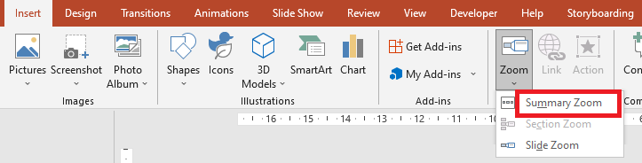

## **Overview**
A slide zoom can help you make your presentation more dynamic. It allows you to navigate freely between slides in any order without interruptions to the flow of your presentation. 

With a slide zoom, you get to deeply examine several information parts while feeling like you were on a single canvas. 


To allow you use zoom objects, Aspose.Slides provides the [ZoomImageType](https://apireference.aspose.com/slides/java/com.aspose.slides/ZoomImageType) enumeration, the [IZoomFrame](https://apireference.aspose.com/slides/java/com.aspose.slides/IZoomFrame) interface, and some methods in the [IShapeCollection](https://apireference.aspose.com/slides/java/com.aspose.slides/IShapeCollection) interface.

## **Creating Zoom Frames**
Zoom frame is one of the shapes offered by Aspose.Slides for Java. We intend to provide simple steps and examples to show you how to add zoom frames to slides. 

You can add a zoom frame in a slide using Aspose.Slides for Java this way:

1.	Create an instance of the [Presentation](https://apireference.aspose.com/slides/java/com.aspose.slides/Presentation) class.
2.	Create new slides to which you intend to link. 
3.	Add an identification text and background to the created slides.
4.  Add zoom frames (containing the references to created slides) into the first slide.
5.	Write the modified presentation as a PPTX file.

This sample code shows you how to create a zoom frame in a slide:
```java
Presentation pres = new Presentation();
try {
    //Add new slides to the presentation
    ISlide slide2 = pres.getSlides().addEmptySlide(pres.getSlides().get_Item(0).getLayoutSlide());
    ISlide slide3 = pres.getSlides().addEmptySlide(pres.getSlides().get_Item(0).getLayoutSlide());

    // Create a background for the second slide
    slide2.getBackground().setType(BackgroundType.OwnBackground);
    slide2.getBackground().getFillFormat().setFillType(FillType.Solid);
    slide2.getBackground().getFillFormat().getSolidFillColor().setColor(Color.CYAN);

    // Create a text box for the second slide
    IAutoShape autoshape = slide2.getShapes().addAutoShape(ShapeType.Rectangle, 100, 200, 500, 200);
    autoshape.getTextFrame().setText("Second Slide");

    // Create a background for the third slide
    slide3.getBackground().setType(BackgroundType.OwnBackground);
    slide3.getBackground().getFillFormat().setFillType(FillType.Solid);
    slide3.getBackground().getFillFormat().getSolidFillColor().setColor(Color.DARK_GRAY);

    // Create a text box for the third slide
    autoshape = slide3.getShapes().addAutoShape(ShapeType.Rectangle, 100, 200, 500, 200);
    autoshape.getTextFrame().setText("Trird Slide");

    //Add ZoomFrame objects
    pres.getSlides().get_Item(0).getShapes().addZoomFrame(20, 20, 250, 200, slide2);
    pres.getSlides().get_Item(0).getShapes().addZoomFrame(200, 250, 250, 200, slide3);

    // Save the presentation
    pres.save("presentation.pptx", SaveFormat.Pptx);
} finally {
    if (pres != null) pres.dispose();
}
```
## **Creating Zoom Frames with Custom Images**
With Aspose.Slides for Java, you can create a zoom frame with an image other than the slide preview image this way: 
1.	Create an instance of the [Presentation](https://apireference.aspose.com/slides/java/com.aspose.slides/Presentation) class.
2.	Create a new slide to which you intend to link. 
3.	Add an identification text and background to created slide.
4.  Create an [IPPImage](https://apireference.aspose.com/slides/java/com.aspose.slides/IPPImage) object by adding an image to the Images collection associated with the Presentation object that will be used to fill the frame.
5.  Add zoom frames (containing the reference to created slide) into the first slide.
6.	Write the modified presentation as a PPTX file.

This sample code shows you how to create a zoom frame with a different image:

```java
Presentation pres = new Presentation();
try {
    //Add a new slide to the presentation
    ISlide slide = pres.getSlides().addEmptySlide(pres.getSlides().get_Item(0).getLayoutSlide());

    // Create a background for the second slide
    slide.getBackground().setType(BackgroundType.OwnBackground);
    slide.getBackground().getFillFormat().setFillType(FillType.Solid);
    slide.getBackground().getFillFormat().getSolidFillColor().setColor(Color.CYAN);

    // Create a text box for the third slide
    IAutoShape autoshape = slide.getShapes().addAutoShape(ShapeType.Rectangle, 100, 200, 500, 200);
    autoshape.getTextFrame().setText("Second Slide");

    // Create a new image for the zoom object
    byte[] imageBytes = Files.readAllBytes(Paths.get("image.png"));
    IPPImage image = pres.getImages().addImage(imageBytes);

    //Add the ZoomFrame object
    pres.getSlides().get_Item(0).getShapes().addZoomFrame(20, 20, 300, 200, slide, image);

    // Save the presentation
    pres.save("presentation.pptx", SaveFormat.Pptx);
} catch(IOException e) {
} finally {
    if (pres != null) pres.dispose();
}
```

## **Formatting Zoom Frames**
In the previous sections (above), we showed you how to create simple zoom frames. To create more complicated zoom frames, you have to alter the frames' formatting. There are several formatting settings you can apply on a zoom frame. 

You can control the formatting of a zoom frame in a slide this way:

1.	Create an instance of the [Presentation](https://apireference.aspose.com/slides/java/com.aspose.slides/Presentation) class.
2.	Create new slides to link to.
3.	Add identification text and background to created slides.
4.  Add zoom frames (containing the references to created slides) into the first slide.
5.  Create an [IPPImage](https://apireference.aspose.com/slides/java/com.aspose.slides/IPPImage) object by adding an image to the Images collection associated with the Presentation object that will be used to fill the frame.
6.  Set a custom image for the first zoom frame object.
7.  Change the line format for the second zoom frame object.
8.  Remove the background from an image of the second zoom frame object.
5.	Write the modified presentation as a PPTX file.

This sample code shows you how to change the formatting of a zoom frame: 

```java
Presentation pres = new Presentation();
try {
    //Add new slides to presentation
    ISlide slide2 = pres.getSlides().addEmptySlide(pres.getSlides().get_Item(0).getLayoutSlide());
    ISlide slide3 = pres.getSlides().addEmptySlide(pres.getSlides().get_Item(0).getLayoutSlide());

    // Create a background for the second slide
    slide2.getBackground().setType(BackgroundType.OwnBackground);
    slide2.getBackground().getFillFormat().setFillType(FillType.Solid);
    slide2.getBackground().getFillFormat().getSolidFillColor().setColor(Color.CYAN);

    // Create a text box for the second slide
    IAutoShape autoshape = slide2.getShapes().addAutoShape(ShapeType.Rectangle, 100, 200, 500, 200);
    autoshape.getTextFrame().setText("Second Slide");

    // Create a background for the third slide
    slide3.getBackground().setType(BackgroundType.OwnBackground);
    slide3.getBackground().getFillFormat().setFillType(FillType.Solid);
    slide3.getBackground().getFillFormat().getSolidFillColor().setColor(Color.DARK_GRAY);

    // Create a text box for the third slide
    autoshape = slide3.getShapes().addAutoShape(ShapeType.Rectangle, 100, 200, 500, 200);
    autoshape.getTextFrame().setText("Trird Slide");

    //Add ZoomFrame objects
    IZoomFrame zoomFrame1 = pres.getSlides().get_Item(0).getShapes().addZoomFrame(20, 20, 250, 200, slide2);
    IZoomFrame zoomFrame2 = pres.getSlides().get_Item(0).getShapes().addZoomFrame(200, 250, 250, 200, slide3);

    // Create a new image for the zoom object
    byte[] imageBytes = Files.readAllBytes(Paths.get("image.png")); 
    IPPImage image = pres.getImages().addImage(imageBytes);
	
    // Set custom image for zoomFrame1 object
    zoomFrame1.setImage(image);

    // Set a zoom frame format for the zoomFrame2 object
    zoomFrame2.getLineFormat().setWidth(5);
    zoomFrame2.getLineFormat().getFillFormat().setFillType(FillType.Solid);
    zoomFrame2.getLineFormat().getFillFormat().getSolidFillColor().setColor(Color.MAGENTA);
    zoomFrame2.getLineFormat().setDashStyle(LineDashStyle.DashDot);

    // Do not show background for zoomFrame2 object
    zoomFrame2.setShowBackground(false);

    // Save the presentation
    pres.save("presentation.pptx", SaveFormat.Pptx);
} catch(IOException e) {
} finally {
    if (pres != null) pres.dispose();
}
```

## **Creating a Summary Zoom**
A summary zoom is like a landing page that allows you to see all the parts of your presentation at once. By adding a summary zoom to your presentation, you get to jump in and out of different slides or move between them in any order. 



Aspose.Slides for Java has no methods for creating a summary zoom, but it has an API that allows you to achieve the same effect and do even more. 

You can create a summary zoom in a slide this way:

1.	Create an instance of the [Presentation](https://apireference.aspose.com/slides/java/com.aspose.slides/Presentation) class.
2.	Create new slides to which you intend to link. 
3.	Add an identification text and background to the created slides.
6.  Add zoom frames (containing the references to created slides) into the first slide.
5.  Set the [ReturnToParent](https://apireference.aspose.com/slides/java/com.aspose.slides/IZoomFrame#setReturnToParent-boolean-) property of every zoom frame object to `true`.

**Note**: If you have your own custom algorithm for placing zoom frame objects on a slide, you can use it. 

This sample code shows you how to create a summary zoom using Aspose.Slides for Java:

```java
Presentation pres = new Presentation();
try {
    // Create slides array
    for (int slideNumber = 0; slideNumber < 5; slideNumber++)
    {
        //Add new slides to presentation
        ISlide slide = pres.getSlides().addEmptySlide(pres.getSlides().get_Item(0).getLayoutSlide());

        // Create a background for the slide
        slide.getBackground().setType(BackgroundType.OwnBackground);
        slide.getBackground().getFillFormat().setFillType(FillType.Solid);
        slide.getBackground().getFillFormat().getSolidFillColor().setColor(Color.DARK_GRAY);

        // Create a text box for the slide
        IAutoShape autoshape = slide.getShapes().addAutoShape(ShapeType.Rectangle, 100, 200, 500, 200);
        autoshape.getTextFrame().setText(String.format("Slide - %d", slideNumber + 2));
    }

    // Create zoom objects for all slides in the first slide
    for (int slideNumber = 1; slideNumber < pres.getSlides().size(); slideNumber++)
    {
        int x = (slideNumber - 1) * 100;
        int y = (slideNumber - 1) * 100;
        IZoomFrame zoomFrame = pres.getSlides().get_Item(0).getShapes().addZoomFrame(x, y, 150, 120, pres.getSlides().get_Item(slideNumber));

        // Set the ReturnToParent property to return to the first slide
        zoomFrame.setReturnToParent(true);
    }

    // Save the presentation
    pres.save("presentation.pptx", SaveFormat.Pptx);
} finally {
    if (pres != null) pres.dispose();
}
```

  