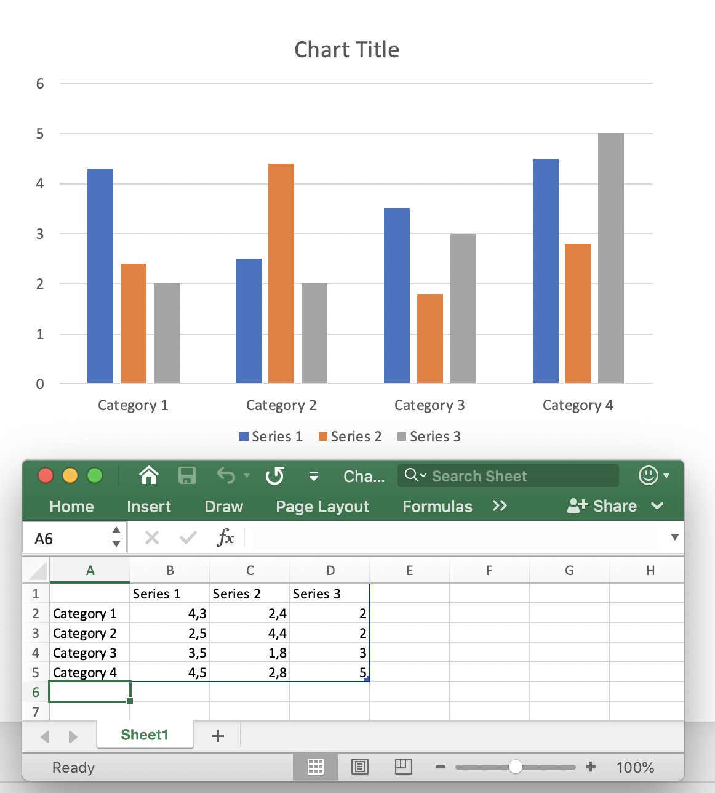

## **About Chart Spreadsheet Formula in Presentation**
**Chart spreadsheet** (or chart worksheet) in presentation is the data source of the chart. Chart spreadsheet contains data, which are represented on the chart in a graphic way. When you create a chart in PowerPoint, the worksheet associated with this chart is automatically created too. Chart worksheet is created for all types of charts: line chart, bar chart, sunburst chart, pie chart, etc. To see chart spreadsheet in PowerPoint you should double-click on the chart:




Chart spreadsheet contains the names of chart elements (Category Name: *Category1*, Serie Name) and a table with numeric data appropriate to these categories and series. By default, when you create a new chart - the chart spreadsheet data are set with the default data. Then you may change spreadsheet data in the worksheet manually.

Usually, the chart represents complicated data (e.g. financial analysts, scientific analysts), having cells that are calculated from the values in other cells or from other dynamic data. Calculating cell’s value manually and hard-coding it into the cell, makes it difficult to change it in the future. If you will change the value of a certain cell, all the cells dependent on it will require to be updated too. Moreover, table data may depend on the data from other tables, creating a complex presentation data scheme with a need to be updated in an easy and flexible way.

**Chart spreadsheet formula** in presentation is an expression to automatically calculate and update chart spreadsheet data. Spreadsheet formula defines the data calculation logic for a certain cell or a set of cells. Spreadsheet formula is a math formula or a logical formula, which is using: cell references, math functions, logical operators, arithmetic operators, conversion functions, string constants, etc. The definition of the formula is written into a cell, and this cell does not contain a simple value. Spreadsheet formula calculates the value and returns it back, then this value is assigned to the cell. Chart spreadsheet formulas in presentations are actually the same as excel formulas, and there are supported the same default functions, operators and constants for their implementation.

In [**Aspose.Slides**](https://products.aspose.com/slides/java) chart spreadsheet is represented with 
[**Chart.getChartData.getChartDataWorkbook**](https://apireference.aspose.com/slides/java/com.aspose.slides/IChartData#getChartDataWorkbook--) method of the
[**IChartDataWorkbook**](https://apireference.aspose.com/slides/java/com.aspose.slides/IChartDataWorkbook) type. 
Spreadsheet formula can be assigned and changed with 
[**IChartDataCell.setFormula**](https://apireference.aspose.com/slides/java/com.aspose.slides/IChartDataCell#setFormula-java.lang.String-) method. 
The following functionality is supported for formulas in Aspose.Slides:

- Logical constants
- Numerical constants
- String constants
- Error constants
- Arithmetic operators
- Comparison operators
- A1-style cell references
- R1C1-style cell references
- Predefined functions


Typically, spreadsheets store the last calculated formula values. If after presentation loading, the chart data were not changed - [**IChartDataCell.getValue**](https://apireference.aspose.com/slides/java/com.aspose.slides/IChartDataCell#getValue--) method it returns those values while reading. But, if spreadsheet data had been changed, while reading **ChartDataCell.Value** property it throws the [**CellUnsupportedDataException**](https://apireference.aspose.com/slides/java/com.aspose.slides/CellUnsupportedDataException) for the unsupported formulas. This is because when formulas are successfully parsed, the cell dependencies are determined and the correctness of the last values is determined. But, if the formula can not be parsed, the correctness of cell value cannot be guaranteed.

## **Add Chart Spreadsheet Formula to Presentation**
First, add a chart to the first slide of a new presentation with 
[IShapeCollection.getShapes.addChart](https://apireference.aspose.com/slides/java/com.aspose.slides/IShapeCollection#addChart-int-float-float-float-float-). 
The worksheet of the chart is automatically created and can be accessed with 
[**Chart.getChartData.getChartDataWorkbook**](https://apireference.aspose.com/slides/java/com.aspose.slides/IChartData#getChartDataWorkbook--) method:


```java
Presentation pres = new Presentation();
try {
    IChart chart = pres.getSlides().get_Item(0).getShapes().addChart(ChartType.ClusteredColumn, 150, 150, 500, 300);

    IChartDataWorkbook workbook = chart.getChartData().getChartDataWorkbook();

    // ...
} finally {
    if (pres != null) pres.dispose();
}
``` 

Let's write some values in cells with 
[**IChartDataCell.setValue**](https://apireference.aspose.com/slides/java/com.aspose.slides/IChartDataCell#setValue-java.lang.Object-) property 
of the **Object** type, which means you can set any value to the property:

```java
workbook.getCell(0, "F2").setValue(-2.5);

workbook.getCell(0, "G3").setValue(6.3);

workbook.getCell(0, "H4").setValue(3);
``` 

Now to write formula to the cell, you can use the 
[**IChartDataCell.setFormula**](https://apireference.aspose.com/slides/java/com.aspose.slides/IChartDataCell#setFormula-java.lang.String-) method:

*Note*: [**IChartDataCell.setFormula**](https://apireference.aspose.com/slides/java/com.aspose.slides/IChartDataCell#setFormula-java.lang.String-) method is used to set A1-style cell references. 

To set the [R1C1Formula](https://apireference.aspose.com/slides/java/com.aspose.slides/IChartDataCell#getR1C1Formula--) cell reference, you can use the [**IChartDataCell.setR1C1Formula**](https://apireference.aspose.com/slides/java/com.aspose.slides/IChartDataCell#setR1C1Formula-java.lang.String-) method:

Then if you try to read the values from the cells B2 and C2, they will be calculated:

```java
Object value1 = cell1.getValue(); // 7.8

Object value2 = cell2.getValue(); // 2.1
``` 

## **Logical Constants**
You can use logical constants such as *FALSE* and *TRUE* in cell formulas:

```java
workbook.getCell(0, "A2").setValue(false);
IChartDataCell cell = workbook.getCell(0, "B2");
cell.setFormula("A2 = TRUE");
Object value = cell.getValue(); // the value contains boolean "false"
```

## **Numerical Constants**
Numbers can be used in common or scientific notations to create chart spreadsheet formula:

```java
workbook.getCell(0, "A2").setFormula("1 + 0.5");
workbook.getCell(0, "B2").setFormula(".3 * 1E-2");
```

## **String Constants**
String (or literal) constant is a specific value that is used as it is and does not change. String constants may be: dates, texts, numbers, etc.:

```java
workbook.getCell(0, "A2").setFormula("\"abc\"");
workbook.getCell(0, "B2").setFormula("\"2/3/2020 12:00\"");
```

## **Error Constants**
Sometimes its not possible to calculate the result by the formula. In that case, the error code is shown in the cell instead of its value. Each type of error has a specific code:

- #DIV/0! - formula tries to divide by zero.
- #GETTING_DATA - may be shown on a cell, while its value is still calculating.
- #N/A - information is missing or not available. Some reasons can be: the cells used in the formula is empty, an extra space character, misspelling, etc.
- #NAME? - a certain cell or other formula objects can not be found by its name. 
- #NULL! - may appear when there is a mistake in the formula, like:  (,) or a space character used instead of a colon (:).
- #NUM! - the numeric in the formula may be invalid, too long or too small, etc.
- #REF! - invalid cell reference.
- #VALUE! - unexpected value type. For example, string value set to numeric cell.

```java
IChartDataCell cell = workbook.getCell(0, "A2");
cell.setFormula("2 / 0");
Object value = cell.getValue(); // the value contains the string "#DIV/0!"
```

## **Arithmetic Operators**
You can use all the arithmetic operators in chart worksheet formulas:

|**Operator** |**Meaning** |**Example**|
| :- | :- | :- |
|+ (plus sign) |Addition or unary plus|2 + 3|
|- (minus sign) |Subtraction or negation |2 - 3<br>-3|
|* (asterisk)|Multiplication |2 * 3|
|/ (forward slash)|Division |2 / 3|
|% (percent sign) |Percent |30%|
|^ (caret) |Exponentiation |2 ^ 3|

*Note*: To change the order of evaluation, enclose in parentheses the part of the formula to be calculated first.

## **Comparison Operators**
You can compare the values of cells with the comparison operators. When two values are compared by using these operators, the result is a logical value either *TRUE* or FALSE:

|**Operator** |**Meaning** |**Meaning** |
| :- | :- | :- |
|= (equal sign) |Equal to |A2 = 3|
|<> (not equal sign) |Not equal to|A2 <> 3|
|> (greater than sign) |Greater than|A2 > 3|
|>= (greater than or equal to sign)|Greater than or equal to|A2 >= 3|
|< (less than sign)|Less than|A2 < 3|
|<= (less than or equal to sign)|Less than or equal to|A2 <= 3|

## **A1-style Cell References**
**A1-style cell references** are used for the worksheets, where the column has a letter identifier (e.g. "*A*") and the row has a numeric identifier (e.g. "*1*"). A1-style cell references can be used in the following way:

|**Cell reference**|**Example**|||
| :- | :- | :- | :- |
||Absolute |Relative |Mixed|
|Cell |$A$2 |A2|<p>A$2</p><p>$A2</p>|
|Row |$2:$2 |2:2 |-|
|Column |$A:$A |A:A |-|
|Range |$A$2:$C$4 |A2:C4|<p>$A$2:C4</p><p>A$2:$C4</p>|


Here is an example how to use A1-style cell reference in formula:

```java
workbook.getCell(0, "A2").setFormula("C3 + SUM(F2:H5)");
```

## **R1C1-style Cell References**
**R1C1-style cell references** are used for the worksheets, where both a row and a column has the numeric identifier. R1C1-style cell references can be used in the following way:

|**Cell reference**|**Example**|||
| :- | :- | :- | :- |
||Absolute |Relative |Mixed|
|Cell |R2C3|R[2]C[3]|R2C[3]<br>R[2]C3|
|Row |R2|R[2]|-|
|Column |C3|C[3]|-|
|Range |R2C3:R5C7|R[2]C[3]:R[5]C[7] |R2C3:R[5]C[7]<br>R[2]C3:R5C[7]|


Here is an example how to use A1-style cell reference in formula:

```java
workbook.getCell(0, "A2").setR1C1Formula("R2C4 + SUM(R5C6:R7C9)");
```

## **Predefined Functions**
There are predefined functions, that can be used in the formulas to simplify their implementation. These functions encapsulate the most commonly used operations, like: 

- ABS
- AVERAGE
- CEILING
- CHOOSE
- DATE (1900 date system)
- DAYS
- FIND
- FINDB
- IF
- INDEX (reference form)
- LOOKUP (vector form)
- MATCH (vector form)
- MAX
- SUM
- VLOOKUP


