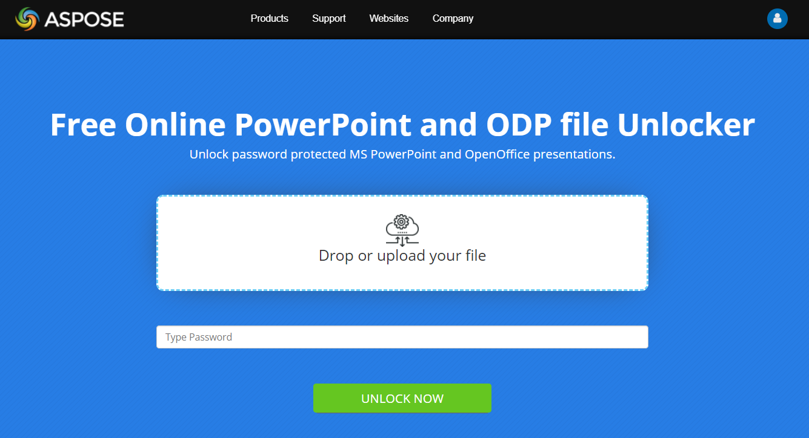

## **About Password Protection**
### **What is Presentation Password Protection**
Password protection on presentation is when we set a password on a presentation to allow operating with it only for authorized users. This means, that only users, who know the password set on the presentation, can operate with it. Password protected presentation is also called locked presentation. Password protection can be set to prohibit:

- Modify.

  If presentation is password protected from modifying, you have two options: a) enter the password while opening to allow modifying presentation; b) open it in read-only mode, without entering the password.
  Read only mode means, that you can open presentation to view it, however you can not make any changes into it. Note, that all the content of presentation will be still available: hyperlinks, animations, effects, etc. In read only mode its not possible to copy paste the content of presentation. You can not save presentation in this mode too.

  Actually, you can edit the presentation, however you can not save these changes into this presentation. If you want to save changes made to presentation - you will need to enter the password. Otherwise, it is possible to save the changes by saving presentation as a new one, with a different file name.
  Protecting presentation from modifying is useful when you need to work on it in collaboration with others.
- Open.

  Presentation can be password protected from opening. In this case, its protected from modifying too. To open presentation, it is required to enter the password.
  
### **Presentation Password Protection in Aspose.Slides**
In [**Aspose.Slides**](https://products.aspose.com/slides/java) password protection from modifying can be divided on two types:

- **Encryption** 
  Presentation is encrypted with the password provided, it can not be modifies without setting a password.
- **Write Protection** 
  Presentation is not encrypted with password, but its just marked as *"do not modify"* presentation. This is done to notify users, that this presentation should not be changed. Actually, such presentation can be modified, but to save the changes you will have to create a new presentation with a different file name.


[**Aspose.Slides**](https://products.aspose.com/slides/java) supports password protection for both PowerPoint (PPTX, PPT) and OpenOffice (ODP) presentation formats. 
In [Aspose.Slides](https://products.aspose.com/slides/java), presentation password 
protection feature is represented by 
[**IProtectionManager**](https://apireference.aspose.com/slides/java/com.aspose.slides/IProtectionManager). Each [Presentation](https://apireference.aspose.com/slides/java/com.aspose.slides/Presentation) object 
has [**ProtectionManager**](https://apireference.aspose.com/slides/java/com.aspose.slides/ProtectionManager) 
property to refer its methods:

- [**encrypt**](https://apireference.aspose.com/slides/java/com.aspose.slides/IProtectionManager#encrypt-java.lang.String-) 
  Under the cover of password protection process, presentation is actually encrypted with the password. Encryption algorithm implemented by Aspose.Slides is used to do that, and you only need to pass the password into Encrypt method.
- [**removeEncryption**](https://apireference.aspose.com/slides/java/com.aspose.slides/IProtectionManager#removeEncryption--) 
  To decrypt presentation, you need to call RemoveEncryption method with no parameters. Note, that before that you will have to enter password to load this presentation. See more: [Unlock Presentation](/slides/java/password-protected-presentation/#unlock-presentation).
- [**setWriteProtection**](https://apireference.aspose.com/slides/java/com.aspose.slides/IProtectionManager#setWriteProtection-java.lang.String-) 
  This method is used to set write protection to presentation, and to do that you need to pass presentation password into the method.
- [**removeWriteProtection**](https://apireference.aspose.com/slides/java/com.aspose.slides/IProtectionManager#removeWriteProtection--) 
  To remove write protection, just call this method with no parameters.


[**isEncrypted**](https://apireference.aspose.com/slides/java/com.aspose.slides/IProtectionManager#isEncrypted--) property is 
used to check if presentation is encrypted, 
[**isWriteProtected**](https://apireference.aspose.com/slides/java/com.aspose.slides/IProtectionManager#isWriteProtected--) - to check is its write protected.

Note that, when presentation is password protected - its document properties are 
password protected by default too. With Aspose.Slides, its possible to change 
this behavior and make document properties available even for locked presentation.
For that, [**getEncryptDocumentProperties**](https://apireference.aspose.com/slides/java/com.aspose.slides/IProtectionManager#getEncryptDocumentProperties--) property needs to be set true. 


## **Lock Presentation**
To lock PowerPoint (or OpenOffice) presentation means to create password protected presentation. To create password protected presentation you just need to set a password to presentation. Password protection is a feature used in both PowerPoint and OpenOffice presentation formats. While password is being set to presentation, this presentation is encrypted with the password. So, to encrypt (password protect) presentation do the following:

```java
// Opening the presentation file
Presentation pres = new Presentation("demoWriteProtected.pptx");
try {
    // ....do some work here.....
	
    // Setting Password
    pres.getProtectionManager().encrypt("pass");
    
    // Save your presentation to a file
    pres.save("demoPass.pptx", SaveFormat.Pptx);
} finally {
    pres.dispose();
}
```

[**ProtectionManager**](https://apireference.aspose.com/slides/java/com.aspose.slides/Presentation#getProtectionManager--) contains [**encrypt**](https://apireference.aspose.com/slides/java/com.aspose.slides/IProtectionManager#encrypt-java.lang.String-) method which sets a password for the presentation. Simply pass the password to the [**encrypt**](https://apireference.aspose.com/slides/java/com.aspose.slides/IProtectionManager#encrypt-java.lang.String-) method and then use [save](https://apireference.aspose.com/slides/java/com.aspose.slides/Presentation#save-java.lang.String-int-) method exposed by the [Presentation](https://apireference.aspose.com/slides/java/com.aspose.slides/Presentation) to save the presentation.

You may take a look at demo app, demonstrating presentation lock feature in Aspose.Slides. For that, visit [**Aspose.Slides Lock**](https://products.aspose.app/slides/lock) online app:

[](https://products.aspose.app/slides/lock)

[](https://products.aspose.app/slides/lock)
## **Open Locked Presentation**
To open password protected presentation, use overloaded constructors of [Presentation](https://apireference.aspose.com/slides/java/com.aspose.slides/Presentation) class. Pass [**LoadOptions**](https://apireference.aspose.com/slides/java/com.aspose.slides/LoadOptions) class object to set the access password to open password protected presentation.

```java
// Creating instance of load options to set the presentation access password
LoadOptions loadOptions = new LoadOptions();

// Setting the access password
loadOptions.setPassword("password");

// Opening the presentation file by passing the file path and load
// options to the constructor of Presentation class
Presentation pres = new Presentation("demoPassDocument.pptx", loadOptions);
try {
    // ....do some work here.....
} finally {
    pres.dispose();
}
```

## **Get Document Properties in Locked Presentation**
When presentation is locked (password protected), the document properties become also prohibited. Aspose.Slides offers a mechanism for password protecting a presentation, but still being able to access the document properties in PowerPoint. The [Presentation](https://apireference.aspose.com/slides/java/com.aspose.slides/Presentation) class exposes the [**setEncryptDocumentProperties**](https://apireference.aspose.com/slides/java/com.aspose.slides/IProtectionManager#setEncryptDocumentProperties-boolean-) method that takes a Boolean value to allow or disallow access to the document properties in password protected presentation. By default, its value is set to true.

```java
// Opening the presentation file
Presentation pres = new Presentation("demoWriteProtected.pptx");
try {
    // ....do some work here.....

    // Setting access to document properties in password protected mode
    pres.getProtectionManager().setEncryptDocumentProperties(false);

    // Setting Password
    pres.getProtectionManager().encrypt("pass");

    // Save your presentation to a file
    pres.save("demoPassDocument.pptx", SaveFormat.Pptx);
} finally {
    pres.dispose();
}
```

## **Unlock Presentation**
To unlock PowerPoint (or OpenOffice) presentation, you need to open password protected presentation and then encrypt it. To open password protected presentation, use [Presentation](https://apireference.aspose.com/slides/java/com.aspose.slides/Presentation) constructor with [LoadOptions](https://apireference.aspose.com/slides/java/com.aspose.slides/LoadOptions) set with a presentation password. To unlock or encrypt presentation, call [**removeEncryption**](https://apireference.aspose.com/slides/java/com.aspose.slides/IProtectionManager#removeEncryption--) method by [**ProtectionManager**](https://apireference.aspose.com/slides/java/com.aspose.slides/IProtectionManager):

```java
// Creating instance of load options to set the presentation access password
LoadOptions loadOptions = new LoadOptions();

// Setting the access password
loadOptions.setPassword("password");

// Opening the presentation file
Presentation pres = new Presentation("demoWriteProtected.pptx", loadOptions);
try {
    // Removing Encryption
    pres.getProtectionManager().removeEncryption();

    // Save your presentation to a file
    pres.save("demoUnProtected.pptx", SaveFormat.Pptx);
} finally {
    pres.dispose();
}
```

To try presentation unlock feature alive, you may try free online app [**Aspose.Slides Unlock**](https://products.aspose.app/slides/unlock):

[](https://products.aspose.app/slides/unlock)

[](https://products.aspose.app/slides/unlock)

## **Set Write Protection to Presentation**
To make a read only PowerPoint (or OpenOffice) presentation, you need to set write protection on it. For that use [**setWriteProtection**](https://apireference.aspose.com/slides/java/com.aspose.slides/IProtectionManager#setWriteProtection-java.lang.String-) method from [**ProtectionManager**](https://apireference.aspose.com/slides/java/com.aspose.slides/IProtectionManager), with presentation password pass into it:

```java
// Opening the presentation file
Presentation pres = new Presentation("demoWriteProtected.pptx");
try {
    // ....do some work here.....

    // Setting Write protection Password
    pres.getProtectionManager().setWriteProtection("test");

    // Save your presentation to a file
    pres.save("demoWriteProtected.pptx", SaveFormat.Pptx);
} finally {
    pres.dispose();
}
```

## **Remove Write Protection from Presentation**
Aspose.Slides for Java provides a facility for accessing write protected presentation through the [Presentation](https://apireference.aspose.com/slides/java/com.aspose.slides/Presentation) class. The [**isWriteProtected**](https://apireference.aspose.com/slides/java/com.aspose.slides/IProtectionManager#isWriteProtected--) property 
identifies whether a presentation is write protected or not. 
Then if it is write protected, the protection can be removed using the [**removeWriteProtection**](https://apireference.aspose.com/slides/java/com.aspose.slides/IProtectionManager#removeWriteProtection--) method.

```java
// Creating instance of load options to set the presentation access password
LoadOptions loadOptions = new LoadOptions();

// Setting the access password
loadOptions.setPassword("password");

// Opening the presentation file
Presentation pres = new Presentation("demoWriteProtected.pptx", loadOptions);
try {
    // Checking if presentation is write protected
    if (pres.getProtectionManager().isWriteProtected())
        // Removing Write protection
        pres.getProtectionManager().removeWriteProtection();
    
    // Saving presentation
    pres.save("newDemo.pptx", SaveFormat.Pptx);
} finally {
    pres.dispose();
}
```

{} 
- [Digital Signature in PowerPoint](/slides/java/digital-signature-in-powerpoint/)
{}