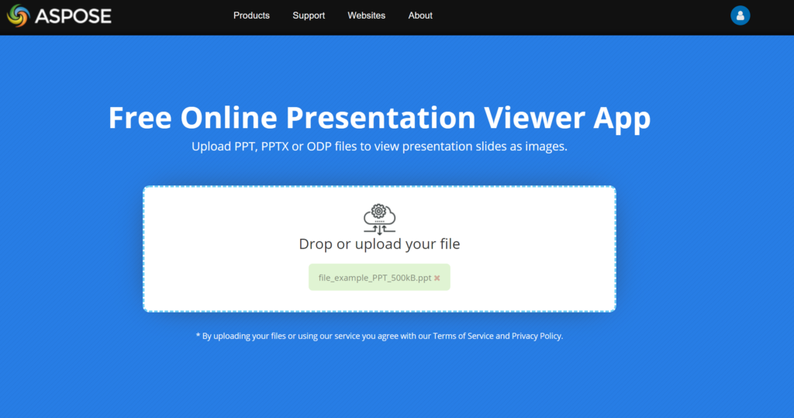

{} 

Aspose.Slides for Java is used to create presentation files, complete with slides. These slides can be viewed by opening presentations using Microsoft PowerPoint. But sometimes, developers may also need to view slides as images in their favorite image viewer or create their own presentation viewer. In such cases, Aspose.Slides for Java lets you export an individual slide to an image. This article describes how to do it.

{} 

## **Live Example**
You can try [**Aspose.Slides Viewer**](https://products.aspose.app/slides/viewer/) free app to see what you can implement with Aspose.Slides API:

[](https://products.aspose.app/slides/viewer/)

[](https://products.aspose.app/slides/viewer/)

## **Generate SVG Image from Slide**
To generate an SVG image from any desired slide with Aspose.Slides for Java, please follow the steps below:

- Create an instance of the [Presentation](https://apireference.aspose.com/slides/java/com.aspose.slides/Presentation) class.
- Obtain the desired slide's reference by using its ID or index.
- Get the SVG image in a memory stream.
- Save the memory stream to file.

```java
// Instantiate a Presentation class that represents the presentation file
Presentation pres = new Presentation("CreateSlidesSVGImage.pptx");
try {
    // Access the first slide
    ISlide sld = pres.getSlides().get_Item(0);

    // Create a memory stream object
    FileOutputStream svgStream = new FileOutputStream("Aspose_out.svg");

    // Generate SVG image of slide and save in memory stream
    sld.writeAsSvg(svgStream);

    svgStream.close();
} catch (IOException e) {
} finally {
    pres.dispose();
}
```

## **Generate SVG with Custom Shape IDS**
Aspose.Slides for Java can be used to generate [SVG](https://wiki.fileformat.com/page-description-language/svg/) from slide with custom shape ID. For that, use ID property from [ISvgShape](https://apireference.aspose.com/slides/java/com.aspose.slides/ISvgShape), which represents custom ID of shapes in generated SVG. CustomSvgShapeFormattingController can be used to set shape ID.

```java
Presentation pres = new Presentation("pptxFileName.pptx");
try {
    FileOutputStream stream = new FileOutputStream("Aspose_out.svg");
    try {
        SVGOptions svgOptions = new SVGOptions();
        svgOptions.setShapeFormattingController(new CustomSvgShapeFormattingController());

        pres.getSlides().get_Item(0).writeAsSvg(stream, svgOptions);
    } finally {
        if (stream != null) stream.close();
    }
} catch (IOException e) {
} finally {
    pres.dispose();
}
```
```java
class CustomSvgShapeFormattingController implements ISvgShapeFormattingController
{
    private int m_shapeIndex;

    public CustomSvgShapeFormattingController()
    {
        m_shapeIndex = 0;
    }
    
    public CustomSvgShapeFormattingController(int shapeStartIndex)
    {
        m_shapeIndex = shapeStartIndex;
    }

    public void formatShape(ISvgShape svgShape, IShape shape)
    {
        svgShape.setId(String.format("shape-%d", m_shapeIndex++));
    }
}
```

## **Create Slides Thumbnail Image**
Aspose.Slides for Java help you generate thumbnail images of the slides. To generate the thumbnail of any desired slide using Aspose.Slides for Java:

1. Create an instance of the [Presentation](https://apireference.aspose.com/slides/java/com.aspose.slides/Presentation) class.
1. Obtain the reference of any desired slide by using its ID or index.
1. Get the thumbnail image of the referenced slide on a specified scale.
1. Save the thumbnail image in any desired image format.

```java
// Instantiate a Presentation class that represents the presentation file
Presentation pres = new Presentation("ThumbnailFromSlide.pptx");
try {
    // Access the first slide
    ISlide sld = pres.getSlides().get_Item(0);

    // Create a full scale image
    BufferedImage bmp = sld.getThumbnail(1f, 1f);

    // Save the image to disk in JPEG format
    ImageIO.write(bmp, "PNG", new java.io.File("Thumbnail_out.png"));
} catch (IOException e) {
} finally {
    pres.dispose();
}
```

## **Create Thumbnail with User Defined Dimensions**

1. Create an instance of the [Presentation](https://apireference.aspose.com/slides/java/com.aspose.slides/Presentation) class.
1. Obtain the reference of any desired slide by using its ID or index.
1. Get the thumbnail image of the referenced slide on a specified scale.
1. Save the thumbnail image in any desired image format.

```java
// Instantiate a Presentation class that represents the presentation file
Presentation pres = new Presentation("ThumbnailWithUserDefinedDimensions.pptx");
try {
    // Access the first slide
    ISlide sld = pres.getSlides().get_Item(0);

    // User defined dimension
    int desiredX = 1200;
    int desiredY = 800;

    // Getting scaled value  of X and Y
    float ScaleX = (float)(1.0 / pres.getSlideSize().getSize().getWidth()) * desiredX;
    float ScaleY = (float)(1.0 / pres.getSlideSize().getSize().getHeight()) * desiredY;
    
    // Create a full scale image
    BufferedImage bmp = sld.getThumbnail(ScaleX, ScaleY);

    // Save the image to disk in JPEG format
    ImageIO.write(bmp, "PNG", new java.io.File("Thumbnail_out.png"));
} catch (IOException e) {
} finally {
    pres.dispose();
}
```

## **Create Thumbnail from Slide in Notes Slides View**
To generate the thumbnail of any desired slide in Notes Slide View using Aspose.Slides for Java:

1. Create an instance of the [Presentation](https://apireference.aspose.com/slides/java/com.aspose.slides/Presentation) class.
1. Obtain the reference of any desired slide by using its ID or index.
1. Get the thumbnail image of the referenced slide on a specified scale in Notes Slide view.
1. Save the thumbnail image in any desired image format.

The code snippet below produces a thumbnail of the first slide of a presentation in Notes Slide View.

```java
// Instantiate a Presentation class that represents the presentation file
Presentation pres = new Presentation("ThumbnailWithUserDefinedDimensions.pptx");
try {
    // Access the first slide
    ISlide sld = pres.getSlides().get_Item(0);

    // User defined dimension
    int desiredX = 1200;
    int desiredY = 800;

    // Getting scaled value  of X and Y
    float ScaleX = (float)(1.0 / pres.getSlideSize().getSize().getWidth()) * desiredX;
    float ScaleY = (float)(1.0 / pres.getSlideSize().getSize().getHeight()) * desiredY;

    RenderingOptions opts = new RenderingOptions();
    opts.getNotesCommentsLayouting().setNotesPosition(NotesPositions.BottomTruncated);
    
    // Create a full scale image
    BufferedImage bmp = sld.getThumbnail(opts, ScaleX, ScaleY);

    // Save the image to disk in JPEG format
    ImageIO.write(bmp, "PNG", new java.io.File("Thumbnail_out.png"));
} catch (IOException e) {
} finally {
    pres.dispose();
}
```
