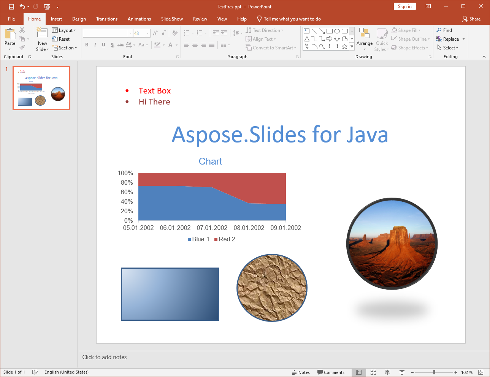

{} 

PPT to PPTX conversion is supported from Aspose.Slides for Java. Most presentation features - master slides, structure and so on - are retained when converted from one format to the other, but there are [a few limitations](/slides/java/ppt-to-pptx-conversion/).

{} 
## **Features Supported in Conversion**
Aspose.Slides for Java provides partial support for converting the PPT file format to PPTX. Support for conversion has just been introduced to Aspose.Slides for Java, so it has a few limitations and works best for simple presentations. The main advantage that Aspose.Slides for Java provides when converting PPT to PPTX is how easy the API is to use. To see examples of the code, read about [Converting PPT to PPTX](). Below, lists explain which features are supported and which are not for PPT to PPTX conversion.

**Source PPT presentation**

**After conversion to PPTX**

## **Supported Features**
The following features are supported for conversion:

- Converting the structure of masters, layouts and slides.
- Converting charts.
- Group shapes.
- Converting autoshapes including rectangles and ellipses. However, it is possible that autoshapes may have wrong adjustments values.
- Shapes with custom geometry may sometimes not be converted.
- Textures and pictures fill styles for autoshapes may sometimes not be converted.
- Converting placeholders.
- Converting text in text frames and text holders. However, bullets, alignment and tabulations are not fully supported.
## **Unsupported Features**
The following features are not yet supported when converting from PPT to PPTX:

- Slide with notes as reading notes is not implemented in PPTX. When a PPT presentation has notes it can't be saved as PPTX yet.
- Converting lines and polylines.
- Line and fill formats.
- Gradient fill styles.
- OLE frames, tables, video and audio frames, etc.
- Animation and other slideshow properties are ignored.

New or missing features will be added in future releases of Aspose.Slides for Java.
