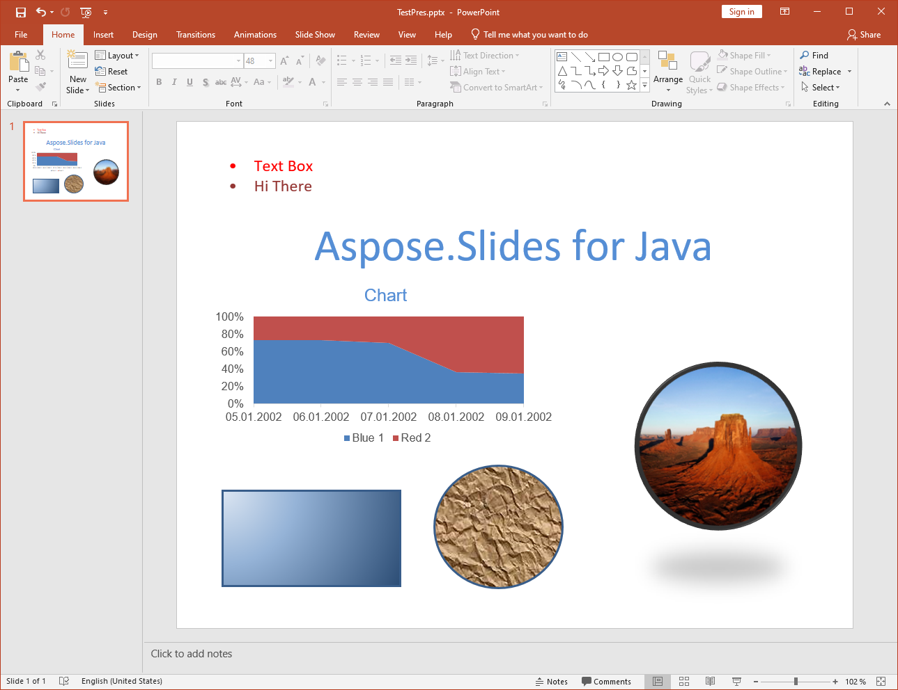
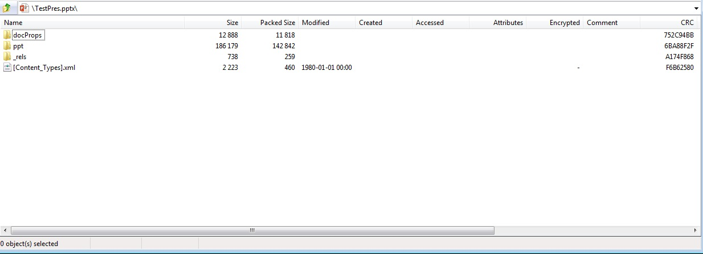

{} 

PresentationML is a name for a family of XML-based formats for presentation documents. Office OpenXML (OOXML) is the XML-based format introduced in Microsoft Office 2007 applications. Office OpenXML is a container format for several specialized XML-based markup languages. PresentationML is the markup language used by Microsoft Office PowerPoint 2007 to store documents.

{} 

## **PresentationML in Aspose.Slides for Java**
OOXML PresentationML documents come as PPTX files, zipped XML packages that follow the [OOXML ECMA-376](http://www.ecma-international.org/publications/standards/Ecma-376.htm) specification. Aspose.Slides for Java extensively supports creating, reading, manipulating and writing PresentationML documents. In addition, Aspose.Slides for Java is capable of exporting PresentationML documents to a widely used document format like PDF. This is possible because Aspose.Slides for Java was designed with the aim to comprehensively handle presentation documents and PresentationML basically holds the internal presentation of documents as a zipped XML package.

**A PPTX document generated by Aspose.Slides for Java and opened in Microsoft PowerPoint** 




**Viewing the same PPTX document generated by Aspose.Slides for Java in a ZIP** 




## **PresentationML is Open, Why Use Aspose.Slides for Java?**
Since PresentationML is XML based, it is quite possible to build applications to process and generat PresentationML documents using XML classes without relying on a third party class library such as Aspose.Slides for Java. However, there are several advantages of using Aspose.Slides for Java over XML classes when working with PresentationML documents.

The OOXML specification is several thousand pages long so to properly handle the PresentationML documents, you have to spend a lot of time and effort to understand the format. On the other hand, with Aspose.Slides for Java, you just use classes and their methods and properties to performing operations which seem complex if performed via XML classes.

Some of the features that Aspose.Slides offer are not even available when you work with PresentationML documents through XML classes:

- Export PPT documents to PDF format.
- Render a slide to any image format supported by the Java Framework.
- Automatically copy masters from a source presentations using the cloning feature.
- Apply protection to shapes.

Below is an example of a PresentationML document with a single slide containing a text box with the text “Hello World”. To read the text using XML classes, you have to write a program that can parse this simple text from the following fragment. Aspose.Slides does that for you.

**XML**

``` xml
<?xml version="1.0" encoding="UTF-8" standalone="yes"?>
<p:sld xmlns:a="http://schemas.openxmlformats.org/drawingml/2006/main" xmlns:r="http://schemas.openxmlformats.org/officeDocument/2006/relationships" xmlns:p="http://schemas.openxmlformats.org/presentationml/2006/main">
  <p:cSld>
    <p:spTree>
      <p:nvGrpSpPr>
        <p:cNvPr id="1" name=""/>
        <p:cNvGrpSpPr/>
        <p:nvPr/>
      </p:nvGrpSpPr>
      <p:grpSpPr>
        <a:xfrm>
          <a:off x="0" y="0"/>
          <a:ext cx="0" cy="0"/>
          <a:chOff x="0" y="0"/>
          <a:chExt cx="0" cy="0"/>
        </a:xfrm></p:grpSpPr><p:sp>
          <p:nvSpPr><p:cNvPr id="4" name="TextBox 3"/>
          <p:cNvSpPr txBox="1"/>
            <p:nvPr/>
          </p:nvSpPr>
          <p:spPr>
            <a:xfrm>
              <a:off x="2819400" y="2590800"/>
              <a:ext cx="1297086" cy="369332"/>
            </a:xfrm>
            <a:prstGeom prst="rect">
              <a:avLst/>
            </a:prstGeom>
            <a:noFill/>
          </p:spPr>
          <p:txBody>
            <a:bodyPr wrap="none" rtlCol="0">
              <a:spAutoFit/>
            </a:bodyPr>
            <a:lstStyle/>
            <a:p>
              <a:r>
                <a:rPr lang="en-US"/>
                <a:t>Hello World
                </a:t>
              </a:r>
              <a:endParaRPr lang="en-US"/>
            </a:p>
          </p:txBody>
        </p:sp>
    </p:spTree>
  </p:cSld>
  <p:clrMapOvr>
    <a:masterClrMapping/>
  </p:clrMapOvr>
</p:sld>
```
