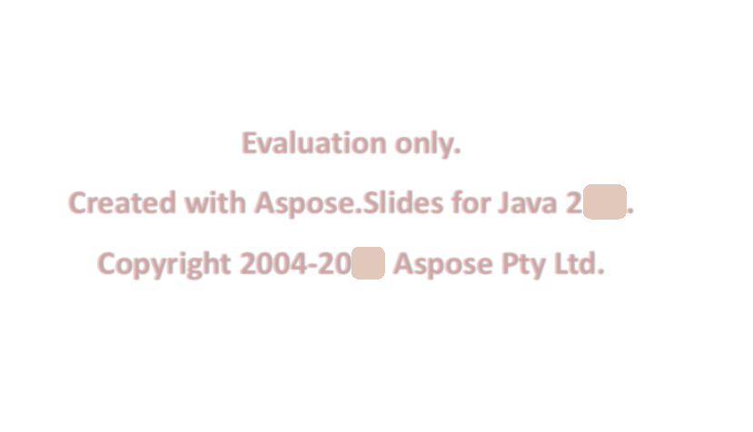

{} 

You can download an evaluation version of **Aspose.Slides for Java** from [its download page](https://repository.aspose.com/repo/com/aspose/aspose-slides/). The evaluation version provides absolutely the same functionalities as the licensed version of the product. Furthermore, the evaluation version simply becomes licensed after you purchase a license and add a couple of lines of code to apply the license.

Once you are happy with your evaluation of **Aspose.Slides**, you can [purchase a license](https://purchase.aspose.com/buy) at the Aspose website. We strongly recommend you go through the different subscription types. If you have questions, contact the Aspose sales team.

Every Aspose license carries a one-year subscription for free upgrades to new versions or fixes that come out within the subscription period. Technical support is free and unlimited and provided both to users with licensed products and evaluation versions.

{} {} 

If you want to test **Aspose.Slides** without evaluation version limitations, you can request a 30-day temporary license. Please refer to [How to get a Temporary License?](https://purchase.aspose.com/temporary-license) for more information.

{} 

## **Evaluation Version Limitation**
Evaluation version of Aspose.Slides (without a license specified) provides full product functionality, but (when you save your presentations) it injects an evaluation watermark at the center of each slide as shown in the figure below:

 

## **Setting a License**
The license is a plain text XML file that contains details such as the product name, number of developers it is licensed to, subscription expiry date, and so on. The file is digitally signed, so do not modify the file. Even an inadvertent addition of an extra line break to the contents of the file will invalidate it.

To avoid the limitations associated with the evaluation version, you need to set a license before using **Aspose.Slides**. You are only required to set a license once per application or process.

The license can be loaded from a stream or file in the following locations:

1. An explicit path.
1. The folder containing Aspose.Slides.jar.

Use the [License.setLicense](https://apireference.aspose.com/slides/java/com.aspose.slides/License#setLicense-java.lang.String-) method to license the component. The easiest way to set a license requires you to place the license file in the same folder as Aspose.Slides.jar and then specify the file name without its path as shown in the following example:

**Example 1**

In this example, Aspose.Slides will attempt to find the license file in the folder that contains the JARs of your application.

``` java
com.aspose.slides.License license = new com.aspose.slides.License();

license.setLicense("Aspose.Slides.Java.lic");
```

**Example 2**

Initializes a license from a stream.

``` java
com.aspose.slides.License license = new com.aspose.slides.License();

license.setLicense(new java.io.FileInputStream("Aspose.Slides.Java.lic"));
```

## **Setting a License in PHP Using PHP/Java Bridge**
Setting the license in PHP using **PHP/Java Bridge** is similar to **Aspose.Slides for Java**. For this reason, PHP developers actually use  **Aspose.Slides for Java** API in PHP. **PHP/Java Bridge** provides an interface to the PHP developers that makes it possible to use Java classes in PHP syntax.

``` php
<?php
	 //Using aspose.slides.jar file so that the classes inside the jar file
	 //can be used
	 java_require("aspose.slides.jar");

	 try
	 {
	   //Create a stream object containing the license file
	   $fistream=new Java("java.io.FileInputStream", "Aspose.Slides.Java.lic");

	   //Instantiate the License class
	   $license=new Java("com.aspose.slides.License");

	   //Set the license through the stream object
	   $license->setLicense($fistream);

	   //Closing the stream
	   $fistream->close();
	 }
	 catch(JavaException $ex)
	 {
	   //Printing the exception, if it occurs
	   echo $ex->toString();
	 }
?>
```

## **Validating a License**
To check whether a license has been properly set, you can validate it. The [License](https://apireference.aspose.com/slides/java/com.aspose.slides/License) class has the [isLicensed](https://apireference.aspose.com/slides/java/com.aspose.slides/License#isLicensed--) method that will return true if the license has been properly set.

``` java
License license = new License();
license.setLicense("Aspose.Slides.Java.lic");

if (License.isLicensed()) 
{
    System.out.println("License is Set!");
}
```

