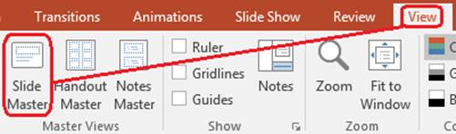

## **개요**

A **슬라이드 마스터** defines shared design settings for a group of slides. It can contain common shapes, logos, backgrounds, text styles, theme settings, and footer settings. In PowerPoint, editing a slide master is the usual way to keep a presentation consistent without repeating the same formatting on every slide.

Aspose.Slides for Android via Java supports the same model. A presentation can contain one or more master slides, and each master slide can contain several layout slides. Normal slides do not usually refer to a master slide directly. Instead, a normal slide uses a layout slide, and that layout slide belongs to a master slide.

The hierarchy is:

1. **슬라이드 마스터** - defines the shared design and theme.
1. **레이아웃 슬라이드** - defines a specific arrangement of placeholders and layout-level formatting.
1. **일반 슬라이드** - contains the actual presentation content and uses one layout slide.


In Aspose.Slides, a slide master is represented by the [IMasterSlide](https://reference.aspose.com/slides/ko/androidjava/com.aspose.slides/imasterslide/) interface. All master slides in a presentation are available through the [Presentation.getMasters](https://reference.aspose.com/slides/ko/androidjava/com.aspose.slides/presentation/#getMasters--) collection, which implements [IMasterSlideCollection](https://reference.aspose.com/slides/ko/androidjava/com.aspose.slides/imasterslidecollection/). For the full Android via Java API surface, see the [com.aspose.slides API reference](https://reference.aspose.com/slides/ko/androidjava/com.aspose.slides/).

{}
When the same property is defined at more than one level, the more specific level wins. For example, if a master slide and a layout slide both define a background, slides based on that layout use the layout background. For more information about layout slides, see [슬라이드 레이아웃 적용 또는 변경](/slides/ko/androidjava/slide-layout/).
{}

## **슬라이드 마스터에 액세스**

In PowerPoint, you can open the Slide Master view from **View** > **Slide Master**.



In Aspose.Slides, use the `getMasters()` collection to access master slides:

```java
Presentation presentation = new Presentation("presentation.pptx");
try {
    IMasterSlide firstMasterSlide = presentation.getMasters().get_Item(0);
    int masterSlideCount = presentation.getMasters().size();
    int firstMasterLayoutSlideCount = firstMasterSlide.getLayoutSlides().size();

    System.out.println("Master slides: " + masterSlideCount);
    System.out.println("Layouts in the first master: " + firstMasterLayoutSlideCount);
} finally {
    presentation.dispose();
}
```

You can also get the master slide used by a normal slide through its layout:

```java
Presentation presentation = new Presentation("presentation.pptx");
try {
    ISlide slide = presentation.getSlides().get_Item(0);
    ILayoutSlide layoutSlide = slide.getLayoutSlide();
    IMasterSlide masterSlide = layoutSlide.getMasterSlide();
    String masterSlideName = masterSlide.getName();

    System.out.println(masterSlideName);
} finally {
    presentation.dispose();
}
```

## **슬라이드 마스터에 포함된 내용**

A master slide is a slide-like object. It implements [IBaseSlide](https://reference.aspose.com/slides/ko/androidjava/com.aspose.slides/ibaseslide/), so it exposes many of the same slide properties used by normal and layout slides.

Commonly used master slide members include:

| 멤버 | 목적 |
| --- | --- |
| `getBackground()` | 마스터 수준 슬라이드 배경을 설정합니다. |
| `getShapes()` | 마스터에 배치된 로고, 그림 프레임 및 공유 텍스트와 같은 도형을 저장합니다. |
| `getLayoutSlides()` | 마스터에 속한 레이아웃 슬라이드를 저장합니다. |
| `getThemeManager()` | 마스터 테마 API에 대한 액세스를 제공합니다. |
| `getHeaderFooterManager()` | 마스터 및 해당 자식 레이아웃의 머리글, 바닥글, 날짜 및 슬라이드 번호를 제어합니다. |
| `getDependingSlides()` | 레이아웃을 통해 마스터에 종속된 일반 슬라이드를 반환합니다. |

## **슬라이드 마스터에 이미지 추가**

When you add an image to a master slide, it appears on slides that use layouts from that master. This is useful for logos, watermarks, decorative bands, and other repeated visual elements.

The following example adds a logo to the first master slide:

```java
Presentation presentation = new Presentation("presentation.pptx");
try {
    IMasterSlide masterSlide = presentation.getMasters().get_Item(0);
    IImage logo = Images.fromFile("logo.png");

    try {
        IPPImage logoImage = presentation.getImages().addImage(logo);

        masterSlide.getShapes().addPictureFrame(
                ShapeType.Rectangle,
                20,
                20,
                80,
                80,
                logoImage);
    } finally {
        logo.dispose();
    }

    presentation.save("presentation-with-logo.pptx", SaveFormat.Pptx);
} finally {
    presentation.dispose();
}
```

For more information about picture frames, see [그림 프레임](/slides/ko/androidjava/picture-frame/).

## **플레이스홀더 작업**

Placeholders are normally defined on layout slides. The master slide provides the shared style and theme that those layouts inherit, while each layout decides which placeholders are available and where they are placed.

In PowerPoint, placeholder commands are available in Slide Master view.


To add new placeholders with Aspose.Slides, work with the layout slide that belongs to the master:

```java
Presentation presentation = new Presentation("presentation.pptx");
try {
    IMasterSlide masterSlide = presentation.getMasters().get_Item(0);
    ILayoutSlide blankLayoutSlide = masterSlide.getLayoutSlides().getByType(SlideLayoutType.Blank);

    if (blankLayoutSlide == null) {
        blankLayoutSlide = masterSlide.getLayoutSlides().add(SlideLayoutType.Blank, "Blank");
    }

    blankLayoutSlide.getPlaceholderManager().addTextPlaceholder(60, 120, 600, 80);

    presentation.getSlides().addEmptySlide(blankLayoutSlide);
    presentation.save("presentation-with-placeholder.pptx", SaveFormat.Pptx);
} finally {
    presentation.dispose();
}
```

You can also format placeholder shapes that already exist on a master slide. The following example finds the title placeholder and applies a linear gradient fill:

```java
Presentation presentation = new Presentation("presentation.pptx");
try {
    IMasterSlide masterSlide = presentation.getMasters().get_Item(0);
    IAutoShape titlePlaceholder = null;

    for (IShape shape : masterSlide.getShapes()) {
        if (shape instanceof IAutoShape) {
            IAutoShape autoShape = (IAutoShape) shape;

            if (autoShape.getPlaceholder() != null &&
                    autoShape.getPlaceholder().getType() == PlaceholderType.Title) {
                titlePlaceholder = autoShape;
                break;
            }
        }
    }

    if (titlePlaceholder != null) {
        int redGradientColor = Color.valueOf(255, 0, 0).toArgb();
        int purpleGradientColor = Color.valueOf(128, 0, 128).toArgb();

        titlePlaceholder.getFillFormat().setFillType(FillType.Gradient);
        titlePlaceholder.getFillFormat().getGradientFormat().setGradientShape(GradientShape.Linear);
        titlePlaceholder.getFillFormat().getGradientFormat().getGradientStops().add(0.0f, redGradientColor);
        titlePlaceholder.getFillFormat().getGradientFormat().getGradientStops().add(1.0f, purpleGradientColor);
    }

    presentation.save("presentation-title-style.pptx", SaveFormat.Pptx);
} finally {
    presentation.dispose();
}
```


For more placeholder and text formatting options, see [플레이스홀더에서 프롬프트 텍스트 설정](/slides/ko/androidjava/manage-placeholder/) and [텍스트 서식](/slides/ko/androidjava/text-formatting/).

## **슬라이드 마스터 배경 변경**

A master background is inherited by layouts and slides that do not override it. The following example sets a solid background color for the first master slide:

```java
Presentation presentation = new Presentation("presentation.pptx");
try {
    IMasterSlide masterSlide = presentation.getMasters().get_Item(0);
    int masterBackgroundColor = Color.GREEN;

    masterSlide.getBackground().setType(BackgroundType.OwnBackground);
    masterSlide.getBackground().getFillFormat().setFillType(FillType.Solid);
    masterSlide.getBackground().getFillFormat().getSolidFillColor().setColor(masterBackgroundColor);

    presentation.save("presentation-master-background.pptx", SaveFormat.Pptx);
} finally {
    presentation.dispose();
}
```

For related topics, see [프레젠테이션 배경](/slides/ko/androidjava/presentation-background/) and [프레젠테이션 테마](/slides/ko/androidjava/presentation-theme/).

## **슬라이드 마스터를 다른 프레젠테이션으로 복제**

Use [IMasterSlideCollection.addClone](https://reference.aspose.com/slides/ko/androidjava/com.aspose.slides/imasterslidecollection/#addClone-com.aspose.slides.IMasterSlide-) to copy a master slide into another presentation. The copied master can then be used by layouts and slides in the destination presentation.

```java
Presentation sourcePresentation = new Presentation("source.pptx");
Presentation destinationPresentation = new Presentation("destination.pptx");
try {
    IMasterSlide sourceMasterSlide = sourcePresentation.getMasters().get_Item(0);
    IMasterSlide clonedMasterSlide = destinationPresentation.getMasters().addClone(sourceMasterSlide);

    destinationPresentation.save("destination-with-master.pptx", SaveFormat.Pptx);
} finally {
    sourcePresentation.dispose();
    destinationPresentation.dispose();
}
```

If you need to clone normal slides together with their master, see [슬라이드 복제](/slides/ko/androidjava/clone-slides/).

## **여러 슬라이드 마스터 추가**

A presentation can contain multiple master slides. This is useful when different sections require different branding, page structure, or theme settings.


The following example clones the default master, gives the clone a different background, creates a layout under that cloned master, and adds a new slide based on that layout:

```java
Presentation presentation = new Presentation("presentation.pptx");
try {
    IMasterSlide defaultMasterSlide = presentation.getMasters().get_Item(0);
    IMasterSlide sectionMasterSlide = presentation.getMasters().addClone(defaultMasterSlide);
    int sectionMasterBackgroundColor = Color.GRAY;

    sectionMasterSlide.getBackground().setType(BackgroundType.OwnBackground);
    sectionMasterSlide.getBackground().getFillFormat().setFillType(FillType.Solid);
    sectionMasterSlide.getBackground().getFillFormat().getSolidFillColor().setColor(sectionMasterBackgroundColor);

    ILayoutSlide sourceBlankLayout = defaultMasterSlide.getLayoutSlides().getByType(SlideLayoutType.Blank);
    if (sourceBlankLayout == null) {
        sourceBlankLayout = defaultMasterSlide.getLayoutSlides().get_Item(0);
    }

    ILayoutSlide sectionBlankLayout = sectionMasterSlide.getLayoutSlides().addClone(sourceBlankLayout);

    presentation.getSlides().addEmptySlide(sectionBlankLayout);
    presentation.save("presentation-with-multiple-masters.pptx", SaveFormat.Pptx);
} finally {
    presentation.dispose();
}
```

## **슬라이드 마스터 비교**

Master slides can be compared with the `equals` method inherited from [IBaseSlide](https://reference.aspose.com/slides/ko/androidjava/com.aspose.slides/ibaseslide/). The comparison checks structure and static content, such as shapes, text, formatting, animations, and other slide settings. It does not compare unique identifiers, such as slide IDs, or dynamic placeholder values, such as the current date.

```java
Presentation firstPresentation = new Presentation("first.pptx");
Presentation secondPresentation = new Presentation("second.pptx");
try {
    int firstPresentationMasterCount = firstPresentation.getMasters().size();
    int secondPresentationMasterCount = secondPresentation.getMasters().size();

    for (int firstMasterIndex = 0; firstMasterIndex < firstPresentationMasterCount; firstMasterIndex++) {
        for (int secondMasterIndex = 0; secondMasterIndex < secondPresentationMasterCount; secondMasterIndex++) {
            IMasterSlide firstMasterSlide = firstPresentation.getMasters().get_Item(firstMasterIndex);
            IMasterSlide secondMasterSlide = secondPresentation.getMasters().get_Item(secondMasterIndex);
            boolean areMasterSlidesEqual = firstMasterSlide.equals(secondMasterSlide);

            if (areMasterSlidesEqual) {
                System.out.printf(
                        "first.pptx master #%d equals second.pptx master #%d%n",
                        firstMasterIndex,
                        secondMasterIndex);
            }
        }
    }
} finally {
    firstPresentation.dispose();
    secondPresentation.dispose();
}
```

For more information, see [프레젠테이션 슬라이드 비교](/slides/ko/androidjava/compare-slides/).

## **슬라이드 마스터 보기를 기본 보기로 설정**

Use the `setLastView` method on [ViewProperties](https://reference.aspose.com/slides/ko/androidjava/com.aspose.slides/viewproperties/) to control the view that PowerPoint opens first. The following example opens the presentation in Slide Master view:

```java
Presentation presentation = new Presentation("presentation.pptx");
try {
    presentation.getViewProperties().setLastView(ViewType.SlideMasterView);
    presentation.save("presentation-master-view.pptx", SaveFormat.Pptx);
} finally {
    presentation.dispose();
}
```

For more view settings, see [프레젠테이션 저장](/slides/ko/androidjava/save-presentation/).

## **사용되지 않는 마스터 슬라이드 제거**

Presentations sometimes contain master slides that are no longer used by any normal slides. Removing unused masters can reduce file size and simplify template maintenance.

Use `removeUnused` to remove unused masters from the `getMasters()` collection:

```java
Presentation presentation = new Presentation("presentation.pptx");
try {
    presentation.getMasters().removeUnused(true);
    presentation.save("presentation-clean.pptx", SaveFormat.Pptx);
} finally {
    presentation.dispose();
}
```

You can also use the low-code [Compress.removeUnusedMasterSlides](https://reference.aspose.com/slides/ko/androidjava/com.aspose.slides/compress/#removeUnusedMasterSlides-com.aspose.slides.Presentation-) method:

```java
Presentation presentation = new Presentation("presentation.pptx");
try {
    Compress.removeUnusedMasterSlides(presentation);
    presentation.save("presentation-clean.pptx", SaveFormat.Pptx);
} finally {
    presentation.dispose();
}
```

## **FAQ**

**슬라이드 마스터와 레이아웃 슬라이드의 차이점은 무엇인가요?**

A slide master defines shared design settings such as theme, background, common shapes, and text styles. A layout slide belongs to a master slide and defines a specific arrangement of placeholders. A normal slide uses a layout slide, so it inherits from both the layout and the master.

**하나의 프레젠테이션에 여러 슬라이드 마스터를 포함할 수 있나요?**

Yes. A presentation can contain several slide masters. Use multiple masters when different sections need different visual systems or branding.

**플레이스홀더를 마스터 슬라이드에 추가해야 하나요, 레이아웃 슬라이드에 추가해야 하나요?**

In most cases, add placeholders to layout slides. Put shared visual elements and shared formatting on the master slide, then put content placeholders on the layouts that normal slides will use.

**여전히 사용 중인 마스터 슬라이드를 삭제할 수 있나요?**

No. A master slide that has dependent slides cannot be safely removed directly. First move those slides to layouts under another master, or use an unused‑master cleanup method that removes only masters that are not in use.