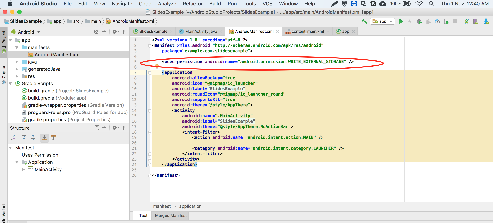

## **개요**

이 문서에서는 Aspose.Slides for Android via Java를 설치하고 Android 프로젝트에 추가하는 방법을 설명합니다. 수동으로 Aspose.Slides JAR 파일을 프로젝트에 추가하는 방법과 Maven 저장소에서 라이브러리를 설치하는 두 가지 설치 옵션을 설명합니다.

이 문서에는 Android Studio에서 새로운 Android 애플리케이션을 만들고, Aspose.Slides 라이브러리를 참조한 뒤, 프로그래밍으로 PowerPoint 프레젠테이션을 생성하고 PPTX 형식으로 저장하는 단계별 예제가 포함되어 있습니다. 또한 버전 관리에 대한 참고 사항과 통합 확인, 메모리 사용 관리, 최종 JAR 크기 축소에 대한 일반적인 질문에 대한 답변도 포함합니다.

## **설치**
이전에는 Aspose.Slides for Android via Java가 JAR 파일, 데모 및 제품 문서를 포함하는 단일 ZIP 파일로 배포되었습니다. 

1. Aspose.Words for Android via Java 18.9보다 이전 버전을 사용하려면 Aspose.Slides.Android.zip 파일을 원하는 디렉터리로 압축 해제해야 합니다. 
1. 추출한 Jar 파일을 Build Path 설정을 사용하여 애플리케이션에 추가합니다. 
### **Aspose.Slides for Android via Java Jar에 대한 참조 추가**
1. 최신 버전의 [Aspose.Slides for Android via Java](https://downloads.aspose.com/slides/ko/androidjava)를 다운로드합니다.
1. aspose-slides-18.9-android.via.java.jar 파일을 프로젝트의 *libs/* 폴더에 복사합니다


### **Maven 저장소에서 Aspose.Slides for Android via Java 설치**
1. build.gradle에 Maven 저장소를 추가합니다. 
1. [Aspose.Slides for Android via Java](https://releases.aspose.com/java/repo/com/aspose/aspose-slides/) JAR를 종속성으로 추가합니다.

``` java

 // 1. build.gradle에 Maven 저장소 추가

repositories {

    mavenCentral()

    maven { url "https://releases.aspose.com/java/repo/" }

}

// 2. 'Aspose.Slides for Android via Java' JAR를 종속성으로 추가

dependencies {

    ...

    ...

    compile (group: 'com.aspose', name: 'aspose-slides', version: 'XX.XX', classifier: 'android.via.java')

}
```
## **Aspose.Slides for Android via Java를 사용한 첫 번째 애플리케이션**
이 섹션에서는 Aspose.Slides for Android via Java를 시작하는 방법을 배웁니다. 새로운 Android 프로젝트를 처음부터 설정하고, Aspose.Slides JAR에 대한 참조를 추가한 뒤, PPTX 형식으로 디스크에 저장되는 새로운 PowerPoint 프레젠테이션을 만드는 방법을 보여드립니다. 여기 예제는 개발에 [Android Studio](https://developer.android.com/studio/index.html) 를 사용하며, 애플리케이션은 Android Emulator에서 실행됩니다. Aspose.Slides for Android via Java를 시작하려면, 다음 단계별 튜토리얼을 따라 Aspose.Slides for Android via Java를 사용하는 앱을 만드세요:

1. [Android Studio](https://developer.android.com/studio/index.html)를 다운로드하고 원하는 위치에 설치합니다.
1. Android Studio를 실행합니다.
1. 새 Android Application Project를 생성합니다.


1. aspose-slides-XX.XX-android.via.java.jar 파일을 프로젝트의 libs 폴더에 복사합니다


1. 파일 메뉴에서 Project Section을 선택하고 Dependencies 탭을 클릭합니다.
   1. "+" 버튼을 클릭하고 파일 종속성 옵션을 선택합니다.
   1. libs 폴더에서 Aspose.Slides 라이브러리를 선택하고 OK를 클릭합니다.


1. 필요에 따라 프로젝트를 gradle 파일과 동기화합니다. 


1. SDcard에 접근하려면 특별 권한을 추가해야 합니다. AndroidManifest.xml 파일을 클릭하고 XML 보기로 전환한 뒤, 파일에 다음 줄을 추가합니다 <uses-permission android:name="android.permission.WRITE_EXTERNAL_STORAGE" />





1. 앱의 코드 섹션으로 돌아가 다음 import 문을 추가합니다: 

``` java

 import java.io.File;

import com.aspose.slides.IAutoShape;

import com.aspose.slides.IParagraph;

import com.aspose.slides.IPortion;

import com.aspose.slides.ISlide;

import com.aspose.slides.ITextFrame;

import com.aspose.slides.Presentation;

import com.aspose.slides.SaveFormat;

import com.aspose.slides.ShapeType;

import android.os.Environment; 

```

이제 onCreate 메서드 본문에 다음 코드를 삽입하여 Aspose.Slides를 사용해 처음부터 새로운 Presentation을 만들고 PPTX 형식으로 SDCard에 저장합니다.

``` java

 try

{

    // PPTX를 나타내는 Presentation 클래스 인스턴스화
    Presentation pres = new Presentation();


    // 첫 번째 슬라이드에 접근
    ISlide sld = pres.getSlides().get_Item(0);


    // Rectangle 유형의 AutoShape 추가
    IAutoShape ashp = sld.getShapes().addAutoShape(ShapeType.Rectangle, 150, 75, 150, 50);


    // Rectangle에 TextFrame 추가
    ashp.addTextFrame(" ");


    // 텍스트 프레임에 접근
    ITextFrame txtFrame = ashp.getTextFrame();


    // 텍스트 프레임용 Paragraph 객체 생성
    IParagraph para = txtFrame.getParagraphs().get_Item(0);


    // Paragraph용 Portion 객체 생성
    IPortion portion = para.getPortions().get_Item(0);


    // 텍스트 설정
    portion.setText("Aspose TextBox");


    // PPTX를 카드에 저장
    String sdCardPath = Environment.getExternalStorageDirectory().getPath() + File.separator;
    pres.save(sdCardPath + "Textbox.pptx",SaveFormat.Pptx);
}

catch (Exception e)

{
   e.printStackTrace();
}
```

전체 코드는 다음과 같아야 합니다:


1. 이제 애플리케이션을 다시 실행합니다. 이번에는 Aspose.Slides 코드가 백그라운드에서 실행되어 문서를 생성하고 SDcard에 저장합니다.


1. 생성된 문서를 보려면 Tools 메뉴로 이동합니다. Android를 선택한 뒤 Android Device Monitor를 선택합니다


## **버전 관리**
2018년 이후, Aspose.Slides for Android via Java의 버전 관리 방식은 Aspose.Slides for Java와 동일합니다.

## **FAQ**

**Aspose.Slides가 올바르게 통합되었는지 확인하려면 어떻게 해야 하나요?**

프로젝트를 빌드하고 빈 [Presentation](https://reference.aspose.com/slides/ko/androidjava/com.aspose.slides/presentation/)을 인스턴스화한 뒤 새 이름으로 저장합니다. 파일이 예외 없이 생성되면 라이브러리가 성공적으로 통합된 것입니다.

**대용량 프레젠테이션을 처리할 때 메모리 사용량을 제한하려면 어떻게 해야 하나요?**

필요한 만큼만 JVM 메모리 제한을 높이고, 각 [Presentation](https://reference.aspose.com/slides/ko/androidjava/com.aspose.slides/presentation/) 인스턴스를 `finally` 블록에서 닫아 캐시를 즉시 해제합니다. 이렇게 하면 메모리 부족 오류를 방지하고 배치 작업 중 전체 메모리 사용량을 예측 가능하게 유지할 수 있습니다.

**불필요한 내보내기 형식을 제외하여 최종 JAR 크기를 줄일 수 있나요?**

현재 Aspose.Slides 릴리스는 단일 모노리식 라이브러리로 제공되므로 빌드 시 PDF 또는 SVG와 같은 특정 내보내기 형식을 비활성화할 수 없습니다.