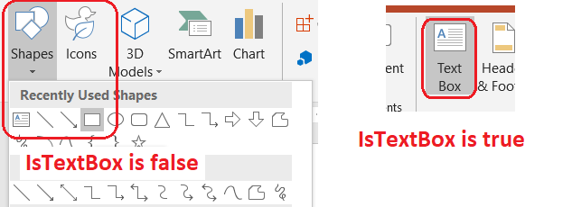

## **소개**

슬라이드의 텍스트는 일반적으로 텍스트 상자나 도형에 존재합니다. 따라서 슬라이드에 텍스트를 추가하려면 텍스트 상자를 추가한 다음 상자 안에 텍스트를 넣어야 합니다. Aspose.Slides for C++는 텍스트를 포함하는 도형을 추가할 수 있는 [IAutoShape](https://reference.aspose.com/slides/ko/cpp/class/aspose.slides.i_auto_shape) 인터페이스를 제공합니다.

{}
Aspose.Slides는 슬라이드에 도형을 추가할 수 있는 [IShape](https://reference.aspose.com/slides/ko/cpp/class/aspose.slides.i_shape) 인터페이스도 제공합니다. 그러나 `IShape` 인터페이스를 통해 추가된 모든 도형이 텍스트를 담을 수 있는 것은 아닙니다. 하지만 [IAutoShape](https://reference.aspose.com/slides/ko/cpp/class/aspose.slides.i_auto_shape) 인터페이스를 통해 추가된 도형은 텍스트를 포함할 수 있습니다. 
{}

{} 
따라서 텍스트를 추가하려는 도형을 다룰 때는 해당 도형이 `IAutoShape` 인터페이스를 통해 캐스팅되었는지 확인해야 할 수 있습니다. 그래야만 `IAutoShape` 아래 속성인 [TextFrame](https://reference.aspose.com/slides/ko/cpp/class/aspose.slides.text_frame)을 사용할 수 있습니다. 이 페이지의 [Update Text](https://docs.aspose.com/slides/ko/cpp/manage-textbox/#update-text) 섹션을 참고하십시오. 
{}

## **슬라이드에 텍스트 상자 만들기**

슬라이드에 텍스트 상자를 만들려면 다음 단계를 진행하십시오:

1. [Presentation](https://reference.aspose.com/slides/ko/cpp/class/aspose.slides.presentation) 클래스의 인스턴스를 생성합니다. 
2. 새로 만든 프레젠테이션의 첫 번째 슬라이드에 대한 참조를 얻습니다. 
3. 슬라이드의 지정 위치에 `Rectangle`으로 설정된 [ShapeType](https://reference.aspose.com/slides/ko/cpp/class/aspose.slides.i_geometry_shape#ad941a828a2d9dd58ae1417b5c00c9a5c)을 사용하여 [IAutoShape](https://reference.aspose.com/slides/ko/cpp/class/aspose.slides.i_auto_shape) 객체를 추가하고, 새로 추가된 `IAutoShape` 객체에 대한 참조를 얻습니다. 
4. 텍스트를 포함할 `IAutoShape` 객체에 `TextFrame` 속성을 추가합니다. 아래 예제에서는 *Aspose TextBox*라는 텍스트를 추가했습니다. 
5. 마지막으로 `Presentation` 객체를 통해 PPTX 파일을 저장합니다. 

위 단계들을 구현한 C++ 코드 예제는 슬라이드에 텍스트를 추가하는 방법을 보여줍니다:

```cpp
// 프레젠테이션 인스턴스 생성
auto pres = System::MakeObject<Presentation>();

// 프레젠테이션의 첫 번째 슬라이드를 가져옵니다
auto sld = pres->get_Slides()->idx_get(0);

// 타입이 Rectangle로 설정된 AutoShape를 추가합니다
auto ashp = sld->get_Shapes()->AddAutoShape(ShapeType::Rectangle, 150.0f, 75.0f, 150.0f, 50.0f);

// Rectangle에 TextFrame을 추가합니다
ashp->AddTextFrame(u" ");

// 텍스트 프레임에 접근합니다
auto txtFrame = ashp->get_TextFrame();

// 텍스트 프레임을 위한 Paragraph 객체를 생성합니다
auto para = txtFrame->get_Paragraphs()->idx_get(0);

// Paragraph를 위한 Portion 객체를 생성합니다
auto portion = para->get_Portions()->idx_get(0);

// 텍스트를 설정합니다
portion->set_Text(u"Aspose TextBox");

// 프레젠테이션을 디스크에 저장합니다
pres->Save(u"TextBox_out.pptx", SaveFormat::Pptx);
```

## **텍스트 상자 도형 확인**

Aspose.Slides는 [IAutoShape](https://reference.aspose.com/slides/ko/cpp/aspose.slides/iautoshape/) 인터페이스의 [get_IsTextBox](https://reference.aspose.com/slides/ko/cpp/aspose.slides/iautoshape/get_istextbox/) 메서드를 제공하여 도형을 검사하고 텍스트 상자를 식별할 수 있게 합니다.



다음 C++ 코드는 도형이 텍스트 상자로 생성되었는지 확인하는 방법을 보여줍니다: 

```c++
auto presentation = MakeObject<Presentation>(u"sample.pptx");
for (auto&& slide : presentation->get_Slides())
{
    for (auto&& shape : slide->get_Shapes())
    {
        if (ObjectExt::Is<IAutoShape>(shape))
        {
            auto autoShape = ExplicitCast<IAutoShape>(shape);
            Console::WriteLine(autoShape->get_IsTextBox() ? u"shape is a text box" : u"shape is not a text box");
        }
    }
}

presentation->Dispose();
```

`IShapeCollection` 인터페이스의 `AddAutoShape` 메서드를 사용하여 자동 도형을 추가하면 해당 자동 도형의 `get_IsTextBox` 메서드는 `false`를 반환합니다. 그러나 `AddTextFrame` 메서드 또는 `set_Text` 메서드로 자동 도형에 텍스트를 추가한 후에는 `get_IsTextBox` 메서드가 `true`를 반환합니다.

```cpp
auto presentation = MakeObject<Presentation>();
auto slide = presentation->get_Slide(0);

auto shape1 = slide->get_Shapes()->AddAutoShape(ShapeType::Rectangle, 10, 10, 100, 40);
// shape1->get_IsTextBox()는 false를 반환합니다
shape1->AddTextFrame(u"shape 1");
// shape1->get_IsTextBox()는 true를 반환합니다

auto shape2 = slide->get_Shapes()->AddAutoShape(ShapeType::Rectangle, 10, 110, 100, 40);
// shape2->get_IsTextBox()는 false를 반환합니다
shape2->get_TextFrame()->set_Text(u"shape 2");
// shape2->get_IsTextBox()는 true를 반환합니다

auto shape3 = slide->get_Shapes()->AddAutoShape(ShapeType::Rectangle, 10, 210, 100, 40);
// shape3->get_IsTextBox()는 false를 반환합니다
shape3->AddTextFrame(u"");
// shape3->get_IsTextBox()는 false를 반환합니다

auto shape4 = slide->get_Shapes()->AddAutoShape(ShapeType::Rectangle, 10, 310, 100, 40);
// shape4->get_IsTextBox()는 false를 반환합니다
shape4->get_TextFrame()->set_Text(u"");
// shape4->get_IsTextBox()는 false를 반환합니다
```

## **텍스트 상자에 열 추가**

Aspose.Slides는 [ITextFrameFormat](https://reference.aspose.com/slides/ko/cpp/class/aspose.slides.i_text_frame_format) 인터페이스와 [TextFrameFormat](https://reference.aspose.com/slides/ko/cpp/class/aspose.slides.i_text_frame_format) 클래스에서 제공하는 [set_ColumnCount](https://reference.aspose.com/slides/ko/cpp/class/aspose.slides.i_text_frame_format#a969f998a2573e1540250855ce67df620) 및 [set_ColumnSpacing](https://reference.aspose.com/slides/ko/cpp/class/aspose.slides.i_text_frame_format#a5254ce6acdc2cd90f4db1c861a94716a) 메서드를 사용하여 텍스트 상자에 열을 추가할 수 있습니다. 텍스트 상자의 열 수와 열 사이의 포인트 단위 간격을 지정할 수 있습니다. 

다음 C++ 코드는 위에서 설명한 작업을 보여줍니다: 

```cpp
auto presentation = System::MakeObject<Presentation>();
// 프레젠테이션의 첫 번째 슬라이드를 가져옵니다
auto slide = presentation->get_Slides()->idx_get(0);

// 타입을 Rectangle로 설정하여 AutoShape를 추가합니다
auto aShape = slide->get_Shapes()->AddAutoShape(ShapeType::Rectangle, 100.0f, 100.0f, 300.0f, 300.0f);

// Rectangle에 TextFrame을 추가합니다
aShape->AddTextFrame(String(u"All these columns are limited to be within a single text container -- ") 
    + u"you can add or delete text and the new or remaining text automatically adjusts " 
    + u"itself to flow within the container. You cannot have text flow from one container " 
    + u"to other though -- we told you PowerPoint's column options for text are limited!");

// TextFrame의 텍스트 형식을 가져옵니다
auto format = aShape->get_TextFrame()->get_TextFrameFormat();

// TextFrame의 열 수를 지정합니다
format->set_ColumnCount(3);

// 열 사이의 간격을 지정합니다
format->set_ColumnSpacing(10);

// 프레젠테이션을 저장합니다
presentation->Save(u"ColumnCount.pptx", SaveFormat::Pptx);
```

## **텍스트 프레임에 열 추가**

Aspose.Slides for C++는 [ITextFrameFormat](https://reference.aspose.com/slides/ko/cpp/class/aspose.slides.i_text_frame_format) 인터페이스의 [set_ColumnCount](https://reference.aspose.com/slides/ko/cpp/class/aspose.slides.i_text_frame_format#a969f998a2573e1540250855ce67df620) 메서드를 제공하여 텍스트 프레임에 열을 추가할 수 있게 합니다. 이 메서드를 통해 텍스트 프레임에 원하는 열 수를 지정할 수 있습니다. 

다음 C++ 코드는 텍스트 프레임 안에 열을 추가하는 방법을 보여줍니다:

```cpp
String outPptxFileName = u"ColumnsTest.pptx";
    
auto pres = System::MakeObject<Presentation>();
auto shape = pres->get_Slides()->idx_get(0)->get_Shapes()->AddAutoShape(ShapeType::Rectangle, 100.0f, 100.0f, 300.0f, 300.0f);
auto format = System::ExplicitCast<TextFrameFormat>(shape->get_TextFrame()->get_TextFrameFormat());

format->set_ColumnCount(2);
shape->get_TextFrame()->set_Text(String(u"All these columns are forced to stay within a single text container -- ") 
    + u"you can add or delete text - and the new or remaining text automatically adjusts " 
    + u"itself to stay within the container. You cannot have text spill over from one container " 
    + u"to other, though -- because PowerPoint's column options for text are limited!");
pres->Save(outPptxFileName, SaveFormat::Pptx);

{
    auto test = System::MakeObject<Presentation>(outPptxFileName);
    auto format1 = System::ExplicitCast<AutoShape>(test->get_Slides()->idx_get(0)->get_Shapes()->idx_get(0))->get_TextFrame()->get_TextFrameFormat();
    CODEPORTING_DEBUG_ASSERT1(2 == format1->get_ColumnCount());
    CODEPORTING_DEBUG_ASSERT1(std::numeric_limits<double>::quiet_NaN() == format1->get_ColumnSpacing());
}

format->set_ColumnSpacing(20);
pres->Save(outPptxFileName, SaveFormat::Pptx);

{
    auto test = System::MakeObject<Presentation>(outPptxFileName);
    auto format2 = System::ExplicitCast<AutoShape>(test->get_Slides()->idx_get(0)->get_Shapes()->idx_get(0))->get_TextFrame()->get_TextFrameFormat();
    CODEPORTING_DEBUG_ASSERT1(2 == format2->get_ColumnCount());
    CODEPORTING_DEBUG_ASSERT1(20 == format2->get_ColumnSpacing());
}

format->set_ColumnCount(3);
format->set_ColumnSpacing(15);
pres->Save(outPptxFileName, SaveFormat::Pptx);

{
    auto test = System::MakeObject<Presentation>(outPptxFileName);
    auto format3 = System::ExplicitCast<AutoShape>(test->get_Slides()->idx_get(0)->get_Shapes()->idx_get(0))->get_TextFrame()->get_TextFrameFormat();
    CODEPORTING_DEBUG_ASSERT1(3 == format3->get_ColumnCount());
    CODEPORTING_DEBUG_ASSERT1(15 == format3->get_ColumnSpacing());
}
```

## **텍스트 업데이트**

Aspose.Slides를 사용하면 텍스트 상자에 포함된 텍스트 또는 프레젠테이션 전체에 포함된 모든 텍스트를 변경하거나 업데이트할 수 있습니다. 

다음 C++ 코드는 프레젠테이션의 모든 텍스트를 업데이트하거나 변경하는 작업을 시연합니다:

```cpp
auto pres = System::MakeObject<Presentation>(u"text.pptx");
for (const auto& slide : pres->get_Slides())
{
    for (const auto& shape : slide->get_Shapes())
    {
        if (ObjectExt::Is<IAutoShape>(shape))
        {
            auto autoShape = System::AsCast<IAutoShape>(shape);
            for (const auto& paragraph : autoShape->get_TextFrame()->get_Paragraphs())
            {
                for (const auto& portion : paragraph->get_Portions())
                {
                    //텍스트를 변경합니다
                    portion->set_Text(portion->get_Text().Replace(u"years", u"months"));
                    //서식을 변경합니다
                    portion->get_PortionFormat()->set_FontBold(NullableBool::True);
                }
            }
        }
    }
}

//수정된 프레젠테이션을 저장합니다
pres->Save(u"text-changed.pptx", SaveFormat::Pptx);
```

## **하이퍼링크가 포함된 텍스트 상자 추가** 

텍스트 상자 안에 링크를 삽입할 수 있습니다. 텍스트 상자를 클릭하면 사용자는 해당 링크가 열리게 됩니다. 

하이퍼링크가 포함된 텍스트 상자를 추가하려면 다음 단계를 수행하십시오:

1. `Presentation` 클래스의 인스턴스를 생성합니다. 
2. 새로 만든 프레젠테이션의 첫 번째 슬라이드에 대한 참조를 얻습니다. 
3. 슬라이드의 지정 위치에 `Rectangle`으로 설정된 `ShapeType`을 가진 `AutoShape` 객체를 추가하고, 새로 추가된 AutoShape 객체에 대한 참조를 얻습니다. 
4. 기본 텍스트 *Aspose TextBox*를 포함하는 `TextFrame`을 `AutoShape` 객체에 추가합니다. 
5. `IHyperlinkManager` 클래스를 인스턴스화합니다. 
6. 원하는 `TextFrame` 부분에 연결된 [set_HyperlinkClick](https://reference.aspose.com/slides/ko/cpp/class/aspose.slides.shape#a617f857c862b71ac2093ed7866677a5c) 메서드에 `IHyperlinkManager` 객체를 할당합니다. 
7. 마지막으로 `Presentation` 객체를 통해 PPTX 파일을 저장합니다. 

위 단계들을 구현한 C++ 코드는 슬라이드에 하이퍼링크가 포함된 텍스트 상자를 추가하는 방법을 보여줍니다:

```cpp
// PPTX를 나타내는 Presentation 클래스를 인스턴스화합니다
auto presentation = System::MakeObject<Presentation>();

// 프레젠테이션의 첫 번째 슬라이드를 가져옵니다
auto slide = presentation->get_Slides()->idx_get(0);

// 타입을 Rectangle로 설정하여 AutoShape 객체를 추가합니다
auto shape = slide->get_Shapes()->AddAutoShape(ShapeType::Rectangle, 150.0f, 150.0f, 150.0f, 50.0f);

// 도형을 AutoShape로 캐스팅합니다
auto autoShape = System::ExplicitCast<IAutoShape>(shape);

// AutoShape와 연결된 ITextFrame 속성에 접근합니다
autoShape->AddTextFrame(u"");

auto textFrame = autoShape->get_TextFrame();

// 프레임에 텍스트를 추가합니다
textFrame->get_Paragraphs()->idx_get(0)->get_Portions()->idx_get(0)->set_Text(u"Aspose.Slides");

// 부분 텍스트에 대한 하이퍼링크를 설정합니다
auto linkManager = textFrame->get_Paragraphs()->idx_get(0)->get_Portions()->idx_get(0)->get_PortionFormat()->get_HyperlinkManager();
linkManager->SetExternalHyperlinkClick(u"http://www.aspose.com");

// PPTX 프레젠테이션을 저장합니다
presentation->Save(u"hLinkPPTX_out.pptx", SaveFormat::Pptx);
```

## **FAQ**

**마스터 슬라이드에서 작업할 때 텍스트 상자와 텍스트 자리표시자(placeholder)의 차이점은 무엇인가요?**

[placeholder](/slides/ko/cpp/manage-placeholder/)는 [마스터](https://reference.aspose.com/slides/ko/cpp/aspose.slides/masterslide/)의 스타일/위치를 상속받으며 [레이아웃](https://reference.aspose.com/slides/ko/cpp/aspose.slides/layoutslide/)에서 재정의될 수 있지만, 일반 텍스트 상자는 특정 슬라이드에 독립적인 객체이며 레이아웃을 전환해도 변경되지 않습니다.

**차트, 표 및 SmartArt 내부의 텍스트를 건드리지 않고 프레젠테이션 전체에서 대량 텍스트 교체를 수행하려면 어떻게 해야 하나요?**

텍스트 프레임이 있는 자동 도형만 반복하고, 차트([charts](https://reference.aspose.com/slides/ko/cpp/aspose.slides.charts/chart/)), 표([tables](https://reference.aspose.com/slides/ko/cpp/aspose.slides/table/)), SmartArt([smartart](https://reference.aspose.com/slides/ko/cpp/aspose.slides.smartart/smartart/))와 같은 삽입 객체는 별도 컬렉션을 순회하거나 해당 객체 유형을 건너뛰어 제외하십시오.