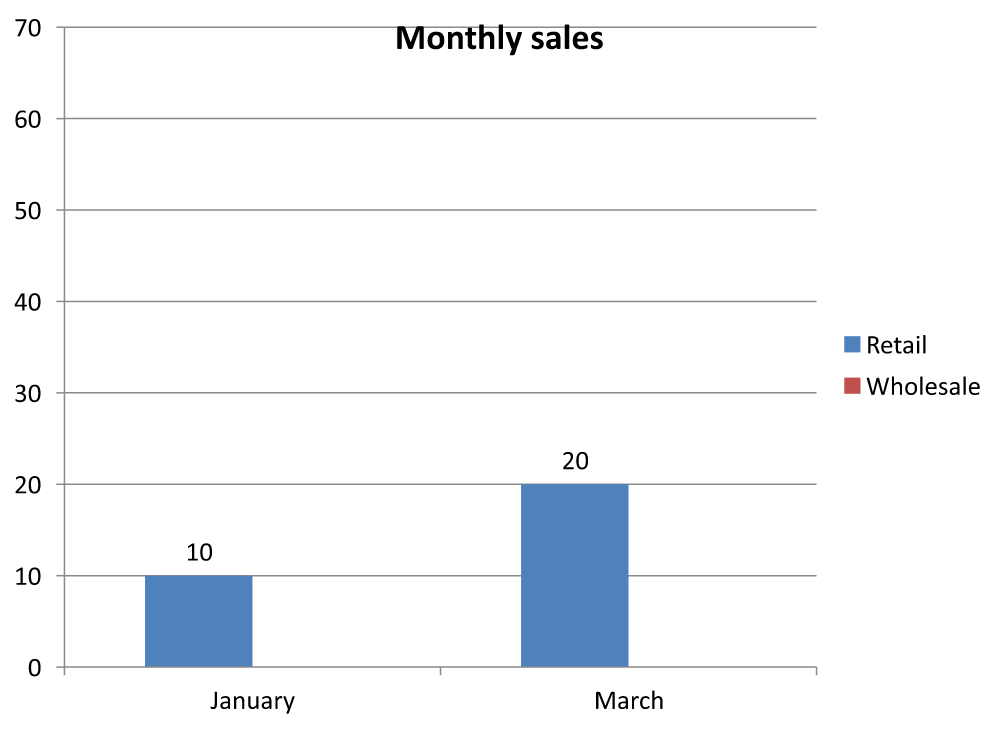

## **개요**

이 문서는 Aspose.Slides에서 차트 워크북을 사용하는 방법을 설명합니다. 워크북 스트림을 통해 차트 데이터를 읽고 쓰는 방법, 워크북 셀을 차트 데이터 레이블로 사용하는 방법, 워크시트 컬렉션에 액세스하는 방법 및 차트 값에 대한 데이터 소스 유형을 지정하는 방법을 보여줍니다.

또한 외부 워크북을 차트 데이터 소스로 사용하는 방법을 다룹니다. 예제에서는 외부 워크북을 만들고 할당하는 방법, 차트에 연결된 외부 워크북의 경로를 가져오는 방법, 워크북이 사용할 수 있을 때 차트 데이터를 편집하는 방법을 보여줍니다.

누락된 데이터를 나타내는 워크북 셀에 대해서는 [빈 셀 표시 제어](/slides/ko/cpp/chart-series/)를 참조하여 빈 셀과 0의 차이점 및 사용 가능한 표시 모드의 선 차트 비교를 확인하십시오.

## **숨겨진 행 및 열의 데이터 포함하기**

숨겨진 워크시트 행 및 열의 데이터를 차트가 플롯할지 여부를 제어하려면 [IChart::set_PlotVisibleCellsOnly](https://reference.aspose.com/slides/cpp/aspose.slides.charts/ichart/set_plotvisiblecellsonly/)를 사용합니다. `true` 로 설정하면 보이는 셀만 플롯하고, `false` 로 설정하면 보이는 셀과 숨겨진 셀을 모두 포함합니다. 이 설정은 차트 플롯을 제어할 뿐이며 워크시트 행이나 열을 숨기거나 표시하지는 않습니다.

[샘플 프레젠테이션](hidden-source-data.pptx)에는 첫 번째 슬라이드의 첫 번째 도형으로 열 차트가 포함되어 있습니다. 포함된 워크시트 `Sheet1`에는 `A1:C4` 범위가 있습니다. 3번째 행과 C 열은 숨겨져 있지만 해당 셀은 여전히 값을 가지고 있습니다.

| 워크시트 행 | A: 월 | B: 소매 | C: 도매 (숨겨진 열) |
| --- | --- | --- | --- |
| 2 | January | 10 | 30 |
| 3 (숨겨진 행) | February | 40 | 60 |
| 4 | March | 20 | 50 |

소스 셀에 접근하려면 [IChartData::get_ChartDataWorkbook](https://reference.aspose.com/slides/cpp/aspose.slides.charts/ichartdata/get_chartdataworkbook/)을 사용하고, 숨김 상태를 확인하려면 [IChartDataCell::get_IsHidden](https://reference.aspose.com/slides/cpp/aspose.slides.charts/ichartdatacell/get_ishidden/)을 읽습니다. 이 속성은 읽기 전용입니다. 이 파일에서 B2는 보이며, B3은 숨겨진 행에 속하고, C2는 숨겨진 열에 속합니다; 예제는 각각 `False`, `True`, `True`를 출력합니다.

이 예제에서는 플롯 설정을 변경한 후 차트 데이터를 새로 고칩니다: 포함된 워크북을 [ReadWorkbookStream](https://reference.aspose.com/slides/cpp/aspose.slides.charts/ichartdata/readworkbookstream/)으로 유지하고 [WriteWorkbookStream](https://reference.aspose.com/slides/cpp/aspose.slides.charts/ichartdata/writeworkbookstream/)으로 다시 로드합니다. 모든 셀을 포함할 때는 [SetRange](https://reference.aspose.com/slides/cpp/aspose.slides.charts/ichartdata/setrange/)을 사용하여 숨겨진 2월 범주를 포함한 전체 범위를 복원합니다. 단순히 플래그를 변경하는 것만으로는 이 샘플의 캐시된 차트 데이터와 범주 레이블을 새로 고치기에 충분하지 않습니다.

```cpp
#include <DOM/Chart/IChartData.h>
#include <DOM/Chart/IChartDataCell.h>
#include <DOM/Chart/IChartDataWorkbook.h>
#include <DOM/IChart.h>
#include <DOM/IShapeCollection.h>
#include <DOM/ISlide.h>
#include <DOM/Presentation.h>
#include <Export/SaveFormat.h>
#include <initializer_list>
#include <system/console.h>
#include <system/io/memory_stream.h>
#include <system/object_ext.h>

using namespace Aspose::Slides;
using namespace Aspose::Slides::Charts;
using namespace System;

auto presentation = MakeObject<Presentation>(u"hidden-source-data.pptx");
auto slide = presentation->get_Slide(0);

auto chart = slide->get_Shapes()->get_Count() > 0 ? AsCast<IChart>(slide->get_Shape(0)) : nullptr;
if (chart != nullptr)
{
    auto workbook = chart->get_ChartData()->get_ChartDataWorkbook();
    Console::WriteLine(u"B2 hidden: {0}", workbook->GetCell(0, u"B2")->get_IsHidden());
    Console::WriteLine(u"B3 hidden: {0}", workbook->GetCell(0, u"B3")->get_IsHidden());
    Console::WriteLine(u"C2 hidden: {0}", workbook->GetCell(0, u"C2")->get_IsHidden());

    auto workbookStream = chart->get_ChartData()->ReadWorkbookStream();
    for (auto visibleOnly : {true, false})
    {
        chart->set_PlotVisibleCellsOnly(visibleOnly);

        // 포함된 워크북에서 차트 데이터를 새로 고칩니다.
        workbookStream->set_Position(0);
        chart->get_ChartData()->WriteWorkbookStream(workbookStream);
        if (!visibleOnly)
        {
            // 숨겨진 범주를 포함한 전체 소스 범위를 복원합니다.
            chart->get_ChartData()->SetRange(u"Sheet1!$A$1:$C$4");
        }

        auto outputPath = visibleOnly ? u"hidden_cells_True.pptx" : u"hidden_cells_False.pptx";
        presentation->Save(outputPath, Export::SaveFormat::Pptx);
    }
}
else
{
    Console::WriteLine(u"The first shape is not a chart.");
}
```

예제는 프레젠테이션의 두 버전을 저장합니다: 보이는 소매 값(10 및 20)만 포함한 버전과 모든 여섯 값을 포함한 버전. 아래 이미지가 두 플롯 모드를 보여줍니다. 행 3과 열 C는 두 포함 워크북 모두에서 숨겨진 상태로 유지됩니다.

| 보이는 셀만 (`true`) | 모든 셀 (`false`) |
| --- | --- |
|  |  |

값이 들어 있는 숨겨진 셀은 빈 셀과 다릅니다. [IChart::get_DisplayBlanksAs](https://reference.aspose.com/slides/cpp/aspose.slides.charts/ichart/get_displayblanksas/)는 누락된 값이 표시되는 방식을 제어하며, 숨겨진 소스 데이터를 포함하거나 제외하지는 않습니다. 예제는 [빈 셀 표시 제어](/slides/ko/cpp/chart-series/#control-the-display-of-empty-cells)를 참고하십시오.

## **차트 데이터 범위 가져오기**

기존 프레젠테이션에서 워크북 데이터를 업데이트하기 전에, 각 차트가 사용하는 워크시트 셀을 식별하기 위해 소스 범위를 검사합니다. [IChartData::GetRange](https://reference.aspose.com/slides/cpp/aspose.slides.charts/ichartdata/getrange/) 메서드는 현재 데이터 범위를 워크시트 한정 수식 형태(`Sheet1!$A$1:$D$5` 등)로 반환합니다. 여기서 `Sheet1`은 워크시트 이름이고, `!`는 셀 범위와 구분하며, `$A$1:$D$5`는 절대 행·열 참조를 나타냅니다.

이 메서드는 차트나 워크북을 변경하지 않고 현재 범위를 읽습니다. 차트가 워크북을 데이터 소스로 사용하지 않는 경우 [System::InvalidOperationException](https://reference.aspose.com/slides/cpp/system/details_invalidoperationexception/)을 발생시킵니다. 자세한 내용은 [ChartData API Reference](https://reference.aspose.com/slides/cpp/aspose.slides.charts/chartdata/)를 참고하십시오.

이 예제는 프레젠테이션을 열고 각 슬라이드의 도형을 직접 확인하여 차트인지 검사합니다. 차트 이름과 소스 범위를 출력합니다. 차트가 워크북을 사용하지 않으면 메시지를 출력하고 다음 차트로 진행합니다.

```cpp
#include <DOM/Chart/IChartData.h>
#include <DOM/IChart.h>
#include <DOM/IShapeCollection.h>
#include <DOM/ISlide.h>
#include <DOM/ISlideCollection.h>
#include <DOM/Presentation.h>
#include <system/console.h>
#include <system/enumerator_adapter.h>
#include <system/exceptions.h>
#include <system/object_ext.h>

using namespace Aspose::Slides;
using namespace Aspose::Slides::Charts;
using namespace System;

auto presentation = MakeObject<Presentation>(u"presentation.pptx");

for (auto slide : IterateOver(presentation->get_Slides()))
{
    for (auto shape : IterateOver(slide->get_Shapes()))
    {
        auto chart = AsCast<IChart>(shape);
        if (chart != nullptr)
        {
            try
            {
                auto range = chart->get_ChartData()->GetRange();
                Console::WriteLine(u"{0}: {1}", chart->get_Name(), range);
            }
            catch (const InvalidOperationException&)
            {
                Console::WriteLine(u"{0}: The chart does not use a workbook as its data source.", chart->get_Name());
            }
        }
    }
}
```

## **워크북에서 차트 데이터 읽기 및 쓰기**

Aspose.Slides for C++는 [ReadWorkbookStream](https://reference.aspose.com/slides/cpp/aspose.slides.charts/ichartdata/readworkbookstream/) 및 [WriteWorkbookStream](https://reference.aspose.com/slides/cpp/aspose.slides.charts/ichartdata/writeworkbookstream/) 메서드를 제공하며, 이를 통해 차트 데이터 워크북( Aspose.Cells로 편집된 차트 데이터 포함)을 읽고 쓸 수 있습니다. **참고** 차트 데이터는 동일한 방식으로 구성되었거나 원본과 유사한 구조를 가져야 합니다.

이 예제는 첫 번째 슬라이드의 첫 번째 도형으로 차트가 포함된 프레젠테이션을 사용합니다. 포함된 워크북을 스트림으로 읽고, 기존 시리즈와 범주를 지우고, 동일한 워크북을 다시 씁니다. 변경 사항은 메모리에 남으며, 예제는 프레젠테이션을 저장하지 않습니다.

```cpp
#include <DOM/Chart/IChartCategoryCollection.h>
#include <DOM/Chart/IChartData.h>
#include <DOM/Chart/IChartSeriesCollection.h>
#include <DOM/IChart.h>
#include <DOM/IShapeCollection.h>
#include <DOM/ISlide.h>
#include <DOM/Presentation.h>
#include <system/console.h>
#include <system/io/memory_stream.h>
#include <system/object_ext.h>

using namespace Aspose::Slides;
using namespace Aspose::Slides::Charts;
using namespace System;

auto presentation = MakeObject<Presentation>(u"chart.pptx");
auto slide = presentation->get_Slide(0);

auto chart = slide->get_Shapes()->get_Count() > 0 ? AsCast<IChart>(slide->get_Shape(0)) : nullptr;
if (chart != nullptr)
{
    auto chartData = chart->get_ChartData();
    auto workbookStream = chartData->ReadWorkbookStream();

    chartData->get_Series()->Clear();
    chartData->get_Categories()->Clear();

    workbookStream->set_Position(0);
    chartData->WriteWorkbookStream(workbookStream);
}
else
{
    Console::WriteLine(u"The first shape is not a chart.");
}
```

### **워크북 수정 후 차트 레이아웃 검증**

포함된 워크북을 수정된 워크북으로 교체하면 차트는 원래 시리즈와 범주 컬렉션을 유지합니다. 이 불일치로 인해 [IChart::ValidateChartLayout](https://reference.aspose.com/slides/cpp/aspose.slides.charts/ichart/validatechartlayout/)이 인덱스 범위 초과 오류로 실패할 수 있습니다. 업데이트된 워크북을 차트에 다시 쓰기 전에 기존 시리즈와 범주를 지우십시오. 이 예제는 첫 번째 슬라이드의 첫 번째 도형인 차트를 사용합니다. 주석은 워크북 편집이 발생할 위치를 표시합니다; 실행 가능한 예제는 원본 워크북을 다시 쓰고 메모리에서 레이아웃을 검증합니다.

```cpp
#include <DOM/Chart/IChartCategoryCollection.h>
#include <DOM/Chart/IChartData.h>
#include <DOM/Chart/IChartSeriesCollection.h>
#include <DOM/IChart.h>
#include <DOM/IShapeCollection.h>
#include <DOM/ISlide.h>
#include <DOM/Presentation.h>
#include <system/console.h>
#include <system/io/memory_stream.h>
#include <system/object_ext.h>

using namespace Aspose::Slides;
using namespace Aspose::Slides::Charts;
using namespace System;

auto presentation = MakeObject<Presentation>(u"chart.pptx");
auto slide = presentation->get_Slide(0);

auto chart = slide->get_Shapes()->get_Count() > 0 ? AsCast<IChart>(slide->get_Shape(0)) : nullptr;
if (chart != nullptr)
{
    auto chartData = chart->get_ChartData();
    auto workbookStream = chartData->ReadWorkbookStream();

    // 여기서 워크북 스트림을 수정합니다, 예를 들어 Aspose.Cells를 사용합니다.

    chartData->get_Series()->Clear();
    chartData->get_Categories()->Clear();

    workbookStream->set_Position(0);
    chartData->WriteWorkbookStream(workbookStream);
    chart->ValidateChartLayout();
}
else
{
    Console::WriteLine(u"The first shape is not a chart.");
}
```

컬렉션을 지우면 워크북을 다시 쓸 때 오래된 데이터 참조가 제거됩니다. 업데이트된 워크북을 사용하기 전에 필요한 시리즈 및 범주 매핑을 다시 구축하십시오.

## **워크북 셀을 차트 데이터 레이블로 설정하기**

워크북 셀의 텍스트를 차트 데이터 레이블로 사용할 수 있습니다.

```cpp
#include <DOM/Chart/ChartType.h>
#include <DOM/Chart/IChartData.h>
#include <DOM/Chart/IChartDataCell.h>
#include <DOM/Chart/IChartDataWorkbook.h>
#include <DOM/Chart/IChartSeries.h>
#include <DOM/Chart/IChartSeriesCollection.h>
#include <DOM/Chart/IDataLabel.h>
#include <DOM/Chart/IDataLabelCollection.h>
#include <DOM/Chart/IDataLabelFormat.h>
#include <DOM/IChart.h>
#include <DOM/IShapeCollection.h>
#include <DOM/ISlide.h>
#include <DOM/Presentation.h>
#include <Export/SaveFormat.h>
#include <system/object_ext.h>

using namespace Aspose::Slides;
using namespace Aspose::Slides::Charts;
using namespace System;

auto presentation = MakeObject<Presentation>(u"chart2.pptx");
auto slide = presentation->get_Slide(0);

auto chart = slide->get_Shapes()->AddChart(ChartType::Bubble, 50, 50, 600, 400, true);
auto series = chart->get_ChartData()->get_Series()->idx_get(0);
auto workbook = chart->get_ChartData()->get_ChartDataWorkbook();

series->get_Labels()->get_DefaultDataLabelFormat()->set_ShowLabelValueFromCell(true);
auto firstLabelCell = workbook->GetCell(0, u"A10", ObjectExt::Box<String>(u"Label 0 cell value"));
auto secondLabelCell = workbook->GetCell(0, u"A11", ObjectExt::Box<String>(u"Label 1 cell value"));
auto thirdLabelCell = workbook->GetCell(0, u"A12", ObjectExt::Box<String>(u"Label 2 cell value"));
series->get_Labels()->idx_get(0)->set_ValueFromCell(firstLabelCell);
series->get_Labels()->idx_get(1)->set_ValueFromCell(secondLabelCell);
series->get_Labels()->idx_get(2)->set_ValueFromCell(thirdLabelCell);

presentation->Save(u"resultchart.pptx", Export::SaveFormat::Pptx);
```

## **워크시트 관리**

[IChartDataWorkbook::get_Worksheets](https://reference.aspose.com/slides/cpp/aspose.slides.charts/ichartdataworkbook/get_worksheets/) 메서드는 차트 워크북에 포함된 워크시트에 대한 액세스를 제공합니다. 이 예제는 기본 데이터가 포함된 원형 차트를 만들고 각 워크시트 이름을 콘솔에 출력합니다.

```cpp
#include <DOM/Chart/ChartType.h>
#include <DOM/Chart/IChartData.h>
#include <DOM/Chart/IChartDataWorkbook.h>
#include <DOM/Chart/IChartDataWorksheet.h>
#include <DOM/Chart/IChartDataWorksheetCollection.h>
#include <DOM/IChart.h>
#include <DOM/IShapeCollection.h>
#include <DOM/ISlide.h>
#include <DOM/Presentation.h>
#include <system/console.h>
#include <system/object_ext.h>

using namespace Aspose::Slides;
using namespace Aspose::Slides::Charts;
using namespace System;

auto presentation = MakeObject<Presentation>();
auto slide = presentation->get_Slide(0);

auto chart = slide->get_Shapes()->AddChart(ChartType::Pie, 50, 50, 400, 500);
auto workbook = chart->get_ChartData()->get_ChartDataWorkbook();

for (auto i = 0; i < workbook->get_Worksheets()->get_Count(); i++)
{
    Console::WriteLine(workbook->get_Worksheets()->idx_get(i)->get_Name());
}
```

## **데이터 소스 유형 지정하기**

이 예제는 기본 데이터가 포함된 3D 열 차트를 만들고 서로 다른 데이터 소스를 사용하여 두 시리즈 이름을 설정합니다. 첫 번째 이름은 문자열 리터럴을 사용하고, 두 번째 이름은 워크시트 0의 셀 C1을 사용합니다. [DataSourceType](https://reference.aspose.com/slides/cpp/aspose.slides.charts/datasourcetype/) 열거형은 각 이름의 소스를 선택합니다. 예제는 업데이트된 시리즈 이름으로 프레젠테이션을 저장합니다.

```cpp
#include <DOM/Chart/ChartType.h>
#include <DOM/Chart/DataSourceType.h>
#include <DOM/Chart/IChartData.h>
#include <DOM/Chart/IChartDataCell.h>
#include <DOM/Chart/IChartDataWorkbook.h>
#include <DOM/Chart/IChartSeries.h>
#include <DOM/Chart/IChartSeriesCollection.h>
#include <DOM/Chart/IStringChartValue.h>
#include <DOM/IChart.h>
#include <DOM/IShapeCollection.h>
#include <DOM/ISlide.h>
#include <DOM/Presentation.h>
#include <Export/SaveFormat.h>
#include <system/object_ext.h>

using namespace Aspose::Slides;
using namespace Aspose::Slides::Charts;
using namespace System;

auto presentation = MakeObject<Presentation>();
auto slide = presentation->get_Slide(0);

auto chart = slide->get_Shapes()->AddChart(ChartType::Column3D, 50, 50, 600, 400, true);
auto literalName = chart->get_ChartData()->get_Series()->idx_get(0)->get_Name();

literalName->set_DataSourceType(DataSourceType::StringLiterals);
literalName->set_Data(ObjectExt::Box<String>(u"LiteralString"));

auto cellName = chart->get_ChartData()->get_Series()->idx_get(1)->get_Name();
auto nameCell = chart->get_ChartData()->get_ChartDataWorkbook()->GetCell(0, u"C1", ObjectExt::Box<String>(u"NewCell"));
cellName->set_DataSourceType(DataSourceType::Worksheet);
cellName->set_Data(nameCell);

presentation->Save(u"pres.pptx", Export::SaveFormat::Pptx);
```

## **지원되지 않는 포함 워크북 형식 감지**

Aspose.Slides는 일부 차트에 포함될 수 있는 Excel 이진 워크북(.xlsb) 형식을 지원하지 않습니다. [IChartData](https://reference.aspose.com/slides/cpp/aspose.slides.charts/ichartdata/)와 [WorkbookType](https://reference.aspose.com/slides/cpp/aspose.slides.charts/workbooktype/) 열거형을 함께 사용하여 [get_EmbeddedWorkbookType](https://reference.aspose.com/slides/cpp/aspose.slides.charts/ichartdata/get_embeddedworkbooktype/) 메서드로 지원되지 않는 형식을 감지하고 해당 차트를 건너뛸 수 있습니다. 이 예제는 기존 프레젠테이션의 첫 번째 슬라이드에 있는 도형을 검사하고, 차트가 아닌 도형을 건너뛰며, 포함된 .xlsb 워크북이 있는 각 차트에 대해 진단 메시지를 출력합니다.

```cpp
#include <DOM/Chart/ChartDataSourceType.h>
#include <DOM/Chart/IChartData.h>
#include <DOM/Chart/WorkbookType.h>
#include <DOM/IChart.h>
#include <DOM/IShapeCollection.h>
#include <DOM/ISlide.h>
#include <DOM/Presentation.h>
#include <system/console.h>
#include <system/enumerator_adapter.h>
#include <system/object_ext.h>

using namespace Aspose::Slides;
using namespace Aspose::Slides::Charts;
using namespace System;

auto presentation = MakeObject<Presentation>(u"sample.pptx");
auto slide = presentation->get_Slide(0);

for (auto shape : IterateOver(slide->get_Shapes()))
{
    auto chart = AsCast<IChart>(shape);
    if (chart == nullptr)
    {
        continue;
    }

    auto chartData = chart->get_ChartData();
    auto isInternalWorkbook = chartData->get_DataSourceType() == ChartDataSourceType::InternalWorkbook;
    auto isBinaryMacro = chartData->get_EmbeddedWorkbookType() == WorkbookType::WorkbookBinaryMacro;

    if (isInternalWorkbook && isBinaryMacro)
    {
        Console::WriteLine(u"Skipping a chart with an unsupported .xlsb workbook.");
        continue;
    }

    // 지원되는 차트 워크북 데이터를 여기서 읽거나 수정합니다.
}
```

## **외부 워크북**

Aspose.Slides는 차트의 데이터 소스로 외부 워크북을 사용하는 것을 지원합니다.

### **외부 워크북 만들기**

[ReadWorkbookStream](https://reference.aspose.com/slides/cpp/aspose.slides.charts/ichartdata/readworkbookstream/)와 [SetExternalWorkbook](https://reference.aspose.com/slides/cpp/aspose.slides.charts/ichartdata/setexternalworkbook/)을 사용하여 포함된 차트 워크북을 파일로 내보내고 차트를 해당 외부 워크북에 연결합니다.

이 예제는 기본 데이터가 포함된 원형 차트를 만들고 워크북을 내보냅니다. 외부 워크북을 차트 데이터 소스로 할당하기 전에 출력 스트림을 닫고, 연결된 프레젠테이션을 저장합니다.

```cpp
#include <DOM/Chart/ChartType.h>
#include <DOM/Chart/IChartData.h>
#include <DOM/IChart>
#include <DOM/IShapeCollection.h>
#include <DOM/ISlide.h>
#include <DOM/Presentation.h>
#include <Export/SaveFormat.h>
#include <system/io/file.h>
#include <system/io/file_stream.h>
#include <system/io/memory_stream.h>
#include <system/io/path.h>

using namespace Aspose::Slides;
using namespace Aspose::Slides::Charts;
using namespace System;

auto presentation = MakeObject<Presentation>();
auto slide = presentation->get_Slide(0);

auto chart = slide->get_Shapes()->AddChart(ChartType::Pie, 50, 50, 400, 600);
auto workbookPath = IO::Path::GetFullPath(u"externalWorkbook1.xlsx");
auto workbookStream = chart->get_ChartData()->ReadWorkbookStream();
auto fileStream = IO::File::Create(workbookPath);
workbookStream->CopyTo(fileStream);
fileStream->Close();

chart->get_ChartData()->SetExternalWorkbook(workbookPath);

presentation->Save(u"externalWorkbook.pptx", Export::SaveFormat::Pptx);
```

### **외부 워크북 설정하기**

[SetExternalWorkbook](https://reference.aspose.com/slides/cpp/aspose.slides.charts/ichartdata/setexternalworkbook/) 메서드를 사용하면 외부 워크북을 차트의 데이터 소스로 할당할 수 있습니다. 이 메서드는 외부 워크북의 경로가 이동된 경우 경로를 업데이트하는 데에도 사용할 수 있습니다.

원격 위치나 리소스에 저장된 워크북의 데이터를 편집할 수는 없지만, 이러한 워크북을 외부 데이터 소스로 사용할 수 있습니다. 외부 워크북에 대한 상대 경로가 제공되면 자동으로 전체 경로로 변환됩니다.

이 예제는 워크시트 이름이 `Sheet1`인 외부 워크북을 사용합니다. 해당 워크북은 B1에 시리즈 이름, A2:A4에 범주 이름, B2:B4에 숫자 값을 포함합니다. 예제는 원형 차트를 만들고 워크북을 연결한 뒤 [SetRange](https://reference.aspose.com/slides/cpp/aspose.slides.charts/ichartdata/setrange/)을 사용해 A1:B4를 하나의 시리즈와 세 개의 범주에 매핑합니다. 연결된 차트와 함께 프레젠테이션을 저장합니다.

```cpp
#include <DOM/Chart/ChartType.h>
#include <DOM/Chart/IChartData.h>
#include <DOM/IChart.h>
#include <DOM/IShapeCollection.h>
#include <DOM/ISlide.h>
#include <DOM/Presentation.h>
#include <Export/SaveFormat.h>
#include <system/io/path.h>

using namespace Aspose::Slides;
using namespace Aspose::Slides::Charts;
using namespace System;

auto presentation = MakeObject<Presentation>();
auto slide = presentation->get_Slide(0);

auto chart = slide->get_Shapes()->AddChart(ChartType::Pie, 50, 50, 400, 600, true);
auto chartData = chart->get_ChartData();
auto workbookPath = IO::Path::GetFullPath(u"externalWorkbook.xlsx");

chartData->SetExternalWorkbook(workbookPath);
chartData->SetRange(u"Sheet1!$A$1:$B$4");

presentation->Save(u"Presentation_with_externalWorkbook.pptx", Export::SaveFormat::Pptx);
```

[SetExternalWorkbook](https://reference.aspose.com/slides/cpp/aspose.slides.charts/ichartdata/setexternalworkbook/)의 `updateChartData` 매개변수는 워크북이 로드되는지를 제어합니다.

* `updateChartData`가 `false`일 때는 워크북 경로만 업데이트됩니다. 차트 데이터는 대상 워크북에서 로드되거나 업데이트되지 않으므로 워크북이 없을 수도 있습니다.
* `updateChartData`가 `true`일 때는 차트 데이터가 대상 워크북에서 업데이트됩니다.

다음 예제는 `updateChartData`를 `false`로 설정한 상태에서 자리표시자 URL을 할당합니다. 이 경우 원형 차트의 기본 데이터는 유지되며, 사용 불가능한 워크북을 로드하지 않고 프레젠테이션을 저장합니다.

```cpp
#include <DOM/Chart/ChartType.h>
#include <DOM/Chart/IChartData.h>
#include <DOM/IChart.h>
#include <DOM/IShapeCollection.h>
#include <DOM/ISlide.h>
#include <DOM/Presentation.h>
#include <Export/SaveFormat.h>

using namespace Aspose::Slides;
using namespace Aspose::Slides::Charts;
using namespace System;

auto presentation = MakeObject<Presentation>();
auto slide = presentation->get_Slide(0);

auto chart = slide->get_Shapes()->AddChart(ChartType::Pie, 50, 50, 400, 600, true);

chart->get_ChartData()->SetExternalWorkbook(u"https://example.com/unavailable-workbook.xlsx", false);
presentation->Save(u"SetExternalWorkbookWithUpdateChartData.pptx", Export::SaveFormat::Pptx);
```

### **차트의 외부 데이터 소스 워크북 경로 가져오기**

차트에 연결된 워크북을 확인하려면 차트가 외부 데이터 소스를 사용하는지 확인하고 워크북 경로를 가져옵니다.

이 예제는 외부 워크북이 연결된 프레젠테이션의 첫 번째 슬라이드에 있는 첫 번째 도형을 검사합니다. 차트가 외부 워크북에 연결된 경우 [get_ExternalWorkbookPath](https://reference.aspose.com/slides/cpp/aspose.slides.charts/ichartdata/get_externalworkbookpath/)을 콘솔에 출력하고, 프레젠테이션의 복사본을 저장합니다.

```cpp
#include <DOM/Chart/ChartDataSourceType.h>
#include <DOM/Chart/IChartData.h>
#include <DOM/IChart.h>
#include <DOM/IShapeCollection.h>
#include <DOM/ISlide.h>
#include <DOM/Presentation.h>
#include <Export/SaveFormat.h>
#include <system/console.h>
#include <system/object_ext.h>

using namespace Aspose::Slides;
using namespace Aspose::Slides::Charts;
using namespace System;

auto presentation = MakeObject<Presentation>(u"externalWorkbook.pptx");
auto slide = presentation->get_Slide(0);

auto chart = slide->get_Shapes()->get_Count() > 0 ? AsCast<IChart>(slide->get_Shape(0)) : nullptr;
if (chart != nullptr)
{
    auto chartData = chart->get_ChartData();
    if (chartData->get_DataSourceType() == ChartDataSourceType::ExternalWorkbook)
    {
        Console::WriteLine(chartData->get_ExternalWorkbookPath());
    }
    else
    {
        Console::WriteLine(u"The chart does not use an external workbook.");
    }
}
else
{
    Console::WriteLine(u"The first shape is not a chart.");
}

presentation->Save(u"Result.pptx", Export::SaveFormat::Pptx);
```

### **차트 데이터 편집하기**

외부 워크북의 데이터를 내부 워크북과 동일한 방식으로 편집할 수 있습니다. 외부 워크북을 로드할 수 없을 경우 예외가 발생합니다.

이 예제는 첫 번째 슬라이드의 첫 번째 도형이며 접근 가능한 외부 워크북에 연결된 차트를 사용합니다. 첫 번째 시리즈의 첫 번째 데이터 포인트 값을 100으로 설정하고 업데이트된 프레젠테이션을 저장합니다. 셀 값을 편집하면 연결된 외부 XLSX 파일이 업데이트되므로 원본 워크북을 보존해야 할 경우 복사본을 사용하십시오.

```cpp
#include <DOM/Chart/IChartData.h>
#include <DOM/Chart/IChartDataCell.h>
#include <DOM/Chart/IChartDataPoint.h>
#include <DOM/Chart/IChartDataPointCollection.h>
#include <DOM/Chart/IChartDataWorkbook.h>
#include <DOM/Chart/IChartSeries.h>
#include <DOM/Chart/IChartSeriesCollection.h>
#include <DOM/Chart/IDoubleChartValue.h>
#include <DOM/IChart.h>
#include <DOM/IShapeCollection.h>
#include <DOM/ISlide.h>
#include <DOM/Presentation.h>
#include <Export/SaveFormat.h>
#include <system/console.h>
#include <system/object_ext.h>

using namespace Aspose::Slides;
using namespace Aspose::Slides::Charts;
using namespace System;

auto presentation = MakeObject<Presentation>(u"presentation.pptx");
auto slide = presentation->get_Slide(0);

auto chart = slide->get_Shapes()->get_Count() > 0 ? AsCast<IChart>(slide->get_Shape(0)) : nullptr;
if (chart != nullptr)
{
    auto series = chart->get_ChartData()->get_Series();
    if (series->get_Count() > 0 && series->idx_get(0)->get_DataPoints()->get_Count() > 0)
    {
        auto valueCell = series->idx_get(0)->get_DataPoints()->idx_get(0)->get_Value()->get_AsCell();
        if (valueCell != nullptr)
        {
            valueCell->set_Value(ObjectExt::Box<int32_t>(100));
            presentation->Save(u"presentation_out.pptx", Export::SaveFormat::Pptx);
        }
        else
        {
            Console::WriteLine(u"The first data point is not linked to a workbook cell.");
        }
    }
    else
    {
        Console::WriteLine(u"The chart has no data points to edit.");
    }
}
else
{
    Console::WriteLine(u"The first shape is not a chart.");
}
```

### **차트 캐시에서 워크북 복구하기**

차트가 누락되었거나 사용할 수 없는 외부 워크북을 사용 중인 경우, Aspose.Slides는 프레젠테이션에 캐시된 데이터를 기반으로 차트 워크북을 재구성할 수 있습니다. [LoadOptions](https://reference.aspose.com/slides/cpp/aspose.slides/loadoptions/)를 생성하고, [set_SpreadsheetOptions](https://reference.aspose.com/slides/cpp/aspose.slides/loadoptions/set_spreadsheetoptions/)로 구성한 뒤, 프레젠테이션을 열기 전에 [ISpreadsheetOptions::set_RecoverWorkbookFromChartCache](https://reference.aspose.com/slides/cpp/aspose.slides/ispreadsheetoptions/set_recoverworkbookfromchartcache/)를 `true` 로 설정하십시오.

다음 C++ 예제는 첫 번째 슬라이드의 첫 번째 도형이며 사용할 수 없는 외부 워크북을 참조하는 차트의 워크북 데이터를 복구합니다. 복구된 데이터는 [IChart::get_ChartData](https://reference.aspose.com/slides/cpp/aspose.slides.charts/ichart/get_chartdata/)와 [IChartData::get_ChartDataWorkbook](https://reference.aspose.com/slides/cpp/aspose.slides.charts/ichartdata/get_chartdataworkbook/)를 통해 액세스합니다:

```cpp
#include <DOM/Chart/IChartData.h>
#include <DOM/Chart/IChartDataWorkbook.h>
#include <DOM/IChart.h>
#include <DOM/IShapeCollection.h>
#include <DOM/ISlide.h>
#include <DOM/LoadOptions.h>
#include <DOM/Presentation.h>
#include <DOM/SpreadsheetOptions.h>
#include <system/console.h>
#include <system/object_ext.h>

using namespace Aspose::Slides;
using namespace Aspose::Slides::Charts;
using namespace System;

auto spreadsheetOptions = MakeObject<SpreadsheetOptions>();
spreadsheetOptions->set_RecoverWorkbookFromChartCache(true);

auto loadOptions = MakeObject<LoadOptions>();
loadOptions->set_SpreadsheetOptions(spreadsheetOptions);

auto presentation = MakeObject<Presentation>(u"presentation.pptx", loadOptions);
auto slide = presentation->get_Slide(0);

auto chart = slide->get_Shapes()->get_Count() > 0 ? AsCast<IChart>(slide->get_Shape(0)) : nullptr;
if (chart != nullptr)
{
    auto recoveredWorkbook = chart->get_ChartData()->get_ChartDataWorkbook();

    // 여기에서 복구된 워크북 데이터를 읽거나 수정합니다.
}
else
{
    Console::WriteLine(u"The first shape is not a chart.");
}
```

외부 워크북을 사용할 수 없고 복구가 비활성화된 경우, Aspose.Slides는 [System::InvalidOperationException](https://reference.aspose.com/slides/cpp/system/details_invalidoperationexception/)을 발생시킵니다. 캐시된 차트 데이터를 사용해도 되는 경우에만 복구를 활성화하십시오. 캐시에는 외부 워크북이 마지막으로 프레젠테이션이 업데이트된 이후에 변경된 내용이 포함되지 않을 수 있습니다.

## **FAQ**

**특정 차트가 외부 워크북에 연결되어 있는지 또는 포함된 워크북에 연결되어 있는지 확인할 수 있나요?**

예. 차트는 [data source type](https://reference.aspose.com/slides/cpp/aspose.slides.charts/chartdata/get_datasourcetype/)과 [path to an external workbook](https://reference.aspose.com/slides/cpp/aspose.slides.charts/chartdata/get_externalworkbookpath/)을 가지고 있습니다. 소스가 외부 워크북인 경우 전체 경로를 읽어 외부 파일이 사용되고 있는지 확인할 수 있습니다.

**외부 워크북에 대한 상대 경로가 지원되며, 어떻게 저장됩니까?**

예. 상대 경로를 지정하면 자동으로 절대 경로로 변환됩니다. 프레젠테이션은 절대 경로를 PPTX 파일에 저장하므로 워크북을 이동하면 링크를 업데이트해야 할 수 있습니다.

**네트워크 리소스/공유에 있는 워크북을 사용할 수 있나요?**

예, 이러한 워크북을 외부 데이터 소스로 사용할 수 있습니다. 그러나 Aspose.Slides에서 원격 워크북을 직접 편집하는 것은 지원되지 않으며, 소스로만 사용할 수 있습니다.

**Aspose.Slides가 프레젠테이션을 저장할 때 외부 XLSX를 덮어쓰나요?**

프레젠테이션은 [link to the external file](https://reference.aspose.com/slides/cpp/aspose.slides.charts/chartdata/get_externalworkbookpath/)을 저장합니다. 셀 기반 차트 데이터를 편집하면 연결된 로컬 XLSX 파일도 업데이트될 수 있습니다. 원본 파일을 유지해야 하면 워크북 복사본을 사용하십시오.

**외부 파일이 암호로 보호된 경우 어떻게 해야 하나요?**

Aspose.Slides는 연결 시 비밀번호를 받지 않습니다. 일반적인 방법은 미리 보호를 해제하거나, 예를 들어 [Aspose.Cells](https://reference.aspose.com/cells/cpp/)를 사용해 복호화된 복사본을 만든 뒤 해당 복사본에 연결하는 것입니다.

**여러 차트가 동일한 외부 워크북을 참조할 수 있나요?**

예. 각 차트는 자체 링크를 저장합니다. 모두 같은 파일을 가리키면 해당 파일을 업데이트할 때마다 다음 데이터 로드 시 모든 차트에 반영됩니다.