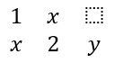

## **개요**

PowerPoint는 방정식을 Office Math Markup Language(OMML)로 저장합니다. Aspose.Slides for C++를 사용하면 프로그램으로 동일한 유형의 수학 콘텐츠를 만들 수 있습니다: 분수, 근호, 함수, 극한, N-ary 연산자, 행렬, 배열 및 서식이 지정된 수학 블록.

PowerPoint에서 사용자는 일반적으로 **삽입 > 방정식**을 통해 방정식을 추가합니다:


그 결과는 슬라이드에 편집 가능한 수학 텍스트가 나타납니다:


Aspose.Slides는 세 가지 주요 객체를 통해 해당 수학 텍스트를 구성합니다:

- 수학 도형은 [AddMathShape](https://reference.aspose.com/slides/ko/cpp/aspose.slides/shapecollection/)로 생성되며, 방정식을 포함하는 도형입니다.
- [MathPortion](https://reference.aspose.com/slides/ko/cpp/aspose.slides.mathtext/mathportion/)은 도형 텍스트 프레임 내부에 수학 콘텐츠를 저장합니다.
- [MathParagraph](https://reference.aspose.com/slides/ko/cpp/aspose.slides.mathtext/mathparagraph/)은 하나 이상의 [MathBlock](https://reference.aspose.com/slides/ko/cpp/aspose.slides.mathtext/mathblock/) 객체를 포함합니다.

아래 대부분의 예제는 [MathematicalText](https://reference.aspose.com/slides/ko/cpp/aspose.slides.mathtext/mathematicaltext/)와 [IMathElement](https://reference.aspose.com/slides/ko/cpp/aspose.slides.mathtext/imathelement/)의 유창한 메서드를 사용하여 코드를 간결하고 읽기 쉽게 유지합니다.

MathML 내보내기 시나리오에 대해서는 [Export Math Equations from Presentations in C++](/slides/ko/cpp/exporting-math-equations/)를 참고하십시오.

## **방정식 만들기**

이 예제는 수학 도형을 만들고 피타고라스 정리를 추가합니다:


```cpp
auto presentation = System::MakeObject<Presentation>();
auto slide = presentation->get_Slide(0);

auto mathShape = slide->get_Shapes()->AddMathShape(20.0f, 20.0f, 700.0f, 120.0f);
auto mathPortion = System::ExplicitCast<MathPortion>(mathShape->get_TextFrame()->get_Paragraph(0)->get_Portion(0));
auto mathParagraph = mathPortion->get_MathParagraph();

auto equation = System::MakeObject<MathematicalText>(u"c")
        - >SetSuperscript(u"2")
        - >Join(u"=")
        - >Join(System::MakeObject<MathematicalText>(u"a")->SetSuperscript(u"2"))
        - >Join(u"+")
        - >Join(System::MakeObject<MathematicalText>(u"b")->SetSuperscript(u"2"));

mathParagraph->Add(equation);

presentation->Save(u"pythagorean-theorem.pptx", SaveFormat::Pptx);
presentation->Dispose();
```

{}
`AddMathShape`은 이미 수학 단락을 포함하는 도형을 생성합니다. 첫 번째 `MathPortion`에 접근하고, 해당 `MathParagraph`를 얻은 다음 수학 블록이나 수학 요소를 추가합니다.
{}

## **분수 추가**

`Divide`를 사용하여 분수를 만듭니다. [MathFractionTypes](https://reference.aspose.com/slides/ko/cpp/aspose.slides.mathtext/mathfractiontypes/)를 사용하여 분수 스타일을 선택할 수 있습니다.


```cpp
auto presentation = System::MakeObject<Presentation>();
auto slide = presentation->get_Slide(0);

auto mathShape = slide->get_Shapes()->AddMathShape(20.0f, 20.0f, 700.0f, 100.0f);
auto mathPortion = System::ExplicitCast<MathPortion>(mathShape->get_TextFrame()->get_Paragraph(0)->get_Portion(0));
auto mathParagraph = mathPortion->get_MathParagraph();

auto fraction = System::MakeObject<MathematicalText>(u"1")
        - >Divide(u"x", MathFractionTypes::Skewed);

mathParagraph->Add(System::MakeObject<MathBlock>(fraction));

presentation->Save(u"fraction.pptx", SaveFormat::Pptx);
presentation->Dispose();
```

스택된 분수를 위해서는 `MathFractionTypes::Bar`를 사용하십시오:

```cpp
auto stackedFraction = System::MakeObject<MathematicalText>(u"x + 1")->Divide(u"y - 1", MathFractionTypes::Bar);
```

## **근호 추가**

`Radical`을 사용하여 제곱근, 세제곱근 또는 기타 근을 만들 수 있습니다. 현재 요소가 밑이 되고, 인수가 차수가 됩니다.


```cpp
auto presentation = System::MakeObject<Presentation>();
auto slide = presentation->get_Slide(0);

auto mathShape = slide->get_Shapes()->AddMathShape(20.0f, 20.0f, 700.0f, 100.0f);
auto mathPortion = System::ExplicitCast<MathPortion>(mathShape->get_TextFrame()->get_Paragraph(0)->get_Portion(0));
auto mathParagraph = mathPortion->get_MathParagraph();

auto radical = System::MakeObject<MathematicalText>(u"x")
        - >Radical(u"n");

mathParagraph->Add(System::MakeObject<MathBlock>(radical));

presentation->Save(u"radical.pptx", SaveFormat::Pptx);
presentation->Dispose();
```

## **함수 및 극한 추가**

`AsArgumentOfFunction` 또는 `Function`을 사용하여 `sin(x)`, `log(x)`와 같은 함수 또는 사용자 정의 함수명을 만들 수 있습니다. 극한의 경우, [MathLimit](https://reference.aspose.com/slides/ko/cpp/aspose.slides.mathtext/mathlimit/)에 `lim`을 넣거나 `SetLowerLimit`를 사용하십시오.


```cpp
auto presentation = System::MakeObject<Presentation>();
auto slide = presentation->get_Slide(0);

auto mathShape = slide->get_Shapes()->AddMathShape(20.0f, 20.0f, 700.0f, 100.0f);
auto mathPortion = System::ExplicitCast<MathPortion>(mathShape->get_TextFrame()->get_Paragraph(0)->get_Portion(0));
auto mathParagraph = mathPortion->get_MathParagraph();

auto limit = System::MakeObject<MathematicalText>(u"lim")
        - >SetLowerLimit(u"x→∞")
        - >Function(u"x");

mathParagraph->Add(System::MakeObject<MathBlock>(limit));

presentation->Save(u"functions-and-limits.pptx", SaveFormat::Pptx);
presentation->Dispose();
```

사용자 정의 함수명을 위해서는 함수명을 현재 요소로 만듭니다:

```cpp
auto customFunction = System::MakeObject<MathematicalText>(u"f")->Function(u"x + 1");
```

## **N-ary 연산자 및 적분 추가**

`Nary`를 사용하여 합계, 합집합, 교집합 및 기타 큰 연산자를 만들 수 있습니다. `Integral`을 사용하여 적분을 만듭니다. 두 메서드 모두 하한 및 상한을 설정할 수 있습니다.


```cpp
auto presentation = System::MakeObject<Presentation>();
auto slide = presentation->get_Slide(0);

auto mathShape = slide->get_Shapes()->AddMathShape(20.0f, 20.0f, 700.0f, 120.0f);
auto mathPortion = System::ExplicitCast<MathPortion>(mathShape->get_TextFrame()->get_Paragraph(0)->get_Portion(0));
auto mathParagraph = mathPortion->get_MathParagraph();

auto summationBase = System::MakeObject<MathematicalText>(u"x")
        - >SetSuperscript(u"k")
        - >Join(System::MakeObject<MathematicalText>(u"a")->SetSuperscript(u"n-k"));

auto summation = summationBase->Nary(MathNaryOperatorTypes::Summation, u"k=0", u"n");

mathParagraph->Add(System::MakeObject<MathBlock>(summation));

presentation->Save(u"nary-operators.pptx", SaveFormat::Pptx);
presentation->Dispose();
```

N-ary 연산자는 선택적 한계를 갖는 큰 연산자에 사용됩니다. `+`, `-`, `=`와 같은 간단한 연산자는 보통 `MathematicalText`로 추가되고 식에 결합됩니다.

적분의 경우, `Integral`을 사용하십시오:

```cpp
auto integralBase = System::MakeObject<MathematicalText>(u"x")->Join(System::MakeObject<MathematicalText>(u"dx")->ToBox());
auto integral = integralBase->Integral(MathIntegralTypes::Simple, u"0", u"1");
```

## **행렬 추가**

행과 열을 위해 [MathMatrix](https://reference.aspose.com/slides/ko/cpp/aspose.slides.mathtext/mathmatrix/)를 사용하십시오. 행렬은 기본적으로 괄호를 포함하지 않으므로, 괄호, 대괄호 또는 중괄호가 필요할 경우 행렬을 감싸야 합니다.



```cpp
auto presentation = System::MakeObject<Presentation>();
auto slide = presentation->get_Slide(0);

auto mathShape = slide->get_Shapes()->AddMathShape(20.0f, 20.0f, 700.0f, 120.0f);
auto mathPortion = System::ExplicitCast<MathPortion>(mathShape->get_TextFrame()->get_Paragraph(0)->get_Portion(0));
auto mathParagraph = mathPortion->get_MathParagraph();

auto matrix = System::MakeObject<MathMatrix>(2, 3);
matrix->idx_set(0, 0, System::MakeObject<MathematicalText>(u"1"));
matrix->idx_set(0, 1, System::MakeObject<MathematicalText>(u"x"));
matrix->idx_set(1, 0, System::MakeObject<MathematicalText>(u"x"));
matrix->idx_set(1, 1, System::MakeObject<MathematicalText>(u"2"));
matrix->idx_set(1, 2, System::MakeObject<MathematicalText>(u"y"));

mathParagraph->Add(System::MakeObject<MathBlock>(matrix));

presentation->Save(u"matrix.pptx", SaveFormat::Pptx);
presentation->Dispose();
```

## **방정식 배열 추가**

정렬된 방정식이나 수식의 수직 스택이 필요할 때는 `ToMathArray`를 사용하십시오.


```cpp
auto presentation = System::MakeObject<Presentation>();
auto slide = presentation->get_Slide(0);

auto mathShape = slide->get_Shapes()->AddMathShape(20.0f, 20.0f, 700.0f, 140.0f);
auto mathPortion = System::ExplicitCast<MathPortion>(mathShape->get_TextFrame()->get_Paragraph(0)->get_Portion(0));
auto mathParagraph = mathPortion->get_MathParagraph();

auto equationArray = System::MakeObject<MathematicalText>(u"x")
        - >Join(u"y")
        - >ToMathArray();

mathParagraph->Add(System::MakeObject<MathBlock>(equationArray));

presentation->Save(u"equation-array.pptx", SaveFormat::Pptx);
presentation->Dispose();
```

## **삼각 함수 추가**

인수가 현재 요소이며 함수 이름이 알려진 경우 `AsArgumentOfFunction`을 사용하십시오.


```cpp
auto presentation = System::MakeObject<Presentation>();
auto slide = presentation->get_Slide(0);

auto mathShape = slide->get_Shapes()->AddMathShape(20.0f, 20.0f, 700.0f, 100.0f);
auto mathPortion = System::ExplicitCast<MathPortion>(mathShape->get_TextFrame()->get_Paragraph(0)->get_Portion(0));
auto mathParagraph = mathPortion->get_MathParagraph();

auto cosine = System::MakeObject<MathematicalText>(u"2x")
        - >AsArgumentOfFunction(MathFunctionsOfOneArgument::Cos);

mathParagraph->Add(System::MakeObject<MathBlock>(cosine));

presentation->Save(u"trigonometric-function.pptx", SaveFormat::Pptx);
presentation->Dispose();
```

## **첨자 및 위첨자 추가**

첨자와 위첨자 도우미를 사용하여 인덱스와 거듭제곱을 표시합니다. 인덱스를 기본 요소의 왼쪽에 표시해야 할 경우 `SetSubSuperscriptOnTheLeft`를 사용하십시오.


```cpp
auto presentation = System::MakeObject<Presentation>();
auto slide = presentation->get_Slide(0);

auto mathShape = slide->get_Shapes()->AddMathShape(20.0f, 20.0f, 700.0f, 100.0f);
auto mathPortion = System::ExplicitCast<MathPortion>(mathShape->get_TextFrame()->get_Paragraph(0)->get_Portion(0));
auto mathParagraph = mathPortion->get_MathParagraph();

auto scripts = System::MakeObject<MathematicalText>(u"Y")
        - >SetSubSuperscriptOnTheLeft(u"1", u"n");

mathParagraph->Add(System::MakeObject<MathBlock>(scripts));

presentation->Save(u"subscript-superscript.pptx", SaveFormat::Pptx);
presentation->Dispose();
```

## **구분 기호 추가**

`Enclose`를 사용하여 식을 구분 기호 안에 넣습니다. 여러 요소를 포함하는 구분 기호 식의 경우 구분 문자도 설정할 수 있습니다.


```cpp
auto presentation = System::MakeObject<Presentation>();
auto slide = presentation->get_Slide(0);

auto mathShape = slide->get_Shapes()->AddMathShape(20.0f, 20.0f, 700.0f, 100.0f);
auto mathPortion = System::ExplicitCast<MathPortion>(mathShape->get_TextFrame()->get_Paragraph(0)->get_Portion(0));
auto mathParagraph = mathPortion->get_MathParagraph();

auto delimiter = System::MakeObject<MathematicalText>(u"x")
        - >Join(u"y")
        - >Join(u"z")
        - >Enclose(u'<', u'>', u'|');

mathParagraph->Add(System::MakeObject<MathBlock>(delimiter));

presentation->Save(u"delimiters.pptx", SaveFormat::Pptx);
presentation->Dispose();
```

## **테두리 상자 추가**

방정식 자체에 테두리를 둘러야 할 경우 `ToBorderBox`를 사용하십시오.


```cpp
auto presentation = System::MakeObject<Presentation>();
auto slide = presentation->get_Slide(0);

auto mathShape = slide->get_Shapes()->AddMathShape(20.0f, 20.0f, 700.0f, 100.0f);
auto mathPortion = System::ExplicitCast<MathPortion>(mathShape->get_TextFrame()->get_Paragraph(0)->get_Portion(0));
auto mathParagraph = mathPortion->get_MathParagraph();

auto boxedEquation = System::MakeObject<MathematicalText>(u"a")
        - >SetSuperscript(u"2")
        - >Join(u"=")
        - >Join(System::MakeObject<MathematicalText>(u"b")->SetSuperscript(u"2"))
        - >Join(u"+")
        - >Join(System::MakeObject<MathematicalText>(u"c")->SetSuperscript(u"2"))
        - >ToBorderBox();

mathParagraph->Add(System::MakeObject<MathBlock>(boxedEquation));

presentation->Save(u"border-box.pptx", SaveFormat::Pptx);
presentation->Dispose();
```

## **항목 그룹화**

`Group`을 사용하여 식 위 또는 아래에 그룹화 문자를 배치합니다. 그룹화된 항목에 레이블을 달기 위해 한계를 추가하십시오.


```cpp
auto presentation = System::MakeObject<Presentation>();
auto slide = presentation->get_Slide(0);

auto mathShape = slide->get_Shapes()->AddMathShape(20.0f, 20.0f, 700.0f, 120.0f);
auto mathPortion = System::ExplicitCast<MathPortion>(mathShape->get_TextFrame()->get_Paragraph(0)->get_Portion(0));
auto mathParagraph = mathPortion->get_MathParagraph();

auto grouped = System::MakeObject<MathematicalText>(u"x + y")
        - >Group(u'\u23DF', MathTopBotPositions::Bottom, MathTopBotPositions::Top)
        - >SetLowerLimit(u"any text");

mathParagraph->Add(System::MakeObject<MathBlock>(grouped));

presentation->Save(u"grouped-terms.pptx", SaveFormat::Pptx);
presentation->Dispose();
```

## **수학 요소 서식 지정**

서식 도우미는 식을 명확히 할 때만 사용하십시오. 예를 들어 `Overbar`는 수학 요소 위에 바를 놓습니다.


```cpp
auto presentation = System::MakeObject<Presentation>();
auto slide = presentation->get_Slide(0);

auto mathShape = slide->get_Shapes()->AddMathShape(20.0f, 20.0f, 700.0f, 100.0f);
auto mathPortion = System::ExplicitCast<MathPortion>(mathShape->get_TextFrame()->get_Paragraph(0)->get_Portion(0));
auto mathParagraph = mathPortion->get_MathParagraph();

auto overbar = System::MakeObject<MathematicalText>(u"ABC")->Overbar();

mathParagraph->Add(System::MakeObject<MathBlock>(overbar));

presentation->Save(u"overbar.pptx", SaveFormat::Pptx);
presentation->Dispose();
```

## **빠른 참조**

| 작업 | 주요 API |
| --- | --- |
| 수학 텍스트 만들기 | [MathematicalText](https://reference.aspose.com/slides/ko/cpp/aspose.slides.mathtext/mathematicaltext/) |
| 요소 결합 | [IMathElement.Join](https://reference.aspose.com/slides/ko/cpp/aspose.slides.mathtext/imathelement/join/) |
| 분수 만들기 | [IMathElement.Divide](https://reference.aspose.com/slides/ko/cpp/aspose.slides.mathtext/imathelement/divide/) |
| 위첨자 또는 아래첨자 추가 | [SetSuperscript](https://reference.aspose.com/slides/ko/cpp/aspose.slides.mathtext/imathelement/setsuperscript/), [SetSubscript](https://reference.aspose.com/slides/ko/cpp/aspose.slides.mathtext/imathelement/setsubscript/) |
| 함수 추가 | [Function](https://reference.aspose.com/slides/ko/cpp/aspose.slides.mathtext/imathelement/function/), [AsArgumentOfFunction](https://reference.aspose.com/slides/ko/cpp/aspose.slides.mathtext/imathelement/asargumentoffunction/) |
| 근호 추가 | [IMathElement.Radical](https://reference.aspose.com/slides/ko/cpp/aspose.slides.mathtext/imathelement/radical/) |
| 극한 추가 | [SetLowerLimit](https://reference.aspose.com/slides/ko/cpp/aspose.slides.mathtext/imathelement/setlowerlimit/), [SetUpperLimit](https://reference.aspose.com/slides/ko/cpp/aspose.slides.mathtext/imathelement/setupperlimit/) |
| 왼쪽 스크립트 추가 | [SetSubSuperscriptOnTheLeft](https://reference.aspose.com/slides/ko/cpp/aspose.slides.mathtext/imathelement/setsubsuperscriptontheleft/) |
| 합계 및 적분 추가 | [Nary](https://reference.aspose.com/slides/ko/cpp/aspose.slides.mathtext/imathelement/nary/), [Integral](https://reference.aspose.com/slides/ko/cpp/aspose.slides.mathtext/imathelement/integral/) |
| 행렬 추가 | [MathMatrix](https://reference.aspose.com/slides/ko/cpp/aspose.slides.mathtext/mathmatrix/) |
| 방정식 배열 추가 | [ToMathArray](https://reference.aspose.com/slides/ko/cpp/aspose.slides.mathtext/imathelement/tomatharray/) |
| 구분 기호 추가 | [Enclose](https://reference.aspose.com/slides/ko/cpp/aspose.slides.mathtext/imathelement/enclose/) |
| 바 및 테두리 추가 | [Overbar](https://reference.aspose.com/slides/ko/cpp/aspose.slides.mathtext/imathelement/overbar/), [ToBorderBox](https://reference.aspose.com/slides/ko/cpp/aspose.slides.mathtext/imathelement/toborderbox/) |
| 항목 그룹화 | [Group](https://reference.aspose.com/slides/ko/cpp/aspose.slides.mathtext/imathelement/group/) |

## **FAQ**

**기존 PowerPoint 방정식을 편집할 수 있나요?**

예. 프레젠테이션을 열고 `MathPortion`을 포함하는 도형을 찾아 해당 `MathParagraph`를 얻은 다음 그 단락의 수학 블록을 업데이트합니다.

**방정식이 편집 가능한 PowerPoint 수학으로 저장되나요?**

예. PPTX로 저장하면 Aspose.Slides는 방정식을 편집 가능한 Office 수학 콘텐츠로 기록합니다.

**방정식을 LaTeX로 내보낼 수 있나요?**

Aspose.Slides는 수학 방정식을 MathML로 내보냅니다. LaTeX가 필요하면 먼저 MathML로 내보낸 다음, 대상 LaTeX 방언을 지원하는 도구로 MathML을 변환하십시오.