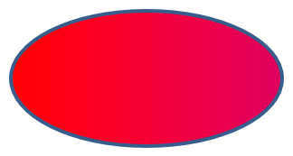

## **소개**

PowerPoint에서 슬라이드에 도형을 추가할 수 있습니다. 도형은 선으로 구성되어 있으므로 윤곽선을 수정하거나 효과를 적용하여 형식을 지정할 수 있습니다. 또한 내부가 채워지는 방식을 제어하는 설정을 지정하여 도형을 형식화할 수 있습니다.


Aspose.Slides for C++는 PowerPoint에서 사용할 수 있는 동일한 옵션을 사용하여 도형을 형식화할 수 있는 인터페이스와 메서드를 제공합니다.

## **선 형식 지정**

Aspose.Slides를 사용하면 도형에 사용자 지정 선 스타일을 지정할 수 있습니다. 절차는 다음과 같습니다:

1. [Presentation](https://reference.aspose.com/slides/ko/cpp/aspose.slides/presentation/) 클래스의 인스턴스를 생성합니다.
1. 인덱스로 슬라이드에 대한 참조를 가져옵니다.
1. 슬라이드에 [IAutoShape](https://reference.aspose.com/slides/ko/cpp/aspose.slides/iautoshape/)을 추가합니다.
1. 도형의 [line style](https://reference.aspose.com/slides/ko/cpp/aspose.slides/linestyle/)을 설정합니다.
1. 선의 두께를 설정합니다.
1. 선의 [dash style](https://reference.aspose.com/slides/ko/cpp/aspose.slides/linedashstyle/)을 설정합니다.
1. 도형의 선 색상을 설정합니다.
1. 수정된 프레젠테이션을 PPTX 파일로 저장합니다.

다음 코드는 사각형 `AutoShape`의 선을 형식화하는 방법을 보여줍니다:

```cpp
#include <DOM/FillType.h>
#include <DOM/IAutoShape.h>
#include <DOM/IColorFormat.h>
#include <DOM/IFillFormat.h>
#include <DOM/ILineFillFormat.h>
#include <DOM/ILineFormat.h>
#include <DOM/IShapeCollection.h>
#include <DOM/ISlide.h>
#include <DOM/LineDashStyle.h>
#include <DOM/LineStyle.h>
#include <DOM/Presentation.h>
#include <DOM/ShapeType.h>
#include <Export/SaveFormat.h>
#include <drawing/color.h>
#include <system/smart_ptr.h>
using namespace Aspose::Slides;
using namespace Aspose::Slides::Export;
using namespace System;
using namespace System::Drawing;

// 프레젠테이션 파일을 나타내는 Presentation 클래스를 인스턴스화합니다.
auto presentation = MakeObject<Presentation>();

// 첫 번째 슬라이드를 가져옵니다.
auto slide = presentation->get_Slide(0);

// 사각형 타입의 자동 도형을 추가합니다.
auto shape = slide->get_Shapes()->AddAutoShape(ShapeType::Rectangle, 50, 150, 150, 75);

// 사각형 도형의 채우기 색상을 설정합니다.
shape->get_FillFormat()->set_FillType(FillType::NoFill);

// 사각형 선에 서식을 적용합니다.
shape->get_LineFormat()->set_Style(LineStyle::ThickThin);
shape->get_LineFormat()->set_Width(7);
shape->get_LineFormat()->set_DashStyle(LineDashStyle::Dash);

// 사각형 선의 색상을 설정합니다.
shape->get_LineFormat()->get_FillFormat()->set_FillType(FillType::Solid);
shape->get_LineFormat()->get_FillFormat()->get_SolidFillColor()->set_Color(Color::get_Blue());

// PPTX 파일을 디스크에 저장합니다.
presentation->Save(u"formatted_lines.pptx", SaveFormat::Pptx);
presentation->Dispose();
```

결과:


## **도형 선에 스케치 효과 적용**

스케치 효과는 도형 선을 손으로 그린 듯하게 보이게 합니다. 선 설정에 접근하려면 [IShape::get_LineFormat](https://reference.aspose.com/slides/ko/cpp/aspose.slides/ishape/get_lineformat/)을, 스케치 설정에 접근하려면 [ILineFormat::get_SketchFormat](https://reference.aspose.com/slides/ko/cpp/aspose.slides/ilineformat/get_sketchformat/)을, 그리고 [ISketchFormat::set_SketchType](https://reference.aspose.com/slides/ko/cpp/aspose.slides/isketchformat/set_sketchtype/)을 사용하여 [LineSketchType](https://reference.aspose.com/slides/ko/cpp/aspose.slides/linesketchtype/) 열거형에서 값을 선택합니다.

다음 C++ 코드는 [LineSketchType::Curved](https://reference.aspose.com/slides/ko/cpp/aspose.slides/linesketchtype/) 효과를 적용하고, 명시적으로 할당된 값을 읽으며, [LineSketchType::None](https://reference.aspose.com/slides/ko/cpp/aspose.slides/linesketchtype/)으로 효과를 제거하는 방법을 보여줍니다:

```cpp
auto presentation = MakeObject<Presentation>();

auto slide = presentation->get_Slide(0);
auto shape = slide->get_Shapes()->AddAutoShape(ShapeType::Rectangle, 50, 50, 200, 100);

// Access the shape's line format and its sketch format.
auto sketchFormat = shape->get_LineFormat()->get_SketchFormat();

// Apply a sketch effect.
sketchFormat->set_SketchType(LineSketchType::Curved);

// Read the sketch effect assigned directly to the shape.
auto explicitSketchType = sketchFormat->get_SketchType();
Console::WriteLine(u"Explicit sketch type: {0}", explicitSketchType);

// Remove the sketch effect.
sketchFormat->set_SketchType(LineSketchType::None);

presentation->Dispose();
```

[ISketchFormat::get_SketchType](https://reference.aspose.com/slides/ko/cpp/aspose.slides/isketchformat/get_sketchtype/)이 반환하는 값은 도형에 직접 할당된 설정을 나타냅니다. 선 서식이 테마, 마스터 슬라이드 또는 레이아웃 슬라이드에서 상속될 수 있는 경우 [ILineFormat::GetEffective](https://reference.aspose.com/slides/ko/cpp/aspose.slides/ilineformat/geteffective/)을 사용하고, [ILineFormatEffectiveData::get_SketchFormat](https://reference.aspose.com/slides/ko/cpp/aspose.slides/ilineformateffectivedata/get_sketchformat/)에 접근한 뒤, [ISketchFormatEffectiveData::get_SketchType](https://reference.aspose.com/slides/ko/cpp/aspose.slides/isketchformateffectivedata/get_sketchtype/)을 읽습니다. 유효값은 상속이 해결된 후 실제 적용된 서식을 반영합니다:

```cpp
auto presentation = MakeObject<Presentation>(u"presentation.pptx");

auto shape = presentation->get_Slide(0)->get_Shape(0);
auto lineFormat = shape->get_LineFormat();

auto explicitSketchType = lineFormat->get_SketchFormat()->get_SketchType();
auto effectiveLineFormat = lineFormat->GetEffective();
auto effectiveSketchType = effectiveLineFormat->get_SketchFormat()->get_SketchType();

Console::WriteLine(u"Explicit sketch type: {0}", explicitSketchType);
Console::WriteLine(u"Effective sketch type: {0}", effectiveSketchType);

presentation->Dispose();
```

## **조인 스타일 형식 지정**

다음은 세 가지 조인 유형 옵션입니다:

* Round
* Miter
* Bevel

기본적으로 PowerPoint는 두 선이 각도(예: 도형 모서리)에서 만나면 **Round** 설정을 사용합니다. 그러나 날카로운 각도가 있는 도형을 그리는 경우 **Miter** 옵션을 선호할 수 있습니다.


다음 C++ 코드는 위 이미지와 같이 Miter, Bevel, Round 조인 유형 설정을 사용하여 세 개의 사각형을 만든 방법을 보여줍니다:

```cpp
#include <DOM/FillType.h>
#include <DOM/IAutoShape.h>
#include <DOM/IColorFormat.h>
#include <DOM/IFillFormat.h>
#include <DOM/ILineFillFormat.h>
#include <DOM/ILineFormat.h>
#include <DOM/IShapeCollection.h>
#include <DOM/ISlide.h>
#include <DOM/ITextFrame.h>
#include <DOM/LineJoinStyle.h>
#include <DOM/Presentation.h>
#include <DOM/ShapeType.h>
#include <Export/SaveFormat.h>
#include <drawing/color.h>
#include <system/smart_ptr.h>
using namespace Aspose::Slides;
using namespace Aspose::Slides::Export;
using namespace System;
using namespace System::Drawing;

// 프레젠테이션 파일을 나타내는 Presentation 클래스를 인스턴스화합니다.
auto presentation = MakeObject<Presentation>();

// 첫 번째 슬라이드를 가져옵니다.
auto slide = presentation->get_Slide(0);

// 사각형 타입의 자동 도형 세 개를 추가합니다.
auto shape1 = slide->get_Shapes()->AddAutoShape(ShapeType::Rectangle, 20, 20, 150, 75);
auto shape2 = slide->get_Shapes()->AddAutoShape(ShapeType::Rectangle, 210, 20, 150, 75);
auto shape3 = slide->get_Shapes()->AddAutoShape(ShapeType::Rectangle, 20, 135, 150, 75);

// 각 사각형 도형의 채우기 색상을 설정합니다.
shape1->get_FillFormat()->set_FillType(FillType::Solid);
shape1->get_FillFormat()->get_SolidFillColor()->set_Color(Color::get_Black());
shape2->get_FillFormat()->set_FillType(FillType::Solid);
shape2->get_FillFormat()->get_SolidFillColor()->set_Color(Color::get_Black());
shape3->get_FillFormat()->set_FillType(FillType::Solid);
shape3->get_FillFormat()->get_SolidFillColor()->set_Color(Color::get_Black());

// 선 두께를 설정합니다.
shape1->get_LineFormat()->set_Width(15);
shape2->get_LineFormat()->set_Width(15);
shape3->get_LineFormat()->set_Width(15);

// 각 사각형 선의 색상을 설정합니다.
shape1->get_LineFormat()->get_FillFormat()->set_FillType(FillType::Solid);
shape1->get_LineFormat()->get_FillFormat()->get_SolidFillColor()->set_Color(Color::get_Blue());
shape2->get_LineFormat()->get_FillFormat()->set_FillType(FillType::Solid);
shape2->get_LineFormat()->get_FillFormat()->get_SolidFillColor()->set_Color(Color::get_Blue());
shape3->get_LineFormat()->get_FillFormat()->set_FillType(FillType::Solid);
shape3->get_LineFormat()->get_FillFormat()->get_SolidFillColor()->set_Color(Color::get_Blue());

// 조인 스타일을 설정합니다.
shape1->get_LineFormat()->set_JoinStyle(LineJoinStyle::Miter);
shape2->get_LineFormat()->set_JoinStyle(LineJoinStyle::Bevel);
shape3->get_LineFormat()->set_JoinStyle(LineJoinStyle::Round);

// 각 사각형에 텍스트를 추가합니다.
shape1->get_TextFrame()->set_Text(u"Miter Join Style");
shape2->get_TextFrame()->set_Text(u"Bevel Join Style");
shape3->get_TextFrame()->set_Text(u"Round Join Style");

// PPTX 파일을 디스크에 저장합니다.
presentation->Save(u"join_styles.pptx", SaveFormat::Pptx);
presentation->Dispose();
```

## **그라디언트 채우기**

PowerPoint에서 그라디언트 채우기는 도형에 연속적인 색상 혼합을 적용하는 서식 옵션입니다. 예를 들어 두 개 이상의 색상을 하나가 점차 다른 색상으로 사라지도록 적용할 수 있습니다.

Aspose.Slides를 사용하여 도형에 그라디언트 채우기를 적용하는 방법은 다음과 같습니다:

1. [Presentation](https://reference.aspose.com/slides/ko/cpp/aspose.slides/presentation/) 클래스의 인스턴스를 생성합니다.
1. 인덱스로 슬라이드에 대한 참조를 가져옵니다.
1. 슬라이드에 [IAutoShape](https://reference.aspose.com/slides/ko/cpp/aspose.slides/iautoshape/)을 추가합니다.
1. 도형의 [FillType](https://reference.aspose.com/slides/ko/cpp/aspose.slides/filltype/)을 `Gradient`로 설정합니다.
1. [IGradientFormat](https://reference.aspose.com/slides/ko/cpp/aspose.slides/igradientformat/) 인터페이스가 노출하는 그라디언트 스톱 컬렉션의 `Add` 메서드를 사용하여 정의된 위치에 두 가지 선호 색상을 추가합니다.
1. 수정된 프레젠테이션을 PPTX 파일로 저장합니다.

다음 C++ 코드는 타원에 그라디언트 채우기 효과를 적용하는 방법을 보여줍니다:

```cpp
#include <DOM/FillType.h>
#include <DOM/GradientDirection.h>
#include <DOM/GradientShape.h>
#include <DOM/IAutoShape.h>
#include <DOM/IFillFormat.h>
#include <DOM/IGradientFormat.h>
#include <DOM/IGradientStopCollection.h>
#include <DOM/IShapeCollection.h>
#include <DOM/ISlide.h>
#include <DOM/Presentation.h>
#include <DOM/PresetColor.h>
#include <DOM/ShapeType.h>
#include <Export/SaveFormat.h>
#include <system/smart_ptr.h>
using namespace Aspose::Slides;
using namespace Aspose::Slides::Export;
using namespace System;

// 프레젠테이션 파일을 나타내는 Presentation 클래스를 인스턴스화합니다.
auto presentation = MakeObject<Presentation>();

// 첫 번째 슬라이드를 가져옵니다.
auto slide = presentation->get_Slide(0);

// 타원 타입의 자동 도형을 추가합니다.
auto shape = slide->get_Shapes()->AddAutoShape(ShapeType::Ellipse, 50, 50, 150, 75);

// 타원에 그라디언트 서식을 적용합니다.
shape->get_FillFormat()->set_FillType(FillType::Gradient);
shape->get_FillFormat()->get_GradientFormat()->set_GradientShape(GradientShape::Linear);

// 그라디언트 방향을 설정합니다.
shape->get_FillFormat()->get_GradientFormat()->set_GradientDirection(GradientDirection::FromCorner2);

// 두 개의 그라디언트 스톱을 추가합니다.
shape->get_FillFormat()->get_GradientFormat()->get_GradientStops()->Add(1.0f, PresetColor::Purple);
shape->get_FillFormat()->get_GradientFormat()->get_GradientStops()->Add(0.0f, PresetColor::Red);

// PPTX 파일을 디스크에 저장합니다.
presentation->Save(u"gradient_fill.pptx", SaveFormat::Pptx);
presentation->Dispose();
```

결과:



## **패턴 채우기**

PowerPoint에서 패턴 채우기는 두 가지 색상 디자인(점, 줄무늬, 교차선 또는 체크 등)을 도형에 적용할 수 있는 서식 옵션입니다. 패턴의 전경색과 배경색을 사용자 지정할 수 있습니다.

Aspose.Slides는 프레젠테이션의 시각적 매력을 높이기 위해 도형에 적용할 수 있는 45개 이상의 사전 정의된 패턴 스타일을 제공합니다. 사전 정의된 패턴을 선택한 후에도 정확한 색상을 지정할 수 있습니다.

Aspose.Slides를 사용하여 도형에 패턴 채우기를 적용하는 방법은 다음과 같습니다:

1. [Presentation](https://reference.aspose.com/slides/ko/cpp/aspose.slides/presentation/) 클래스의 인스턴스를 생성합니다.
1. 인덱스로 슬라이드에 대한 참조를 가져옵니다.
1. 슬라이드에 [IAutoShape](https://reference.aspose.com/slides/ko/cpp/aspose.slides/iautoshape/)을 추가합니다.
1. 도형의 [FillType](https://reference.aspose.com/slides/ko/cpp/aspose.slides/filltype/)을 `Pattern`으로 설정합니다.
1. 사전 정의된 옵션 중에서 패턴 스타일을 선택합니다.
1. 패턴의 [Background Color](https://reference.aspose.com/slides/ko/cpp/aspose.slides/ipatternformat/get_backcolor/)을 설정합니다.
1. 패턴의 [Foreground Color](https://reference.aspose.com/slides/ko/cpp/aspose.slides/ipatternformat/get_forecolor/)을 설정합니다.
1. 수정된 프레젠테이션을 PPTX 파일로 저장합니다.

다음 C++ 코드는 사각형에 패턴 채우기를 적용하는 방법을 보여줍니다:

```cpp
#include <DOM/FillType.h>
#include <DOM/IAutoShape.h>
#include <DOM/IColorFormat.h>
#include <DOM/IFillFormat.h>
#include <DOM/IPatternFormat.h>
#include <DOM/IShapeCollection.h>
#include <DOM/ISlide.h>
#include <DOM/PatternStyle.h>
#include <DOM/Presentation.h>
#include <DOM/ShapeType.h>
#include <Export/SaveFormat.h>
#include <drawing/color.h>
#include <system/smart_ptr.h>
using namespace Aspose::Slides;
using namespace Aspose::Slides::Export;
using namespace System;
using namespace System::Drawing;

// 프레젠테이션 파일을 나타내는 Presentation 클래스를 인스턴스화합니다.
auto presentation = MakeObject<Presentation>();

// 첫 번째 슬라이드를 가져옵니다.
auto slide = presentation->get_Slide(0);

// 사각형 타입의 자동 도형을 추가합니다.
auto shape = slide->get_Shapes()->AddAutoShape(ShapeType::Rectangle, 50, 50, 150, 75);

// 채우기 유형을 Pattern으로 설정합니다.
shape->get_FillFormat()->set_FillType(FillType::Pattern);

// 패턴 스타일을 설정합니다.
shape->get_FillFormat()->get_PatternFormat()->set_PatternStyle(PatternStyle::Trellis);

// 패턴의 배경색 및 전경색을 설정합니다.
shape->get_FillFormat()->get_PatternFormat()->get_BackColor()->set_Color(Color::get_LightGray());
shape->get_FillFormat()->get_PatternFormat()->get_ForeColor()->set_Color(Color::get_Yellow());

// PPTX 파일을 디스크에 저장합니다.
presentation->Save(u"pattern_fill.pptx", SaveFormat::Pptx);
presentation->Dispose();
```

결과:


## **그림 채우기**

PowerPoint에서 그림 채우기는 이미지를 도형 내부에 삽입하여 이미지가 도형의 배경으로 사용되도록 하는 서식 옵션입니다.

Aspose.Slides를 사용하여 도형에 그림 채우기를 적용하는 방법은 다음과 같습니다:

1. [Presentation](https://reference.aspose.com/slides/ko/cpp/aspose.slides/presentation/) 클래스의 인스턴스를 생성합니다.
1. 인덱스로 슬라이드에 대한 참조를 가져옵니다.
1. 슬라이드에 [IAutoShape](https://reference.aspose.com/slides/ko/cpp/aspose.slides/iautoshape/)을 추가합니다.
1. 도형의 [FillType](https://reference.aspose.com/slides/ko/cpp/aspose.slides/filltype/)을 `Picture`로 설정합니다.
1. 그림 채우기 모드를 `Tile`(또는 다른 선호 모드)으로 설정합니다.
1. 사용하려는 이미지에서 [IPPImage](https://reference.aspose.com/slides/ko/cpp/aspose.slides/ippimage/) 객체를 생성합니다.
1. 이미지를 `ISlidesPicture.set_Image` 메서드에 전달합니다.
1. 수정된 프레젠테이션을 PPTX 파일로 저장합니다.

다음은 "lotus.png" 파일을 사용한 그림 예시입니다:


다음 C++ 코드는 그림으로 도형을 채우는 방법을 보여줍니다:

```cpp
#include <DOM/FillType.h>
#include <DOM/IAutoShape.h>
#include <DOM/IFillFormat.h>
#include <DOM/IImageCollection.h>
#include <DOM/IPictureFillFormat.h>
#include <DOM/IShapeCollection.h>
#include <DOM/ISlide.h>
#include <DOM/ISlidesPicture.h>
#include <DOM/PictureFillMode.h>
#include <DOM/Presentation.h>
#include <DOM/ShapeType.h>
#include <Export/SaveFormat.h>
#include <IImage.h>
#include <Util/Images.h>
#include <system/smart_ptr.h>
using namespace Aspose::Slides;
using namespace Aspose::Slides::Export;
using namespace System;

// 프레젠테이션 파일을 나타내는 Presentation 클래스를 인스턴스화합니다.
auto presentation = MakeObject<Presentation>();

// 첫 번째 슬라이드를 가져옵니다.
auto slide = presentation->get_Slide(0);

// 사각형 타입의 자동 도형을 추가합니다.
auto shape = slide->get_Shapes()->AddAutoShape(ShapeType::Rectangle, 50, 50, 255, 130);

// 채우기 유형을 Picture로 설정합니다.
shape->get_FillFormat()->set_FillType(FillType::Picture);

// 그림 채우기 모드를 설정합니다.
shape->get_FillFormat()->get_PictureFillFormat()->set_PictureFillMode(PictureFillMode::Tile);

// 이미지를 로드하고 프레젠테이션 리소스에 추가합니다.
auto image = Images::FromFile(u"lotus.png");
auto picture = presentation->get_Images()->AddImage(image);
image->Dispose();

// 그림을 설정합니다.
shape->get_FillFormat()->get_PictureFillFormat()->get_Picture()->set_Image(picture);

// PPTX 파일을 디스크에 저장합니다.
presentation->Save(u"picture_fill.pptx", SaveFormat::Pptx);
presentation->Dispose();
```

결과:


### **텍스처로 타일링 그림 사용**

타일링된 그림을 텍스처로 설정하고 타일링 동작을 사용자 정의하려면 [IPictureFillFormat](https://reference.aspose.com/slides/ko/cpp/aspose.slides/ipicturefillformat/) 인터페이스와 [PictureFillFormat](https://reference.aspose.com/slides/ko/cpp/aspose.slides/picturefillformat/) 클래스의 다음 메서드를 사용할 수 있습니다:

- [set_PictureFillMode](https://reference.aspose.com/slides/ko/cpp/aspose.slides/ipicturefillformat/set_picturefillmode/): 그림 채우기 모드를 `Tile` 또는 `Stretch`로 설정합니다.
- [set_TileAlignment](https://reference.aspose.com/slides/ko/cpp/aspose.slides/ipicturefillformat/set_tilealignment/): 도형 내 타일 정렬을 지정합니다.
- [set_TileFlip](https://reference.aspose.com/slides/ko/cpp/aspose.slides/ipicturefillformat/set_tileflip/): 타일을 수평, 수직 또는 모두 뒤집을지 제어합니다.
- [set_TileOffsetX](https://reference.aspose.com/slides/ko/cpp/aspose.slides/ipicturefillformat/set_tileoffsetx/): 도형 원점에서 타일의 수평 오프셋(포인트)을 설정합니다.
- [set_TileOffsetY](https://reference.aspose.com/slides/ko/cpp/aspose.slides/ipicturefillformat/set_tileoffsety/): 도형 원점에서 타일의 수직 오프셋(포인트)을 설정합니다.
- [set_TileScaleX](https://reference.aspose.com/slides/ko/cpp/aspose.slides/ipicturefillformat/set_tilescalex/): 타일의 수평 배율을 백분율로 정의합니다.
- [set_TileScaleY](https://reference.aspose.com/slides/ko/cpp/aspose.slides/ipicturefillformat/set_tilescaley/): 타일의 수직 배율을 백분율로 정의합니다.

다음 코드 샘플은 타일링된 그림 채우기가 적용된 사각형 도형을 추가하고 타일 옵션을 구성하는 방법을 보여줍니다:

```cpp
#include <DOM/FillType.h>
#include <DOM/IAutoShape.h>
#include <DOM/IFillFormat.h>
#include <DOM/IImageCollection.h>
#include <DOM/IPictureFillFormat.h>
#include <DOM/IShapeCollection.h>
#include <DOM/ISlide.h>
#include <DOM/ISlidesPicture.h>
#include <DOM/PictureFillMode.h>
#include <DOM/Presentation.h>
#include <DOM/RectangleAlignment.h>
#include <DOM/ShapeType.h>
#include <DOM/TileFlip.h>
#include <Export/SaveFormat.h>
#include <IImage.h>
#include <Util/Images.h>
#include <system/smart_ptr.h>
using namespace Aspose::Slides;
using namespace Aspose::Slides::Export;
using namespace System;

// 프레젠테이션 파일을 나타내는 Presentation 클래스를 인스턴스화합니다.
auto presentation = MakeObject<Presentation>();

// 첫 번째 슬라이드를 가져옵니다.
auto firstSlide = presentation->get_Slide(0);

// 사각형 자동 도형을 추가합니다.
auto shape = firstSlide->get_Shapes()->AddAutoShape(ShapeType::Rectangle, 50, 50, 190, 95);

// 도형의 채우기 유형을 Picture로 설정합니다.
shape->get_FillFormat()->set_FillType(FillType::Picture);

// 이미지를 로드하고 프레젠테이션 리소스에 추가합니다.
auto sourceImage = Images::FromFile(u"lotus.png");
auto presentationImage = presentation->get_Images()->AddImage(sourceImage);
sourceImage->Dispose();

// 이미지를 도형에 할당합니다.
auto pictureFillFormat = shape->get_FillFormat()->get_PictureFillFormat();
pictureFillFormat->get_Picture()->set_Image(presentationImage);

// 그림 채우기 모드와 타일링 속성을 구성합니다.
pictureFillFormat->set_PictureFillMode(PictureFillMode::Tile);
pictureFillFormat->set_TileOffsetX(-32);
pictureFillFormat->set_TileOffsetY(-32);
pictureFillFormat->set_TileScaleX(50);
pictureFillFormat->set_TileScaleY(50);
pictureFillFormat->set_TileAlignment(RectangleAlignment::BottomRight);
pictureFillFormat->set_TileFlip(TileFlip::FlipBoth);

// PPTX 파일을 디스크에 저장합니다.
presentation->Save(u"tile.pptx", SaveFormat::Pptx);
presentation->Dispose();
```

결과:


## **단색 채우기**

PowerPoint에서 단색 채우기는 도형을 단일균일한 색상으로 채우는 서식 옵션입니다. 이 배경 색상은 그라디언트, 텍스처 또는 패턴 없이 적용됩니다.

Aspose.Slides를 사용하여 도형에 단색 채우기를 적용하려면 다음 단계를 따르세요:

1. [Presentation](https://reference.aspose.com/slides/ko/cpp/aspose.slides/presentation/) 클래스의 인스턴스를 생성합니다.
1. 인덱스로 슬라이드에 대한 참조를 가져옵니다.
1. 슬라이드에 [IAutoShape](https://reference.aspose.com/slides/ko/cpp/aspose.slides/iautoshape/)을 추가합니다.
1. 도형의 [FillType](https://reference.aspose.com/slides/ko/cpp/aspose.slides/filltype/)을 `Solid`로 설정합니다.
1. 원하는 채우기 색상을 도형에 할당합니다.
1. 수정된 프레젠테이션을 PPTX 파일로 저장합니다.

다음 C++ 코드는 PowerPoint 슬라이드의 사각형에 단색 채우기를 적용하는 방법을 보여줍니다:

```cpp
#include <DOM/FillType.h>
#include <DOM/IAutoShape.h>
#include <DOM/IColorFormat.h>
#include <DOM/IFillFormat.h>
#include <DOM/IShapeCollection.h>
#include <DOM/ISlide.h>
#include <DOM/Presentation.h>
#include <DOM/ShapeType.h>
#include <Export/SaveFormat.h>
#include <drawing/color.h>
#include <system/smart_ptr.h>
using namespace Aspose::Slides;
using namespace Aspose::Slides::Export;
using namespace System;
using namespace System::Drawing;

// 프레젠테이션 파일을 나타내는 Presentation 클래스를 인스턴스화합니다.
auto presentation = MakeObject<Presentation>();

// 첫 번째 슬라이드를 가져옵니다.
auto slide = presentation->get_Slide(0);

// 사각형 타입의 자동 도형을 추가합니다.
auto shape = slide->get_Shapes()->AddAutoShape(ShapeType::Rectangle, 50, 50, 150, 75);

// 채우기 유형을 Solid으로 설정합니다.
shape->get_FillFormat()->set_FillType(FillType::Solid);

// 채우기 색상을 설정합니다.
shape->get_FillFormat()->get_SolidFillColor()->set_Color(Color::get_Yellow());

// PPTX 파일을 디스크에 저장합니다.
presentation->Save(u"solid_color_fill.pptx", SaveFormat::Pptx);
presentation->Dispose();
```

결과:


## **투명도 설정**

PowerPoint에서 도형에 단색, 그라디언트, 그림 또는 텍스처 채우기를 적용할 때 채우기의 불투명도를 제어하기 위해 투명도 수준을 설정할 수 있습니다. 투명도 값이 높을수록 도형이 더 투명해져 배경이나 아래에 있는 객체가 일부 보이게 됩니다.

Aspose.Slides는 채우기에 사용되는 색상의 알파 값을 조정하여 투명도 수준을 설정할 수 있게 합니다. 방법은 다음과 같습니다:

1. [Presentation](https://reference.aspose.com/slides/ko/cpp/aspose.slides/presentation/) 클래스의 인스턴스를 생성합니다.
1. 인덱스로 슬라이드에 대한 참조를 가져옵니다.
1. 슬라이드에 [IAutoShape](https://reference.aspose.com/slides/ko/cpp/aspose.slides/iautoshape/)을 추가합니다.
1. [FillType](https://reference.aspose.com/slides/ko/cpp/aspose.slides/filltype/)을 `Solid`로 설정합니다.
1. `Color`를 사용하여 투명도가 포함된 색상을 정의합니다(알파 구성 요소가 투명도를 제어합니다).
1. 프레젠테이션을 저장합니다.

다음 C++ 코드는 사각형에 투명 채우기 색상을 적용하는 방법을 보여줍니다:

```cpp
#include <DOM/FillType.h>
#include <DOM/IAutoShape.h>
#include <DOM/IColorFormat.h>
#include <DOM/IFillFormat.h>
#include <DOM/IShapeCollection.h>
#include <DOM/ISlide.h>
#include <DOM/Presentation.h>
#include <DOM/ShapeType.h>
#include <Export/SaveFormat.h>
#include <drawing/color.h>
#include <system/smart_ptr.h>
using namespace Aspose::Slides;
using namespace Aspose::Slides::Export;
using namespace System;
using namespace System::Drawing;

// 프레젠테이션 파일을 나타내는 Presentation 클래스를 인스턴스화합니다.
auto presentation = MakeObject<Presentation>();

// 첫 번째 슬라이드를 가져옵니다.
auto slide = presentation->get_Slide(0);

// 단색 사각형 자동 도형을 추가합니다.
auto solidShape = slide->get_Shapes()->AddAutoShape(ShapeType::Rectangle, 50, 50, 150, 75);

// 단색 도형 위에 투명 사각형 자동 도형을 추가합니다.
auto transparentShape = slide->get_Shapes()->AddAutoShape(ShapeType::Rectangle, 80, 80, 150, 75);
transparentShape->get_FillFormat()->set_FillType(FillType::Solid);
transparentShape->get_FillFormat()->get_SolidFillColor()->set_Color(Color::FromArgb(204, 255, 255, 0));

// PPTX 파일을 디스크에 저장합니다.
presentation->Save(u"shape_transparency.pptx", SaveFormat::Pptx);
presentation->Dispose();
```

결과:


## **도형 회전**

Aspose.Slides를 사용하면 PowerPoint 프레젠테이션에서 도형을 회전시킬 수 있습니다. 이는 특정 정렬이나 디자인 요구 사항에 따라 시각적 요소를 배치할 때 유용합니다.

슬라이드에서 도형을 회전하려면 다음 단계를 따르세요:

1. [Presentation](https://reference.aspose.com/slides/ko/cpp/aspose.slides/presentation/) 클래스의 인스턴스를 생성합니다.
1. 인덱스로 슬라이드에 대한 참조를 가져옵니다.
1. 슬라이드에 [IAutoShape](https://reference.aspose.com/slides/ko/cpp/aspose.slides/iautoshape/)을 추가합니다.
1. 도형의 회전 속성을 원하는 각도로 설정합니다.
1. 프레젠테이션을 저장합니다.

다음 C++ 코드는 도형을 5도 회전시키는 방법을 보여줍니다:

```cpp
#include <DOM/IAutoShape.h>
#include <DOM/IShapeCollection.h>
#include <DOM/ISlide.h>
#include <DOM/Presentation.h>
#include <DOM/ShapeType.h>
#include <Export/SaveFormat.h>
#include <system/smart_ptr.h>
using namespace Aspose::Slides;
using namespace Aspose::Slides::Export;
using namespace System;

// 프레젠테이션 파일을 나타내는 Presentation 클래스를 인스턴스화합니다.
auto presentation = MakeObject<Presentation>();

// 첫 번째 슬라이드를 가져옵니다.
auto slide = presentation->get_Slide(0);

// 사각형 타입의 자동 도형을 추가합니다.
auto shape = slide->get_Shapes()->AddAutoShape(ShapeType::Rectangle, 50, 0? ???? ????

```

결과:


## **3D 베벨 효과 추가**

Aspose.Slides를 사용하면 [ThreeDFormat](https://reference.aspose.com/slides/ko/cpp/aspose.slides/threedformat/) 속성을 구성하여 도형에 3D 베벨 효과를 적용할 수 있습니다.

도형에 3D 베벨 효과를 추가하려면 다음 단계를 따르세요:

1. [Presentation](https://reference.aspose.com/slides/ko/cpp/aspose.slides/presentation/) 클래스를 인스턴스화합니다.
1. 인덱스로 슬라이드에 대한 참조를 가져옵니다.
1. 슬라이드에 [IAutoShape](https://reference.aspose.com/slides/ko/cpp/aspose.slides/iautoshape/)을 추가합니다.
1. 도형의 [ThreeDFormat](https://reference.aspose.com/slides/ko/cpp/aspose.slides/threedformat/)을 구성하여 베벨 설정을 정의합니다.
1. 프레젠테이션을 저장합니다.

다음 C++ 코드는 도형에 3D 베벨 효과를 적용하는 방법을 보여줍니다:

```cpp
#include <DOM/BevelPresetType.h>
#include <DOM/CameraPresetType.h>
#include <DOM/FillType.h>
#include <DOM/IAutoShape.h>
#include <DOM/ICamera.h>
#include <DOM/IColorFormat.h>
#include <DOM/IFillFormat.h>
#include <DOM/ILightRig.h>
#include <DOM/ILineFillFormat.h>
#include <DOM/ILineFormat.h>
#include <DOM/IShapeBevel.h>
#include <DOM/IShapeCollection.h>
#include <DOM/ISlide.h>
#include <DOM/IThreeDFormat.h>
#include <DOM/LightRigPresetType.h>
#include <DOM/LightingDirection.h>
#include <DOM/Presentation.h>
#include <DOM/ShapeType.h>
#include <Export/SaveFormat.h>
#include <drawing/color.h>
#include <system/smart_ptr.h>
using namespace Aspose::Slides;
using namespace Aspose::Slides::Export;
using namespace System;
using namespace System::Drawing;

// Create an instance of the Presentation class.
auto presentation = MakeObject<Presentation>();

auto slide = presentation->get_Slide(0);

// Add a shape to the slide.
auto shape = slide->get_Shapes()->AddAutoShape(ShapeType::Ellipse, 50, 50, 100, 100);
shape->get_FillFormat()->set_FillType(FillType::Solid);
shape->get_FillFormat()->get_SolidFillColor()->set_Color(Color::get_Green());
shape->get_LineFormat()->get_FillFormat()->set_FillType(FillType::Solid);
shape->get_LineFormat()->get_FillFormat()->get_SolidFillColor()->set_Color(Color::get_Orange());
shape->get_LineFormat()->set_Width(2.0);

// Set the shape's ThreeDFormat properties.
shape->get_ThreeDFormat()->set_Depth(4.0);
shape->get_ThreeDFormat()->get_BevelTop()->set_BevelType(BevelPresetType::Circle);
shape->get_ThreeDFormat()->get_BevelTop()->set_Height(6);
shape->get_ThreeDFormat()->get_BevelTop()->set_Width(6);
shape->get_ThreeDFormat()->get_Camera()->set_CameraType(CameraPresetType::OrthographicFront);
shape->get_ThreeDFormat()->get_LightRig()->set_LightType(LightRigPresetType::ThreePt);
shape->get_ThreeDFormat()->get_LightRig()->set_Direction(LightingDirection::Top);

// Save the presentation as a PPTX file.
presentation->Save(u"3D_bevel_effect.pptx", SaveFormat::Pptx);
presentation->Dispose();
```

결과:


## **3D 회전 효과 추가**

Aspose.Slides를 사용하면 [ThreeDFormat](https://reference.aspose.com/slides/ko/cpp/aspose.slides/threedformat/) 속성을 구성하여 도형에 3D 회전 효과를 적용할 수 있습니다.

도형에 3D 회전을 적용하려면:

1. [Presentation](https://reference.aspose.com/slides/ko/cpp/aspose.slides/presentation/) 클래스의 인스턴스를 생성합니다.
1. 인덱스로 슬라이드에 대한 참조를 가져옵니다.
1. 슬라이드에 [IAutoShape](https://reference.aspose.com/slides/ko/cpp/aspose.slides/iautoshape/)을 추가합니다.
1. [set_CameraType](https://reference.aspose.com/slides/ko/cpp/aspose.slides/icamera/set_cameratype/) 및 [set_LightType](https://reference.aspose.com/slides/ko/cpp/aspose.slides/ilightrig/set_lighttype/)을 사용하여 3D 회전을 정의합니다.
1. 프레젠테이션을 저장합니다.

다음 C++ 코드는 도형에 3D 회전 효과를 적용하는 방법을 보여줍니다:

```cpp
#include <DOM/CameraPresetType.h>
#include <DOM/IAutoShape.h>
#include <DOM/ICamera.h>
#include <DOM/ILightRig.h>
#include <DOM/IShapeCollection.h>
#include <DOM/ISlide.h>
#include <DOM/ITextFrame.h>
#include <DOM/IThreeDFormat.h>
#include <DOM/LightRigPresetType.h>
#include <DOM/Presentation.h>
#include <DOM/ShapeType.h>
#include <Export/SaveFormat.h>
#include <system/smart_ptr.h>
using namespace Aspose::Slides;
using namespace Aspose::Slides::Export;
using namespace System;

// Presentation 클래스의 인스턴스를 생성합니다.
auto presentation = MakeObject<Presentation>();

auto slide = presentation->get_Slide(0);

auto shape = slide->get_Shapes()->AddAutoShape(ShapeType::Rectangle, 50, 50, 150, 75);
shape->get_TextFrame()->set_Text(u"Hello, Aspose!");

shape->get_ThreeDFormat()->set_Depth(6);
shape->get_ThreeDFormat()->get_Camera()->SetRotation(40, 35, 20);
shape->get_ThreeDFormat()->get_Camera()->set_CameraType(CameraPresetType::IsometricLeftUp);
shape->get_ThreeDFormat()->get_LightRig()->set_LightType(LightRigPresetType::Balanced);

// 프레젠테이션을 PPTX 파일로 저장합니다.
presentation->Save(u"3D_rotation_effect.pptx", SaveFormat::Pptx);
presentation->Dispose();
```

결과:


## **도형에 대한 흑백 렌더링 제어**

[IShape::set_BlackWhiteMode](https://reference.aspose.com/slides/ko/cpp/aspose.slides/ishape/set_blackwhitemode/) 메서드는 프레젠테이션이 흑백 모드로 표시되거나 처리될 때 개별 도형이 어떻게 렌더링되는지를 지정합니다. 이 메서드 자체가 흑백 표시를 활성화하지 않으며, 일반 색상 모드에서 도형의 채우기, 선 또는 기타 서식을 변경하지도 않습니다.

[BlackWhiteMode](https://reference.aspose.com/slides/ko/cpp/aspose.slides/blackwhitemode/) 열거형에서 값을 선택하여 원하는 동작을 지정합니다. 예를 들어 `Automatic`은 렌더링 애플리케이션이 변환을 선택하도록 하고, `Gray`와 `LightGray`는 회색 색상을 사용하며, `BlackWhite`는 흑백만 사용하고, `Black`과 `White`는 단일 색상을 강제하고, `Color`는 일반 색상을 유지하며, `Hidden`은 흑백 모드에서 도형을 생략합니다. `NotDefined`는 도형 수준 모드가 지정되지 않았음을 의미합니다.

다음 C++ 코드는 색상 도형을 만들고 흑백 표시 모드에서 회색으로 보이게 합니다:

```cpp
#include <DOM/BlackWhiteMode.h>
#include <DOM/FillType.h>
#include <DOM/IAutoShape.h>
#include <DOM/IFillFormat.h>
#include <DOM/IShapeCollection.h>
#include <DOM/ISlide.h>
#include <DOM/Presentation.h>
#include <DOM/ShapeType.h>
#include <Export/SaveFormat.h>
#include <drawing/color.h>
#include <system/smart_ptr.h>

using namespace Aspose::Slides;
using namespace Aspose::Slides::Export;
using namespace System;
using namespace System::Drawing;

auto presentation = MakeObject<Presentation>();
auto slide = presentation->get_Slide(0);

auto shape = slide->get_Shapes()->AddAutoShape(ShapeType::Rectangle, 50, 50, 200, 100);
shape->get_FillFormat()->set_FillType(FillType::Solid);
shape->get_FillFormat()->get_SolidFillColor()->set_Color(Color::get_Orange());

// 색상 모드에서는 주황색 채우기를 유지하고, 흑백 모드에서는 도형을 회색으로 렌더링합니다.
shape->set_BlackWhiteMode(BlackWhiteMode::Gray);

presentation->Save(u"shape_black_white_mode.pptx", SaveFormat::Pptx);
presentation->Dispose();
```

일반 색상 모드에서는 사각형이 주황색 채우기를 유지합니다. 흑백 표시 워크플로에서는 모드가 `Gray`로 설정되었기 때문에 회색으로 표시됩니다. 이를 통해 전체 컬러 슬라이드를 유지하면서 인쇄, 미리 보기 또는 프레젠테이션의 흑백 표시 설정을 따르는 다른 워크플로에 대해 별도 외관을 정의할 수 있습니다.

## **서식 재설정**

다음 C++ 코드는 슬라이드의 서식을 재설정하고 [LayoutSlide](https://reference.aspose.com/slides/ko/cpp/aspose.slides/layoutslide/)에 있는 자리표시자와 연결된 모든 도형의 위치, 크기 및 서식을 기본값으로 되돌리는 방법을 보여줍니다:

```cpp
#include <DOM/ISlide.h>
#include <DOM/ISlideCollection.h>
#include <DOM/Presentation.h>
#include <Export/SaveFormat.h>
#include <system/enumerator_adapter.h>
#include <system/smart_ptr.h>
using namespace Aspose::Slides;
using namespace Aspose::Slides::Export;
using namespace System;

auto presentation = MakeObject<Presentation>(u"sample.pptx");

for (auto&& slide : System::IterateOver(presentation->get_Slides()))
{
    // 레이아웃에 자리표시자가 있는 슬라이드의 각 도형을 재설정합니다.
}

presentation->Save(u"reset_formatting.pptx", SaveFormat::Pptx);
presentation->Dispose();
```

## **FAQ**

**도형 서식이 최종 프레젠테이션 파일 크기에 영향을 줍니까?**

거의 영향을 주지 않습니다. 삽입된 이미지와 미디어가 파일 용량의 대부분을 차지하고, 색상, 효과 및 그라디언트와 같은 도형 매개변수는 메타데이터로 저장되며 사실상 추가 용량이 없습니다.

**같은 서식을 공유하는 도형을 찾아 그룹화하려면 어떻게 해야 하나요?**

각 도형의 핵심 서식 속성(채우기, 선, 효과 설정)을 비교합니다. 모든 해당 값이 일치하면 스타일이 동일하다고 판단하고 논리적으로 해당 도형들을 그룹화하면 이후 스타일 관리를 단순화할 수 있습니다.

**맞춤 도형 스타일 세트를 별도 파일에 저장해 다른 프레젠테이션에서 재사용할 수 있나요?**

가능합니다. 원하는 스타일이 적용된 샘플 도형을 템플릿 슬라이드나 `.POTX` 템플릿 파일에 저장합니다. 새 프레젠테이션을 만들 때 템플릿을 열고 필요한 스타일 도형을 복제한 뒤 필요한 위치에 서식을 다시 적용하면 됩니다.