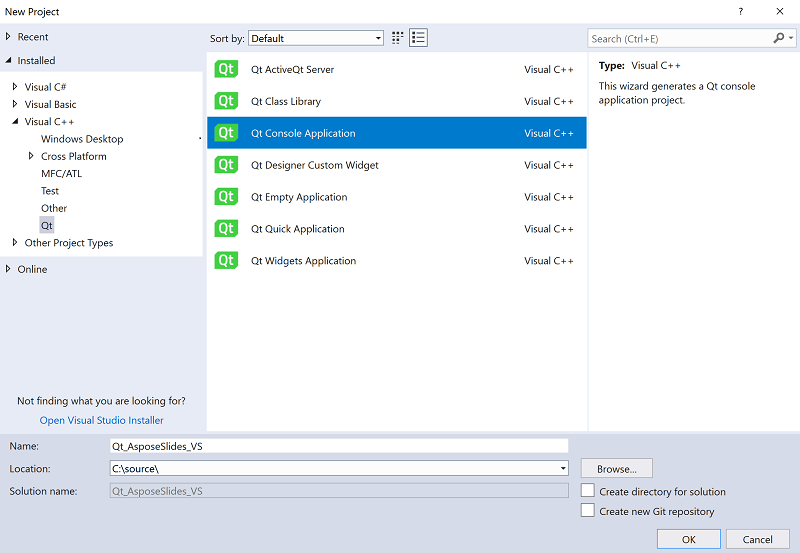

## **소개**

Qt는 C++ 기반의 크로스 플랫폼 애플리케이션 개발 프레임워크로, 데스크톱, 모바일 및 임베디드 시스템 애플리케이션을 다양하게 개발하는 데 널리 사용됩니다. Aspose.Slides for C++를 Qt와 통합하면 Qt 애플리케이션에서 PowerPoint 문서를 만들고 조작할 수 있습니다.

## **Qt Creator에서 Aspose.Slides for C++ 사용하기**

Qt 애플리케이션에서 Aspose.Slides for C++를 사용하려면 [downloads](https://downloads.aspose.com/slides/ko/cpp) 섹션에서 최신 버전의 API를 다운로드하십시오. API를 다운로드하면 Qt Creator 또는 Visual Studio에 C++ 라이브러리를 통합할 수 있습니다.

Qt Creator에서 개발한 Qt 콘솔 애플리케이션에 Aspose.Slides for C++ 라이브러리를 통합하고 사용하려면 아래 단계에 따라 진행하십시오:

- Qt Creator를 열고 새 *Qt Console Application*을 생성합니다.

- *Build System* 드롭다운 목록에서 QMake 옵션을 선택합니다.

- 적절한 킷을 선택하고 마법사를 완료합니다.

- 추출된 Aspose.Slides for C++ 패키지에서 aspose-slides-cpp-21.02 폴더를 프로젝트 루트에 복사합니다.

- lib 및 include 폴더 경로를 추가하려면 왼쪽 패널에서 프로젝트를 마우스 오른쪽 버튼으로 클릭하고 *Add Library*를 선택합니다.

- External Library 옵션을 선택하고 lib 폴더 경로를 하나씩 찾아 추가합니다.

- 완료하면 .pro 프로젝트 파일에 다음 항목이 포함됩니다:

- 애플리케이션을 빌드하면 통합이 완료됩니다.  
{}

참고: 자세한 내용은 [full demo project](https://github.com/aspose-slides/Aspose.Slides-for-C/tree/master/QtDemos/QtCreator/Qt_AsposeSlides_QMake)를 확인하십시오.

{}

## **Visual Studio에서 Qt 애플리케이션에 Aspose.Slides for C++ 사용하기**

Visual Studio를 사용해 Qt 애플리케이션을 개발하려면 [Qt Visual Studio Tools](https://marketplace.visualstudio.com/items?itemName=TheQtCompany.QtVisualStudioTools-19123)를 설치해야 합니다. 설치가 완료되면 [downloads](https://downloads.aspose.com/slides/ko/cpp) 섹션에서 최신 버전의 API를 다운로드하고 아래 단계에 따라 진행하십시오:

- Microsoft Visual Studio를 열고 새 *Qt Console Application*을 생성합니다.

- 적절한 킷을 선택하고 마법사를 완료합니다.

- Aspose.Slides for C++ 라이브러리를 통합하고 사용하려면 프로젝트를 마우스 오른쪽 버튼으로 클릭하고 *Manage NuGet Packages...*를 선택합니다.

- 필요한 *Aspose.Slides.Cpp* 패키지를 찾아 설치합니다.

- 프로젝트를 빌드하면 통합이 완료됩니다.  
{}

참고: 자세한 내용은 [full demo project](https://github.com/aspose-slides/Aspose.Slides-for-C/tree/master/QtDemos/Visual%20Studio/Qt_AsposeSlides_VS)를 확인하십시오.

{}