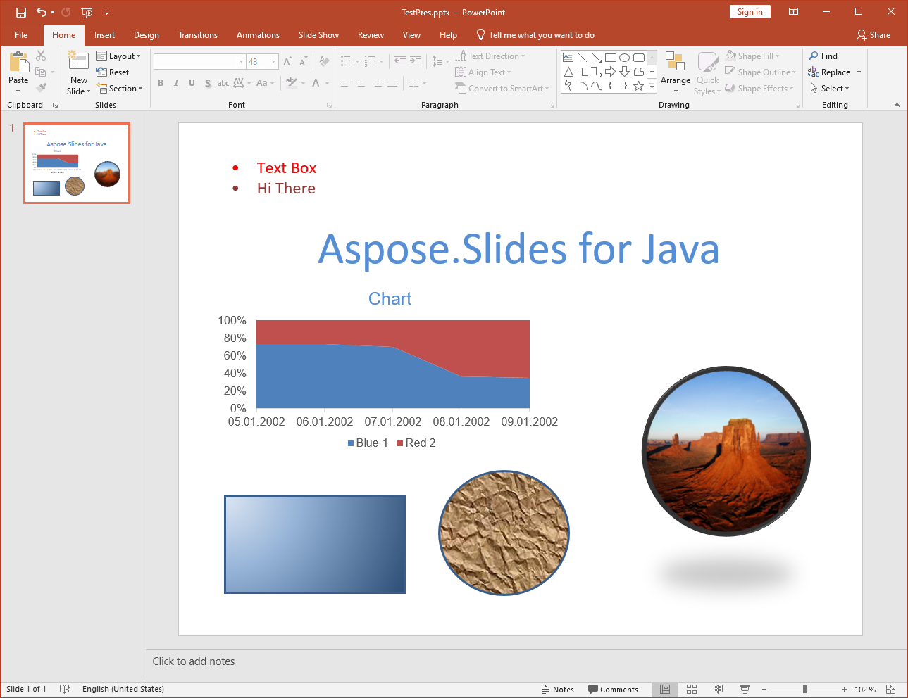

{}

이 페이지는 기존 링크를 위해 보관된 기록용 페이지입니다. 현재 버전의 Aspose.Slides for Java에 대한 설명은 포함되어 있지 않습니다. Aspose.Slides for Java가 로드하고, 가져오고, 저장하며, 렌더링하는 형식 및 각 형식에 대한 API는 [지원되는 파일 형식](/slides/ko/java/supported-file-formats/)을 참조하십시오. 현재 PDF 변환 가이드는 [PPT 및 PPTX를 PDF로 변환](/slides/ko/java/convert-powerpoint-to-pdf/)을 확인하십시오.

{}

{}

[포터블 문서 형식](https://en.wikipedia.org/wiki/PDF) 은(는) Adobe Systems가 조직 간 문서 교환을 위해 만든 파일 형식입니다. 이 형식의 목적은 플랫폼에 관계없이 콘텐츠와 레이아웃을 동일하게 유지하는 것이었습니다. Aspose.Slides for Java를 사용하면 프레젠테이션 파일을 PDF로 변환할 수 있습니다.

{}

## **Aspose.Slides for Java의 PDF**
Aspose.Slides for Java에 로드할 수 있는 모든 프레젠테이션은 선택에 따라 [PDF 1.5](https://en.wikipedia.org/wiki/PDF), [PDF/A-1a](https://en.wikipedia.org/wiki/PDF/A), [PDF/A-1b](https://en.wikipedia.org/wiki/PDF/A) 또는 [PDF/UA](https://en.wikipedia.org/wiki/PDF/UA) 규격에 맞는 PDF로 변환할 수 있습니다. Aspose.Slides for Java는 프레젠테이션을 PDF로 내보내며 대부분의 경우 출력 PDF는 원본 프레젠테이션과 정확히 동일하게 보입니다.

Aspose.Slides는 PDF로 변환할 때 다음 프레젠테이션 기능을 지원합니다:

- 이미지, 텍스트 상자 및 기타 도형.
- 텍스트 및 서식.
- 단락 및 서식.
- 하이퍼링크.
- 머리글 및 바닥글.
- 글머리표.
- 표.

Aspose.Slides for Java를 사용하면 다른 구성 요소 없이 직접 프레젠테이션을 PDF로 내보낼 수 있습니다. 또한 [PPT 및 PPTX를 PDF로 변환](/slides/ko/java/convert-powerpoint-to-pdf/)에 설명된 다양한 옵션으로 프레젠테이션의 PDF 내보내기를 사용자 지정할 수 있습니다.

**입력 프레젠테이션**

**Aspose.Slides for Java를 사용해 PDF로 변환된 프레젠테이션**

