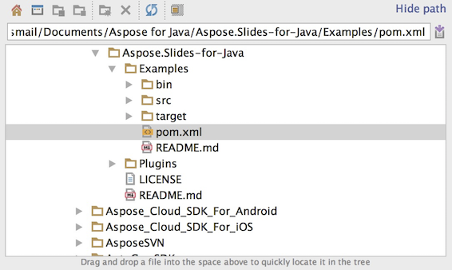

## **GitHub에서 Aspose.Slides 다운로드**
Aspose.Slides for Java의 모든 예제는 [Github](https://github.com/aspose-slides/Aspose.Slides-for-Java)에서 호스팅됩니다. 좋아하는 Github 클라이언트를 사용해 저장소를 복제하거나 [여기](https://codeload.github.com/aspose-slides/Aspose.Slides-for-Java/zip/master)에서 ZIP 파일을 다운로드할 수 있습니다.

ZIP 파일의 내용을 컴퓨터의 임의 폴더에 압축 해제하십시오. 모든 예제는 **Examples** 폴더에 있습니다.


## **IDE에 예제 가져오기**
이 프로젝트는 Maven 빌드 시스템을 사용합니다. 최신 IDE라면 프로젝트와 종속성을 쉽게 열거나 가져올 수 있습니다. 아래에서는 일반적인 IDE를 사용하여 예제를 빌드하고 실행하는 방법을 보여줍니다.

### **IntelliJ IDEA**
**File** 메뉴를 클릭하고 **Open**을 선택하십시오. 프로젝트 폴더로 이동하여 **pom.xml** 파일을 선택합니다.



프로젝트가 열리고 종속성이 자동으로 다운로드됩니다. Project 탭에서 **src/main/java** 폴더의 예제를 찾아볼 수 있습니다. 예제를 실행하려면 파일을 마우스 오른쪽 버튼으로 클릭하고 "Run .."를 선택하면 예제가 실행되고 출력이 내장 콘솔 창에 표시됩니다.


### **Eclipse**
**File** 메뉴를 클릭하고 **Import**를 선택하십시오. **Maven** - Existing Maven Projects를 선택합니다.


GitHub에서 복제하거나 다운로드한 폴더로 이동하여 **pom.xml** 파일을 선택합니다. 프로젝트가 열리고 종속성이 자동으로 다운로드됩니다. Package Explorer 탭에서 **src/main/java** 폴더의 예제를 찾아볼 수 있습니다. 예제를 실행하려면 파일을 마우스 오른쪽 버튼으로 클릭하고 **Run As** - **Java Application**을 선택하면 예제가 실행되고 출력이 내장 콘솔 창에 표시됩니다.


### **NetBeans**
**File** 메뉴를 클릭하고 **Open Project**를 선택하십시오. GitHub에서 복제하거나 다운로드한 폴더로 이동합니다. **Examples** 폴더 아이콘이 Maven 프로젝트임을 표시합니다. Examples를 선택하고 엽니다.


프로젝트가 열리고 종속성이 자동으로 다운로드됩니다. Projects 탭에서 **source packages**의 예제를 찾아볼 수 있습니다. 예제를 실행하려면 파일을 마우스 오른쪽 버튼으로 클릭하고 **Run File**을 선택하면 예제가 실행되고 출력이 내장 콘솔 창에 표시됩니다.


## **Maven 로컬 저장소에 Aspose.Slides 라이브러리 추가**
**Aspose.Slides Examples** 프로젝트를 IDE에 가져오면 Maven이 [Aspose Maven Repository](https://releases.aspose.com/java/repo/com/aspose/)에서 aspose.slides JAR 파일을 자동으로 다운로드합니다. 인터넷에 접속할 수 없는 경우 로컬 저장소에 JAR를 수동으로 추가할 수 있습니다.

### **mvn install**
[aspose.slides](https://releases.aspose.com/java/repo/com/aspose/aspose-slides/)를 다운로드하고 압축을 푼 뒤 aspose.slides-version.jar를 다른 곳(예: C 드라이브)으로 복사합니다. 다음 명령을 실행합니다:

```
mvn install:install-file
    - Dfile=c:\aspose.slides-version.jar
    - DgroupId=com.aspose
    - DartifactId=aspose-slides
    - Dversion={version}
    - Dpackaging=jar
```

이제 **aspose.slides** JAR가 Maven 로컬 저장소에 복사되었습니다.

### **pom.xml**
설치 후, pom.xml에 **aspose.slides** 좌표를 선언하십시오. repositories 탭에 다음 저장소를 추가하고 dependencies 탭에 종속성을 추가합니다.

``` xml
<repository>
    <id>AsposeJavaAPI</id>
    <name>Aspose Java API</name>
    <url>https://releases.aspose.com/java/repo/</url>
</repository>

<dependency>
    <groupId>com.aspose</groupId>
    <artifactId>aspose-slides</artifactId>
    <version>25.12</version>
    <classifier>jdk16</classifier>
</dependency>
```

### **완료**
빌드하면 이제 **aspose.slides** JAR를 Maven 로컬 저장소에서 가져올 수 있습니다.

## **기여**
예제를 추가하거나 개선하고 싶다면 프로젝트에 기여하시길 권장합니다. 이 저장소의 모든 예제와 showcase 프로젝트는 오픈 소스이며 자신의 애플리케이션에서 자유롭게 사용할 수 있습니다.

기여하려면 저장소를 포크하고 소스 코드를 편집한 뒤 Pull Request를 제출하면 됩니다. 변경 사항을 검토하고 유용하면 저장소에 포함시킬 것입니다.