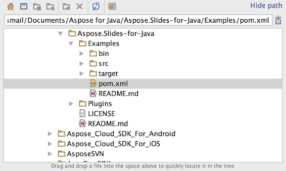

## **Aspose.Slides를 GitHub에서 다운로드**
Aspose.Slides for Java의 모든 예제는 [Github](https://github.com/aspose-slides/Aspose.Slides-for-Java)에 호스팅됩니다. 원하는 Github 클라이언트를 사용해 저장소를 복제하거나 [여기](https://codeload.github.com/aspose-slides/Aspose.Slides-for-Java/zip/master)에서 ZIP 파일을 다운로드할 수 있습니다.

ZIP 파일의 내용을 컴퓨터의 원하는 폴더에 압축 해제하십시오. 모든 예제는 **Examples** 폴더에 있습니다.


## **IDE에 예제 가져오기**
이 프로젝트는 Maven 빌드 시스템을 사용합니다. 최신 IDE라면 프로젝트와 종속성을 쉽게 열거나 가져올 수 있습니다. 아래에서는 일반적인 IDE를 사용해 예제를 빌드하고 실행하는 방법을 보여줍니다.

### **IntelliJ IDEA**
**File** 메뉴를 클릭하고 **Open**을 선택하십시오. 프로젝트 폴더로 이동하여 **pom.xml** 파일을 선택합니다.



프로젝트가 열리며 종속성이 자동으로 다운로드됩니다. Project 탭에서 **src/main/java** 폴더의 예제를 찾아보세요. 예제를 실행하려면 파일을 오른쪽 클릭하고 "Run .."를 선택하면 예제가 실행되고 출력이 내장 콘솔 창에 표시됩니다.


### **Eclipse**
**File** 메뉴를 클릭하고 **Import**를 선택하십시오. **Maven** - Existing Maven Projects를 선택합니다.


GitHub에서 복제하거나 다운로드한 폴더로 이동하여 **pom.xml** 파일을 선택합니다. 프로젝트가 열리며 종속성이 자동으로 다운로드됩니다. Package Explorer 탭에서 **src/main/java** 폴더의 예제를 찾아보세요. 예제를 실행하려면 파일을 오른쪽 클릭하고 **Run As** - **Java Application**을 선택하면 예제가 실행되고 출력이 내장 콘솔 창에 표시됩니다.


### **NetBeans**
**File** 메뉴를 클릭하고 **Open Project**를 선택하십시오. GitHub에서 복제하거나 다운로드한 폴더로 이동합니다. **Examples** 폴더 아이콘이 Maven 프로젝트임을 나타냅니다. Examples를 선택하고 엽니다.


프로젝트가 열리며 종속성이 자동으로 다운로드됩니다. Projects 탭에서 **source packages**에 있는 예제를 찾아보세요. 예제를 실행하려면 파일을 오른쪽 클릭하고 **Run File**을 선택하면 예제가 실행되고 출력이 내장 콘솔 창에 표시됩니다.


## **Maven 로컬 저장소에 Aspose.Slides 라이브러리 추가**
IDE에 **Aspose.Slides Examples** 프로젝트를 가져오면 Maven이 자동으로 [Aspose Maven Repository](https://releases.aspose.com/java/repo/com/aspose/)에서 aspose.slides JAR 파일을 다운로드합니다. 인터넷에 접근할 수 없는 경우 로컬 저장소에 직접 JAR를 추가할 수 있습니다.

### **mvn install**
다음 [aspose.slides](https://releases.aspose.com/java/repo/com/aspose/aspose-slides/)를 다운로드하고 압축을 푼 뒤 aspose.slides-version.jar 파일을 예를 들어 C 드라이브와 같은 다른 위치에 복사하십시오. 다음 명령을 실행합니다:

```
mvn install:install-file
    - Dfile=c:\aspose.slides-version.jar
    - DgroupId=com.aspose
    - DartifactId=aspose-slides
    - Dversion={version}
    - Dpackaging=jar
```

이제 **aspose.slides** JAR가 Maven 로컬 저장소에 복사되었습니다.

### **pom.xml**
설치 후 pom.xml에 **aspose.slides** 좌표를 선언하면 됩니다. repositories 탭에 다음 저장소를 추가하고 dependencies 탭에 종속성을 추가하십시오.

``` xml
<repository>
    <id>AsposeJavaAPI</id>
    <name>Aspose Java API</name>
    <url>https://releases.aspose.com/java/repo/</url>
</repository>

<dependency>
    <groupId>com.aspose</groupId>
    <artifactId>aspose-slides</artifactId>
    <version>26.10</version>
    <classifier>jdk8</classifier>
</dependency>
```

### **Done**
빌드하면 이제 **aspose.slides** JAR를 Maven 로컬 저장소에서 가져올 수 있습니다.

## **Contribute**
예제를 추가하거나 개선하고 싶다면 프로젝트에 기여하는 것을 권장합니다. 이 저장소의 모든 예제와 쇼케이스 프로젝트는 오픈 소스이며 여러분의 애플리케이션에서 자유롭게 사용할 수 있습니다.

기여하려면 저장소를 포크하고, 소스 코드를 편집한 뒤 Pull Request를 제출하면 됩니다. 변경 사항을 검토한 후 유용하다고 판단되면 저장소에 포함시킬 것입니다.