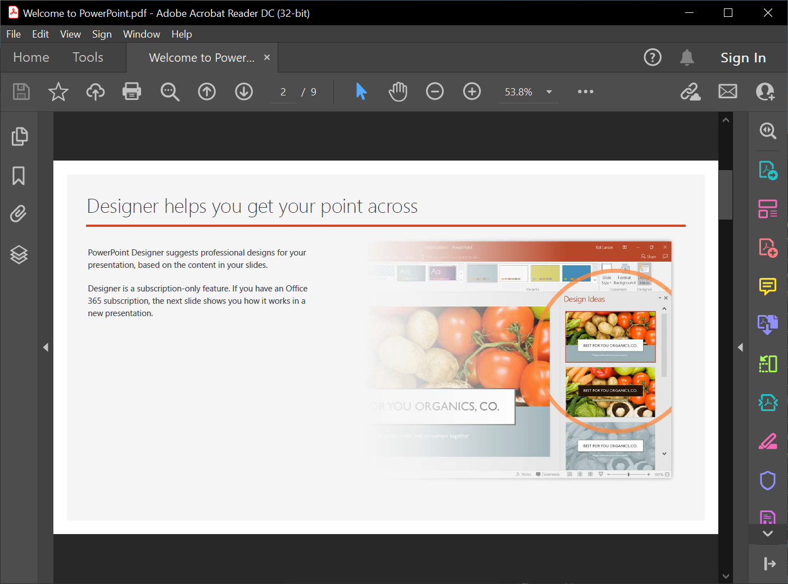

## **소개**

Aspose.Slides를 사용하면 다른 형식의 파일에서 프레젠테이션을 가져올 수 있습니다. Aspose.Slides는 PDF 및 HTML 문서에서 프레젠테이션을 가져올 수 있는 [SlideCollection](https://reference.aspose.com/slides/ko/net/aspose.slides/slidecollection/) 클래스를 제공합니다.

## **PDF에서 PowerPoint 가져오기**

이 경우 PDF를 PowerPoint 프레젠테이션으로 변환합니다.



1. [Presentation](https://reference.aspose.com/slides/ko/net/aspose.slides/presentation/) 클래스의 인스턴스를 생성합니다. 
2. [AddFromPdf](https://reference.aspose.com/slides/ko/net/aspose.slides.slidecollection/addfrompdf/methods/1) 메서드를 호출하고 PDF 파일을 전달합니다. 
3. [Save](https://reference.aspose.com/slides/ko/net/aspose.slides.presentation/save/methods/5) 메서드를 사용하여 파일을 PowerPoint 형식으로 저장합니다.

다음 C# 코드는 PDF를 PowerPoint로 변환하는 작업을 보여줍니다:

```c#
using (Presentation pres = new Presentation())
{
    pres.Slides.AddFromPdf("InputPDF.pdf");
    pres.Save("OutputPresentation.pptx", SaveFormat.Pptx);
}
```

{} 

이 프로세스의 실시간 구현이므로 **Aspose free** [PDF to PowerPoint](https://products.aspose.app/slides/ko/import/pdf-to-powerpoint) 웹 앱을 확인해 보세요. 

{} 

## **HTML에서 PowerPoint 가져오기**

이 경우 HTML 문서를 PowerPoint 프레젠테이션으로 변환합니다.

1. [Presentation](https://reference.aspose.com/slides/ko/net/aspose.slides/presentation/) 클래스의 인스턴스를 생성합니다. 
2. [AddFromHtml](https://reference.aspose.com/slides/ko/net/aspose.slides/slidecollection/addfromhtml/#addfromhtml) 메서드를 호출하고 HTML 파일을 전달합니다. 
3. [Save](https://apireference.aspose.com/slides/ko/net/aspose.slides.presentation/save/methods/5) 메서드를 사용하여 파일을 PowerPoint 문서로 저장합니다.

다음 C# 코드는 HTML을 PowerPoint로 변환하는 작업을 보여줍니다: 

```c#
using (var presentation = new Presentation())
{
    using (var htmlStream = File.OpenRead("page.html"))
    {
        presentation.Slides.AddFromHtml(htmlStream);
    }

    presentation.Save("MyPresentation.pptx", SaveFormat.Pptx);
}
```

## **FAQ**

**PDF를 가져올 때 표가 유지되며, 표 감지를 개선할 수 있나요?**

가져오는 동안 표를 감지할 수 있습니다; [PdfImportOptions](https://reference.aspose.com/slides/ko/net/aspose.slides.import/pdfimportoptions/)에는 표 인식을 활성화하는 [DetectTables](https://reference.aspose.com/slides/ko/net/aspose.slides.import/pdfimportoptions/detecttables/) 매개변수가 포함되어 있습니다. 효과는 PDF의 구조에 따라 달라집니다.

{} 

또한 Aspose.Slides를 사용하여 HTML을 다른 일반 파일 형식으로 변환할 수 있습니다: 

* [HTML을 이미지로](https://products.aspose.com/slides/ko/net/conversion/html-to-image/)
* [HTML을 JPG로](https://products.aspose.com/slides/ko/net/conversion/html-to-jpg/)
* [HTML을 XML로](https://products.aspose.com/slides/ko/net/conversion/html-to-xml/)
* [HTML을 TIFF로](https://products.aspose.com/slides/ko/net/conversion.html-to-tiff/)

{}