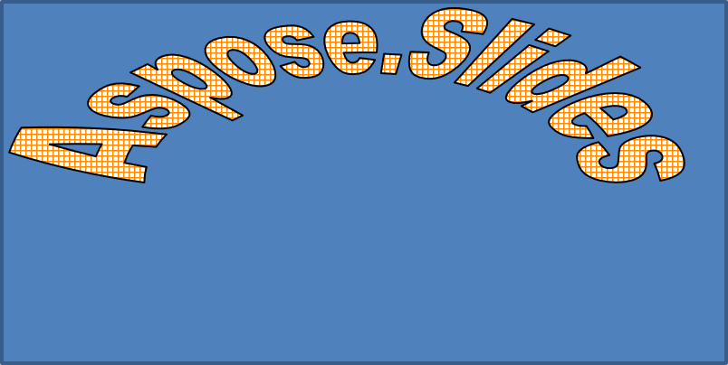

## **개요**

WordArt 효과를 사용하면 PowerPoint 프레젠테이션에 시각적으로 매력적이고 스타일리시한 텍스트를 추가할 수 있습니다. Aspose.Slides for .NET을 사용하면 Microsoft PowerPoint를 설치하지 않아도 개발자가 WordArt를 프로그래밍 방식으로 만들고, 사용자 지정하고, 관리할 수 있습니다. 이 문서는 .NET에서 WordArt를 사용할 때 텍스트 변환, 채우기 스타일, 외곽선, 그림자 및 기타 서식 옵션을 적용하여 프레젠테이션 콘텐츠를 보다 표현력 있고 매력적으로 만드는 방법에 대한 개요를 제공합니다. WordArt는 텍스트를 그래픽 객체처럼 취급합니다. 텍스트에 적용되는 효과 또는 특수 수정으로 텍스트를 더 매력적이거나 눈에 띄게 만들 수 있습니다.

## **간단한 WordArt 템플릿 만들기 및 텍스트에 적용하기**

이 섹션에서는 Aspose.Slides for .NET을 사용하여 간단한 WordArt 템플릿을 만들고 텍스트에 적용하는 방법을 살펴봅니다. WordArt는 눈에 띄는 시각 효과와 스타일로 텍스트 모양을 손쉽게 향상시킬 수 있는 방법을 제공합니다. WordArt를 만들고 사용하는 기본 단계를 배우면 이 기술을 어떤 프로젝트에도 손쉽게 적용하여 프레젠테이션을 더욱 생동감 있고 기억에 남게 만들 수 있습니다.

먼저 다음 C# 코드를 사용하여 간단한 텍스트를 만듭니다.

```cs
using (Presentation presentation = new Presentation())
{
    ISlide slide = presentation.Slides[0];

    IAutoShape autoShape = slide.Shapes.AddAutoShape(ShapeType.Rectangle, 20, 20, 400, 200);
    ITextFrame textFrame = autoShape.TextFrame;

    IPortion portion = textFrame.Paragraphs[0].Portions[0];
    portion.Text = "Aspose.Slides";
}
```

이제 다음 코드를 사용하여 텍스트의 글꼴 높이를 더 큰 값으로 설정해 효과를 보다 눈에 띄게 합니다.

```cs
    portion.PortionFormat.LatinFont = new FontData("Arial Black");
    portion.PortionFormat.FontHeight = 36;
```

여기서는 SmallGrid 패턴 채우기를 텍스트에 적용하고, 너비 1의 검은색 텍스트 외곽선을 추가하는 코드를 사용합니다.

```cs
    portion.PortionFormat.FillFormat.FillType = FillType.Pattern;
    portion.PortionFormat.FillFormat.PatternFormat.ForeColor.Color = Color.DarkOrange;
    portion.PortionFormat.FillFormat.PatternFormat.BackColor.Color = Color.White;
    portion.PortionFormat.FillFormat.PatternFormat.PatternStyle = PatternStyle.SmallGrid;
                
    portion.PortionFormat.LineFormat.FillFormat.FillType = FillType.Solid;
    portion.PortionFormat.LineFormat.FillFormat.SolidFillColor.Color = Color.Black;
```

결과 텍스트:


## **다른 WordArt 효과 적용하기**

기본 변환 외에도 Aspose.Slides for .NET을 사용하면 텍스트 모양을 향상시키는 다양한 고급 WordArt 효과를 적용할 수 있습니다. 여기에는 외곽선, 채우기, 그림자, 반사 및 글로우 효과가 포함됩니다. 이러한 기능을 결합하면 프레젠테이션에서 돋보이는 눈길을 끄는 텍스트 스타일을 만들 수 있습니다. 이 섹션에서는 간단하고 깔끔한 코드 예제를 사용하여 이러한 효과를 프로그래밍 방식으로 적용하는 방법을 보여줍니다.

### **외부 그림자 효과 적용하기**

외부 그림자 효과는 텍스트 외곽선 뒤에 그림자를 추가하여 텍스트가 배경에서 튀어나오고 깊이감을 부여합니다. Aspose.Slides for .NET을 사용하면 WordArt 텍스트에 외부 그림자를 쉽게 적용하고 사용자 지정할 수 있습니다. 이 섹션에서는 그림자 색상, 방향, 거리, 흐림 반경 등을 설정하는 방법을 배우게 됩니다.

다음 C# 코드 스니펫은 앞에서 만든 텍스트에 그림자 효과를 적용합니다.

```cs
    portion.PortionFormat.EffectFormat.EnableOuterShadowEffect();
    portion.PortionFormat.EffectFormat.OuterShadowEffect.ShadowColor.Color = Color.Black;
    portion.PortionFormat.EffectFormat.OuterShadowEffect.ScaleHorizontal = 100;
    portion.PortionFormat.EffectFormat.OuterShadowEffect.ScaleVertical = 100;
    portion.PortionFormat.EffectFormat.OuterShadowEffect.BlurRadius = 4;
    portion.PortionFormat.EffectFormat.OuterShadowEffect.Direction = 230;
    portion.PortionFormat.EffectFormat.OuterShadowEffect.Distance = 30;
    portion.PortionFormat.EffectFormat.OuterShadowEffect.SkewHorizontal = 20;
    portion.PortionFormat.EffectFormat.OuterShadowEffect.SkewVertical = 0;
    portion.PortionFormat.EffectFormat.OuterShadowEffect.ShadowColor.ColorTransform.Add(ColorTransformOperation.SetAlpha, 0.32f);
```

결과 텍스트:


{} 
- OuterShadow와 PresetShadow를 함께 사용할 경우, Only OuterShadow 효과만 적용됩니다.
- OuterShadow와 InnerShadow를 동시에 사용할 경우 결과 효과는 PowerPoint 버전에 따라 달라집니다. 예를 들어 PowerPoint 2013에서는 효과가 두 번 적용되지만, PowerPoint 2007에서는 OuterShadow 효과만 적용됩니다.
{}

### **반사 효과 적용하기**

이 섹션에서는 Aspose.Slides for .NET을 사용하여 슬라이드에 반사 효과를 적용하는 방법을 살펴봅니다. 반사 효과는 텍스트나 도형에 세련되고 현대적인 느낌을 주어 핵심 요소를 돋보이게 하고 프레젠테이션에 깊이를 더합니다. 이러한 효과를 적용하고 사용자 지정하는 과정을 이해하면 디자인 요구와 브랜드 요구에 맞게 쉽게 조정할 수 있습니다.

다음 C# 코드 예제를 사용하여 텍스트에 반사 효과를 추가합니다.

```cs
    portion.PortionFormat.EffectFormat.EnableReflectionEffect();
    portion.PortionFormat.EffectFormat.ReflectionEffect.BlurRadius = 0.5; 
    portion.PortionFormat.EffectFormat.ReflectionEffect.Distance = 4.72; 
    portion.PortionFormat.EffectFormat.ReflectionEffect.StartPosAlpha = 0f; 
    portion.PortionFormat.EffectFormat.ReflectionEffect.EndPosAlpha = 60f; 
    portion.PortionFormat.EffectFormat.ReflectionEffect.Direction = 90; 
    portion.PortionFormat.EffectFormat.ReflectionEffect.ScaleHorizontal = 100; 
    portion.PortionFormat.EffectFormat.ReflectionEffect.ScaleVertical = -100;
    portion.PortionFormat.EffectFormat.ReflectionEffect.StartReflectionOpacity = 60f;
    portion.PortionFormat.EffectFormat.ReflectionEffect.EndReflectionOpacity = 0.9f;
    portion.PortionFormat.EffectFormat.ReflectionEffect.RectangleAlign = RectangleAlignment.BottomLeft;   
```

결과 텍스트:


### **글로우 효과 적용하기**

이 섹션에서는 Aspose.Slides for .NET을 사용하여 텍스트에 글로우 효과를 적용하는 방법을 살펴봅니다. 글로우 효과는 텍스트에 빛나는 외곽선을 추가해 슬라이드의 시각적 매력을 높입니다. 색상 및 강도와 같은 설정을 조정하면 디자인 및 브랜드 요구에 맞게 글로우를 쉽게 맞춤화할 수 있어 프레젠테이션의 핵심 포인트가 청중의 시선을 사로잡게 됩니다.

다음 코드를 사용하여 텍스트에 빛나는 글로우 효과를 적용합니다.

```cs
    portion.PortionFormat.EffectFormat.EnableGlowEffect();
    portion.PortionFormat.EffectFormat.GlowEffect.Color.R = 255;
    portion.PortionFormat.EffectFormat.GlowEffect.Color.ColorTransform.Add(ColorTransformOperation.SetAlpha, 0.54f);
    portion.PortionFormat.EffectFormat.GlowEffect.Radius = 7;
```

결과 텍스트:


### **WordArt 변환 적용하기**

이 섹션에서는 Aspose.Slides for .NET을 사용하여 WordArt에 변환을 적용하는 방법을 살펴봅니다. 변환을 사용하면 텍스트를 구부리거나, 늘리거나, 뒤틀어 독특하고 시각적으로 강렬한 효과를 만들 수 있습니다. 이러한 기술을 마스터하면 텍스트 형태와 스타일을 브랜드나 창의적 비전과 일치하도록 쉽게 맞춤화하여 설득력 있고 다듬어진 프레젠테이션을 만들 수 있습니다.

다음 코드를 사용해 전체 텍스트 블록에 적용되는 `Transform` 속성을 설정합니다.

```cs
    textFrame.TextFrameFormat.Transform = TextShapeType.ArchUpPour;
```

결과 텍스트:



{} 
Aspose.Slides for .NET은 미리 정의된 [변환 유형](https://reference.aspose.com/slides/ko/net/aspose.slides/textshapetype/)을 제공합니다.
{} 

### **도형 및 텍스트에 3D 효과 적용하기**

현실감 있고 눈길을 끄는 시각 요소는 프레젠테이션의 임팩트를 크게 향상시킬 수 있습니다. 이 섹션에서는 Aspose.Slides for .NET을 사용하여 도형에 3차원(3D) 효과를 적용하는 방법을 살펴봅니다. 깊이, 각도, 조명과 같은 매개변수를 조작하면 청중의 시선을 즉시 사로잡는 인상적인 3D 변환을 만들 수 있습니다. 섬세한 강조부터 극적인 착시 효과까지, 이러한 기능은 디자인을 한 단계 끌어올리고 아이디어를 보다 매력적으로 전달하는 유연한 방법을 제공합니다.

다음 샘플 코드를 사용해 도형에 3D 효과를 설정합니다.

```cs
    autoShape.ThreeDFormat.BevelBottom.BevelType = BevelPresetType.Circle;
    autoShape.ThreeDFormat.BevelBottom.Height = 10.5;
    autoShape.ThreeDFormat.BevelBottom.Width = 10.5;

    autoShape.ThreeDFormat.BevelTop.BevelType = BevelPresetType.Circle;
    autoShape.ThreeDFormat.BevelTop.Height = 12.5;
    autoShape.ThreeDFormat.BevelTop.Width = 11;

    autoShape.ThreeDFormat.ExtrusionColor.Color = Color.Orange;
    autoShape.ThreeDFormat.ExtrusionHeight = 6;

    autoShape.ThreeDFormat.ContourColor.Color = Color.DarkRed;
    autoShape.ThreeDFormat.ContourWidth = 1.5;

    autoShape.ThreeDFormat.Depth = 3;

    autoShape.ThreeDFormat.Material = MaterialPresetType.Plastic;

    autoShape.ThreeDFormat.LightRig.Direction = LightingDirection.Top;
    autoShape.ThreeDFormat.LightRig.LightType = LightRigPresetType.Balanced;
    autoShape.ThreeDFormat.LightRig.SetRotation(0, 0, 40);

    autoShape.ThreeDFormat.Camera.CameraType = CameraPresetType.PerspectiveContrastingRightFacing;
```

결과 도형:


다음 샘플 코드를 사용해 텍스트에 3D 효과를 설정합니다.

```cs
    textFrame.TextFrameFormat.ThreeDFormat.BevelBottom.BevelType = BevelPresetType.Circle;
    textFrame.TextFrameFormat.ThreeDFormat.BevelBottom.Height = 3.5;
    textFrame.TextFrameFormat.ThreeDFormat.BevelBottom.Width = 3.5;

    textFrame.TextFrameFormat.ThreeDFormat.BevelTop.BevelType = BevelPresetType.Circle;
    textFrame.TextFrameFormat.ThreeDFormat.BevelTop.Height = 4;
    textFrame.TextFrameFormat.ThreeDFormat.BevelTop.Width = 4;

    textFrame.TextFrameFormat.ThreeDFormat.ExtrusionColor.Color = Color.Orange;
    textFrame.TextFrameFormat.ThreeDFormat.ExtrusionHeight= 6;

    textFrame.TextFrameFormat.ThreeDFormat.ContourColor.Color = Color.DarkRed;
    textFrame.TextFrameFormat.ThreeDFormat.ContourWidth = 1.5;

    textFrame.TextFrameFormat.ThreeDFormat.Depth= 3;

    textFrame.TextFrameFormat.ThreeDFormat.Material = MaterialPresetType.Plastic;

    textFrame.TextFrameFormat.ThreeDFormat.LightRig.Direction = LightingDirection.Top;
    textFrame.TextFrameFormat.ThreeDFormat.LightRig.LightType = LightRigPresetType.Balanced;
    textFrame.TextFrameFormat.ThreeDFormat.LightRig.SetRotation(0, 0, 40);

    textFrame.TextFrameFormat.ThreeDFormat.Camera.CameraType = CameraPresetType.PerspectiveContrastingRightFacing;
```

결과 텍스트:


{} 
텍스트 또는 해당 도형에 3D 효과를 적용하고 이러한 효과 간의 상호 작용은 특정 규칙에 의해 제어됩니다. 텍스트와 해당 텍스트를 포함하는 도형이 모두 있는 장면을 고려해 보세요. 3D 효과에는 객체의 3D 표현과 해당 객체가 배치되는 장면이 포함됩니다.

- 도형과 텍스트 모두에 장면이 설정된 경우, 도형의 장면이 우선하고 텍스트의 장면은 무시됩니다.
- 도형에 자체 장면은 없지만 3D 표현이 있는 경우 텍스트의 장면이 사용됩니다.
- 도형에 3D 효과가 전혀 없으면 평면으로 취급되며, 3D 효과는 텍스트에만 적용됩니다.

이 동작은 [ThreeDFormat.LightRig](https://reference.aspose.com/slides/ko/net/aspose.slides/threedformat/lightrig/) 및 [ThreeDFormat.Camera](https://reference.aspose.com/slides/ko/net/aspose.slides/threedformat/camera/) 속성과 관련됩니다.
{} 

## **FAQ**

**다른 글꼴이나 스크립트(예: 아랍어, 중국어)에서도 WordArt 효과를 사용할 수 있나요?**

예, Aspose.Slides for .NET은 Unicode를 지원하며 모든 주요 글꼴 및 스크립트와 함께 작동합니다. 그림자, 채우기, 외곽선과 같은 WordArt 효과는 언어에 관계없이 적용할 수 있지만, 글꼴 가용성 및 렌더링은 시스템에 설치된 글꼴에 따라 달라질 수 있습니다.

**슬라이드 마스터 요소에 WordArt 효과를 적용할 수 있나요?**

예, 마스터 슬라이드의 도형(제목 자리표, 바닥글, 배경 텍스트 등)에 WordArt 효과를 적용할 수 있습니다. 마스터 레이아웃에 적용된 변경 사항은 해당 슬라이드에 연결된 모든 슬라이드에 반영됩니다.

**WordArt 효과가 프레젠테이션 파일 크기에 영향을 미나요?**

약간 영향을 미칩니다. 그림자, 글로우, 그라디언트 채우기와 같은 WordArt 효과는 추가 서식 메타데이터를 포함하므로 파일 크기가 약간 증가할 수 있지만, 차이는 보통 무시할 정도입니다.

**프레젠테이션을 저장하지 않고 WordArt 효과 결과를 미리 볼 수 있나요?**

예, [IShape](https://reference.aspose.com/slides/ko/net/aspose.slides/ishape/) 또는 [ISlide](https://reference.aspose.com/slides/ko/net/aspose.slides/islide/) 인터페이스의 `GetImage` 메서드를 사용해 WordArt가 포함된 슬라이드를 이미지(PNG, JPEG 등)로 렌더링할 수 있습니다. 이를 통해 전체 프레젠테이션을 저장하거나 내보내기 전에 메모리 내 또는 화면에서 결과를 미리 확인할 수 있습니다.