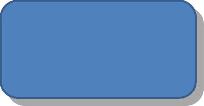

## **소개**

PowerPoint의 효과는 도형을 돋보이게 할 수 있지만, [채우기](/slides/ko/net/shape-formatting/#gradient-fill)나 테두리와는 다릅니다. PowerPoint 효과를 사용하면 도형에 실제처럼 보이는 반사 효과를 만들거나, 도형의 빛남을 퍼뜨리는 등 다양한 시각 효과를 적용할 수 있습니다.


PowerPoint는 도형에 적용할 수 있는 6가지 효과를 제공합니다. 하나 이상의 효과를 도형에 적용할 수 있습니다.

효과 조합에 따라 결과가 달라집니다. 이러한 이유로 PowerPoint에는 **Preset** 옵션이 있습니다. Preset 옵션은 두 개 이상의 효과를 조합한, 보기 좋은 조합을 미리 정의해 둔 것입니다. 따라서 프리셋을 선택하면 별도로 여러 효과를 시험하거나 조합할 필요 없이 손쉽게 멋진 효과를 적용할 수 있습니다.

Aspose.Slides는 [EffectFormat](https://reference.aspose.com/slides/ko/net/aspose.slides/effectformat/) 클래스에 속성 및 메서드를 제공하여 PowerPoint 프레젠테이션의 도형에 동일한 효과를 적용할 수 있도록 합니다.

## **그림자 효과 적용**

Aspose.Slides for .NET에서 도형에 그림자 효과를 적용하려면 색상, 흐림 반경 및 방향과 같은 매개변수를 쉽게 조정하면 됩니다. 이를 통해 도형에 보다 역동적이고 전문적인 외관을 부여하여 깊이감과 포커스를 강조할 수 있습니다. 간단한 코드 조각을 사용하면 여러 도형에 동일한 효과를 적용해 프레젠테이션 전체의 시각적 매력을 높일 수 있습니다.

다음 C# 코드는 사각형에 [외부 그림자 효과](https://reference.aspose.com/slides/ko/net/aspose.slides/effectformat/outershadoweffect/)를 적용하는 방법을 보여줍니다:

```c#
using var presentation = new Presentation();
var slide = presentation.Slides[0];

var shape = slide.Shapes.AddAutoShape(ShapeType.RoundCornerRectangle, 20, 20, 200, 100);

shape.EffectFormat.EnableOuterShadowEffect();
shape.EffectFormat.OuterShadowEffect.ShadowColor.Color = Color.DarkGray;
shape.EffectFormat.OuterShadowEffect.Distance = 10;
shape.EffectFormat.OuterShadowEffect.Direction = 45;

presentation.Save("shadow_effect.pptx", SaveFormat.Pptx);
```



## **반사 효과 적용**

Aspose.Slides for .NET에서 반사 효과를 적용하면 도형에 거울과 같은 반사를 추가하고 거리, 투명도 및 크기와 같은 매개변수를 조정할 수 있습니다. 이 효과는 도형을 보다 세련되고 정교하게 보여 주어 프레젠테이션의 미적 품격을 높여 줍니다. 간단한 코드로 구현할 수 있어 여러 요소에 빠르게 적용해 일관된 디자인을 구현할 수 있습니다.

다음 C# 코드는 도형에 [반사 효과](https://reference.aspose.com/slides/ko/net/aspose.slides/effectformat/reflectioneffect/)를 적용하는 방법을 보여줍니다:

```c#
using var presentation = new Presentation();
var slide = presentation.Slides[0];

var shape = slide.Shapes.AddAutoShape(ShapeType.RoundCornerRectangle, 20, 20, 200, 100);

shape.EffectFormat.EnableReflectionEffect();
shape.EffectFormat.ReflectionEffect.RectangleAlign = RectangleAlignment.Bottom;
shape.EffectFormat.ReflectionEffect.Direction = 90;
shape.EffectFormat.ReflectionEffect.Distance = 40;
shape.EffectFormat.ReflectionEffect.BlurRadius = 2;

presentation.Save("reflection_effect.pptx", SaveFormat.Pptx);
```


## **빛남 효과 적용**

Aspose.Slides for .NET에서 도형에 빛남 효과를 적용하면 부드럽고 빛나는 아우라를 도형 주위에 추가하고 색상 및 크기와 같은 속성을 조정할 수 있습니다. 이 효과는 도형을 강조하고 프레젠테이션에 매력적인 시각 요소를 더해 줍니다. 최소한의 코드로 구현할 수 있어 슬라이드 전체의 외관을 손쉽게 향상시킬 수 있습니다.

다음 C# 코드는 도형에 [빛남 효과](https://reference.aspose.com/slides/ko/net/aspose.slides/effectformat/gloweffect/)를 적용하는 방법을 보여줍니다:

```c#
using var presentation = new Presentation();
var slide = presentation.Slides[0];

var shape = slide.Shapes.AddAutoShape(ShapeType.RoundCornerRectangle, 20, 20, 200, 100);

shape.EffectFormat.EnableGlowEffect();
shape.EffectFormat.GlowEffect.Color.Color = Color.Magenta;
shape.EffectFormat.GlowEffect.Radius = 15;

presentation.Save("glow_effect.pptx", SaveFormat.Pptx);
```


## **부드러운 가장자리 효과 적용**

Aspose.Slides for .NET에서 부드러운 가장자리 효과를 적용하면 도형 가장자리 주위에 부드럽고 흐릿한 전환을 만들 수 있습니다. 이 효과는 보다 섬세하고 정교한 모습을 제공하여 부드러운 외관이 필요한 디자인에 적합합니다. 반경과 같은 매개변수를 쉽게 조정하여 프레젠테이션의 다양한 도형에 원하는 효과를 적용할 수 있습니다.

다음 C# 코드는 도형에 [부드러운 가장자리 효과](https://reference.aspose.com/slides/ko/net/aspose.slides/effectformat/softedgeeffect/)를 적용하는 방법을 보여줍니다:

```c#
using var presentation = new Presentation();
var slide = presentation.Slides[0];

var shape = slide.Shapes.AddAutoShape(ShapeType.RoundCornerRectangle, 20, 20, 200, 150);

shape.EffectFormat.EnableSoftEdgeEffect();
shape.EffectFormat.SoftEdgeEffect.Radius = 8;

presentation.Save("soft_edges_effect.pptx", SaveFormat.Pptx);
```


## **FAQ**

**같은 도형에 여러 효과를 적용할 수 있나요?**

예, 그림자, 반사, 빛남 등 다양한 효과를 하나의 도형에 결합하여 보다 역동적인 외관을 만들 수 있습니다.

**어떤 도형에 효과를 적용할 수 있나요?**

자동 도형, 차트, 표, 그림, SmartArt 개체, OLE 개체 등 다양한 도형에 효과를 적용할 수 있습니다.

**그룹화된 도형에도 효과를 적용할 수 있나요?**

예, 그룹화된 도형 전체에 효과를 적용할 수 있으며, 해당 효과는 전체 그룹에 적용됩니다.