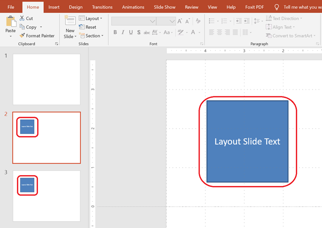

이 문서에서는 Aspose.Slides for .NET에서 **Layout Slides**를 사용하는 방법을 보여줍니다. 레이아웃 슬라이드는 일반 슬라이드가 상속하는 디자인과 서식을 정의합니다. 레이아웃 슬라이드를 추가, 액세스, 복제 및 제거할 수 있으며, 사용되지 않는 레이아웃을 정리하여 프레젠테이션 크기를 줄일 수 있습니다.

## **Add a Layout Slide**

재사용 가능한 서식을 정의하기 위해 사용자 지정 레이아웃 슬라이드를 만들 수 있습니다. 예를 들어, 이 레이아웃을 사용하는 모든 슬라이드에 표시되는 텍스트 상자를 추가할 수 있습니다.

```csharp
static void AddLayoutSlide()
{
    using var presentation = new Presentation();
    
    var masterSlide = presentation.Masters[0];

    // 빈 레이아웃 유형과 사용자 지정 이름으로 레이아웃 슬라이드를 생성합니다.
    var layoutSlide = presentation.LayoutSlides.Add(masterSlide, SlideLayoutType.Blank, "Main layout");

    // 레이아웃 슬라이드에 텍스트 상자를 추가합니다.
    var layoutTextBox = layoutSlide.Shapes.AddAutoShape(ShapeType.Rectangle, x: 75, y: 75, width: 150, height: 150);
    layoutTextBox.TextFrame.Text = "Layout Slide Text";

    // 이 레이아웃을 사용하여 두 개의 슬라이드를 추가합니다; 두 슬라이드 모두 레이아웃의 텍스트를 상속합니다.
    presentation.Slides.AddEmptySlide(layoutSlide);
    presentation.Slides.AddEmptySlide(layoutSlide);
}
```

> 💡 **Note 1:** 레이아웃 슬라이드는 개별 슬라이드의 템플릿 역할을 합니다. 공통 요소를 한 번 정의하고 여러 슬라이드에 재사용할 수 있습니다.
> 
> 💡 **Note 2:** 레이아웃 슬라이드에 도형이나 텍스트를 추가하면 해당 레이아웃을 기반으로 하는 모든 슬라이드가 이 공유 콘텐츠를 자동으로 표시합니다. 아래 스크린샷은 두 슬라이드가 동일한 레이아웃 슬라이드에서 텍스트 상자를 상속받는 모습을 보여줍니다.



## **Access a Layout Slide**

레이아웃 슬라이드는 인덱스 또는 레이아웃 유형(예: `Blank`, `Title`, `SectionHeader` 등)으로 접근할 수 있습니다.

```csharp
static void AccessLayoutSlide()
{
    using var presentation = new Presentation();
    
    // 인덱스로 레이아웃 슬라이드에 액세스합니다.
    var firstLayoutSlide = presentation.LayoutSlides[0];
    
    // 유형으로 레이아웃 슬라이드에 액세스합니다.
    var blankLayoutSlide = presentation.LayoutSlides.GetByType(SlideLayoutType.Blank);
}
```

## **Remove a Layout Slide**

더 이상 필요하지 않은 경우 특정 레이아웃 슬라이드를 제거할 수 있습니다.

```csharp
static void RemoveLayoutSlide()
{
    using var presentation = new Presentation();
    
    // 유형으로 레이아웃 슬라이드를 가져와 제거합니다.
    var blankLayoutSlide = presentation.LayoutSlides.GetByType(SlideLayoutType.Custom);
    presentation.LayoutSlides.Remove(blankLayoutSlide);
}
```

## **Remove Unused Layout Slides**

프레젠테이션 크기를 줄이려면 일반 슬라이드에서 사용되지 않는 레이아웃 슬라이드를 제거할 수 있습니다.

```csharp
static void RemoveUnusedLayoutSlides()
{
    using var presentation = new Presentation();
    
    // 자동으로 어떤 슬라이드에도 참조되지 않은 모든 레이아웃 슬라이드를 제거합니다.
    presentation.LayoutSlides.RemoveUnused();
}
```

## **Clone a Layout Slide**

`AddClone` 메서드를 사용하여 레이아웃 슬라이드를 복제할 수 있습니다.

```csharp
static void CloneLayoutSlides()
{
    using var presentation = new Presentation();
    
    // 유형으로 기존 레이아웃 슬라이드를 가져옵니다.
    var blankLayoutSlide = presentation.LayoutSlides.GetByType(SlideLayoutType.Blank);
    
    // 레이아웃 슬라이드 컬렉션의 끝에 레이아웃 슬라이드를 복제합니다.
    var clonedLayoutSlide = presentation.LayoutSlides.AddClone(blankLayoutSlide);
}
```

> ✅ **Summary:** 레이아웃 슬라이드는 슬라이드 전반에 걸쳐 일관된 서식을 관리하는 강력한 도구입니다. Aspose.Slides를 사용하면 레이아웃 슬라이드의 생성, 관리 및 최적화를 완전히 제어할 수 있습니다.