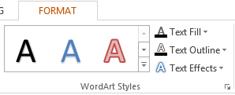

## **개요**

WordArt 효과를 사용하면 PowerPoint 프레젠테이션에 시각적으로 매력적이고 스타일화된 텍스트를 추가할 수 있습니다. Aspose.Slides를 사용하면 개발자가 Microsoft PowerPoint와 동일하게 WordArt를 프로그래밍 방식으로 생성, 사용자 정의 및 관리할 수 있으며 Office를 설치할 필요가 없습니다. 이 문서는 WordArt 작업에 대한 개요를 제공하며, 텍스트 변형, 채우기 스타일, 윤곽선, 그림자 및 기타 서식 옵션을 적용하여 프레젠테이션 콘텐츠를 보다 표현력 있고 매력적으로 만드는 방법을 설명합니다. WordArt는 텍스트를 그래픽 객체처럼 취급할 수 있게 해줍니다. 텍스트에 적용되어 더 매력적이거나 눈에 띄게 만드는 효과 또는 특수 수정으로 구성됩니다.

## **간단한 WordArt 템플릿 만들기 및 텍스트에 적용하기**

**Aspose.Slides 사용** 

먼저, 다음 JavaScript 코드를 사용하여 간단한 텍스트를 만듭니다:

```javascript
var pres = new aspose.slides.Presentation();
try {
    var slide = pres.getSlides().get_Item(0);
    var autoShape = slide.getShapes().addAutoShape(aspose.slides.ShapeType.Rectangle, 200, 200, 400, 200);
    var textFrame = autoShape.getTextFrame();
    var portion = textFrame.getParagraphs().get_Item(0).getPortions().get_Item(0);
    portion.setText("Aspose.Slides");
} finally {
    if (pres != null) {
        pres.dispose();
    }
}
```
이제, 아래 코드를 통해 텍스트의 글꼴 높이를 더 크게 설정하여 효과가 더 눈에 띄게 합니다:

```javascript
var fontData = new aspose.slides.FontData("Arial Black");
portion.getPortionFormat().setLatinFont(fontData);
portion.getPortionFormat().setFontHeight(36);
```

**Microsoft PowerPoint 사용**

Microsoft PowerPoint에서 WordArt 효과 메뉴로 이동합니다:



오른쪽 메뉴에서 미리 정의된 WordArt 효과를 선택할 수 있습니다. 왼쪽 메뉴에서는 새 WordArt에 대한 설정을 지정할 수 있습니다. 

다음은 사용 가능한 일부 매개변수 또는 옵션입니다:


**Aspose.Slides 사용**

여기서는 텍스트에 [SmallGrid](https://reference.aspose.com/slides/ko/nodejs-java/aspose.slides/PatternStyle#SmallGrid) 패턴 색상을 적용하고 아래 코드를 사용하여 1 너비의 검은색 텍스트 테두리를 추가합니다:

```javascript
portion.getPortionFormat().getFillFormat().setFillType(java.newByte(aspose.slides.FillType.Pattern));
portion.getPortionFormat().getFillFormat().getPatternFormat().getForeColor().setColor(java.getStaticFieldValue("java.awt.Color", "ORANGE"));
portion.getPortionFormat().getFillFormat().getPatternFormat().getBackColor().setColor(java.getStaticFieldValue("java.awt.Color", "WHITE"));
portion.getPortionFormat().getFillFormat().getPatternFormat().setPatternStyle(java.newByte(aspose.slides.PatternStyle.SmallGrid));
portion.getPortionFormat().getLineFormat().getFillFormat().setFillType(java.newByte(aspose.slides.FillType.Solid));
portion.getPortionFormat().getLineFormat().getFillFormat().getSolidFillColor().setColor(java.getStaticFieldValue("java.awt.Color", "BLACK"));
```

결과 텍스트:


## **다른 WordArt 효과 적용**

**Microsoft PowerPoint 사용**

프로그램의 클래스에서 텍스트, 텍스트 블록, 도형 또는 유사한 요소에 이러한 효과를 적용할 수 있습니다:


예를 들어, 그림자, 반사 및 글로우 효과는 텍스트에 적용할 수 있고, 3D 형식 및 3D 회전 효과는 텍스트 블록에 적용할 수 있으며, 부드러운 가장자리 속성은 도형 객체에 적용할 수 있습니다(3D 형식 속성이 설정되지 않은 경우에도 효과가 적용됩니다). 

### **그림자 효과 적용**

여기서는 텍스트에만 관련된 속성을 설정하려고 합니다. 아래 JavaScript 코드를 사용하여 텍스트에 그림자 효과를 적용합니다:

```javascript
portion.getPortionFormat().getEffectFormat().enableOuterShadowEffect();
portion.getPortionFormat().getEffectFormat().getOuterShadowEffect().getShadowColor().setColor(java.getStaticFieldValue("java.awt.Color", "BLACK"));
portion.getPortionFormat().getEffectFormat().getOuterShadowEffect().setScaleHorizontal(100);
portion.getPortionFormat().getEffectFormat().getOuterShadowEffect().setScaleVertical(65);
portion.getPortionFormat().getEffectFormat().getOuterShadowEffect().setBlurRadius(4.73);
portion.getPortionFormat().getEffectFormat().getOuterShadowEffect().setDirection(230);
portion.getPortionFormat().getEffectFormat().getOuterShadowEffect().setDistance(2);
portion.getPortionFormat().getEffectFormat().getOuterShadowEffect().setSkewHorizontal(30);
portion.getPortionFormat().getEffectFormat().getOuterShadowEffect().setSkewVertical(0);
portion.getPortionFormat().getEffectFormat().getOuterShadowEffect().getShadowColor().getColorTransform().add(aspose.slides.ColorTransformOperation.SetAlpha, 0.32);
```

Aspose.Slides API는 OuterShadow, InnerShadow 및 PresetShadow의 세 가지 유형의 그림자를 지원합니다. 

PresetShadow를 사용하면 미리 정의된 값을 이용해 텍스트에 그림자를 적용할 수 있습니다. 

**Microsoft PowerPoint 사용**

PowerPoint에서는 한 종류의 그림자만 사용할 수 있습니다. 다음은 예시입니다:


**Aspose.Slides 사용**

Aspose.Slides는 실제로 InnerShadow와 PresetShadow 두 가지 그림자를 동시에 적용할 수 있습니다.

**참고:**

- OuterShadow와 PresetShadow를 함께 사용하면 OuterShadow 효과만 적용됩니다. 
- OuterShadow와 InnerShadow를 동시에 사용하면 적용된 효과는 PowerPoint 버전에 따라 다릅니다. 예를 들어 PowerPoint 2013에서는 효과가 두 배가 되지만, PowerPoint 2007에서는 OuterShadow 효과가 적용됩니다. 

### **텍스트에 디스플레이 적용**

다음 JavaScript 코드 샘플을 통해 텍스트에 디스플레이를 추가합니다:

```javascript
portion.getPortionFormat().getEffectFormat().enableReflectionEffect();
portion.getPortionFormat().getEffectFormat().getReflectionEffect().setBlurRadius(0.5);
portion.getPortionFormat().getEffectFormat().getReflectionEffect().setDistance(4.72);
portion.getPortionFormat().getEffectFormat().getReflectionEffect().setStartPosAlpha(0.0);
portion.getPortionFormat().getEffectFormat().getReflectionEffect().setEndPosAlpha(60.0);
portion.getPortionFormat().getEffectFormat().getReflectionEffect().setDirection(90);
portion.getPortionFormat().getEffectFormat().getReflectionEffect().setScaleHorizontal(100);
portion.getPortionFormat().getEffectFormat().getReflectionEffect().setScaleVertical(-100);
portion.getPortionFormat().getEffectFormat().getReflectionEffect().setStartReflectionOpacity(60.0);
portion.getPortionFormat().getEffectFormat().getReflectionEffect().setEndReflectionOpacity(0.9);
portion.getPortionFormat().getEffectFormat().getReflectionEffect().setRectangleAlign(aspose.slides.RectangleAlignment.BottomLeft);
```

### **텍스트에 글로우 효과 적용**

다음 코드를 사용하여 텍스트에 글로우 효과를 적용해 빛나게 하거나 돋보이게 합니다:

```javascript
portion.getPortionFormat().getEffectFormat().enableGlowEffect();
portion.getPortionFormat().getEffectFormat().getGlowEffect().getColor().setR(255);
portion.getPortionFormat().getEffectFormat().getGlowEffect().getColor().getColorTransform().add(aspose.slides.ColorTransformOperation.SetAlpha, 0.54);
portion.getPortionFormat().getEffectFormat().getGlowEffect().setRadius(7);
```

작업 결과:


{} 

그림자, 디스플레이 및 글로우의 매개변수를 변경할 수 있습니다. 효과 속성은 텍스트의 각 부분에 개별적으로 설정됩니다. 

{} 

### **WordArt에서 변형 사용**

다음 코드를 통해 Transform 속성(전체 텍스트 블록에 내재된)을 사용합니다:
```javascript
textFrame.getTextFrameFormat().setTransform(java.newByte(aspose.slides.TextShapeType.ArchUpPour));
```

결과:


{} 

Microsoft PowerPoint와 Java 기반 Aspose.Slides for Node.js 모두 미리 정의된 여러 변형 유형을 제공합니다.

{} 

**PowerPoint 사용**

미리 정의된 변형 유형에 접근하려면 **Format** -> **TextEffect** -> **Transform** 순으로 이동합니다.

**Aspose.Slides 사용**

변형 유형을 선택하려면 TextShapeType 열거형을 사용합니다. 

### **텍스트와 도형에 3D 효과 적용**

다음 샘플 코드를 사용하여 텍스트 도형에 3D 효과를 설정합니다:

```javascript
autoShape.getThreeDFormat().getBevelBottom().setBevelType(aspose.slides.BevelPresetType.Circle);
autoShape.getThreeDFormat().getBevelBottom().setHeight(10.5);
autoShape.getThreeDFormat().getBevelBottom().setWidth(10.5);
autoShape.getThreeDFormat().getBevelTop().setBevelType(aspose.slides.BevelPresetType.Circle);
autoShape.getThreeDFormat().getBevelTop().setHeight(12.5);
autoShape.getThreeDFormat().getBevelTop().setWidth(11);
autoShape.getThreeDFormat().getExtrusionColor().setColor(java.getStaticFieldValue("java.awt.Color", "ORANGE"));
autoShape.getThreeDFormat().setExtrusionHeight(6);
autoShape.getThreeDFormat().getContourColor().setColor(java.getStaticFieldValue("java.awt.Color", "RED"));
autoShape.getThreeDFormat().setContourWidth(1.5);
autoShape.getThreeDFormat().setDepth(3);
autoShape.getThreeDFormat().setMaterial(aspose.slides.MaterialPresetType.Plastic);
autoShape.getThreeDFormat().getLightRig().setDirection(aspose.slides.LightingDirection.Top);
autoShape.getThreeDFormat().getLightRig().setLightType(aspose.slides.LightRigPresetType.Balanced);
autoShape.getThreeDFormat().getLightRig().setRotation(0, 0, 40);
autoShape.getThreeDFormat().getCamera().setCameraType(aspose.slides.CameraPresetType.PerspectiveContrastingRightFacing);
```

결과 텍스트와 그 도형:


다음 JavaScript 코드를 사용하여 텍스트에 3D 효과를 적용합니다:

```javascript
textFrame.getTextFrameFormat().getThreeDFormat().getBevelBottom().setBevelType(aspose.slides.BevelPresetType.Circle);
textFrame.getTextFrameFormat().getThreeDFormat().getBevelBottom().setHeight(3.5);
textFrame.getTextFrameFormat().getThreeDFormat().getBevelBottom().setWidth(3.5);
textFrame.getTextFrameFormat().getThreeDFormat().getBevelTop().setBevelType(aspose.slides.BevelPresetType.Circle);
textFrame.getTextFrameFormat().getThreeDFormat().getBevelTop().setHeight(4);
textFrame.getTextFrameFormat().getThreeDFormat().getBevelTop().setWidth(4);
textFrame.getTextFrameFormat().getThreeDFormat().getExtrusionColor().setColor(java.getStaticFieldValue("java.awt.Color", "ORANGE"));
textFrame.getTextFrameFormat().getThreeDFormat().setExtrusionHeight(6);
textFrame.getTextFrameFormat().getThreeDFormat().getContourColor().setColor(java.getStaticFieldValue("java.awt.Color", "RED"));
textFrame.getTextFrameFormat().getThreeDFormat().setContourWidth(1.5);
textFrame.getTextFrameFormat().getThreeDFormat().setDepth(3);
textFrame.getTextFrameFormat().getThreeDFormat().setMaterial(aspose.slides.MaterialPresetType.Plastic);
textFrame.getTextFrameFormat().getThreeDFormat().getLightRig().setDirection(aspose.slides.LightingDirection.Top);
textFrame.getTextFrameFormat().getThreeDFormat().getLightRig().setLightType(aspose.slides.LightRigPresetType.Balanced);
textFrame.getTextFrameFormat().getThreeDFormat().getLightRig().setRotation(0, 0, 40);
textFrame.getTextFrameFormat().getThreeDFormat().getCamera().setCameraType(aspose.slides.CameraPresetType.PerspectiveContrastingRightFacing);
```

작업 결과:


{} 

텍스트 또는 해당 도형에 3D 효과를 적용하고 효과 간 상호 작용은 특정 규칙에 따라 이루어집니다. 

텍스트와 텍스트를 포함하는 도형의 씬을 고려하십시오. 3D 효과는 3D 객체 표현과 객체가 배치된 씬을 포함합니다. 

- 도형과 텍스트 모두에 씬이 설정된 경우, 도형 씬이 더 높은 우선순위를 가지며 텍스트 씬은 무시됩니다. 
- 도형에 자체 씬이 없지만 3D 표현이 있는 경우 텍스트 씬이 사용됩니다. 
- 그 외의 경우—도형에 원래 3D 효과가 없으면—도형은 평면이며 3D 효과는 텍스트에만 적용됩니다. 

이 설명은 ThreeDFormat.getLightRig() 및 ThreeDFormat.getCamera() 메서드와 연결됩니다.

{} 

## **텍스트에 외부 그림자 효과 적용**

Aspose.Slides for Node.js via Java는 텍스트를 [TextFrame](https://reference.aspose.com/slides/ko/nodejs-java/aspose.slides/textframe/)에 적용할 수 있게 하는 [**OuterShadow**](https://reference.aspose.com/slides/ko/nodejs-java/aspose.slides/outershadow/) 및 [**InnerShadow**](https://reference.aspose.com/slides/ko/nodejs-java/aspose.slides/innershadow/) 클래스를 제공합니다. 다음 단계에 따라 진행합니다:

1. [Presentation](https://reference.aspose.com/slides/ko/nodejs-java/aspose.slides/presentation) 클래스의 인스턴스를 생성합니다.  
2. 인덱스를 사용하여 슬라이드의 참조를 가져옵니다.  
3. 슬라이드에 Rectangle 유형의 AutoShape를 추가합니다.  
4. AutoShape와 연결된 TextFrame에 접근합니다.  
5. AutoShape의 FillType을 NoFill으로 설정합니다.  
6. OuterShadow 클래스를 인스턴스화합니다.  
7. 그림자의 BlurRadius를 설정합니다.  
8. 그림자의 Direction을 설정합니다.  
9. 그림자의 Distance를 설정합니다.  
10. RectanglelAlign을 TopLeft로 설정합니다.  
11. 그림자의 PresetColor를 Black으로 설정합니다.  
12. 프레젠테이션을 [PPTX](https://docs.fileformat.com/presentation/pptx/) 파일로 저장합니다.  

다음 Java 샘플 코드는 위 단계들을 구현하여 텍스트에 외부 그림자 효과를 적용하는 방법을 보여줍니다:

```javascript
var pres = new aspose.slides.Presentation();
try {
    // 슬라이드에 대한 참조 가져오기
    var sld = pres.getSlides().get_Item(0);
    // Rectangle 타입의 AutoShape 추가
    var ashp = sld.getShapes().addAutoShape(aspose.slides.ShapeType.Rectangle, 150, 75, 150, 50);
    // Rectangle에 TextFrame 추가
    ashp.addTextFrame("Aspose TextBox");
    // 텍스트 그림자를 얻기 위해 도형 채우기 비활성화
    ashp.getFillFormat().setFillType(java.newByte(aspose.slides.FillType.NoFill));
    // 외부 그림자 추가 및 필요한 모든 매개변수 설정
    ashp.getEffectFormat().enableOuterShadowEffect();
    var shadow = ashp.getEffectFormat().getOuterShadowEffect();
    shadow.setBlurRadius(4.0);
    shadow.setDirection(45);
    shadow.setDistance(3);
    shadow.setRectangleAlign(aspose.slides.RectangleAlignment.TopLeft);
    shadow.getShadowColor().setPresetColor(aspose.slides.PresetColor.Black);
    // 프레젠테이션을 디스크에 저장
    pres.save("pres_out.pptx", aspose.slides.SaveFormat.Pptx);
} finally {
    if (pres != null) {
        pres.dispose();
    }
}
```

## **도형에 내부 그림자 효과 적용**

다음 단계에 따라 진행합니다:

1. [Presentation](https://reference.aspose.com/slides/ko/nodejs-java/aspose.slides/presentation) 클래스의 인스턴스를 생성합니다.  
2. 슬라이드의 참조를 가져옵니다.  
3. Rectangle 유형의 AutoShape를 추가합니다.  
4. InnerShadowEffect를 활성화합니다.  
5. 필요한 모든 매개변수를 설정합니다.  
6. ColorType을 Scheme으로 설정합니다.  
7. Scheme Color를 설정합니다.  
8. 프레젠테이션을 [PPTX](https://docs.fileformat.com/presentation/pptx/) 파일로 저장합니다.  

다음 JavaScript 샘플 코드는 위 단계들을 기반으로 두 도형 사이에 커넥터를 추가하는 방법을 보여줍니다:

```javascript
var pres = new aspose.slides.Presentation();
try {
    // 슬라이드에 대한 참조 가져오기
    var slide = pres.getSlides().get_Item(0);
    // Rectangle 타입의 AutoShape 추가
    var ashp = slide.getShapes().addAutoShape(aspose.slides.ShapeType.Rectangle, 150, 75, 400, 300);
    ashp.getFillFormat().setFillType(java.newByte(aspose.slides.FillType.NoFill));
    // Rectangle에 TextFrame 추가
    ashp.addTextFrame("Aspose TextBox");
    var port = ashp.getTextFrame().getParagraphs().get_Item(0).getPortions().get_Item(0);
    var pf = port.getPortionFormat();
    pf.setFontHeight(50);
    // InnerShadowEffect 활성화
    var ef = pf.getEffectFormat();
    ef.enableInnerShadowEffect();
    // 필요한 모든 매개변수 설정
    ef.getInnerShadowEffect().setBlurRadius(8.0);
    ef.getInnerShadowEffect().setDirection(90.0);
    ef.getInnerShadowEffect().setDistance(6.0);
    ef.getInnerShadowEffect().getShadowColor().setB(189);
    // ColorType을 Scheme으로 설정
    ef.getInnerShadowEffect().getShadowColor().setColorType(aspose.slides.ColorType.Scheme);
    // Scheme 색상 설정
    ef.getInnerShadowEffect().getShadowColor().setSchemeColor(aspose.slides.SchemeColor.Accent1);
    // 프레젠테이션 저장
    pres.save("WordArt_out.pptx", aspose.slides.SaveFormat.Pptx);
} finally {
    if (pres != null) {
        pres.dispose();
    }
}
```

## **FAQ**

**다양한 글꼴이나 스크립트(예: 아라비아어, 중국어)와 함께 WordArt 효과를 사용할 수 있나요?**  

예, Aspose.Slides는 Unicode를 지원하며 모든 주요 글꼴 및 스크립트와 함께 작동합니다. 언어에 관계없이 그림자, 채우기 및 윤곽선과 같은 WordArt 효과를 적용할 수 있지만 글꼴 가용성 및 렌더링은 시스템에 설치된 글꼴에 따라 달라질 수 있습니다.

**슬라이드 마스터 요소에 WordArt 효과를 적용할 수 있나요?**  

예, 마스터 슬라이드의 형태(제목 자리 표시자, 바닥글, 배경 텍스트 등)에 WordArt 효과를 적용할 수 있습니다. 마스터 레이아웃에서 수행된 변경 사항은 해당 슬라이드와 연결된 모든 슬라이드에 반영됩니다.

**WordArt 효과가 프레젠테이션 파일 크기에 영향을 미치나요?**  

약간 영향을 줄 수 있습니다. 그림자, 글로우 및 그라데이션 채우기와 같은 WordArt 효과는 추가 서식 메타데이터로 인해 파일 크기를 약간 증가시킬 수 있지만 일반적으로 차이는 무시할 정도입니다.

**프레젠테이션을 저장하지 않고 WordArt 효과 결과를 미리 볼 수 있나요?**  

예, [Shape](https://reference.aspose.com/slides/ko/nodejs-java/aspose.slides/shape/) 또는 [Slide](https://reference.aspose.com/slides/ko/nodejs-java/aspose.slides/slide/) 클래스의 `getImage` 메서드를 사용하여 WordArt가 포함된 슬라이드를 이미지(PNG, JPEG 등)로 렌더링할 수 있습니다. 이를 통해 전체 프레젠테이션을 저장하거나 내보내기 전에 메모리 내 또는 화면에서 결과를 미리 확인할 수 있습니다.